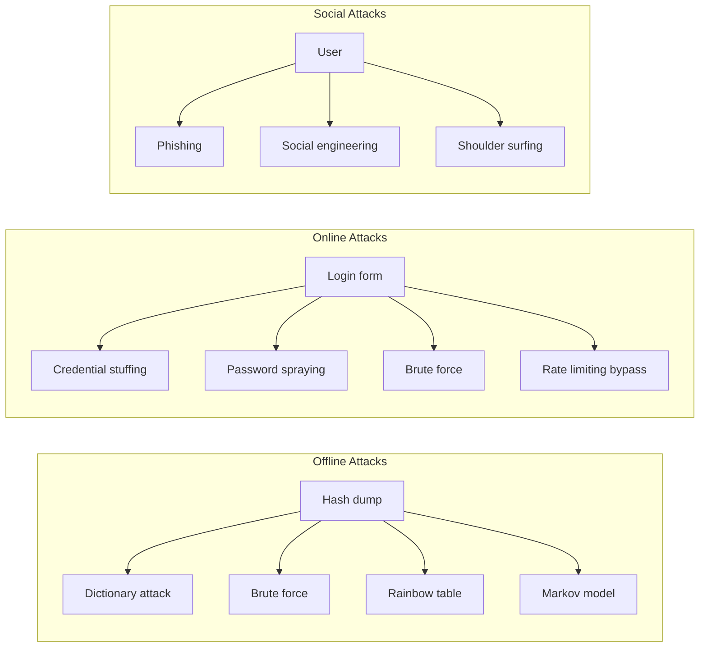

Authentication is the process of verifying that a user, service, or device is who they claim to be. It is the first and most critical line of defence in access control — if authentication fails, no subsequent security control can fully compensate. A compromised authentication mechanism gives an attacker the keys to the kingdom.

The authentication landscape spans five categories of factors, each with distinct security properties and user experience characteristics.

## Authentication Factors — Deep Dive

### Knowledge Factors (Something You Know)

Knowledge factors are the most widely deployed but also the most vulnerable authentication category.

**Examples**: Password, PIN, security questions, passphrase, swipe pattern

**Security Properties**:
- **Shared secret** — Both the user and the verifier know the secret
- **Server-side storage required** — The verifier must store a representation of the secret
- **Transmissible** — Can be shared, stolen, or guessed
- **Replayable** — Once captured, can be reused by an attacker

**Primary Attack Vectors**:
| Attack | Mechanism | Prevalence |
|--------|-----------|------------|
| Phishing | User tricked into entering credentials on fake site | Very High |
| Credential stuffing | Automated login attempts with breached credentials | High |
| Brute force | Systematic password guessing | Medium |
| Password spraying | Same password tried against many accounts | Medium |
| Keylogging | Malware captures keystrokes | Declining |
| Shoulder surfing | Visual observation of password entry | Low |

### Possession Factors (Something You Have)

Possession factors rely on the user holding a physical or digital object that is difficult to duplicate.

**Examples**: Phone, hardware security key, smart card, TOTP seed, software certificate

**Security Properties**:
- **Private key material** — The factor contains a secret that never leaves the device (in strong implementations)
- **Origin-bound** — FIDO2 credentials are bound to a specific domain
- **Tamper-resistant** — Hardware tokens resist physical extraction of secrets
- **Revocable** — Lost token can be removed from the trusted list

### Inherence Factors (Something You Are)

Inherence factors use biological or behavioural characteristics unique to the individual.

**Examples**: Fingerprint, facial recognition, iris scan, voice pattern, palm vein, typing rhythm

**Security Properties**:
- **Non-transferable** — Cannot be given to another person
- **Non-revocable (biometric data)** — If compromised, you cannot change your fingerprint
- **False acceptance rate (FAR)** — Proportion of imposters incorrectly accepted
- **False rejection rate (FRR)** — Proportion of legitimate users incorrectly rejected

<Aside variant="caution">
Biometric data is personally identifiable information (PII) subject to strict regulation under GDPR (Article 9 — special category data) and similar frameworks. Store biometric templates, not raw biometric data. Never store biometric data in the same database as user profiles.
</Aside>

### Location Factors (Somewhere You Are)

Location factors use contextual location data as an implicit authentication signal.

**Examples**: Geo-IP, GPS coordinates, network subnet, Wi-Fi SSID, Bluetooth beacon proximity

**Security Properties**:
- **Implicit** — Requires no user action
- **Spoofable** — VPNs and proxies can falsify location
- **Supplementary only** — Never sufficient as a sole authentication factor
- **Privacy-sensitive** — Location data requires careful handling

### Behavioural Factors (Something You Do)

Behavioural factors analyse patterns in user behaviour to continuously authenticate.

**Examples**: Typing rhythm, mouse movement patterns, walking gait, application usage patterns

**Security Properties**:
- **Continuous** — Provides ongoing authentication, not just at login
- **Passive** — No user friction
- **Machine learning dependent** — Requires training and constant model updates
- **High false-rejection risk** — Legitimate behaviour changes can trigger rejection

## Password Authentication — A Professional's Guide

Despite the industry push toward passwordless, passwords remain the most common authentication method. IAM professionals must understand password security in depth.

### Password Hashing — The Technical Foundation

Passwords must never be stored in plaintext. Hashing converts the password into a fixed-length string that cannot be reversed.

| Algorithm | Year | Hash Size | Purpose-built? | Recommended? |
|-----------|------|-----------|----------------|--------------|
| MD5 | 1992 | 128 bits | No | Never — cryptographically broken |
| SHA-1 | 1995 | 160 bits | No | Never — collision attacks demonstrated |
| SHA-256 | 2001 | 256 bits | No | Not for passwords — too fast, no salt built-in |
| bcrypt | 1999 | Variable | Yes | Yes — adjustable cost factor, built-in salt |
| scrypt | 2009 | Variable | Yes | Yes — memory-hard, resists GPU/ASIC attacks |
| Argon2id | 2015 | Variable | Yes | **Recommended** — winner of PHC, memory-hard, CPU-hard, side-channel resistant |

<Aside variant="tip">
Use Argon2id with a minimum configuration of: memory cost 64MB, time cost 3, parallelism 4. For legacy systems, use bcrypt with cost factor 12+. Never roll your own password hashing — use established libraries (libsodium, bcrypt, argon2).
</Aside>

### NIST SP 800-63B — Modern Password Policy Framework

The NIST Digital Identity Guidelines (SP 800-63B) revolutionised password policy by replacing complexity-based rules with length-based, breach-checked requirements:

| Policy Area | Traditional Approach | NIST SP 800-63B Approach | Rationale |
|-------------|---------------------|--------------------------|-----------|
| **Minimum length** | 8 characters | 12+ characters | Length is the strongest predictor of brute-force resistance |
| **Maximum length** | Often 16-20 characters | At least 64 characters | Don't truncate — accept arbitrarily long passphrases |
| **Complexity rules** | Require uppercase, lowercase, digit, special character | Do NOT require composition rules | Complexity rules produce predictable patterns (Password1!) |
| **Password rotation** | Mandatory 30-90 day rotation | Do NOT require periodic rotation | Frequent rotation leads to weaker passwords and patterns |
| **History check** | Remember last N passwords | Check against known breach databases | A unique but weak password is still weak |
| **MFA requirement** | Optional | **Required** | MFA is the most effective compensating control |
| **Hint questions** | Allowed | **Prohibited** | Hints are easily socially engineered |
| **Password managers** | Often blocked | **Encourage** | Password managers enable unique, complex passwords |

### Password Attack Vectors — Defensive Architecture

Understanding how passwords are attacked is essential for designing effective defences:

**Offline defences**: Slow hashing algorithms (Argon2id), strong salts, pepper, hardware-backed HSM protection

**Online defences**: Account lockout after 5-10 failed attempts, progressive delay, CAPTCHA, IP-based rate limiting, geo-velocity checks

**Social defences**: Security awareness training, phishing simulations, phishing-resistant MFA (FIDO2)

## Modern Authentication — Beyond Passwords

### Passwordless Authentication

Passwordless authentication eliminates passwords entirely, replacing shared secrets with public-key cryptography.

<Steps>
### FIDO2 Registration
1. User navigates to service and initiates registration
2. Service generates a random challenge
3. User's device creates a public-private key pair
4. User verifies identity with local gesture (biometric or PIN)
5. Device signs the challenge with the private key
6. Service stores the public key associated with the user
7. **Result**: Private key never leaves the device

### FIDO2 Authentication
1. User attempts to log in with username
2. Service sends a challenge to the user's device
3. Device prompts user for local gesture
4. Device signs the challenge with the private key
5. Service verifies the signature using the stored public key
6. **Result**: No password transmitted. Phishing-resistant authentication achieved.
</Steps>

### Why FIDO2/WebAuthn Is Phishing-Resistant

- The private key is cryptographically bound to the **origin domain** at registration
- The browser enforces this binding — the credential is only released to `example.com`, not `evil.example.com`
- No shared secret exists that can be stolen from the server
- The attacker cannot trick the user into "signing in" to a fake site because the credential won't work there

<Aside variant="caution">
The single greatest security improvement most organisations can make is deploying phishing-resistant MFA (FIDO2/WebAuthn) for all privileged users. If you can only implement one recommendation from this module, make it this one.
</Aside>

## Key Takeaways

- Authentication factors fall into five categories — knowledge, possession, inherence, location, and behaviour — with true MFA requiring factors from different categories
- Password hashing must use dedicated algorithms (Argon2id recommended, scrypt or bcrypt acceptable) — never use fast hashes like SHA-256 or MD5
- NIST SP 800-63B replaces complexity rules with minimum length (12+), no rotation, and breach database checking
- Password attacks divide into offline (hash cracking), online (credential stuffing/spraying), and social (phishing) — each requires different defensive strategies
- FIDO2/WebAuthn provides phishing-resistant authentication using public-key cryptography where the private key is origin-bound and never leaves the user's device
- The industry is moving toward passwordless as the long-term goal, with FIDO2 as the leading standard supported by all major browsers and platforms
