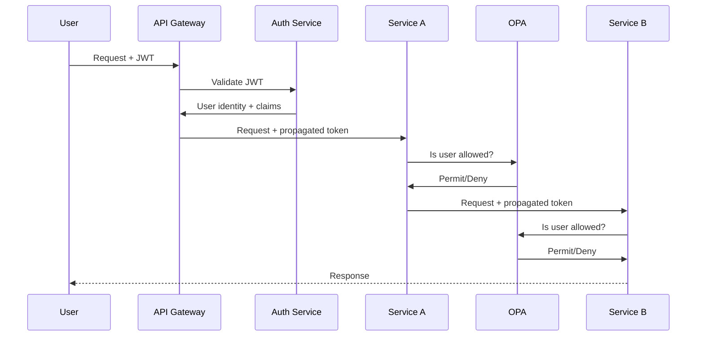

Choosing the right authorization strategy is one of the most consequential architectural decisions an IAM architect makes. The wrong choice leads to administrative overhead, security gaps, or rigid systems that cannot adapt to changing business requirements.

This page provides a decision framework for selecting and combining authorization models based on your organisation's requirements, architecture constraints, and maturity level.

## Authorization Model Spectrum

Authorization models form a spectrum from simple, ownership-based models to sophisticated, policy-driven systems:

```
Simple ────────────────────────────────────────────────────────────→ Complex
  DAC ─→ MAC ─→ RBAC ─→ RBAC+ABAC ─→ ABAC ─→ PBAC ─→ ReBAC
  (coarse)                                                  (fine-grained)
  (low admin)                                             (high admin)
  (low flexibility)                                    (high flexibility)
```

### Discretionary Access Control (DAC)

**Concept**: The resource owner decides who can access their resources.

**Examples**: Unix file permissions (`chmod`), Windows NTFS permissions, Google Drive sharing.

**Characteristics**:
- Decentralised — resource owners grant/revoke access
- Simple to implement — per-resource ACLs
- Poor auditability — no central record of who has access to what
- Does not scale — each resource managed individually
- Vulnerable to privilege escalation — users can grant access to others

**Best for**: File systems, document collaboration, small teams (< 50 people).

### Mandatory Access Control (MAC)

**Concept**: A central authority assigns security labels to subjects and objects. Access is determined by comparing labels against a fixed policy.

**Examples**: SELinux, AppArmor, Bell-LaPadula (confidentiality), Biba (integrity).

**Characteristics**:
- Centralised — label definitions controlled by security administrators
- Non-discretionary — users cannot override access decisions
- Strong theoretical foundation — mathematical models proven correct
- Rigid — difficult to adapt to changing requirements
- High administrative overhead — every resource needs a label

**Best for**: Military, government classified systems, mandatory data protection.

## Hybrid Authorization Patterns

The most effective enterprise authorization strategies combine multiple models to leverage the strengths of each:

### RBAC with ABAC Constraints

The most common hybrid pattern. Use RBAC for broad job-function access, then apply ABAC to constrain that access based on context.

**Example**: A "Healthcare Provider" role (RBAC) can access patient records, but only for patients assigned to their department during their shift (ABAC constraint).

```policy
# RBAC base: role grants access
GRANT access IF user.role == "healthcare_provider"

# ABAC constraint: refine access
AND resource.department == user.department
AND resource.assigned_provider == user.id
AND environment.time BETWEEN user.shift_start AND user.shift_end
```

### Attribute-Augmented RBAC

RBAC roles provide base permissions, but individual attributes can grant additional fine-grained access or impose restrictions.

| Scenario | Base (RBAC) | Augmentation (Attributes) |
|----------|-------------|---------------------------|
| HR specialist | Can view employee records | Can only view records in assigned business unit |
| Software engineer | Can access source code repositories | Can access repositories for their assigned projects only |
| Compliance auditor | Can view access logs | Can view logs for their assigned region only |

### Policy Delegation

Central policy team defines high-level policies (security, compliance, regulatory), while application teams define application-specific policies within that framework.

```
Central Policy (Enterprise)
  └── Data classification: "Confidential data must not leave the EU"
  └── MFA requirement: "All admin access requires phishing-resistant MFA"
      
Application Policy (App Team)
  └── "Contractors can view public documents"
  └── "Full-time employees with 'Finance' role can view financial reports"
```

## Authorization in Microservices

Microservices architectures present unique authorization challenges:

### Challenge 1: Decentralised Policy Enforcement

Each microservice must enforce authorization independently, leading to inconsistent policies across services.

**Solution**: Centralised policy engine (OPA) with sidecar or external deployment. Each service calls the policy engine for authorization decisions.

### Challenge 2: Identity Propagation

The user's identity must propagate through multiple service calls, each of which needs to authorize the action.

**Solution**: Token-based identity propagation with OAuth 2.0 token exchange. The initial token contains the user's identity, and downstream services use token exchange to propagate the identity context.



### Challenge 3: Data-Level Authorization

Authorization often depends on which specific data a user can access, not just which endpoints they can call.

**Solution**: Row-level security with attribute-based filtering. The policy engine returns a filter condition that the data layer applies to queries.

## API Authorization Patterns

| Pattern | Description | Security | Complexity | Use Case |
|---------|-------------|----------|------------|----------|
| **API Keys** | Static key passed in header | Low | Low | Service-to-service, low-security |
| **OAuth 2.0 Client Credentials** | Token-based, client authenticates | Medium | Medium | Machine-to-machine |
| **OAuth 2.0 Authorization Code** | User delegates authorization to app | High | High | User-facing applications |
| **JWT Bearer Tokens** | Self-contained token with claims | High | Medium | Distributed authorization |
| **Mutual TLS (mTLS)** | Both sides authenticate with certs | Very High | High | Zero Trust, regulated |
| **Scoped Tokens** | OAuth 2.0 scopes limit token permissions | High | Medium | API granularity |
| **MAC Tokens** | Proof-of-possession tokens | Very High | High | High-security APIs |

## Authorization Decision Flow

A well-designed authorization system follows a consistent decision flow:

<Steps>
### Authorization Request Flow
1. **Request intercepted** — PEP intercepts the access request (API gateway, middleware, application guard)
2. **Identity resolved** — Who is making the request? Extract user identity from token, session, or certificate
3. **Attributes collected** — PIP gathers subject, resource, action, and environment attributes from authoritative sources
4. **Policy evaluated** — PDP evaluates the request against applicable policies, producing a decision (Permit, Deny, NotApplicable, Indeterminate)
5. **Obligations enforced** — If the decision includes obligations (logging, notification, MFA challenge), these are executed
6. **Decision returned** — PEP enforces the decision: allow access, deny access, or challenge for additional verification
7. **Audit logged** — The decision is logged with full context (who, what, when, where, why) for audit and analysis
</Steps>

## Decision Framework: Which Authorization Model?

| If your organisation... | Start with... | Then add... |
|------------------------|---------------|-------------|
| Has stable, well-defined job functions | RBAC | ABAC constraints |
| Operates in highly regulated industry | RBAC + SOD constraints | Attribute-based controls |
| Has a cloud-native / microservices architecture | OPA/Rego (PBAC) | ReBAC for shared resources |
| Needs data-level security (row-level filtering) | RBAC | ABAC with query filters |
| Runs a SaaS platform with multi-tenancy | RBAC (tenant roles) | ABAC for tenant isolation |
| Has a content/collaboration platform | ReBAC (Zanzibar model) | RBAC for admin roles |
| Is in government or military | MAC | RBAC for non-classified systems |
| Has a small team (< 100 people) | DAC | RBAC as organisation grows |

<Aside variant="caution">
Avoid over-engineering authorization. A startup with 50 employees does not need OPA, ReBAC, and a centralised policy engine. Simple RBAC or even DAC is sufficient at that scale. Over-investing in authorization infrastructure prematurely creates maintenance burden without proportional security benefit.
</Aside>

## Key Takeaways

- Authorization models span a spectrum from DAC (simplest, least scalable) through RBAC (most widely adopted) to PBAC and ReBAC (most flexible, highest overhead)
- The most effective enterprise strategy combines RBAC for coarse-grained role-based access with ABAC for fine-grained contextual constraints
- Microservices authorization introduces challenges of decentralised enforcement, identity propagation, and data-level security — solved by centralised policy engines (OPA) and token-based identity propagation
- API authorization patterns range from simple API keys (low security) to mutual TLS and proof-of-possession tokens (very high security)
- A well-designed authorization system follows a consistent flow: intercept → resolve identity → collect attributes → evaluate policy → enforce decision → audit log
- Choosing the right authorization model depends on organisational size, regulatory requirements, architecture (monolith vs microservices), and data sensitivity — avoid over-investing beyond your current maturity level
