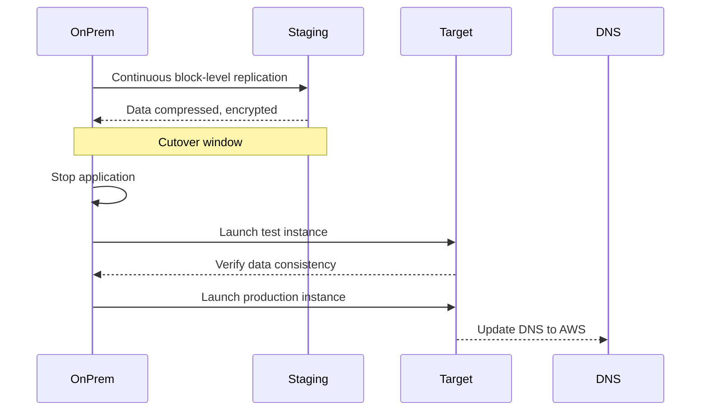

Cloud migration is the process of moving applications, data, and infrastructure from on-premises environments to AWS. The 7 Rs framework helps select the right migration strategy for each workload.

## The 7 Rs

| Strategy | Description | When to Use |
|----------|-------------|-------------|
| **Retire** | Decommission applications no longer needed | Eliminate waste, reduce cost |
| **Retain** | Keep applications on-premises | Compliance, latency, or technical debt |
| **Rehost** (Lift & Shift) | Move as-is to EC2 or VM Import | Quick wins, minimal changes |
| **Replatform** (Lift, Tinker & Shift) | Move with minor optimizations | Migrate to RDS, Elasticache, etc. |
| **Refactor** (Re-architect) | Rewrite for cloud-native patterns | Serverless, microservices, containers |
| **Repurchase** (Drop & Shop) | Move to SaaS solution | Move CRM to Salesforce, email to SaaS |

```
                        ┌─────────┐
                        │ Current │
                        │ On-Prem │
                        └────┬────┘
                             │
             ┌───────────────┼───────────────┐
             ▼               ▼               ▼
       ┌──────────┐   ┌──────────┐   ┌──────────┐
       │ Rehost   │   │Replatform│   │ Refactor │
       │ (quick)  │   │(moderate)│   │ (best)   │
       └──────────┘   └──────────┘   └──────────┘
       60-80% first    15-25% first    5-15%
       wave            wave            (ongoing)
```

<Aside variant="info" title="The 80/20 Rule">
  Most organizations rehost 60-80% of applications in the first migration wave. Refactoring is reserved for applications that need fundamental architectural changes. Start with rehost, then optimize over time.
</Aside>

## Migration Evaluator

AWS Migration Evaluator (formerly TSO Logic) provides a data-driven business case for migration:

```bash
# Download the migration evaluator agent
# Install on-premises to collect utilization data

# After assessment, export the report
aws migration-hub create-migration-task \
  --migration-task-name "web-app-migration" \
  --progress-update-stream "web-app-stream" \
  --resource-attribute-list "[{\"ipAddress\":\"10.0.1.50\"}]"
```

The tool analyzes:
- CPU, memory, and disk utilization over time
- Network throughput and dependencies
- License costs (OS, database, middleware)
- Recommended right-sizing in AWS (EC2, RDS)

## AWS Application Migration Service (MGN)

MGN (formerly CloudEndure) performs continuous replication for **rehost** migrations:



```bash
# Create an MGN launch template
aws mgn create-launch-configuration-template \
  --template-id "lt-12345" \
  --post-launch-actions "{\"cloudWatchLogGroupId\":\"/aws/mgn\"}"

# List source servers ready for migration
aws mgn describe-source-servers \
  --filters "{\"isArchived\":[\"false\"]}"
```

| Feature | Benefit |
|---------|---------|
| **Continuous block-level replication** | Sub-second RPO |
| **Automated staging area** | No data copy during cutover |
| **Non-disruptive testing** | Test instances without affecting on-prem |
| **Automated conversion** | Boot volumes, drivers, network reconfigured |

## AWS DataSync

DataSync automates moving data between on-premises storage and AWS:

```bash
# Create a DataSync task from NFS to S3
aws datasync create-task \
  --source-location-arn "arn:aws:datasync:us-east-1:123456789012:location/loc-src-123" \
  --destination-location-arn "arn:aws:datasync:us-east-1:123456789012:location/loc-dest-456" \
  --options "PreserveDeletedFiles=REMOVE,VerifyMode=POINT_IN_TIME_CONSISTENT" \
  --name "file-server-migration"

# Start the task
aws datasync start-task-execution --task-arn "arn:aws:datasync:..."
```

| Feature | Capability |
|---------|------------|
| **Sources** | NFS, SMB, HDFS, S3, EFS, FSx |
| **Speed** | Up to 10 Gbps per agent |
| **Validation** | Automatic checksums, in-flight verification |
| **Filtering** | Include/exclude patterns, preserve metadata |
| **Bandwidth limiting** | Schedule during off-peak hours |

## AWS Snowball

Snowball is a physical device for large-scale data transfers when network bandwidth is limited:

| Device | Storage | Transfer Speed | Best For |
|--------|---------|---------------|----------|
| **Snowball Edge Storage Optimized** | 80 TB HDD + 1 TB SSD | 100 Gbps | Large datasets, edge computing |
| **Snowball Edge Compute Optimized** | 42 TB HDD + 7.68 TB SSD | 100 Gbps | Edge ML, data processing |
| **Snowmobile** | 100 PB per truck | 1 Tbps (100 Gbps * 10) | Exabyte-scale migrations |

```bash
# Create a Snowball Edge job
aws snowball create-job \
  --job-type "IMPORT" \
  --resources "{\"s3Resources\":[{\"bucketArn\":\"arn:aws:s3:::migration-data\",\"keyRange\":{\"beginMarker\":\"\",\"endMarker\":\"\"}}]}" \
  --address-id "addr-12345678" \
  --role-arn "arn:aws:iam::123456789012:role/snowball-role" \
  --job-description "Historical data archive migration"
```

<Aside variant="tip">
  Use Snowball when the transfer would take more than 1 week over your available bandwidth. Formula: `Transfer Time (days) = (Data Size in TB × 8 × 1024) / (Bandwidth in Mbps) / 86400`. For 100 TB over 100 Mbps it takes ~95 days — use Snowball.
</Aside>

## Migration Planning Checklist

| Phase | Activities | Tools |
|-------|------------|-------|
| **Assess** | Discover inventory, analyze utilization, map dependencies | Migration Evaluator, AWS Application Discovery Service |
| **Mobilize** | Build landing zone, establish connectivity, train team | AWS Control Tower, Transit Gateway, VPN/Direct Connect |
| **Migrate** | Execute migrations wave by wave, test, cut over | MGN, DataSync, DMS, SMS |
| **Operate** | Monitor, optimize, decommission legacy | CloudWatch, Cost Explorer, Trusted Advisor |

## Key Takeaways

- The 7 Rs framework guides migration strategy: Rehost (60-80% of apps, quick wins), Replatform (minor optimizations like moving to RDS), Refactor (rewrite for cloud-native), Repurchase (swap to SaaS), Retire (decommission), Retain (keep on-prem), Relocate (move to AWS) — AWS now includes Relocate as an 8th R for moving between hypervisors
- Migration Evaluator builds the business case by analyzing on-prem utilization (CPU, memory, disk, network) and rightsizing to EC2/RDS equivalents
- Application Migration Service (MGN) provides continuous block-level replication for rehost migrations with sub-second RPO, automated staging, non-disruptive testing, and automated server conversion
- DataSync automates data transfer from NFS/SMB/HDFS to AWS at up to 10 Gbps with checksum validation and metadata preservation
- Snowball devices transfer 80 TB+ when network bandwidth is insufficient — use the bandwidth formula to decide: transfer time > 1 week means use Snowball
- Migration follows four phases: Assess (discovery), Mobilize (landing zone, connectivity), Migrate (waves, test, cut over), Operate (monitor, optimize, decommission)
