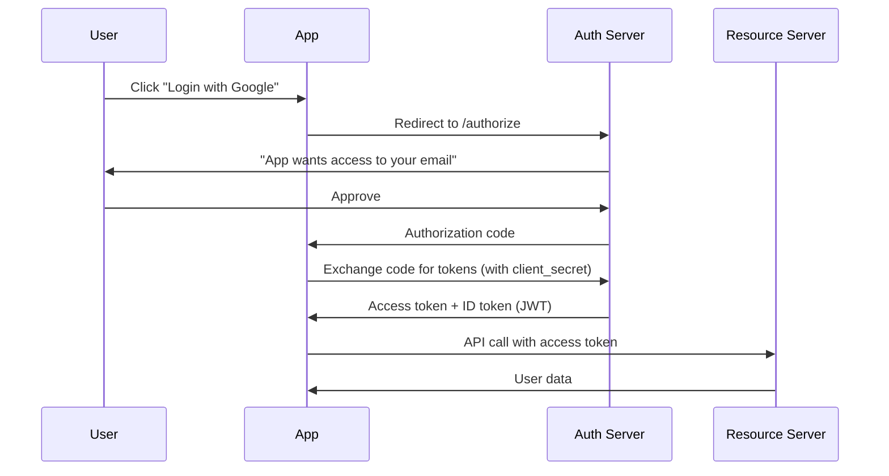

Authentication verifies who a user is. Session management maintains that verification across multiple requests. Weaknesses in either area are among the most commonly exploited vulnerabilities.

## Authentication Fundamentals

| Factor Type | Examples | Security Level |
|-------------|----------|----------------|
| **Something you know** | Password, PIN, security question | Low (can be stolen, guessed) |
| **Something you have** | Phone, hardware token, smart card | Medium (can be lost, SIM swapped) |
| **Something you are** | Fingerprint, face, iris | High (hard to replicate) |
| **Somewhere you are** | Geolocation, IP range | Low (spoofable) |
| **Something you do** | Keystroke dynamics, gait | Medium (behavioural biometrics) |

### Authentication Methods Compared

```yaml
Password-only:
  Security: Low
  User experience: Poor (must remember)
  Breach resistance: Very low (phishing, credential stuffing)
  Recommended: Only with MFA

MFA (Multi-Factor):
  Security: High
  User experience: Moderate
  Breach resistance: High
  Recommended: All external-facing applications

Passwordless (WebAuthn/FIDO2):
  Security: Very high (phishing-resistant)
  User experience: Excellent
  Breach resistance: Very high (hardware-bound keys)
  Recommended: Future direction
  
SSO (Single Sign-On):
  Security: Medium (depends on IdP security)
  User experience: Excellent
  Breach resistance: Single point of failure
  Recommended: With MFA on IdP
```

## Password Storage

### What NOT to Do

```python
# ❌ NEVER DO THIS:

# 1. Plain text
users = {"admin": "password123"}
# Breach → all passwords exposed

# 2. MD5 hashing
import hashlib
hash = hashlib.md5(b"password123").hexdigest()
# MD5 can be cracked at billions of hashes/second

# 3. SHA-1 without salt
hash = hashlib.sha1(b"password123").hexdigest()
# Rainbow tables make unsalted hashes trivial to crack

# 4. Base64 encoding
import base64
encoded = base64.b64encode(b"password123")
# Base64 is encoding, not encryption — decoded instantly
```

### Correct Password Storage

```python
# ✅ RECOMMENDED: bcrypt

import bcrypt

# Register: hash password
password = b"user_password"
salt = bcrypt.gensalt(rounds=12)
hashed = bcrypt.hashpw(password, salt)
# Store 'hashed' in database

# Login: verify password
if bcrypt.checkpw(input_password.encode(), stored_hash):
    print("Login successful")
else:
    print("Invalid password")
```

```python
# ✅ RECOMMENDED: Argon2 (2023 OWASP #1 recommendation)

from argon2 import PasswordHasher

ph = PasswordHasher(
    time_cost=3,        # Iterations
    memory_cost=65536,  # 64 MB memory
    parallelism=4,      # Threads
    hash_len=32,        # Output length
    salt_len=16         # Salt length
)

# Register
hash = ph.hash("user_password")
# Store hash in database

# Verify
try:
    ph.verify(stored_hash, "user_password")
    print("Login successful")
except:
    print("Invalid password")
```

### Password Hashing Comparison

| Algorithm | Cracking Speed (GTX 4090) | Recommended? | Notes |
|-----------|---------------------------|--------------|-------|
| MD5 | 100+ billion/sec | ❌ | Cracked instantly |
| SHA-1 | 50+ billion/sec | ❌ | Cracked in minutes |
| SHA-256 | 20+ billion/sec | ❌ | Fast hash, not for passwords |
| bcrypt (cost 10) | ~10K/sec | ✅ | Slow enough |
| bcrypt (cost 12) | ~2.5K/sec | ✅ | Better |
| Argon2id | ~100/sec | ✅ | Memory-hard, ASIC-resistant |
| PBKDF2 (100K iter) | ~50K/sec | ⚠️ | Can be GPU-cracked with enough iterations |

## Session Management

### Session ID Requirements

```
A secure session ID must be:

1. LONG — at least 128 bits (16+ bytes)
   ❌ 8-character hex ID (32 bits)
   ✅ UUIDv4 or 32+ byte random string

2. UNPREDICTABLE — cryptographically random
   ❌ Sequential: 10001, 10002, 10003
   ❌ Based on user ID: user123_session_1
   ❌ Using Math.random() / rand()
   ✅ Using crypto.getRandomValues() / SecureRandom / /dev/urandom

3. SECURELY TRANSMITTED — HTTPS only
   ❌ Set-Cookie: sessionid=abc123; HttpOnly
   ✅ Set-Cookie: sessionid=abc123; HttpOnly; Secure; SameSite=Lax

4. BOUND TO USER — on server side
   ❌ Only session cookie (anyone with cookie is that user)
   ✅ Session tied to user in database + IP + User-Agent validation

5. REGENERATED ON AUTH — prevent session fixation
   ❌ Same session ID before and after login
   ✅ New session ID issued on login
```

### Secure Cookie Configuration

```python
# Python Flask secure session
app.config.update(
    SECRET_KEY=os.urandom(32),          # Server-side signing key
    SESSION_COOKIE_HTTPONLY=True,       # Not accessible to JavaScript
    SESSION_COOKIE_SECURE=True,         # HTTPS only
    SESSION_COOKIE_SAMESITE='Lax',      # CSRF protection
    PERMANENT_SESSION_LIFETIME=timedelta(hours=8),  # Session expiry
    SESSION_REFRESH_EACH_REQUEST=True   # Extend on activity
)
```

```javascript
// Node.js Express secure session
app.use(session({
  secret: crypto.randomBytes(32).toString('hex'),
  resave: false,
  saveUninitialized: false,
  cookie: {
    httpOnly: true,
    secure: true,
    sameSite: 'strict',
    maxAge: 8 * 60 * 60 * 1000,  // 8 hours
  }
}));
```

## Session Attacks

### Session Fixation

```
  └─ Attacker sends victim a link with a known session ID
  └─ Victim logs in — session ID is not regenerated
  └─ Attacker now has an authenticated session with that ID
  └─ Prevention: Regenerate session ID on login
```

```python
# Flask — session regeneration
from flask import session
session.regenerate()  # New session ID after login
```

### Session Hijacking

```
  └─ Attacker steals session cookie (via XSS, network sniffing, malware)
  └─ Attacker injects cookie into their browser
  └─ Server treats attacker as the authenticated user
  └─ Prevention: HttpOnly cookies (block XSS theft), HTTPS (block sniffing),
     IP binding (alert on IP change), session rotation
```

### Concurrent Session Control

```python
# Limit concurrent sessions per user
# When user logs in, check active session count
# If > N active sessions, invalidate oldest or prompt:
# "You are logged in from another device. Log out other device?"
```

## OAuth 2.0 & OpenID Connect



### OAuth 2.0 Grant Types

| Grant Type | Use Case | Security |
|-----------|----------|----------|
| Authorization Code | Server-side web apps | Best — tokens never see browser |
| PKCE (Proof Key for Code Exchange) | Mobile apps, SPAs | Best for public clients |
| Client Credentials | Server-to-server | No user involved |
| Implicit (DEPRECATED) | Legacy SPAs | Token in URL — insecure |
| Resource Owner Password | Legacy apps (DEPRECATED) | App sees password — avoid |

## Real Case: Authentication Failure at Yahoo (2014)

```
  └─ Attacker compromised Yahoo's user database
  └─ 500 million accounts stolen (names, email, phone numbers)
  └─ Passwords stored with MD5 (should have been bcrypt/Argon2)
  └─ 3 billion accounts eventually disclosed (2013+2014 combined)
  └─ Yahoo's sale to Verizon reduced by $350M due to breach
  └─ Verizon required Yahoo to share 50% of legal costs

Authentication lessons:
  1. MD5 is NOT password hashing — it is fast hash for checksums
  2. Even with MD5, all passwords were unsalted — rainbow table in minutes
  3. Security questions (backup auth) were also compromised
  4. No MFA available at the time — all-or-nothing on password
```

## Key Takeaways

- Passwords are the weakest authentication factor — always layer with MFA for any external-facing application
- Password storage must use adaptive hashing algorithms (Argon2id, bcrypt, PBKDF2) — never MD5, SHA-1, or unsalted hashes
- Session IDs must be: long (128+ bits), cryptographically random, HTTPOnly+Secure+SameSite, regenerated on login, and bound to user context
- Session fixation attack: attacker gives victim a session ID → victim logs in → attacker hijacks — prevented by regenerating session ID on authentication
- The Yahoo 2014 breach (3B accounts) used MD5 for password storage — a modern GPU cracks 100B+ MD5 hashes/second
- OAuth 2.0 Authorization Code + PKCE is the recommended grant for modern SPAs and mobile apps — never use the Implicit grant
- Passwordless (WebAuthn/FIDO2) is the future direction — phishing-resistant, hardware-bound keys, excellent UX
- Session rotation (regenerate ID periodically) limits the window for hijacked sessions
- Log all authentication failures — a spike in failures indicates credential stuffing or brute force
