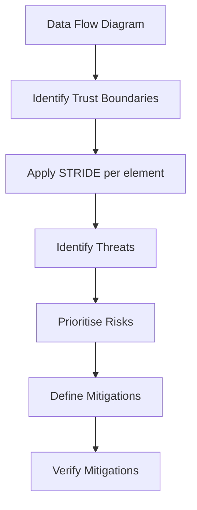

A Secure Software Development Lifecycle (Secure SDLC) integrates security activities into every phase of development rather than treating security as a separate gate at the end.

## The Cost of Fixing Late

The earlier in the lifecycle a vulnerability is found, the cheaper it is to fix.

```yaml
Relative Cost to Fix a Vulnerability:
  Requirements:      1x  (design flaw in spec)
  Design:            6x  (architectural issue in diagram)
  Implementation:    15x (bug in code during dev)
  Testing:           40x (found during QA)
  Production:        100x (found after release)
  
Example: SQL injection found in:
  └─ Design review (parameterised query specified): $1,000
  └─ Code review (before commit): $5,000
  └─ In production (breach discovered): $500,000+ (data breach costs)
```

## Secure SDLC Phases

### Phase 1: Security Requirements (Planning)

Security requirements must be specified before coding begins.

```yaml
Security Requirements Template:
  
  Authentication:
    - MFA required for all admin access
    - Passwordless (WebAuthn) for customer access
    - Session timeout: 15 min idle, 8 hours absolute
  
  Authorization:
    - RBAC with role hierarchy
    - All API endpoints verify object ownership (BOLA protection)
    - Admin functions require secondary approval
  
  Data Protection:
    - PII encrypted at rest (AES-256-GCM)
    - TLS 1.3 for all connections
    - Tokenization of payment data (PCI DSS)
  
  Logging:
    - All authentication attempts logged
    - All privileged operations logged
    - Centralised log aggregation with SIEM
  
  Compliance:
    - GDPR right to deletion implemented
    - SOC 2 control requirements mapped
    - Audit trail for all state changes
```

### Phase 2: Threat Modeling (Design)

Threat modeling identifies security issues before any code is written.

**Methodology: STRIDE** (Microsoft)

| Threat | Definition | Example |
|--------|------------|---------|
| **S**poofing | Pretending to be someone else | Fake login page stealing credentials |
| **T**ampering | Modifying data or code | Changing a price in a shopping cart |
| **R**epudiation | Denying an action was performed | User claims "I didn't make that transfer" |
| **I**nformation Disclosure | Exposing data to unauthorised parties | API returning full user objects |
| **D**enial of Service | Making system unavailable | Flooding login endpoint with requests |
| **E**levation of Privilege | Gaining unauthorised access | Normal user becomes admin |



**Example: Threat Model for File Upload Feature**

```yaml
Element: File Upload Endpoint
Trust Boundary: Internet → Application Server

Threats Identified:
  └─ S: Attacker uploads file pretending to be legitimate user
     → Mitigation: Authenticate all uploads
  └─ T: Malware embedded in uploaded file
     → Mitigation: ClamAV scan, file type validation
  └─ I: Uploaded file contains PII uploaded by mistake
     → Mitigation: DLP scanning, data classification
  └─ D: 10GB file upload exhausts disk space
     → Mitigation: File size limit (10MB), disk quota per user
  └─ E: Path traversal in filename (../../../etc/passwd)
     → Mitigation: Random UUID filename, never trust user-supplied name
```

### Phase 3: Secure Coding (Implementation)

```yaml
Secure Coding Standards:
  
  Input Validation:
    └─ Validate on server (never trust client-side validation)
    └─ Whitelist approach (allow known-good characters)
    └─ Parameterised queries for all database access
    └─ JSON Schema validation for APIs
  
  Output Encoding:
    └─ HTML context: encode & < > " '
    └─ JavaScript context: hex/unicode escape
    └─ URL context: URL encode
    └─ CSS context: avoid user input entirely
  
  Authentication:
    └─ bcrypt/Argon2 for password storage
    └─ Session regeneration on login
    └─ CSRF tokens for all state-changing requests
  
  Error Handling:
    └─ Never expose stack traces to users
    └─ Generic error messages ("An error occurred")
    └─ Detailed errors logged server-side only
  
  Secrets Management:
    └─ Never hardcode credentials in source code
    └─ Use vault/secret store (AWS Secrets Manager, HashiCorp Vault)
    └─ Rotate secrets automatically
```

### Phase 4: Security Testing (Verification)

```yaml
Testing Types:

SAST (Static Analysis):
  └─ Scans source code without executing
  └─ Finds: SQL injection, XSS, buffer overflows, weak crypto
  └─ Tools: SonarQube, Checkmarx, Fortify, Semgrep
  └─ When: Every commit (CI pipeline)
  └─ False positives: 10-30% (requires triage)

DAST (Dynamic Analysis):
  └─ Scans running application
  └─ Finds: Runtime issues, configuration flaws, business logic
  └─ Tools: OWASP ZAP, Burp Suite, Acunetix
  └─ When: Every build, staging environment
  └─ False positives: 5-15%

SCA (Software Composition Analysis):
  └─ Scans dependencies for known vulnerabilities
  └─ Finds: Log4j, Struts, Spring4Shell vulnerabilities
  └─ Tools: Snyk, Dependabot, OWASP Dependency-Check
  └─ When: Every commit, plus continuous monitoring
  
Penetration Testing:
  └─ Manual testing by security professionals
  └─ Finds: Business logic flaws, complex attack chains
  └─ When: Annually (or quarterly for high-risk apps)
  └─ Scope: Full application, infrastructure, APIs
```

### Phase 5: Deployment (Operations)

```yaml
Secure Deployment Checklist:

Pre-Deployment:
  └─ All SAST/DAST/SCA findings reviewed and fixed
  └─ Penetration test completed (if applicable)
  └─ Security review signed off
  └─ Configuration review completed
  └─ Secrets rotated (no default credentials)

Deployment:
  └─ Immutable infrastructure (no SSH access to containers)
  └─ Signed container images
  └─ Canary deployment with rollback
  └─ WAF rules in place before deployment

Post-Deployment:
  └─ Monitoring alerts configured
  └─ Error reporting active (Sentry, Datadog)
  └─ Vulnerability scanning active
  └─ Incident response runbook updated
```

### Phase 6: Maintenance (Operations)

```yaml
Ongoing Security Activities:
  
  Daily:
    └─ Monitor security alerts
    └─ Review authentication failures
    └─ Check for new critical vulnerabilities
  
  Weekly:
    └─ Dependency scan updates
    └─ Review SAST findings
  
  Monthly:
    └─ Access review (remove stale accounts)
    └─ Secret rotation
    └─ Third-party risk review
  
  Quarterly:
    └─ Penetration testing (high-risk apps)
    └─ Threat model update (for changed features)
    └─ Security awareness training reinforcement
    └─ Tabletop incident response exercise
  
  Annually:
    └─ Full penetration test
    └─ Security policy review
    └─ Business continuity test
    └─ Employee security training renewal
```

## DevSecOps Pipeline Integration

```yaml
CI/CD Pipeline with Security Gates:

Step 1: Commit (Developer)
  └─ Pre-commit hook: linting, secrets scanning (truffleHog)
  └─ Secret detected? → BLOCK commit

Step 2: Build
  └─ SCA scan (Snyk/Dependabot)
  └─ Critical vulnerability? → BLOCK build
  └─ High vulnerability? → WARN, auto-create ticket

Step 3: SAST Scan
  └─ Semgrep/CodeQL scan
  └─ Critical/high finding? → BLOCK
  └─ Medium/low? → WARN

Step 4: Unit + Integration Tests
  └─ Security unit tests (auth, input validation)
  └─ Test coverage > 80% required

Step 5: Build Container Image
  └─ Container image scan (Trivy, Clair)
  └─ Critical vulnerability? → BLOCK
  └─ Sign image with cosign

Step 6: Deploy to Staging
  └─ DAST scan (OWASP ZAP)
  └─ Critical finding? → BLOCK
  └─ Configuration compliance check (OPA/conftest)

Step 7: Deploy to Production
  └─ Require all gates passed
  └─ Manual approval required
  └─ Canary deployment (10% → 50% → 100%)

Step 8: Monitor
  └─ Runtime security monitoring
  └─ Anomaly detection
  └─ Alerting and response
```

## Key Takeaways

- The cost of fixing a vulnerability increases exponentially through the SDLC — a design flaw costs 1x in requirements vs 100x in production
- Threat modeling (STRIDE, data flow diagrams) identifies vulnerabilities before code is written — the best time to fix a vulnerability is before it exists
- SAST scans source code for known patterns (SQLi, XSS) — integrate into CI pipeline and block on critical findings
- DAST exercises the running application — best for finding configuration and runtime issues that SAST misses
- SCA tracks dependencies for known CVEs — Log4Shell (CVSS 10) was found in 84% of codebases because no one was scanning dependencies
- Secure SDLC is not optional — it is a requirement for SOC 2, ISO 27001, PCI DSS, and most regulatory frameworks
- DevSecOps pipeline gates prevent vulnerable code from reaching production — security decisions made at each CI/CD stage
- Security testing must happen at every phase, not just at the end — "shift left" means finding issues earlier
- Penetration testing complements automated testing — business logic flaws and complex attack chains require human expertise
- Maintenance (post-deployment) is the longest phase — continuous monitoring, patching, and improvement are essential
