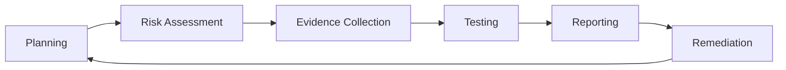

## Audit Lifecycle



## Evidence Collection

Auditors are evidence-driven. If it isn't documented, it didn't happen.

| Evidence Type | Examples | Collection Method |
|---------------|----------|------------------|
| **Policy documents** | Security policies, standards, procedures | Document repository |
| **Configuration exports** | Firewall rules, IAM policies, encryption settings | Automated (API/CLI) |
| **Logs** | Access logs, change logs, audit logs | SIEM / log management |
| **Screenshots** | Configurations, dashboards, tool outputs | Manual (auditor walk-through) |
| **Meeting minutes** | Security reviews, change control board | Calendar invites, meeting notes |
| **Training records** | Security awareness completion, certification | LMS reports |
| **Access review evidence** | Completed certification campaigns | IGA tool exports |

## Managing Audit Findings

| Finding Severity | Action Required | SLA |
|-----------------|-----------------|-----|
| **Critical** | Immediate remediation, root cause analysis | 30 days |
| **High** | Remediation plan with milestone dates | 60 days |
| **Medium** | Remediation scheduled in normal planning | 90 days |
| **Low** | Acknowledged, addressed in next planning cycle | 180 days |
| **Observation** | Noted for improvement, no formal remediation | Next audit |

## Building Audit Readiness

```bash
# Automated evidence collection script (example)
#!/bin/bash
# Collect evidence for SOC 2 security criteria

# IAM evidence
aws iam list-users > evidence/iam/users.json
aws iam list-roles > evidence/iam/roles.json

# Encryption evidence
aws s3api list-buckets --query 'Buckets[].Name' | while read bucket; do
  aws s3api get-bucket-encryption --bucket $bucket > "evidence/s3/${bucket}_encryption.json"
done

# Logging evidence
aws cloudtrail describe-trails > evidence/logging/cloudtrail.json

# Backup evidence
aws backup list-protected-resources > evidence/backup/resources.json

# Create evidence inventory
ls -la evidence/ > evidence_inventory.txt
```
