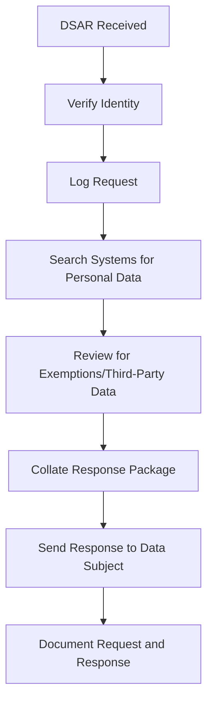

## Privacy Principles (OECD / GDPR)

| Principle | Description | Implementation |
|-----------|-------------|----------------|
| **Lawfulness, Fairness, Transparency** | Process data lawfully, fairly, transparently | Privacy notices, consent management |
| **Purpose Limitation** | Collect data only for specified, legitimate purposes | Data classification, usage policies |
| **Data Minimisation** | Collect only what is necessary | Data collection audits, privacy-by-design |
| **Accuracy** | Keep data accurate and up-to-date | Data quality processes, update mechanisms |
| **Storage Limitation** | Delete data when no longer needed | Retention schedules, automated deletion |
| **Integrity & Confidentiality** | Protect data with appropriate security | Encryption, access controls, monitoring |
| **Accountability** | Demonstrate compliance with all principles | DPO, documentation, audits |

## Data Mapping

```csv
Process,Data Elements,Legal Basis,Storage Location,Retention Period,Third Party Shared With
Employee Payroll,Name,Address,SSN,Bank Account,Contractual Necessity,HR Database (EU),7 years after termination,Payroll Provider Inc.
Customer Support,Name,Email,Order History,Consent,Zendesk (US),3 years after last interaction,N/A
Marketing Newsletter,Email,Name,Preferences,Consent,Mailchimp (US),Until unsubscribe,Unsubscribe at any time
```

## DSAR Process Flow



## Privacy-by-Design

```javascript
// Privacy-by-design in application development
class UserDataManager {
  constructor() {
    this.retentionPeriod = 90 * 24 * 60 * 60 * 1000; // 90 days
    this.purposes = ['authentication', 'order_fulfillment'];
  }
  
  collectData(userId, purpose, data) {
    if (!this.purposes.includes(purpose)) {
      throw new Error(`Purpose "${purpose}" not authorised`);
    }
    
    return {
      userId,
      purpose,
      data: this.encrypt(data),
      collectedAt: new Date(),
      expiresAt: new Date(Date.now() + this.retentionPeriod)
    };
  }
  
  async deleteUserData(userId) {
    // Delete from all databases
    await db.collection('users').deleteOne({ _id: userId });
    await db.collection('sessions').deleteMany({ userId });
    await cache.del(`user:${userId}`);
    
    // Log deletion for audit
    await audit.log('DATA_DELETION', { userId, timestamp: new Date() });
  }
}
```

## Annual Privacy Calendar

```yaml
q1:
  - Data mapping review and update
  - Consent mechanism audit
  - Privacy policy review
q2:
  - DSAR metrics review (volume, response times, types)
  - Third-party data processing audit
  - Data retention schedule enforcement
q3:
  - Data Protection Impact Assessment (DPIA) for new projects
  - Employee privacy training
  - Cross-border data transfer review
q4:
  - Annual privacy report to board
  - Regulatory filing (if applicable)
  - Next year's privacy roadmap
```
