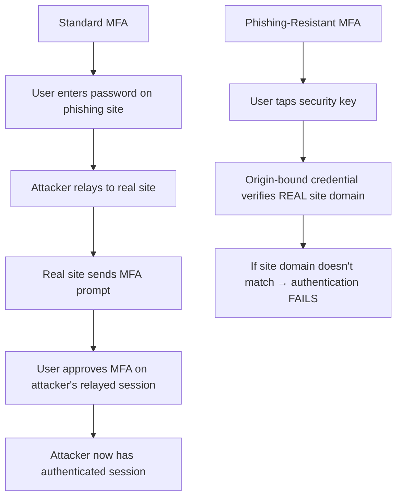

Authentication verifies that a user is who they claim to be. It is the first line of defence — and the most attacked. According to the **2024 Verizon DBIR**, over 50% of all breaches involve compromised credentials.

## Authentication Factors

The three factor categories:

| Factor | Type | Examples | Strength |
|--------|------|----------|----------|
| **Something you know** | Knowledge | Password, PIN, security question | Weakest — can be phished, guessed, or stolen |
| **Something you have** | Possession | Phone (TOTP/push), hardware key (YubiKey), smart card | Strong — attacker needs physical access |
| **Something you are** | Inherence | Fingerprint, face, iris, voice | Strong — difficult to replicate (but can be bypassed) |

**MFA**: Using two or more factors. A password (know) + TOTP code (have) = MFA. A password + security question = NOT MFA (both are knowledge factors).

## Passwords

Passwords remain the most common authentication method despite being the weakest:

### Password Security Requirements

| Requirement | NIST SP 800-63B (Modern) | Traditional (Legacy) |
|-------------|--------------------------|---------------------|
| **Minimum length** | 8 characters (12+ recommended) | 6-8 characters |
| **Maximum length** | 64+ characters (no arbitrary limits) | 12-16 characters |
| **Complexity rules** | None required (length > complexity) | Must include uppercase, lowercase, digit, special char |
| **Expiration** | No forced expiration (only if compromised) | Every 90 days |
| **History** | Check against known compromised passwords | Last 5 passwords |
| **Hint questions** | Prohibited | Common (e.g., "What is your pet's name?") |

### Why NIST Changed Password Guidance

```yaml
Traditional approach (90-day expiry + complexity):
  └─ Users create: Passw0rd!1 → Passw0rd!2 → Passw0rd!3 (predictable patterns)
  └─ Users write down passwords (too many to remember)
  └─ Users reuse similar passwords across sites
  └─ Result: WEAKER security, more support tickets

Modern approach (no expiry + breach check):
  └─ Users create: correct-horse-battery-staple (long, memorable)
  └─ Users with password managers generate: aB7#kL9$xQ2&mR4 (truly random)
  └─ Breach checking prevents reuse of compromised passwords
  └─ Result: STRONGER security, fewer support tickets
```

### The Password Manager Argument

```
OFFICE WORKER WITHOUT PASSWORD MANAGER:
- Has 50+ accounts
- Reuses 3 passwords across all accounts
- One breach at a minor site exposes all accounts
- Average time to reset forgotten password: 10 minutes

OFFICE WORKER WITH PASSWORD MANAGER:
- Has 50+ unique, randomly generated passwords
- Only needs to remember 1 master password
- A breach at one site affects only that account
- Time to log into any account: 3 seconds (autofill)
```

**Recommendation**: Require enterprise password manager for all employees. This is the single highest-impact password security improvement.

## Multi-Factor Authentication (MFA)

MFA blocks **99.9% of automated credential attacks** (Microsoft, 2024). Yet many organisations still do not enforce it.

### MFA Methods Compared

| Method | Security | User Experience | Cost | Phishing Resistant? |
|--------|----------|-----------------|------|---------------------|
| **SMS/Text** | Low (SS7 attacks, SIM swapping) | Good | Low | No |
| **TOTP (Google Authenticator, Authy)** | Medium (phishable) | Good | Free | No |
| **Push notification** (Okta, Microsoft) | Medium (MFA fatigue) | Excellent | Included in SSO | No |
| **Hardware token** (YubiKey, Titan) | High | Good (tap USB/NFC) | $25-50/user | Yes |
| **Passkey (WebAuthn)** | High | Excellent (biometric + device) | Free (built into OS) | Yes |
| **Smart card** (PIV/CAC) | High | Medium (need reader) | $5-20/card | Yes |

### The MFA Fatigue Attack

Push notification MFA introduced a new attack vector — MFA fatigue:

```yaml
MFA Fatigue Attack:
  1. Attacker obtains user's password (phishing, credential stuffing)
  2. Attacker attempts to log in, triggering push MFA notification
  3. Attacker sends MULTIPLE push notifications rapidly (10-50 in minutes)
  4. User gets annoyed and accidentally taps "Approve"
  5. Attacker gains access

Mitigation:
  └─ Number matching: User must enter the number shown on screen
  └─ Geo-fencing: Only allow MFA push from expected locations
  └─ Rate limiting: Max 3 MFA push attempts per 5 minutes
  └─ Phishing-resistant MFA: Hardware keys or passkeys (immune to fatigue)
```

### Phishing-Resistant MFA

Standard MFA (TOTP, push) can be phished via adversary-in-the-middle (AiTM) proxy attacks. Phishing-resistant MFA uses **key-bound credentials**:



**Implementation priority**:
1. All privileged accounts → phishing-resistant MFA (hardware key or passkey)
2. All external-facing applications → MFA (any method is better than none)
3. All employees → MFA for VPN, email, and HR systems

## WebAuthn and Passkeys

WebAuthn is a W3C standard for passwordless, phishing-resistant authentication:

```javascript
// WebAuthn registration (browser)
const credential = await navigator.credentials.create({
  publicKey: {
    challenge: new Uint8Array([/* server-generated challenge */]),
    rp: { name: "Example Corp" },
    user: {
      id: new Uint8Array([/* user ID */]),
      name: "user@example.com",
      displayName: "User Johnson"
    },
    pubKeyCredParams: [{ type: "public-key", alg: -7 }] // ES256
  }
});

// WebAuthn authentication
const assertion = await navigator.credentials.get({
  publicKey: {
    challenge: new Uint8Array([/* server-generated challenge */]),
    allowCredentials: [{ id: credentialId, type: "public-key" }]
  }
});
```

### Passkey Ecosystem

```yaml
Passkey Architecture:
  └─ Private key: Stored on user's device (Secure Enclave, TPM, Keychain)
  └─ Public key: Stored on server
  └─ Authentication: Device proves possession of private key
  └─ Sync: iCloud Keychain (Apple), Google Password Manager (Android), Windows Hello (Microsoft)

Platform Support:
  └─ Apple: iOS 16+, macOS 13+ (Safari, iCloud Keychain sync)
  └─ Google: Android 9+, Chrome (Google Password Manager sync)
  └─ Microsoft: Windows 11, Edge (Windows Hello)
  └─ Third-party: 1Password, Bitwarden, Dashlane (cross-platform)

Enterprise Considerations:
  └─ Platform passkeys: Free, but tied to device ecosystem
  └─ Cross-platform: Third-party providers offer roaming passkeys
  └─ Recovery: Lost device → lose passkey → need account recovery flow
  └─ Hardware-backed: YubiKey Bio, Samsung Pass
```

## Single Sign-On (SSO) and Federation

SSO allows users to authenticate once and access multiple applications:

### SAML 2.0 Flow

```
User → Accesses SP (Service Provider, e.g., Salesforce)
    → SP redirects to IdP (Identity Provider, e.g., Okta)
    → User authenticates at IdP
    → IdP issues SAML assertion
    → Browser posts SAML assertion to SP
    → SP validates assertion → User is logged in
```

### OAuth 2.0 / OpenID Connect

OAuth 2.0 is for delegated authorisation. OpenID Connect (OIDC) adds an identity layer on top:

```
OAuth 2.0:
  Resource Owner (User) → Authorises Client (App) → Gets Access Token
  → Client uses Access Token to access Resource Server (API)

OpenID Connect (adds):
  + ID Token (JWT containing identity claims)
  + UserInfo endpoint (standardised user attributes)
```

### SSO Security Benefits

| Benefit | Detail |
|---------|--------|
| **Fewer passwords** | Users remember 1 password instead of 20+ → less password reuse |
| **Centralised credential management** | One place to enable/disable/audit credentials |
| **Centralised MFA enforcement** | One policy for all applications |
| **Reduced phishing surface** | Users trained to authenticate only through the SSO portal |
| **Simplified offboarding** | Disable one account → all applications locked out |

### SSO Attack Surface

```yaml
SSO Risks:
  └─ IdP compromise = compromise of ALL connected applications
  └─ SAML assertion validation bugs (XML signature wrapping attacks)
  └─ OAuth token theft (access token in browser, CSRF, redirect URI manipulation)
  └─ Shadow admin: Users with IdP admin rights can access any application

SSO Hardening:
  └─ IdP: Strong access controls on IdP admin console (separate admin accounts)
  └─ SAML: Validate signature + assertion + audience + recipient + NotOnOrAfter
  └─ OAuth: PKCE (Proof Key for Code Exchange) for all public clients
  └─ Token: Short access token lifetimes (15-60 minutes), refresh token rotation
```

## Risk-Based Authentication (RBA)

RBA adapts authentication requirements based on the risk of the access attempt:

```python
def calculate_authn_risk(request):
    risk_score = 0
    
    # Location
    if request.geo_country not in ["US", "CA", "GB"]:
        risk_score += 30
    if request.geo_distance_from_last > 500:  # km
        risk_score += 20
    
    # Device
    if not request.device_is_managed:
        risk_score += 25
    if request.device_os_version < MINIMUM_VERSION:
        risk_score += 15
    
    # Behaviour
    if request.time_local.hour < 6 or request.time_local.hour > 22:
        risk_score += 10
    if request.ip_is_anonymous_vpn:
        risk_score += 40
    if request.user_agent_is_unusual:
        risk_score += 15
    
    # Decision
    if risk_score < 20:
        return "Allow — no MFA required"
    elif risk_score < 50:
        return "Allow — require MFA"
    elif risk_score < 80:
        return "Challenge — require phishing-resistant MFA"
    else:
        return "Block — deny access, alert SOC"
```

### RBA Implementation Considerations

```yaml
RBA Best Practices:
  └─ Start permissive: Log risk score without enforcement (discover patterns)
  └─ Add step-up MFA: Only challenge high-risk sessions
  └─ Monitor false positives: Users getting challenged for legitimate access?
  └─ Context matters: A login from a known VPN provider is different from a known anonymiser
  └─ Session risk: Re-evaluate risk during session (not just at login)
  └─ Feedback loop: Approved high-risk sessions should reduce future challenges

Common RBA Signals:
  └─ Impossible travel: Login from NYC → login from Tokyo in 10 minutes
  └─ Anonymous IP: VPN, Tor, proxy, data centre IP
  └─ New device: First time this device has authenticated
  └─ Suspicious behaviour: Rapid-fire API calls, unusual data access patterns
  └─ Credential stuffing indicators: Same username, many IPs; same IP, many usernames
```

## Passwordless Authentication

The ultimate goal: eliminate passwords entirely.

| Method | How It Works | Adoption |
|--------|-------------|----------|
| **Windows Hello** | Biometric + TPM-bound key | Built into Windows 10/11 (100M+ devices) |
| **Apple Face ID / Touch ID** | Biometric + Secure Enclave | All modern Apple devices (1B+ devices) |
| **Passkeys (platform)** | Device-bound key synced via iCloud/Google Password Manager | iOS 16+, Android 9+, Windows 11 |
| **FIDO2 / WebAuthn** | Hardware-bound key (YubiKey) | Growing enterprise adoption |
| **Magic link** | Email-based one-time link | Common for low-security apps, passwordless onboarding |

### Passwordless Migration Strategy

```yaml
Phase 1 — Reduce password reliance:
  └─ Deploy SSO (reduce number of passwords)
  └─ Enforce MFA (add second factor)
  └─ Deploy password manager (handle complex passwords)

Phase 2 — Introduce passwordless options:
  └─ Enable Windows Hello / Face ID for corporate devices
  └─ Deploy FIDO2 security keys for privileged users
  └─ Enable passwordless for low-risk applications first

Phase 3 — Eliminate passwords:
  └─ Require passkeys for all internal applications
  └─ Remove password-based login for privileged accounts
  └─ Implement recovery flow (lost device → verified identity → new passkey)
```

<Aside variant="tip">
The most impactful authentication improvement most organisations can make is NOT passwordless — it's MFA enforcement. Before pursuing passwordless, ensure 100% MFA coverage across all external-facing applications. Then move to phishing-resistant MFA for privileged accounts. Passwordless comes last.
</Aside>

## Key Takeaways

- Authentication verifies identity using three factor types: knowledge (something you know), possession (something you have), inherence (something you are) — MFA requires two or more factors from DIFFERENT categories
- Passwords are the weakest authentication method but remain the most common — enforce password managers and NIST SP 800-63B guidelines (no arbitrary complexity, no forced expiration, check against compromised password databases)
- MFA blocks 99.9% of automated credential attacks but standard MFA (TOTP, push) is phishable via AiTM proxies — privileged accounts MUST use phishing-resistant MFA (hardware keys or passkeys)
- MFA fatigue is a real attack vector — number matching, rate limiting, and geo-fencing mitigate push notification bombing
- WebAuthn/passkeys are the industry direction for phishing-resistant, passwordless authentication — platform support is now universal (Apple, Google, Microsoft)
- SSO and federation (SAML, OAuth, OIDC) centralise authentication, reduce password fatigue, and enable consistent MFA policy enforcement — but the IdP becomes a critical single point of failure requiring strong access controls
- Risk-based authentication adapts security requirements based on context (location, device, behaviour) — enables MFA step-up without blocking low-risk users
- Passwordless authentication (passkeys, Windows Hello, FIDO2) is the long-term goal but MFA coverage should be the immediate priority — implement in phases: reduce passwords → introduce passwordless → eliminate passwords
- The identity attack surface is evolving: credential stuffing, MFA fatigue, AiTM phishing, SIM swapping — authentication security must continuously evolve to match
- Enterprise authentication architecture should combine: SSO (for user experience) + MFA (for security) + RBA (for adaptive risk) + passkeys (for passwordless future)
