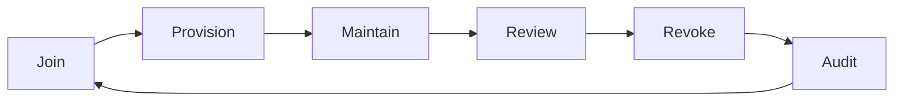

Identity and Access Management (IAM) is the discipline of ensuring the right people have the right access to the right resources at the right time for the right reasons.

## Core IAM Concepts

```yaml
Identity: A digital representation of a person, device, or service
  └─ User identity: Employee, contractor, customer, partner
  └─ Service identity: Application, API, bot, microservice
  └─ Device identity: Laptop, server, IoT device, mobile phone

Access: The ability to perform an action on a resource
  └─ Read, write, execute, delete, admin
  └─ Access can be: granted, denied, revoked, expired

Authentication: Verifying the identity claim
  └─ Factors: knowledge, possession, inherence
  └─ Methods: password, MFA, certificate, biometric

Authorization: Determining what an authenticated identity can do
  └─ Models: RBAC, ABAC, ReBAC, PBAC
  └─ Enforcement: Policy Decision Point (PDP) + Policy Enforcement Point (PEP)
```

## The Identity Lifecycle



| Phase | Activity | Automation |
|-------|----------|------------|
| **Join** | HR system triggers identity creation (new hire) | 100% automated (HR → AD/IdP) |
| **Provision** | Create accounts in all required systems | Automated via SCIM, Lifecycle Management |
| **Maintain** | Role changes, transfers, promotions | Automated (manager approval → update) |
| **Review** | Periodic access certification | Automated quarterly reviews |
| **Revoke** | Termination, contractor end-date | Automated (HR trigger → disable → delete) |
| **Audit** | Verify compliance, detect anomalies | Continuous monitoring + reporting |

### Provisioning Automation

```python
# Example: Automated user provisioning via SCIM
import requests

def provision_user(user_data):
    """Create user in Azure AD / Okta via SCIM API"""
    scim_user = {
        "schemas": ["urn:ietf:params:scim:schemas:core:2.0:User"],
        "userName": user_data['email'],
        "name": {
            "givenName": user_data['first_name'],
            "familyName": user_data['last_name']
        },
        "emails": [{
            "value": user_data['email'],
            "primary": True
        }],
        "active": True
    }
    
    response = requests.post(
        "https://api.okta.com/scim/v2/Users",
        json=scim_user,
        headers={"Authorization": f"Bearer {API_TOKEN}"}
    )
    return response.json()
```

## Least Privilege

Least privilege means granting the minimum permissions needed to perform a function.

```yaml
Least Privilege Implementation:

Start with DENY ALL:
  └─ Every identity starts with zero permissions
  └─ Permissions are explicitly granted based on role
  └─ No implicit trusts, no default access

Grant on Demand:
  └─ Use JIT (Just-In-Time) access for privileged operations
  └─ Approve access with time limit (expires automatically)
  └─ Require justification for elevated access

Review Continuously:
  └─ Quarterly access certification for all users
  └─ Remove unused permissions (90+ days without use)
  └─ Alert on permission escalation
```

## Segregation of Duties (SoD)

SoD prevents a single person from having conflicting permissions that could enable fraud.

```yaml
Classic SoD Violations:
  └─ Same user can create a vendor AND approve invoices
  └─ Same user can submit a purchase order AND receive goods
  └─ Same user can create a user AND assign admin roles

SoD Enforcement:
  └─ Preventive: Block assignment of conflicting roles
  └─ Detective: Monitor for SoD violations post-assignment
  └─ Corrective: Automatically revoke one of the conflicting roles
```

## RBAC Model Design

```yaml
RBAC Components:
  └─ Users: Individual identities
  └─ Groups: Collections of users (department, location, function)
  └─ Roles: Named job functions with associated permissions
  └─ Permissions: Specific actions on specific resources

Role Design Principles:
  └─ Role granularity: Not too coarse (one role for everything) and not too fine (every user has unique permissions)
  └─ Role naming: Clear, descriptive, standardised
  └─ Role hierarchy: Admin includes Manager includes User
  └─ Role lifecycle: Create → Approve → Publish → Review → Retire

Example RBAC Model:
  └─ reader: Read-only access to assigned resources
  └─ contributor: Read + write to assigned resources
  └─ manager: Contributor + approve changes + manage team access
  └─ admin: Full access to all resources + user management
  └─ super_admin: Full access including IAM configuration
```

## Key Takeaways

- IAM is the most critical security control — compromised identities are the root cause of most breaches
- The identity lifecycle (join → provision → maintain → review → revoke → audit) should be fully automated — manual processes create orphan accounts and excessive permissions
- Least privilege is implemented as: start with deny-all, grant on demand (JIT), and review continuously
- Segregation of Duties prevents fraud by ensuring no single person has conflicting permissions
- RBAC is the most common access control model — clear role definitions with periodic certification
- SCIM is the industry standard for automated identity provisioning across systems
- Identity governance (certification, reporting, SoD enforcement) is essential for compliance (SOX, SOC 2, PCI DSS)
- The identity attack surface is expanding: cloud, mobile, APIs, machine identities — each requires IAM coverage
- IAM is not just for employees — contractors, partners, customers, and services all need identity management
- Automation is the key to IAM at scale — manual provisioning and certification does not scale beyond 100 users
