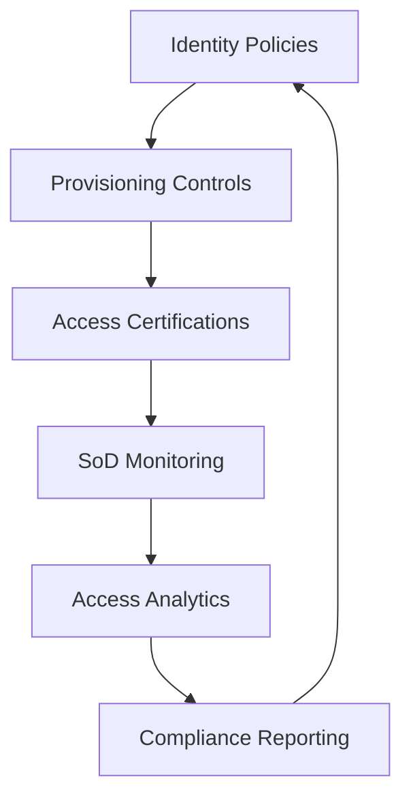

Identity governance is the set of policies, processes, and technologies that ensure the right people have the right access for the right reasons — and that access is continuously verified, certified, and audited. Governance is what separates a well-managed IAM program from chaos.

## Governance Framework



## Access Certification Campaigns

An access certification campaign is a periodic review where managers certify that their team members' access is appropriate.

### Campaign Types

| Type | Frequency | Reviewer | Risk Level |
|------|-----------|----------|------------|
| **Privileged access review** | Quarterly | Security team + app owner | Critical |
| **Application access review** | Semi-annual | Application owner | High |
| **Employee access review** | Annual | Manager | Medium |
| **Third-party/vendor access review** | Quarterly | Vendor manager | Critical |
| **New hire 30-day review** | Once (30 days after hire) | Manager | High |
| **Separation review** | Post-termination | Manager + HR | Critical |

### Campaign Process

```
Step 1: Define scope
  → Which systems, applications, and users are in scope?
  → "All employees with access to the financial system"

Step 2: Collect data
  → Export current access rights from each system
  → Generate certification report for each reviewer

Step 3: Distribute certifications
  → Managers receive list of their team's access
  → Each access right must be: Certified (approved) or Revoked

Step 4: Review and remediate
  → Certified access: remains in place until next campaign
  → Revoked access: automatically removed after campaign closes
  → Unreviewed access: automatically revoked after campaign deadline (HARD CUTOFF)

Step 5: Report and audit
  → Campaign completion report to compliance team
  → Evidence for auditors (SOX, SOC 2, PCI, HIPAA)
  → Metrics: certification rate, revoked access count, overdue items
```

### Certification Campaign Template

```
ACCESS CERTIFICATION — FINANCIAL SYSTEMS
Campaign ID: CERT-2026-Q1-FINANCE
Period: January 1 — March 31, 2026
Reviewer: Sarah Chen (Finance Director)

| User | System | Access Level | Last Used | Risk | Decision |
|------|--------|-------------|-----------|------|----------|
| Alice Wang | ERP | Finance Manager | Today | High | □ Certify  □ Revoke |
| Bob Smith | ERP | Accounts Payable | 3 days ago | Medium | □ Certify  □ Revoke |
| Carol Lee | ERP | Read Only | 60 days ago | Low | □ Certify  □ Revoke |
| David Kim | ERP | Full Admin | Yesterday | Critical | □ Certify  □ Revoke |

Rules:
- Privileged access not reviewed → auto-revoked after 14 days
- Access not used in 90+ days → flagged for removal recommendation
- SoD violations → flagged before certification can be completed
```

## Segregation of Duties (SoD)

SoD prevents fraud by ensuring no single person has enough access to complete a fraudulent transaction independently.

### Common SoD Conflicts

| Conflicting Access Pair | Risk |
|-------------------------|------|
| Create Vendor + Approve Payment | Employee could create fake vendor and pay themselves |
| Create Purchase Order + Receive Goods | Employee could order goods, receive them, and steal them |
| Approve Timesheet + Process Payroll | Employee could approve fake hours and process payment to themselves |
| Grant Access + Audit Access | Admin could grant themselves access and hide the activity |
| Initiate Wire + Approve Wire | Single person could wire money to their own account |

### SoD Enforcement

```
POLICY: "A user cannot be both a Purchase Order Creator AND a Goods Receiver"

Implementation:
  → Role "PO Creator" and Role "Goods Receiver" are marked as SoD-conflicting
  → If a user has both roles → provisioning system blocks
  → If both roles are business-necessary → compensating controls required:
      - Manager must approve exception (documented)
      - All transactions by this user are audited monthly
      - Access is reviewed quarterly (not annually)
```

## Identity Analytics

Identity analytics use data to detect anomalies, risks, and inefficiencies in IAM:

| Analytics | What It Detects | Action |
|-----------|-----------------|--------|
| **Privilege creep** | Users accumulating access over time without removal | Trigger access certification for the user |
| **Stale accounts** | Accounts not used in 90+ days | Flag for review/removal |
| **Orphan accounts** | Active accounts for terminated employees | Immediate disable + investigate |
| **SoD violation** | Users with conflicting access | Block provisioning, flag for review |
| **Anomalous access** | User accessing unusual resources or at unusual times | Alert SOC for investigation |
| **Over-privileged accounts** | Users with more access than their peers in the same role | Trigger role-mining to refine RBAC |

### Role Mining

Role mining uses analytics to discover optimal role definitions:

```sql
-- Find users with similar access patterns (candidates for role-based grouping)
SELECT u.department, COUNT(DISTINCT a.application) as app_count,
       AVG(a.privilege_level) as avg_privilege
FROM users u
JOIN access_assignments a ON u.id = a.user_id
GROUP BY u.department, u.job_title
HAVING COUNT(DISTINCT u.id) > 3
ORDER BY app_count DESC;
```

## Service Account Governance

Service accounts (non-human identities) are the most poorly governed accounts:

| Challenge | Risk | Solution |
|-----------|------|----------|
| No owner assigned | No one knows who manages it | Tag every service account with owner + purpose + expiration |
| Passwords never expire | Old credentials remain valid indefinitely | Auto-rotate passwords every 90 days via PAM |
| Overprivileged | Service accounts often get domain admin | Least-privilege reviews for all service accounts |
| Orphaned (app decommissioned but account remains) | Stale account with high privileges | Monthly orphan account detection + auto-deactivation |
| Shared credentials | Multiple people/systems share the password | Use PAM check-in/check-out or managed identities |

```bash
# Discover orphan service accounts (Microsoft Graph API)
Connect-MgGraph -Scopes "User.Read.All"
Get-MgUser -Filter "userType eq 'Member' and accountEnabled eq true" \
  | Where-Object { $_.LastSignInDateTime -lt (Get-Date).AddMonths(-6) } \
  | Where-Object { $_.UserPrincipalName -like "*svc-*" }
```

## Compliance and Audit

IAM governance directly supports compliance requirements:

| Framework | IAM Requirement | Certification Evidence |
|-----------|-----------------|----------------------|
| **SOX** | Segregation of duties, access controls over financial systems | SoD reports, access certifications |
| **SOC 2** | Logical and physical access controls | Provisioning/deprovisioning reports, access reviews |
| **PCI DSS** | Unique IDs, MFA for remote access, quarterly access reviews | User listing, MFA configuration, review evidence |
| **HIPAA** | Access controls, audit controls, person/entity authentication | Access reports, audit logs, authentication policy |
| **GDPR** | Data access controls, right to erasure | Provisioning records, deprovisioning confirmation |

<Aside variant="tip">
The most common audit finding in IAM is "stale accounts" — active accounts for former employees. This is also the easiest to fix: automate deprovisioning at termination, run monthly orphan account detection, and enforce quarterly certification campaigns with automatic revocation for unreviewed access.
</Aside>

## Key Takeaways

- Identity governance is the control layer that verifies IAM is working correctly — without governance, you have no way to detect privilege creep, SoD violations, or stale accounts
- Access certification campaigns must be regular (quarterly for privileged access) with automatic revocation for unreviewed or revoked items
- Segregation of Duties prevents fraud by ensuring no single person can complete conflicting tasks — enforce through access controls and monitor through analytics
- Identity analytics detect privilege creep, stale accounts, orphan accounts, SoD violations, and anomalous access — data-driven IAM is essential at scale
- Service accounts are the most poorly governed identities — tag with owner, rotate passwords, review permissions, and deactivate orphans
- IAM governance directly supports compliance with SOX, SOC 2, PCI DSS, HIPAA, and GDPR — access certification reports are primary audit evidence

## Access Certification Campaigns

### Campaign Design

```yaml
Campaign Types:
  └─ User Access Review (UAR): Managers review their team's access
    └─ Frequency: Quarterly for privileged, annually for standard
    └─ Reviewers: Direct manager or resource owner
    └─ Scope: All application and system access

  └─ Role Entitlement Review: Review permissions assigned to each role
    └─ Frequency: Annually
    └─ Reviewers: Role owner (usually department head)
    └─ Scope: All permissions associated with each role

  └─ SoD Policy Review: Verify SoD rules are still appropriate
    └─ Frequency: Annually
    └─ Reviewers: Compliance team, internal audit
    └─ Scope: All defined SoD rules and conflict matrices

Campaign Process:
  1. Define scope: Which users, applications, roles are included?
  2. Assign reviewers: Who is accountable for certifying each access item?
  3. Notify reviewers: Email with deadline, link to certification portal
  4. Review period: 2-4 weeks for reviewers to certify/reject/revoke
  5. Escalation: Reminders at 2 weeks, 1 week, 3 days before deadline
  6. Auto-revoke: Unreviewed items are automatically revoked after deadline
  7. Remediation: Execute revocations, update policies
  8. Report: Generate compliance evidence report
```

### Certification Best Practices

```yaml
Best Practices:
  └─ Make it easy for reviewers:
    └─ Show last access date (when did the user last use this access?)
    └─ Show manager + peer comparison (do similar users have similar access?)
    └─ Provide bulk certify (certify all items in one click)
    └─ Keep review sessions short (< 15 minutes per review session)

  └─ Automate the obvious:
    └─ Auto-certify: Users who haven't logged in for 90+ days → auto-revoke
    └─ Auto-certify: Managers who re-certify the same access 3+ times without changes
    └─ Auto-remediate: Orphan accounts → auto-disable

  └─ Escalation rules:
    └─ Reviewer inactive after 2 weeks → escalate to reviewer's manager
    └─ Reviewer inactive after 3 weeks → escalate to compliance team
    └─ After review deadline → auto-revoke all uncertified access
```

## SoD Rule Examples

| Role A | Role B | Conflict Risk | Industry |
|--------|--------|---------------|----------|
| Purchase Order Creator | Purchase Order Approver | Fraudulent procurement | All |
| Vendor Creator | Vendor Payment Approver | Fake vendor creation + payment | Finance |
| User Provisioner | Security Admin | Creating accounts with excessive privilege | IT |
| Code Developer | Code Reviewer | Self-approving vulnerable code | Software |
| Security Event Viewer | Security Event Deletion | Covering up security incidents | SOC |
| Cloud Resource Creator | Cloud Cost Approver | Unauthorised resource creation | Cloud |
| Data Exporter | Data Classification Admin | Exfiltration without detection | Data |

## Identity Analytics

### Analytics Use Cases

| Use Case | Detection Method | Action |
|----------|-----------------|--------|
| **Privilege creep** | User's permissions have grown 50%+ in 6 months | Review and trim permissions |
| **Stale account** | No login in 90+ days | Disable account, move to inactive |
| **Orphan account** | User departed but account still active | Disable immediately, verify no access |
| **SoD violation** | User holds conflicting roles | Remove one role, document exception |
| **Anomalous access** | User accessed system they never use | Investigate — possible compromise |
| **Excessive privilege** | User has admin rights but only needs read | Reduce to least privilege |

### Access Analytics Query

```sql
-- Find users with excessive privileged access (SQL example)
SELECT 
    u.display_name,
    u.department,
    COUNT(ug.group_id) as group_count,
    SUM(CASE WHEN g.is_privileged = 1 THEN 1 ELSE 0 END) as privileged_group_count
FROM users u
JOIN user_groups ug ON u.id = ug.user_id
JOIN groups g ON ug.group_id = g.id
WHERE u.is_active = 1
GROUP BY u.id
HAVING privileged_group_count > 3
ORDER BY privileged_group_count DESC;
```

### Identity Analytics Automation

```python
# Detect stale accounts (Powershell for Active Directory)
Get-ADUser -Filter {Enabled -eq $true} -Properties LastLogonDate |
  Where-Object { $_.LastLogonDate -lt (Get-Date).AddDays(-90) } |
  Select-Object Name, SamAccountName, LastLogonDate |
  Export-Csv -Path stale_accounts.csv -NoTypeInformation

# Detect orphan accounts (users no longer in HR system)
# Requires HR feed integration (Workday, SAP, BambooHR)
Compare-Object -ReferenceObject $hr_users -DifferenceObject $ad_users |
  Where-Object { $_.SideIndicator -eq "=>" } |
  Select-Object -ExpandProperty InputObject |
  ForEach-Object { Disable-ADAccount -Identity $_ }
```

## Governance Compliance Mapping

| Regulation | Governance Requirement | Evidence |
|------------|----------------------|----------|
| **SOX (404)** | Access controls over financial systems | Access certification reports, SoD violation reports |
| **SOC 2 (CC6)** | Logical and physical access controls | User access review, terminated user removal |
| **PCI DSS (7, 8)** | Access control requirements for cardholder data | Access control matrix, quarterly access review |
| **HIPAA (164.312)** | Information access management | Access authorization policies, access reports |
| **GDPR (Art 32)** | Security of processing | Access controls, data minimisation, audit logs |
