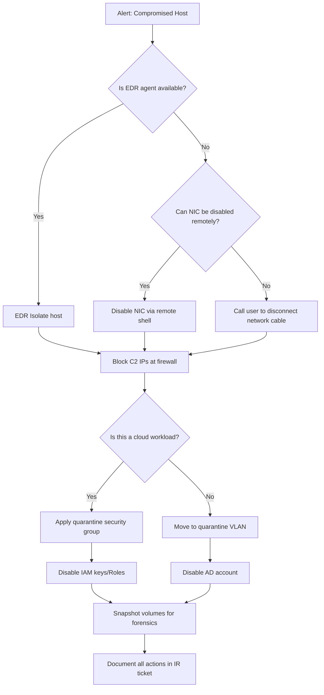

**Containment** is the phase of incident response where the IR team actively stops the adversary from causing further damage. The goal of containment is not to investigate — it is to **stop the bleeding**. Speed is paramount; the perfect containment action taken too late is worthless.

According to the **2024 CrowdStrike Global Threat Report**, the average breakout time (initial compromise to lateral movement) is **79 minutes**. Ransomware operators have achieved lateral movement in as little as **10 minutes**. This means containment decisions must be made in seconds, not hours.

## The Containment Decision Matrix

Every containment option involves a trade-off between speed, reversibility, and evidence preservation:

| Strategy | Speed | Reversibility | Evidence Impact | User Impact |
|----------|-------|---------------|-----------------|-------------|
| **Disable NIC** | Seconds (if EDR agent) | High (enable NIC) | Preserves endpoint state | User loses network |
| **EDR isolate** | Seconds (EDR command) | High (un-isolate) | Allows remote collection | System isolated |
| **Disable user account** | Seconds (AD action) | High (re-enable) | Preserves access logs | User locked out |
| **Revoke session tokens** | Minutes (IdP action) | High (re-issue) | Preserves session traces | User logged out |
| **Block IP at firewall** | Minutes | High (remove rule) | Preserves network evidence | IP blocked |
| **VM snapshot + disconnect** | Minutes | High (reconnect) | Captures volatile state | VM unavailable |
| **Kill process** | Seconds (EDR action) | Low (process restarts) | Loses process memory | App disruption |
| **ACL update (network segment)** | Minutes | High (revert ACL) | Preserves segment evidence | Network segment affected |
| **Power off system** | Seconds | Low (data loss risk) | **Loses all volatile evidence** | System offline |

<Aside variant="danger">
**Never power off a compromised system unless there is an immediate threat to life or safety.** Powering off destroys volatile evidence (RAM, running processes, network connections) that is essential for forensic analysis. Use EDR isolation or NIC disable instead.
</Aside>

## Immediate Containment (Host Level)

These are the fastest containment actions, typically executed through EDR agents already deployed on endpoints.

### EDR Isolation (Recommended)

Modern EDR tools can isolate a host from the network while maintaining a connection to the EDR console for remote investigation:

```bash
# CrowdStrike Falcon — isolate host
csfalcon contain start --hostname WS-FINANCE-01

# SentinelOne — isolate host
sentinelctl isolate network --quiet

# Microsoft Defender for Endpoint — isolate host
Start-MpComputerIsolation -Reason "Suspected malware - finance workstation"
```

### Disable NIC

If EDR is not available, the NIC can be disabled via command:

**Windows:**
```powershell
# Disable all network adapters
Get-NetAdapter | Disable-NetAdapter -Confirm:$false

# Disable specific adapter
Disable-NetAdapter -Name "Ethernet0" -Confirm:$false
```

**Linux:**
```bash
# Bring down all network interfaces
ifconfig eth0 down

# Or using iproute2
ip link set eth0 down

# Block all outbound traffic (emergency)
iptables -A OUTPUT -j DROP
iptables -A INPUT -j DROP
```

**macOS:**
```bash
# Disable network interfaces
sudo ifconfig en0 down

# Disable all network services
sudo networksetup -setnetworkserviceenabled "Wi-Fi" off
```

### Kill Malicious Processes

```powershell
# Windows — kill process by name
Stop-Process -Name "malicious" -Force

# Windows — kill process by PID
Stop-Process -Id 1234 -Force

# Linux — kill process
kill -9 1234

# Linux — kill all processes by name
pkill -9 malicious_process_name
```

## Network Containment

Network containment blocks the adversary's ability to communicate with compromised systems or external infrastructure.

### Firewall ACL Updates

```bash
# Linux iptables — block outbound C2 traffic
iptables -A OUTPUT -d 185.130.5.213 -j DROP
iptables -A OUTPUT -p tcp --dport 443 -m state --state NEW -j LOG --log-prefix "OUTBOUND_443"

# Block all outbound traffic from a specific source IP
iptables -A FORWARD -s 192.168.1.100 -j DROP

# Create a whitelist-only egress rule
iptables -P OUTPUT DROP
iptables -A OUTPUT -d 10.0.0.0/8 -j ACCEPT   # Internal traffic only
iptables -A OUTPUT -d 172.16.0.0/12 -j ACCEPT
iptables -A OUTPUT -m state --state ESTABLISHED,RELATED -j ACCEPT
# Log and drop everything else
iptables -A OUTPUT -j LOG --log-prefix "EGRESS_BLOCKED"
```

### VLAN Isolation

```bash
# Cisco IOS — move port to quarantine VLAN
configure terminal
interface GigabitEthernet0/1
 switchport access vlan 999  # Quarantine VLAN
 end

# Move user to restricted ACL
ip access-list extended QUARANTINE
 permit udp host 192.168.1.100 host 10.0.0.10 eq 53  # DNS only
 permit icmp host 192.168.1.100 any echo-reply
 deny ip any any
```

### DNS Sinkhole

Redirect known malicious domains to a sinkhole IP:

```bash
# Add to DNS server zone
zone "evil-c2.com" {
    type master;
    file "/etc/bind/db.sinkhole";
};

# Sinkhole zone file
$TTL 86400
@   IN  SOA ns1.sinkhole.local. admin.sinkhole.local. (
        2026011601 ; serial
        3600       ; refresh
        600        ; retry
        86400      ; expire
        3600 )     ; minimum
    IN  NS  ns1.sinkhole.local.
    IN  A   10.0.0.99
*   IN  A   10.0.0.99
```

## Cloud Containment

Containment in cloud environments requires different approaches than on-premises:

### AWS Containment Actions

```bash
# Revoke IAM access keys
aws iam update-access-key --access-key-id AKIA12345 --status Inactive --user-name compromised-user

# Attach a deny-all policy to an IAM user
aws iam attach-user-policy --policy-arn arn:aws:iam::aws:policy/AWSDenyAll --user-name compromised-user

# Isolate an EC2 instance (change security group)
aws ec2 modify-instance-attribute --instance-id i-12345 --groups sg-quarantine

# Disable RDS public accessibility
aws rds modify-db-instance --db-instance-identifier compromised-db --no-publicly-accessible

# Revoke an EC2 security group rule
aws ec2 revoke-security-group-ingress --group-id sg-12345 --protocol tcp --port 22 --cidr 0.0.0.0/0

# Remove IAM role from EC2 instance
aws ec2 associate-iam-instance-profile --instance-id i-12345 --iam-instance-profile Name=""
```

### Azure Containment Actions

```bash
# Disable Azure AD user
Connect-MgGraph
Update-MgUser -UserId "user@domain.com" -AccountEnabled:$false

# Revoke all Azure AD refresh tokens
Revoke-MgUserSignInSession -UserId "user@domain.com"

# Isolate Azure VM
az vm update --resource-group myRg --name compromised-vm --enable-agent false
az network nsg rule create --resource-group myRg --nsg-name quarantine-nsg \
  --name deny-all --priority 100 --direction Outbound --access Deny

# Disable Azure AD application
az ad app update --id <app-id> --available-to-other-tenants false --set signInAudience=""
```

### Automated Cloud Containment (AWS Lambda)

The following Lambda function automatically isolates any EC2 instance that is flagged by GuardDuty with a high-severity finding:

```python
import boto3
import os

ec2 = boto3.client('ec2')
QUARANTINE_SG = os.environ['QUARANTINE_SECURITY_GROUP']

def lambda_handler(event, context):
    detail = event['detail']
    
    # Only respond to high-severity GuardDuty findings
    if detail['severity'] >= 7.0:
        instance_id = detail['resource']['instanceDetails']['instanceId']
        
        try:
            # Get current security groups
            response = ec2.describe_instances(InstanceIds=[instance_id])
            current_sgs = response['Reservations'][0]['Instances'][0]['SecurityGroups']
            
            # Remove all current security groups and apply quarantine
            ec2.modify_instance_attribute(
                InstanceId=instance_id,
                Groups=[QUARANTINE_SG]
            )
            
            print(f"ISOLATED: {instance_id} — Moved to quarantine SG {QUARANTINE_SG}")
            
            # Create snapshot for forensics
            for vol in response['Reservations'][0]['Instances'][0]['BlockDeviceMappings']:
                if 'Ebs' in vol:
                    ec2.create_snapshot(
                        VolumeId=vol['Ebs']['VolumeId'],
                        Description=f"Forensic snapshot — {instance_id} — GuardDuty isolation"
                    )
                    
        except Exception as e:
            print(f"ERROR isolating {instance_id}: {str(e)}")
            raise
```

<Aside variant="tip">
Cloud containment should be automated where possible. Use GuardDuty + Lambda (AWS), Defender for Cloud + Logic Apps (Azure), or Chronicle + Cloud Functions (GCP) to trigger automatic isolation when high-severity detections fire. Every second counts.
</Aside>

## Account and Credential Containment

Compromised credentials must be contained immediately, as attackers use them for lateral movement and persistence:

```powershell
# Disable AD user account
Disable-ADAccount -Identity "compromised-user"

# Reset password (forces immediate logoff in most cases)
Set-ADAccountPassword -Identity "compromised-user" -Reset -NewPassword (ConvertTo-SecureString -AsPlainText "Temp$2026!" -Force)

# Revoke all Kerberos tickets
Get-ADUser -Identity "compromised-user" | Revoke-ADAuthentication

# Force logoff all active sessions
Get-WmiObject -Class Win32_ComputerSystem | ForEach-Object { $_.Logoff() }

# Remove from all privileged groups
Remove-ADGroupMember -Identity "Domain Admins" -Members "compromised-user" -Confirm:$false

# Revoke SaaS session tokens (Okta)
Invoke-OktaDeactivateUser -UserId "compromised-user"

# Revoke all OAuth tokens (Azure AD)
Revoke-MgUserSignInSession -UserId "compromised-user@domain.com"

# Reset API keys and rotate secrets
aws iam create-access-key --user-name compromised-sa
aws iam update-access-key --access-key-id OLD_KEY --status Inactive --user-name compromised-sa
aws iam delete-access-key --access-key-id OLD_KEY --user-name compromised-sa
```

## Containment Decision Flow



## Case Study: Colonial Pipeline Containment

The **Colonial Pipeline ransomware attack (May 2021)** demonstrates both good and bad containment decisions:

| Containment Decision | Good or Bad? | Rationale |
|---------------------|--------------|-----------|
| **Immediately shut down the pipeline** | Good — prevented ransomware from spreading to OT systems | The decision to proactively shut down, while painful (6-day shutdown, fuel shortages), prevented what could have been a catastrophic OT compromise |
| **Took the billing system offline** | Good — isolated financial systems from the compromise | Prevented attackers from accessing payment data |
| **Paid the $4.4M ransom** | Controversial — but the operational decision was that they could not restore from backups quickly enough | Debate continues: the decryptor was slow and some data could not be recovered |
| **Did not have offline backups** | Bad — forced the ransom payment decision | Backups were also encrypted (connected network storage) |
| **No EDR on ICS/OT systems** | Bad — limited visibility into OT environment | Lack of endpoint telemetry made scoping difficult |

### Lessons Learned

- **Cold/offline backups are essential** — online backups are vulnerable to the same ransomware
- **Network segmentation between IT and OT should be air-gapped** — firewalls alone are not enough
- **Containment decisions have business consequences** — shutting down a pipeline creates fuel shortages; containment plans must account for business continuity
- **Ransom payment should never be the first option** — the decision to pay must be informed by backup status, decryption viability, and insurance policy requirements

## Key Takeaways

- Containment stops the bleeding — speed is paramount, and the perfect containment action taken late is worthless
- EDR isolation is the fastest and most reversible host containment method — never power off a compromised system
- Network containment blocks adversary communication: firewall ACLs, VLAN isolation, and DNS sinkholes
- Cloud containment requires different tools: security group changes, IAM key revocation, and Lambda-based auto-containment
- Account containment (disable, reset password, revoke tokens, remove from groups) must happen for every compromised identity
- The Colonial Pipeline breach demonstrated that backup strategy and network segmentation directly determine containment outcomes — offline backups and IT/OT separation are non-negotiable
