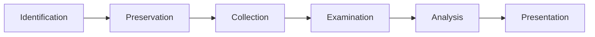

**Digital forensics** is the practice of collecting, preserving, analysing, and presenting digital evidence in a manner that is legally admissible. In incident response, forensics answers the critical questions: *What happened? How did the attacker get in? What did they do? What data was affected?*

The **2024 Verizon DBIR** found that organisations conducting formal forensic investigations identified the root cause of breaches **3x more accurately** than those relying solely on log review. Accurate root cause analysis is essential for preventing recurrence.

## Forensics Methodology

The forensic process follows a structured methodology that ensures evidence integrity and legal admissibility:



### Phase 1 — Identification

Identify what evidence exists and where it resides:

| Evidence Source | What It Contains | Priority |
|-----------------|------------------|----------|
| **Volatile memory (RAM)** | Running processes, network connections, loaded drivers, encryption keys, injected code, clipboard contents | **Highest** — lost on power off |
| **System state** | Registry hives, event logs, crash dumps, pagefile | High |
| **Non-volatile storage** (HDD/SSD) | Files, deleted data, slack space, unallocated clusters | Medium |
| **Network traffic** | Packet captures, NetFlow, firewall logs, proxy logs | Medium |
| **Cloud artifacts** | API logs, bucket access logs, IAM activity, VPC flow logs | Medium |
| **Backups** | Historical system state, file versions | Low (stable) |

### Phase 2 — Preservation

Preserve evidence in its current state without modification. The cardinal rule: **do not modify the original evidence**.

| Preservation Principle | Practice |
|-----------------------|----------|
| **Write blocker** | Use hardware or software write blockers when imaging disks |
| **Hash verification** | Generate SHA-256 hash before and after collection; verify match |
| **Chain of custody** | Document every person who handles the evidence, when, and why |
| **Secure storage** | Store evidence in encrypted, access-controlled, temperature-monitored storage |
| **Working copy** | **Never analyse the original** — always work from a forensically sound copy |

### Phase 3 — Collection

Collect evidence following the **Order of Volatility** (RFC 3227):

| Order | Evidence | Collection Tool | Volatility |
|-------|----------|-----------------|------------|
| **1** | CPU registers, cache | Not typically collected (lost on capture) | Nanoseconds |
| **2** | RAM / Memory | `dumpit` (Windows), `avml` (Linux), `memdump` (Volatility) | Seconds |
| **3** | Network connections | `netstat -anob` (Windows), `ss -tulpn` (Linux), `netsh trace` | Seconds-minutes |
| **4** | Running processes | `pslist` (Sysinternals), `ps aux` (Linux) | Seconds |
| **5** | Open files | `handle` (Sysinternals), `lsof` (Linux) | Minutes |
| **6** | Operating system state | Registry, event logs, configuration | Minutes-hours |
| **7** | Disk | Bit-for-bit image (`dd`, FTK Imager, `guymager`) | Hours-days |
| **8** | Network captures | tcpdump, Wireshark, network tap | Continuous |
| **9** | Remote logs / backups | SIEM, log server, backup repository | Days-weeks |

### Phase 4 — Examination

Examine the evidence to extract relevant data:

| Examination Type | Tool | What to Look For |
|-----------------|------|------------------|
| **Memory analysis** | Volatility | Malicious processes, injected DLLs, hidden connections, rootkits |
| **Disk analysis** | Autopsy, FTK Imager, The Sleuth Kit | Deleted files, browser history, registry keys, prefetch files |
| **Timeline analysis** | `fls` + `mactime`, Autopsy timeline | File creation/modification/access timeline, attacker activity chronology |
| **Registry analysis** | RegRipper, Zimmerman Tools | Run keys (persistence), UserAssist (executed programs), Shellbags (folder access) |
| **Browser forensics** | BrowserHistoryView, Chrome analysis | Downloaded files, visited URLs, saved passwords, search history |
| **Network analysis** | Wireshark, NetworkMiner | C2 traffic, data exfiltration, protocol anomalies |

### Phase 5 — Analysis

Analysis reconstructs the sequence of events and determines:

- **Initial access vector**: How did the attacker get in?
- **Timeline of activity**: What happened, in what order?
- **Scope of compromise**: Which systems, users, and data were affected?
- **Exfiltration**: Was data stolen? What data and how much?
- **Persistence mechanisms**: How would the attacker maintain access?
- **Root cause**: What vulnerability or failure enabled the breach?

### Phase 6 — Presentation

Present findings in a clear, defensible format:

- **Executive summary**: One-page overview for leadership
- **Technical report**: Detailed findings for IR team and engineering
- **Evidence log**: Complete chain of custody, hash values, collection details
- **Timeline**: Visual chronology of attacker activity
- **Recommendations**: Specific, prioritised remediation actions

## Chain of Custody

The **chain of custody** is a formal document that tracks evidence from collection through analysis to court presentation. It must be maintained for every piece of evidence.

### Chain of Custody Form

```
CHAIN OF CUSTODY FORM

Case Number: IR-2026-0016
Evidence ID: EVD-001
Description: Forensic image of WS-FINANCE-01 SSD (Samsung 1TB)
Investigator: Jane Smith, Lead Forensics

ACQUISITION:
Date/Time: 2026-01-16 09:15 UTC
Collection Method: dd bit-for-bit image (write-blocked)
Hash (SHA-256): a1b2c3d4e5f6... (before collection)
                         a1b2c3d4e5f6... (after collection) ✓ MATCH
Collected by: Jane Smith
Location: Finance Dept, Building A, 3rd Floor

TRANSFER HISTORY:
| Date/Time (UTC) | From | To | Reason | Signature |
|-----------------|------|----|--------|-----------|
| 2026-01-16 10:30 | Jane Smith | Evidence Locker (EVD-SAFE-01) | Initial storage | J. Smith |
| 2026-01-16 14:00 | Evidence Locker | Forensics Lab (WS-FORENSICS-01) | Analysis | J. Smith |
| 2026-01-17 08:00 | Forensics Lab | Evidence Locker | Returned after analysis | J. Smith |
| 2026-01-17 08:15 | Evidence Locker | External Forensics (Mandiant) | Advanced malware analysis | J. Smith → M. Chen |
| 2026-01-22 17:00 | Mandiant | Evidence Locker | Returned after analysis | M. Chen → J. Smith |

NOTES:
- Evidence was stored in encrypted LUKS container during transfer
- All transfers witnessed and signed
- Access to evidence locker logged and monitored
- No evidence was left unattended at any time
```

<Aside variant="danger">
A broken chain of custody makes evidence inadmissible in court. Any gap in the chain — even a few minutes of unaccounted time — can be exploited by the defence to argue evidence tampering. Document everything, verify every transfer.
</Aside>

## Forensics Tools In-Depth

### Memory Collection and Analysis

**Memory collection on Windows (DumpIt):**

```bash
# DumpIt — one-click memory acquisition (runs from USB drive)
DumpIt.exe /output E:\evidence\WS01_memory.dmp /quiet

# Magnet RAM Capture — CLI memory acquisition
MagnetRAMCapture.exe E:\evidence\WS01_memory.raw
```

**Memory collection on Linux (AVML / LiME):**

```bash
# AVML (Azure VM memory acquisition tool)
sudo ./avml /evidence/server01_memory.dmp

# LiME (Linux Memory Extractor)
insmod lime.ko "path=/evidence/server01_memory.dmp format=lime"
```

**Memory analysis with Volatility:**

```bash
# Identify the OS profile
volatility -f memory.dmp imageinfo
# Output: Suggested Profile(s): Win10x64_19041

# List running processes
volatility -f memory.dmp --profile=Win10x64_19041 pslist
volatility -f memory.dmp --profile=Win10x64_19041 psscan    # Hidden processes
volatility -f memory.dmp --profile=Win10x64_19041 pstree    # Process tree

# List network connections
volatility -f memory.dmp --profile=Win10x64_19041 netscan

# Dump process memory
volatility -f memory.dmp --profile=Win10x64_19041 memdump -p 1234 -D output/

# Extract command-line history
volatility -f memory.dmp --profile=Win10x64_19041 cmdline

# Scan for injected code
volatility -f memory.dmp --profile=Win10x64_19041 malfind

# Extract registry hives
volatility -f memory.dmp --profile=Win10x64_19041 hivelist
volatility -f memory.dmp --profile=Win10x64_19041 printkey -K "Software\Microsoft\Windows\CurrentVersion\Run"

# Dump LSASS for credential analysis
volatility -f memory.dmp --profile=Win10x64_19041 lsadump
```

### Disk Imaging

**dd (Linux — standard imaging tool):**

```bash
# Create a bit-for-bit forensic image
sudo dd if=/dev/sda of=/evidence/image.dd bs=4M conv=noerror,sync status=progress

# Create compressed image (saves 40-70% space)
sudo dd if=/dev/sda bs=4M conv=noerror,sync | gzip -c > /evidence/image.dd.gz

# Verify image integrity with hash
sudo dd if=/dev/sda bs=4M | tee >(sha256sum > /evidence/hash.txt) > /evidence/image.dd

# Image over network (forensic workstation receives)
sudo dd if=/dev/sda bs=4M | nc forensic-workstation 9999
```

**Guymager (Linux — GUI imaging tool):**

```bash
# Install guymager
sudo apt-get install guymager

# Run (GUI interface)
sudo guymager

# Guymager features:
# - Support for EWF (EnCase), AFF, and raw formats
# - Automatic hash calculation (MD5, SHA-1, SHA-256)
# - Bad sector handling with retry
# - Progress indicator and ETA
# - Case number, evidence number, and notes fields
```

**FTK Imager (Windows — free forensic imaging):**

```bash
# FTK Imager can:
# 1. Create forensic images (dd, E01, SMART)
# 2. Mount images as read-only drives
# 3. Export files and folders
# 4. Capture memory (32-bit only)
# 5. View registry, event logs, and file system
```

### Disk Analysis

**Autopsy (GUI — open-source digital forensics platform):**

```bash
# Install Autopsy (Linux)
sudo apt-get install autopsy

# Or download from sleuthkit.org
```

Autopsy features:
- **Timeline analysis**: Visual chronology of file system activity
- **Keyword search**: Indexed search across all files, unallocated space, and slack space
- **File type sorting**: Identify files by type regardless of extension
- **EXIF/metadata extraction**: Camera, GPS, document metadata
- **Email analysis**: PST/OST parsing, mailbox analysis
- **Registry analysis**: Automated registry artifact extraction
- **Web artifact analysis**: Browser history, cookies, downloads, bookmarks
- **Hash matching**: NSRL hash set (known good files) + custom hash sets

**The Sleuth Kit (CLI — command-line forensic toolkit):**

```bash
# List partitions in an image file
mmls image.dd

# List files in a partition
fls -o 2048 image.dd

# List deleted files
fls -o 2048 -d image.dd

# Recover a specific file
icat -o 2048 image.dd 1234 > recovered_file.bin

# Create a timeline of file activity
fls -o 2048 -r -m / image.dd > body.txt
mactime -b body.txt -d > timeline.csv

# Search for specific content
sigfind -l -i "MZ" image.dd   # Search for PE executables
```

## Forensic Analysis Workflow

```
Step 1: Initial Assessment
├── Review the alert and IR ticket for context
├── Determine collection priority based on order of volatility
├── Prepare forensic workstation (updated tools, clean drives)
└── Set up chain of custody documentation

Step 2: Memory Collection
├── Collect RAM before any other action
├── Verify hash of collected memory
├── Document collection details
└── Store in encrypted evidence container

Step 3: Disk Imaging
├── Connect source disk via write blocker
├── Verify write blocker is functioning (test write — verify blocked)
├── Create forensic image (dd, E01, or AFF)
├── Generate and verify hash
├── Document serial numbers, model, capacity
└── Store original disk in evidence locker; work from image

Step 4: Analysis — Memory
├── Identify OS profile with Volatility
├── Extract process list, network connections, loaded DLLs
├── Scan for injected code (malfind)
├── Extract command-line history
├── Dump suspicious process memory
└── Extract credentials and crypto keys if relevant

Step 5: Analysis — Disk
├── Recover deleted files
├── Extract registry hives and analyze persistence
├── Review event logs for attacker activity
├── Analyze prefetch files for executed tools
├── Review browser history for downloads
├── Extract user documents and recent files
└── Search for keywords (passwords, confidential terms, attacker names)

Step 6: Timeline Reconstruction
├── Build comprehensive timeline from all sources
├── Correlate memory, disk, network, and log evidence
├── Identify patient zero and initial access vector
├── Map attacker actions to MITRE ATT&CK
└── Document the complete attack narrative

Step 7: Reporting
├── Executive summary (one page)
├── Technical findings (detailed)
├── Timeline with visual aids
├── Exfiltration assessment
├── Remediation recommendations
└── Chain of custody appendix
```

## Key Takeaways

- Digital forensics follows a six-phase methodology: Identification → Preservation → Collection → Examination → Analysis → Presentation — each phase is critical for legal admissibility
- Order of Volatility dictates collection priority: RAM is collected first, disk is collected last. Never power off a system before collecting volatile evidence
- Chain of custody is the most important administrative control — every evidence transfer must be documented, dated, and signed. A broken chain makes evidence inadmissible
- Memory analysis with Volatility reveals running processes, injected code, network connections, and credentials that are invisible on disk
- Disk imaging must use write blockers and hash verification — the original evidence must never be modified
- Timeline analysis correlates evidence across sources to reconstruct the complete attack narrative
