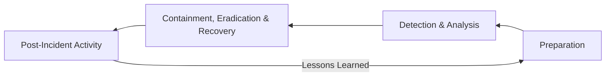
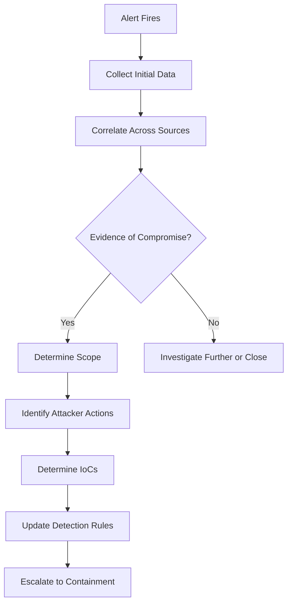

The **NIST SP 800-61 Rev 2** standard, *Computer Security Incident Handling Guide*, defines the authoritative framework for incident response. It structures IR into four phases that form a continuous improvement cycle:



Understanding this lifecycle — and its real-world application — is essential for anyone involved in security operations. According to the **2024 Ponemon Cost of a Data Breach Report**, organisations that follow a structured IR lifecycle reduce breach costs by an average of **$1.2 million** compared to those with ad-hoc response processes.

## Phase 1: Preparation

Preparation is the most critical phase — and the most commonly neglected. If you are building your IR capability during an incident, you have already failed.

### Components of Preparation

| Area | Detail | Real-World Example |
|------|--------|-------------------|
| **IR Plan** | Documented, approved, and communicated | NIST-based plan with defined roles, escalation paths, and communication templates |
| **IR Team** | Trained personnel with defined roles | CSIRT with L1/L2/L3, legal, PR, executive liaison |
| **Tools** | Pre-deployed and tested | EDR, SIEM, SOAR, forensic workstations, network capture |
| **Playbooks** | Runbooks for common scenarios | Ransomware playbook, phishing playbook, DDoS playbook |
| **Communication** | Call tree, secure channels, PR templates | Slack channels, conference bridge, encrypted email, press statement drafts |
| **Training** | Regular exercises and drills | Quarterly tabletop exercises, annual full-scale simulation |
| **Infrastructure** | Logging, backups, network segmentation | Centralised logging with sufficient retention, immutable backups |

### Preparation Check — The 80/20 Rule

A common mistake is trying to prepare for every possible scenario. The 80/20 rule applies: **80% of incidents fall into 20% of scenarios**. Focus preparation on the most likely scenarios:

| Scenario | Likelihood (Enterprise) | Priority |
|----------|------------------------|----------|
| **Phishing / Email compromise** | Very high | P1 |
| **Ransomware** | High | P1 |
| **Insider data theft** | Medium | P2 |
| **DDoS** | Medium | P2 |
| **Supply chain compromise** | Low | P3 |
| **Nation-state APT** | Very low (for most orgs) | P3 |

## Phase 2: Detection & Analysis

Detection is covered in depth in the Threat Detection module. From an IR perspective, detection triggers the transition from monitoring to response.

### The Triage Process

When an alert fires, the IR team follows a structured triage process:

**Step 1 — Verify**: Is this a true positive? Check the alert details, correlate with other data sources, rule out environmental noise.

**Step 2 — Classify**: Determine the incident type (malware, phishing, unauthorised access, DDoS, etc.) and severity (critical, high, medium, low).

**Step 3 — Scope**: What systems, users, and data are affected? Is it a single workstation or a domain-wide compromise?

**Step 4 — Impact**: What is the potential business impact? Data exfiltration? Ransomware encryption? Regulatory notification?

| Severity | Definition | Response SLA | Example |
|----------|------------|--------------|---------|
| **Critical** | Active threat to life/safety, or confirmed breach of critical systems with data exfiltration | Immediate — < 15 min response | Active ransomware encryption across production servers |
| **High** | Confirmed compromise of sensitive data or systems | < 1 hour | Phishing compromise of a finance executive's email |
| **Medium** | Suspicious activity without confirmed data loss | < 4 hours | Multiple failed logons from unusual geo-location |
| **Low** | Policy violation, nuisance activity | < 24 hours | Employee installing unauthorised software |

### Analysis — Gathering the Picture

Analysis determines what happened, how it happened, and what the adversary is doing:



<Aside variant="info">
The first 60 minutes of detection are the most critical. According to CrowdStrike's 2024 report, the average breakout time is 79 minutes. If your triage takes longer than that, the attacker has already moved laterally.
</Aside>

## Phase 3: Containment, Eradication & Recovery

This phase is where the IR team actively stops the adversary and removes their presence.

### Containment Strategies

| Strategy | Speed | Reversibility | Use Case |
|----------|-------|---------------|----------|
| **Host isolation** (disable NIC) | Seconds | Moderate (reboot to restore) | Single compromised host |
| **Account disable** | Seconds | High (re-enable) | Compromised user/service account |
| **Network block** (firewall ACL) | Minutes | High (remove rule) | Blocking C2 infrastructure |
| **VM isolation** (snapshot + disconnect) | Minutes | High (reconnect) | Cloud workload compromise |
| **Application quarantine** | Minutes | Moderate (remove from quarantine) | SaaS account compromise |
| **Full network segmentation** | Hours | Low (complex reconfiguration) | Active ransomware spreading |

### Eradication

Eradication removes the adversary's presence from the environment. This includes:

- Removing malware from affected systems
- Deleting backdoors, webshells, and persistence mechanisms
- Resetting compromised credentials (passwords, API keys, certificates)
- Patching exploited vulnerabilities
- Removing unauthorised accounts and group memberships

**The Golden Rule of Eradication**: If you cannot be certain that a system is clean, rebuild it from known-good sources. Reimaging is always safer than attempting to clean a compromised system.

### Recovery

Recovery restores normal operations:

1. Restore clean systems from validated backups (test the backup first!)
2. Verify systems are patched and hardened before reconnecting
3. Monitor restored systems closely for signs of re-infection
4. Gradually restore service access as each system is verified clean
5. Communicate restoration progress to stakeholders

## Phase 4: Post-Incident Activity

The final phase — and the one most frequently skipped — is where the organisation learns from the incident and improves its defences.

### Post-Mortem Meeting

The post-mortem (also called a "lessons learned" or "after-action review") should include:

- **Timeline reconstruction**: What happened, when, and in what sequence
- **Root cause analysis**: How did the attacker gain initial access?
- **Control effectiveness**: Which controls worked? Which failed? Which were missing?
- **Process evaluation**: Did the IR plan hold up? Were communication channels effective?
- **Metrics**: MTTD, MTTR, containment time, recovery time
- **Improvement actions**: Specific, owner-assigned actions with deadlines

### Post-Mortem Template

```
INCIDENT POST-MORTEM

Incident ID: INC-2026-0016
Title: Ransomware — Finance Department
Date: 2026-01-16
Severity: Critical

TIMELINE:
[2026-01-14 08:23] — User received phishing email (clicked link)
[2026-01-14 08:25] — QakBot loader downloaded and executed
[2026-01-14 09:45] — Cobalt Strike beacon established
[2026-01-14 14:12] — Lateral movement via RDP to file server
[2026-01-15 02:00] — Ransomware deployed (LockBit 3.0 variant)
[2026-01-15 02:03] — SIEM alert fired (mass file encryption detected)
[2026-01-15 02:07] — L1 analyst acknowledged alert
[2026-01-15 02:15] — Containment initiated: file server isolated
[2026-01-15 02:30] — EDR containment: all affected hosts isolated
[2026-01-15 03:00] — C2 domains blocked at firewall
[2026-01-15 04:00] — IR team completed scoping
[2026-01-15 06:00] — Clean backup restoration began
[2026-01-15 18:00] — Full recovery completed

ROOT CAUSE:
Phishing email with malicious link delivered to finance user. Email security filter 
did not detect the URL because the domain was 2 hours old (newly registered).

WHAT WORKED:
- EDR detected and alerted on mass file encryption within 3 minutes
- Offline backups allowed full restoration
- Call tree activation was completed in 8 minutes

WHAT FAILED:
- Email security did not detect the phishing URL (new domain)
- No endpoint isolation trigger automated from SIEM alert
- RDP was open to the file server from all workstations (not segmented)

IMPROVEMENT ACTIONS:
1. [P1] Implement automated host isolation in SOAR playbook for ransomware alerts (Owner: IR Lead, Due: 2 weeks)
2. [P1] Add new-domain detection to email security (Owner: Security Eng, Due: 1 week)
3. [P2] Segment RDP access to file server to specific jump hosts (Owner: Network Team, Due: 4 weeks)
4. [P3] Deploy phishing simulation training for finance department (Owner: Security Awareness, Due: 2 weeks)
```

### Metrics and Reporting

Key metrics to track across all incidents:

| Metric | Definition | Target |
|--------|------------|--------|
| **MTTD** (Mean Time to Detect) | Time from compromise to detection | < 1 hour |
| **MTTR** (Mean Time to Respond) | Time from detection to containment | < 2 hours |
| **Mean containment time** | Time from escalation to containment | < 30 minutes |
| **Mean recovery time** | Time from containment to full recovery | < 24 hours |
| **% of incidents with post-mortem** | How many incidents get a formal review | 100% for critical/high |
| **% of post-mortem actions completed** | Improvement action closure rate | > 80% within 30 days |

## Case Study: Mandiant and the SolarWinds Response

The **SolarWinds breach (discovered December 2020)** remains one of the most significant incident response cases in history. FireEye (Mandiant) discovered the breach within their own network and traced it to the SolarWinds Orion supply chain compromise.

### Response Timeline

| Date | Event | IR Phase |
|------|-------|----------|
| **March 2020** | Attacker inserts SUNBURST backdoor into SolarWinds Orion build | Initial Compromise |
| **March-Dec 2020** | 18,000 organisations receive trojanised update | Propagation |
| **Dec 8, 2020** | FireEye detects the breach internally | Detection |
| **Dec 13, 2020** | Mandiant releases public disclosure | Analysis |
| **Dec 14-31, 2020** | Global IR mobilisation — every affected org begins response | Containment |
| **Jan-Mar 2021** | Attribution to APT29 (SVR) — infrastructure dismantled | Eradication |
| **2021-2022** | Organisations rebuild SolarWinds servers, rotate all credentials, audit cloud access | Recovery |
| **Ongoing** | Supply chain security reforms, software bill of materials (SBOM) mandates | Post-Incident |

### Key IR Lessons from SolarWinds

1. **Trust nothing, verify everything**: The attackers signed their malware with a valid SolarWinds certificate. Code signing does not equal safety.

2. **Supply chain risk is real**: Your security depends on the security of every vendor whose software runs in your environment.

3. **18 months of dwell time**: The attackers maintained access for over a year — log retention must exceed maximum possible dwell time.

4. **Backdoors in trusted software**: No amount of perimeter security helps when the software itself is compromised. Detection must focus on behaviour, not just signatures.

5. **Coordinate across organisations**: The response required unprecedented collaboration between private sector (FireEye, Microsoft, CrowdStrike) and government (CISA, FBI).

<Aside variant="danger">
The SolarWinds breach fundamentally changed incident response. It demonstrated that even the most sophisticated security teams can be compromised through trusted vendors. Every IR plan must now include supply chain incident scenarios.
</Aside>

## Key Takeaways

- The NIST SP 800-61 IR lifecycle (Preparation → Detection → Containment/Eradication/Recovery → Post-Incident) provides the foundational framework for all incident response activities
- Preparation is the most critical phase — build the plan, train the team, and test the tools before an incident occurs
- Triage classifies incidents by severity and determines the appropriate response SLA — the first 60 minutes are critical
- Containment strategies range from seconds (host isolation) to hours (network segmentation) — choose speed over elegance
- Post-incident activity (post-mortem) is how the organisation improves — without it, the same incident will happen again
- The SolarWinds breach demonstrated that supply chain attacks require new response approaches: behaviour-based detection, extended log retention, and cross-organisation coordination
