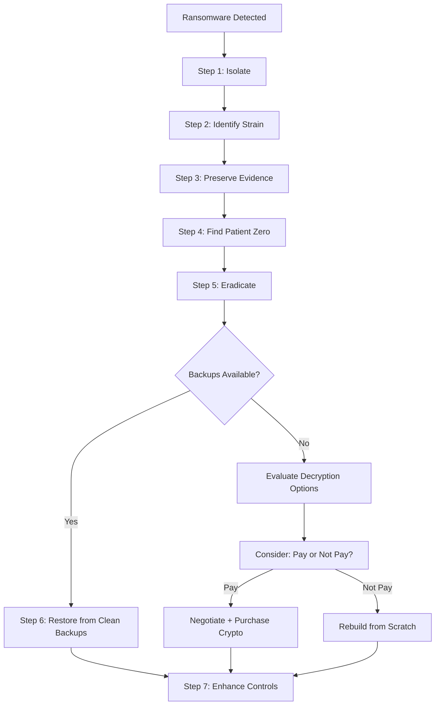

**Ransomware** is the most financially destructive threat facing organisations today. The **2024 Verizon DBIR** found that ransomware appeared in **24% of all breaches** — and the average ransom demand increased to **$1.5 million**, with the average recovery cost reaching **$4.5 million** including downtime, remediation, and reputational damage.

Ransomware response is a specialised discipline within incident response. The stakes are high: every minute of encryption spreads the damage, and the decision to pay or not to pay has legal, financial, and ethical implications.

## The Ransomware Threat Landscape

| Statistic | Value | Source |
|-----------|-------|--------|
| Average ransom demand (2024) | $1.5 million | Palo Alto Unit 42 |
| Average recovery cost | $4.5 million | IBM/Ponemon |
| Median downtime | 24 days | Coveware |
| % of organisations paying ransom | 32% | Sophos |
| % paying who got all data back | 63% | Sophos |
| Most common initial access | Phishing (41%), RDP compromise (22%) | CrowdStrike |
| Average dwell time before encryption | 5 days | Mandiant |
| Most targeted sector | Healthcare, Financial Services, Government | Verizon DBIR |

## Step-by-Step Ransomware Response



### Step 1: Isolate Affected Systems

**Immediate actions** (seconds to minutes):

```
1. EDR isolate all affected hosts immediately
   → Do not wait for scoping — isolate first, investigate second

2. Disable all network shares and mapped drives
   → Prevents encryption of network file servers

3. Block all outbound traffic from affected network segments
   → Prevents C2 communication and further data exfiltration

4. Disable or disconnect backup storage if backups are online
   → Prevents backup encryption (immutable/cold backups unaffected)

5. Notify IR team via out-of-band communication
   → Ransomware may monitor email/Slack — use phone or Signal
```

**CRITICAL: Do not power off systems** — volatile evidence (RAM, running processes, active encryption) is needed for analysis and decryption possibilities.

### Step 2: Identify the Ransomware Strain

Identifying the strain determines whether a decryptor exists, what the ransom demand will be, and how the ransomware operates:

**Method 1: Ransom note**

```
README_TO_DECRYPT.html (LockBit)
How_To_Return_Files.txt (REvil)
DECRYPT_INSTRUCTIONS.html (BlackCat/ALPHV)
!Decrypt-All-Files!.html (Maze)
```

**Method 2: File extension**

```
.encrypted (LockBit)
.locked (REvil)  
.[email].mamba (BlackCat)
.[id].crypt (Sodinokibi)
```

**Method 3: Ransomware identification tools**

| Tool | URL | Description |
|------|-----|-------------|
| **ID Ransomware** | https://id-ransomware.malwarehunterteam.com | Upload ransom note or encrypted file; identifies strain |
| **No More Ransom** | https://www.nomoreransom.org | Joint project by Europol, Kaspersky, McAfee; offers free decryptors |
| **EMSIsoft Ransomware Identification** | https://www.emsisoft.com/ransomware-decryption-tools | Database of known ransomware + decryptors |
| **AV decryptor tools** | Vendor-specific | Bitdefender, Avast, Kaspersky offer free decryptors for some strains |

**Method 4: Dark web leak site check**

Many ransomware operations have public leak sites where they name victims. Check these to confirm the group and see what data has been leaked:

```
LockBit: http://lockbit[.]org
BlackCat/ALPHV: http://alphv[.]xyz
Cl0p: http://clop[.]su
```

<Aside variant="danger">
Visiting ransomware leak sites from corporate networks is risky — the sites may contain malicious content or be monitored by the ransomware group. Use a sanitised browser or Tor browser in a separate environment.
</Aside>

### Step 3: Preserve Evidence

Forensic evidence is critical for understanding the attack, supporting law enforcement, and defending against legal action:

| Evidence | Collection Method | What It Reveals |
|----------|-------------------|-----------------|
| **Ransom note** | Copy the note text and metadata | Ransomware strain, contact email, payment instructions |
| **Encrypted files** | Copy a sample of encrypted files + originals (if available) | Encryption algorithm, extension pattern |
| **Memory dump** | Collect RAM from affected hosts | Running processes, encryption keys (potentially recoverable) |
| **Process creation logs** | Export Windows Event Log (4688) | Execution chain, parent process, command line |
| **Network capture** | pcap from affected network segment | C2 traffic, lateral movement, data exfiltration |
| **EDR telemetry** | Export EDR timeline | Complete process ancestry, file operations, network connections |

### Step 4: Determine Patient Zero and Infection Vector

Understanding how the ransomware entered is essential for eradication and prevention:

| Infection Vector | Forensic Evidence | Prevention |
|-----------------|-------------------|------------|
| **Phishing email** | Email logs, user report, browser history | Email security, phishing training, MFA |
| **RDP brute force** | Windows Event ID 4625, firewall logs | MFA for RDP, VPN-only access, account lockout |
| **Exploited vulnerability** | EDR logs, vulnerability scanner data | Patch management, WAF, IPS |
| **Compromised credentials** | Authentication logs, credential stuffing patterns | MFA, passwordless auth, dark web monitoring |
| **Supply chain** | Software install logs, update logs | SBOM, vendor security assessment, behaviour-based detection |
| **Drive-by download** | Browser logs, download history, web proxy logs | Web filtering, browser isolation, ad blocking |

### Step 5: Eradicate

Remove the ransomware and attacker access from the environment:

```
1. Remove ransomware binaries and persistence mechanisms
   → Delete scheduled tasks, services, Run keys

2. Terminate active attacker sessions
   → Disable all compromised accounts, reset credentials

3. Remove backdoors and C2 beacons
   → Delete webshells, remote access tools, tunnelling software

4. Patch exploited vulnerabilities
   → Apply patches for the specific CVE or misconfiguration used

5. Change ALL credentials
   → All local admin passwords, service account passwords, domain admin passwords
   → All application credentials and API keys
   → All certificates (replace, not just re-issue)

6. Verify eradication
   → Full EDR scan across the environment
   → Hunt for persistence mechanisms related to the ransomware family
   → Monitor for 48+ hours of no malicious activity
```

<Aside variant="caution">
If you cannot be certain that a system is 100% clean — format and reinstall. Ransomware groups now use multi-stage payloads where the initial executable is only the first stage. What looks like a clean system may have a dormant second stage waiting for activation.
</Aside>

### Step 6: Restore from Backups

Restoration is the most critical phase for business continuity. The quality of your backup strategy determines whether you recover quickly or face extended downtime.

**Backup Requirements for Ransomware Resilience:**

| Requirement | Why | Implementation |
|-------------|-----|----------------|
| **3-2-1 rule** | 3 copies, 2 media types, 1 off-site | Primary + local backup + off-site/cloud |
| **Immutable backups** | Cannot be modified or encrypted by attacker | AWS S3 Object Lock, Azure Blob immutability, tape (offline) |
| **Air-gapped backups** | No network path from production | Tape stored offline, physically disconnected NAS |
| **Tested restoration** | Backups are worthless if they don't restore | Quarterly full restoration drill |
| **Separation of duties** | Backup admin ≠ domain admin | Different accounts prevent attacker from deleting backups via compromised domain admin |

**Restoration Process:**

```
1. Verify backup integrity
   → Check backup catalogs are not corrupted
   → Test restore a single small system first

2. Rebuild clean environment
   → Wipe and reinstall affected systems from known-good media
   → Apply all security patches before reconnecting

3. Restore data
   → Restore from the most recent clean backup (pre-compromise)
   → Scan restored files for malware before moving to production

4. Verify restored data
   → Check data integrity and completeness
   → Test application functionality

5. Reconnect to network
   → Apply least-privilege segmentation
   → Enhanced monitoring for re-infection
```

### Step 7: Enhance Security Controls

Post-incident hardening to prevent recurrence:

| Control | Implementation | Timeline |
|---------|---------------|----------|
| **MFA everywhere** | MFA on all external-facing systems, VPN, admin portals | 1 week |
| **EDR deployment** | 100% endpoint coverage (no gaps) | 2 weeks |
| **Network segmentation** | Isolate critical systems, limit lateral movement | 4 weeks |
| **Backup hardening** | Immutable/air-gapped backups | 2 weeks |
| **Email security** | DMARC, DKIM, SPF, phishing detection, URL sandboxing | 2 weeks |
| **Patching** | Critical patch SLA < 48 hours | Immediate |
| **RDP hardening** | VPN-only, MFA, jump boxes, no direct exposure | 1 week |
| **User training** | Phishing simulation, ransomware awareness | Ongoing |

## Case Study: Colonial Pipeline

The **Colonial Pipeline ransomware attack (May 2021)** is the most significant ransomware incident in US history. The attack disrupted fuel supply across the US East Coast for 6 days and led to the payment of a $4.4 million ransom.

### Timeline

| Date/Time | Event |
|-----------|-------|
| **April 29** | Darkside ransomware affiliate gains access via compromised VPN password (no MFA) to legacy VPN account no longer in active use |
| **May 6** | Attacker deploys Darkside ransomware on Colonial's billing and business network |
| **May 7 (early AM)** | Ransomware begins encrypting billing system servers |
| **May 7 (05:00)** | Colonial discovers the ransomware; begins containment |
| **May 7 (09:00)** | Colonial proactively shuts down the entire pipeline (gasoline, diesel, jet fuel) — 5,500 miles |
| **May 7 (afternoon)** | Colonial notifies FBI and CISA |
| **May 8** | Colonial pays $4.4 million ransom (75 Bitcoin) |
| **May 8-10** | Colonial receives decryptor; decryption is slow and some data cannot be recovered |
| **May 12** | Pipeline restarts partial operations |
| **May 15** | Full pipeline operations restored |
| **June 2021** | US Department of Justice recovers $2.3 million of the ransom (63.7 Bitcoin) |

### Root Cause Analysis

| Finding | Detail | Prevention |
|---------|--------|------------|
| **No MFA on VPN** | Legacy VPN account (no longer used by employee) had only password authentication | MFA on all VPN access; disable unused accounts |
| **Shared credentials** | The VPN password was reused across multiple systems | Password manager, unique passwords per system |
| **Insufficient network segmentation** | Billing system compromise could impact pipeline operations | Air-gap or strongly isolate OT/IT networks |
| **Online backups only** | Backups were on network-connected storage that was also encrypted | Immutable, offline, or air-gapped backups |
| **No EDR on OT systems** | Limited visibility into operational technology | Deploy EDR/NDR on OT environments (air-gapped) |

### Ransom Payment Decision

The Colonial Pipeline decision to pay the ransom was driven by:

1. **Operational necessity** — The pipeline shutdown was creating a national fuel emergency
2. **Backup limitation** — Online backups were encrypted; offline backups would take weeks to restore
3. **Insurance guidance** — Cyber insurance policy covered ransomware payments
4. **Law enforcement involvement** — FBI was notified and did not advise against payment (the FBI's official stance is not to pay, but they recognised the operational pressure)

**The ransom was paid to a wallet that was later identified and partially recovered by the FBI. This was a rare success in crypto recovery — most ransomware payments are not recovered.**

### Post-Incident Changes

The Colonial Pipeline attack drove industry-wide changes:

- **TSA Security Directive (May 2021)** — Mandatory ransomware controls for pipeline operators
- **Cyber Incident Reporting for Critical Infrastructure Act (March 2022)** — Mandatory 72-hour breach reporting
- **Increased cyber insurance requirements** — Insurers now require MFA, EDR, offline backups for ransomware coverage
- **SEC breach disclosure rules (2023)** — Public companies must disclose material cybersecurity incidents within 4 business days

## To Pay or Not to Pay?

The ransom payment decision is one of the most difficult an organisation can face:

| Argument | Pay | Not Pay |
|----------|-----|---------|
| **Data recovery** | 63% get all data back (Sophos) | Full recovery from backups or rebuild |
| **Cost** | Ransom ($1.5M avg) < downtime ($4.5M avg) | No direct payment cost |
| **Precedent** | Organisations that pay are targeted again (56% according to Cybereason) | Payment refusal reduces ransomware profitability |
| **Legal** | OFAC sanctions risk if paying sanctioned group (FINCEN advisory) | No legal liability |
| **Ethical** | Funds criminal operations, funds more ransomware | Starves ransomware ecosystem |
| **Law enforcement** | FBI advises not to pay | Supports deterrence |

<Aside variant="info">
**Recommendation**: Never make the ransom payment decision without first consulting: (1) your cyber insurance provider (to understand policy coverage), (2) legal counsel (to assess regulatory obligations and sanctions risk), (3) law enforcement (FBI/CISA for guidance), and (4) your executive team (for business impact assessment). Document the entire decision process.
</Aside>

## Key Takeaways

- Ransomware response follows seven steps: Isolate → Identify Strain → Preserve Evidence → Find Patient Zero → Eradicate → Restore → Enhance Controls
- The first action is always isolation — every minute of spread increases recovery cost and complexity
- Identifying the ransomware strain determines whether a decryptor exists and informs the response strategy
- Backup strategy is the single most important determinant of ransomware resilience — 3-2-1, immutable, air-gapped, and tested
- The Colonial Pipeline attack demonstrated that MFA, network segmentation, and offline backups are non-negotiable for critical infrastructure
- The ransom payment decision has security, legal, financial, and ethical dimensions — never make it alone, and always document the reasoning
