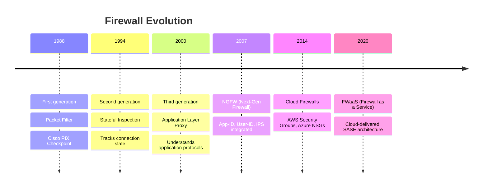

A firewall is a network security device that monitors and controls incoming and outgoing traffic based on predetermined security rules. It is the most fundamental — and most frequently misconfigured — security control in any organisation.

## The Evolution of Firewalls



## Firewall Types

### 1. Packet Filter (Stateless)

Decisions based solely on packet headers: source/dest IP, port, protocol.

```bash
# Stateless packet filter via iptables
# Allows HTTP(S) inbound to web server
iptables -A INPUT -p tcp --dport 80 -s 0.0.0.0/0 -d 10.0.1.10 -j ACCEPT
iptables -A INPUT -p tcp --dport 443 -s 0.0.0.0/0 -d 10.0.1.10 -j ACCEPT

# Blocks all other inbound traffic
iptables -A INPUT -j DROP

# Limitations: Cannot track connection state
# An attacker can send a packet with SYN flag even if connection was never established
```

| Pros | Cons |
|------|------|
| Very fast (simple lookups) | Cannot detect fragmented packet attacks |
| Low resource usage | Vulnerable to IP spoofing |
| Simple to configure | No application awareness |
| Suitable for high-throughput | Cannot track session state |

### 2. Stateful Firewall

Maintains a state table tracking the state of each connection. Only allows packets that match an established connection state.

```bash
# Stateful firewall rules (iptables with conntrack)
# Allow established/related traffic
iptables -A INPUT -m state --state ESTABLISHED,RELATED -j ACCEPT

# Allow new SSH connections from admin subnet only
iptables -A INPUT -p tcp --dport 22 -s 10.0.100.0/24 -m state --state NEW -j ACCEPT

# Allow new HTTP/HTTPS from anywhere
iptables -A INPUT -p tcp --dport 80 -m state --state NEW -j ACCEPT
iptables -A INPUT -p tcp --dport 443 -m state --state NEW -j ACCEPT

# Default: drop everything else
iptables -A INPUT -j DROP
```

| Pros | Cons |
|------|------|
| Tracks connection state (SYN, SYN-ACK, ACK) | Higher resource usage |
| Prevents many spoofing attacks | Can be bypassed by tunnelling |
| More secure than stateless | State table can fill up (DoS vector) |
| Widely used standard | |

**Connection states tracked**:

| State | Meaning |
|-------|---------|
| NEW | First packet of a new connection (SYN) |
| ESTABLISHED | Part of an established bidirectional connection |
| RELATED | New connection related to an established one (e.g. FTP data channel) |
| INVALID | Packet not part of any known connection — should be dropped |

### 3. Next-Generation Firewall (NGFW)

Integrates traditional firewall capabilities with additional features:

| Feature | What It Does | Why It Matters |
|---------|-------------|----------------|
| **App-ID** | Identifies application regardless of port | Blocks Skype tunnelling over port 80 |
| **User-ID** | Maps IP to user identity | Rules based on username, not IP |
| **Content-ID** | Inspects file types, content | Blocks executable files via email |
| **IPS** | Inline intrusion prevention | Blocks SQLi, XSS, buffer overflow |
| **SSL Decryption** | Decrypts TLS for inspection | Catches malware in encrypted traffic |
| **Threat Intelligence** | Real-time threat feeds | Blocks known malicious IPs immediately |

```yaml
NGFW Rule Example (Palo Alto style):

Rule Name: "Allow HR to Salesforce"
Source Zone: internal
Source User: HR-Users (group)
Source IP: 10.0.50.0/24
Destination Zone: internet
Destination IP: salesforce.com
Application: salesforce-base
Service: ssl (443)
Action: Allow
Log: Allowed traffic
Profile: vulnerability-protection, anti-malware, url-filtering
```

### 4. Web Application Firewall (WAF)

Specifically designed to protect web applications from Layer 7 attacks.

```yaml
WAF Protects Against:
  └─ SQL Injection (SQLi)
  └─ Cross-Site Scripting (XSS)
  └─ Cross-Site Request Forgery (CSRF)
  └─ Remote File Inclusion (RFI)
  └─ Local File Inclusion (LFI)
  └─ Parameter tampering
  └─ Brute force login attempts
  └─ DDoS at application layer

Examples: AWS WAF, Cloudflare WAF, ModSecurity, F5 ASM, Imperva
```

**ModSecurity rule example**:
```bash
# Block SQL injection attempts
SecRule ARGS "@detectSQLi" \
  "id:942100,\
   phase:2,\
   deny,\
   status:403,\
   msg:'SQL Injection Detected via libinjection',\
   logdata:'Matched Data: %{TX.0} found within %{MATCHED_VAR_NAME}: %{MATCHED_VAR}',\
   severity:'CRITICAL'"
```

### 5. Cloud Firewall / Security Groups

Virtual firewalls in cloud environments. Unlike physical firewalls, these are highly dynamic and API-driven.

**AWS Security Group example**:
```json
{
  "IpPermissions": [
    {
      "IpProtocol": "tcp",
      "FromPort": 443,
      "ToPort": 443,
      "IpRanges": [{"CidrIp": "0.0.0.0/0", "Description": "HTTPS from internet"}]
    },
    {
      "IpProtocol": "tcp",
      "FromPort": 22,
      "ToPort": 22,
      "IpRanges": [{"CidrIp": "10.0.100.0/24", "Description": "SSH from admin subnet"}]
    },
    {
      "IpProtocol": "-1",
      "UserIdGroupPairs": [{"GroupId": "sg-12345"}],
      "Description": "All traffic from web tier"
    }
  ]
}
```

**Key differences from physical firewalls**:

| Cloud Security Group | Physical Firewall |
|---------------------|-------------------|
| Stateful (return traffic auto-allowed) | Configuration-dependent |
| No explicit deny (whitelist only) | Can explicitly deny |
| Cannot inspect content | Full inspection possible |
| API-managed, changes instant | Manual or orchestrated changes |
| Distributed enforcement | Central chokepoint |

## Firewall Rule Base Design

### Default Policies

| Policy | Security | Usability | Standard |
|--------|----------|-----------|----------|
| **Default-Deny** | Maximum | Minimal | Best practice |
| **Default-Allow** | Minimal | Maximum | Discouraged |

**Best practice**: Default-deny with explicit allow rules for required traffic.

### Rule Ordering

Firewalls process rules from top to bottom. First match wins.

```yaml
Rule Base Layout (Palo Alto firewall):

Order 1-10: Antivirus / Threat Prevention (auto-generated)
Order 11:  [INFRASTRUCTURE] Allow DNS (DNS servers → internet)
Order 12:  [INFRASTRUCTURE] Allow NTP (all servers → time.cloudflare.com)  
Order 13:  [ADMIN] Allow RDP/SSH (admin jump box → all servers)
Order 14:  [BUSINESS] Allow HTTPS (web servers → database servers :3306)
Order 15:  [BUSINESS] Allow LDAP (app servers → AD domain controllers)
Order 16-25: Business application rules
Order 26:  [DENY] Block known malicious IPs (threat intel feed)
Order 27:  [DENY] Block high-risk countries (if no business there)
Order 28:  [LOG] Log all remaining traffic
Order 29:  [DENY] Default-deny — catch-all (LAST RULE)
```

### Rule Design Principles

```
1. Be Specific — Use source/dest zones, IPs, ports, applications
   ❌ Allow any any any
   ✅ Allow internal_zone → dmz_zone tcp/443 (web servers)

2. Least Privilege — Only open what's needed
   ❌ Allow web_servers to database_servers any any
   ✅ Allow web_servers to database_servers tcp/3306 (specific DB port)

3. Group Similar Rules — Order by function
   ❌ Random order of infrastructure, business, admin rules
   ✅ infrastructure_rules → admin_rules → business_rules

4. Block by Default — Change unused rules to deny
   ❌ Rules exist for decommissioned apps
   ✅ Remove or disable unused rules

5. Log + Monitor — Log denies, review rule hits
   ❌ No logging on deny rules
   ✅ Log all denies, track rule hit count

6. Review Regularly — Quarterly rulebase audit
   ❌ No review process
   ✅ Annual full review, quarterly hit count analysis
```

## Common Firewall Misconfigurations

| Misconfiguration | Risk | Detection |
|-----------------|------|-----------|
| **Any/Any rules** | No traffic restriction | Audit rulebase for "any any any" |
| **Shadow rules** | Hidden rule that overrides intended policy (e.g., earlier allow-any supersedes a later deny) | Rulebase analysis tools |
| **Orphan rules** | Rules for decommissioned systems | Match rules to asset inventory |
| **Overly permissive outbound** | Data exfiltration possible | Egress filtering audit |
| **Default passwords** | Admin access to firewall itself | Password audit, credential scanning |
| **No logging on deny** | Silent blocking, can't troubleshoot | Enable logging on all deny rules |
| **Rules never reviewed** | Rules accumulate, security drifts | Quarterly review process |

## Real Case: Firewall Misconfiguration at the Office of Personnel Management (OPM)

The 2015 OPM breach (21.5M records, including security clearance data of US intelligence personnel) was enabled by firewall misconfigurations.

```
Attack Path:
  1. Attacker gains initial access via compromised credentials
  2. Firewall rules were overly permissive — allowed broad access between segments
  3. Once inside, attacker moved laterally to the background investigation database
  4. No firewall segmentation between the web tier and the database tier
  5. Data exfiltrated over 12+ months before detection
  
Aftermath:
  - Total cost: $500M+ in remediation, credit monitoring
  - Director of OPM resigned
  - Congressional hearings on federal IT security
  - Firewall rules tightened across all federal agencies
```

## Firewall Tuning and Best Practices

```yaml
Rule Lifecycle Management:
  
  Create:
    - Define business justification
    - Specify source/dest/app/protocol
    - Set expiration/review date
    - Assign owner

  Test:
    - Deploy in monitor-only mode first (log but don't block)
    - Verify no legitimate traffic is affected
    - Review logs for 7 days before enabling enforcement

  Enable:
    - Set to enforce
    - Monitor initially for false positives

  Review (Quarterly):
    - Check rule hit count (remove zero-hit rules)
    - Verify source/dest/ports still valid
    - Check for shadow rules
    - Update documentation

  Decommission:
    - Remove immediately when systems are decommissioned
    - Never leave orphan rules
```

## Firewall Performance Considerations

| Factor | Impact | Mitigation |
|--------|--------|-----------|
| Rule count | More rules → slower processing | Keep under 1,000 rules per firewall |
| Logging | Logging every packet → performance hit | Sample logs, log only denies |
| SSL decryption | Decrypting all TLS → 2-5x performance hit | Selective decryption per policy |
| IPS/App-ID | Deep inspection → 30-50% throughput reduction | Profile-based activation |
| State table size | Full state table drops new connections | Monitor table utilization |

## Key Takeaways

- Firewalls are the most fundamental network security control but also the most frequently misconfigured — an Any/Any rule effectively disables the firewall
- Packet filter → Stateful → NGFW → Cloud firewall → FWaaS — choose the type that matches your architecture and risk
- Default-deny is the only acceptable default policy — default-allow means you have no security boundary
- Cloud security groups are stateful and API-driven — fundamentally different from physical firewall management
- The OPM breach (21.5M records stolen) was enabled by flat networks with no firewall between web and database tiers
- WAFs protect against application-layer attacks (SQLi, XSS) that traditional firewalls cannot see
- Rule hygiene matters — orphan rules, shadow rules, and any/any rules accumulate over time; quarterly audits are essential
- Monitor rule hit counts — if a rule has zero hits in 90 days, it should be reviewed for removal
- SSL decryption is critical but expensive — selectively decrypt based on risk (not all traffic)
- A firewall is only as good as its configuration — the hardware is irrelevant if the rulebase is poorly designed
