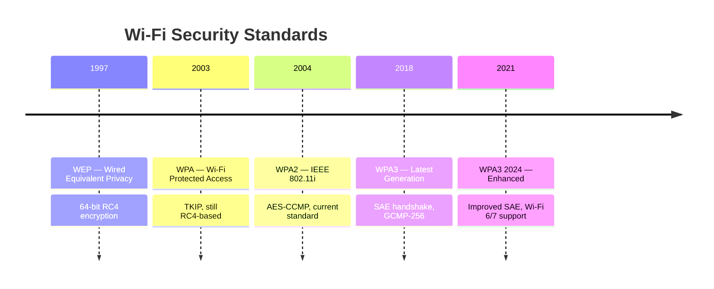

Wireless networks are inherently less secure than wired networks because data is broadcast through the air. Anyone within range can intercept, analyse, and potentially manipulate wireless traffic. Understanding wireless security is critical because wireless is often the easiest entry point for attackers.

## Wi-Fi Security Evolution

The journey from WEP to WPA3 represents 20+ years of cryptographic lessons learned.



### WEP (1997) — COMPLETELY BROKEN

WEP is the cautionary tale of custom cryptography. It uses RC4 with a 24-bit IV (Initialisation Vector), which guarantees IV collision after ~5,000 packets. From that point, the key can be recovered in minutes.

```
Weaknesses:
  └─ RC4 cipher with 24-bit IV (too small — collisions guaranteed)
  └─ No key management (all users share the same key)
  └─ CRC32 integrity check (can be forged without key knowledge)
  └─ Passive attack: capture packets → crack key in < 60 seconds

Tools to crack WEP:
  airodump-ng wlan0mon    # Capture packets
  aircrack-ng capture.cap # Recover WEP key (5,000 IVs needed)
  besside-ng wlan0mon     # Automated WEP cracking
```

**Status**: Anyone still using WEP is in critical violation of security best practices. PCI DSS explicitly prohibits WEP.

### WPA (2003) — TRANSITIONAL, STILL WEAK

WPA was a firmware-upgradeable stopgap that kept RC4 but added TKIP (Temporal Key Integrity Protocol).

```
Weaknesses:
  └─ Still RC4-based (fundamentally limited)
  └─ TKIP key recovery possible (Beck-Tews attack, 2008)
  └─ MIC failure can be exploited (DoS)
  └─ WPA-TKIP deprecated in 802.11-2016 standard
```

**Status**: WPA is deprecated. Do not use.

### WPA2 (2004) — THE CURRENT STANDARD, BUT WITH FLAWS

WPA2 brought AES-based encryption (CCMP) and is still widely used. However, it has known weaknesses.

```
Known Weaknesses:
  └─ KRACK attack (Key Reinstallation Attack, 2017)
     └─ Mathy Vanhoef discovered attacker can force nonce reuse
     └─ Allows decryption of WPA2 traffic without the password
     └─ Patched in 2017 — but many IoT devices never updated
  └─ PMKID attack (2018)
     └─ Uses RSN IE from EAPOL frame
     └─ No need for handshake capture (faster cracking)
  └─ Dictionary attacks on PSK
     └─ Pre-shared key is brute-forceable if weak password
  
WPA2 Enterprise:
  └─ Much more secure than WPA2 Personal
  └─ Per-user credentials (not shared password)
  └─ 802.1X authentication with RADIUS
```

### WPA3 (2018) — THE MODERN STANDARD

WPA3 addresses WPA2's fundamental weaknesses:

```
WPA3 Improvements:
  └─ SAE (Simultaneous Authentication of Equals) handshake
     └─ Replaces WPA2's 4-way handshake
     └─ Protected against offline dictionary attacks
     └─ Even weak passwords are hard to brute-force offline
  └─ GCMP-256 encryption (instead of AES-CCMP)
  └─ Opportunistic Wireless Encryption (OWE)
     └─ Encryption even on open networks (no password needed)
  └─ Management Frame Protection (802.11w)
     └─ Prevents deauthentication attacks
  └─ Perfect Forward Secrecy
     └─ Past traffic cannot be decrypted if key is compromised

WPA3 Personal vs Enterprise:
  └─ Personal: SAE with password
  └─ Enterprise: 802.1X with EAP-TLS (certificate-based)
```

## Enterprise Wi-Fi: 802.1X / RADIUS

Enterprise environments should never use Pre-Shared Key (PSK) — too hard to revoke access when an employee leaves.

### 802.1X Authentication Flow

```
Client (Supplicant)          AP (Authenticator)          RADIUS Server
      │                            │                          │
      │  Association Request       │                          │
      │───────────────────────────>│                          │
      │  Association Response      │                          │
      │<───────────────────────────│                          │
      │                            │                          │
      │  EAPOL-Start               │                          │
      │───────────────────────────>│                          │
      │                            │  RADIUS Access-Request   │
      │                            │──────────────────────────>│
      │  EAP-Request Identity      │                          │
      │<───────────────────────────│                          │
      │  EAP-Response Identity     │                          │
      │───────────────────────────>│                          │
      │                            │  RADIUS Access-Request   │
      │                            │──────────────────────────>│
      │                            │                          │
      │  [EAP-TLS Certificate Exchange]                       │
      │<────────────────────────────────────────────────────>│
      │                            │                          │
      │                            │  RADIUS Access-Accept   │
      │                            │<──────────────────────────│
      │  4-Way Handshake Start     │                          │
      │───────────────────────────>│                          │
      │  4-Way Handshake Complete  │                          │
      │<───────────────────────────│                          │
      │                            │                          │
      │  ✓ Connected + Encrypted   │                          │
```

### RADIUS Server Configuration (FreeRADIUS)

```bash
# FreeRADIUS users configuration (/etc/freeradius/users)
# Per-user VLAN assignment
"john.doe" Cleartext-Password := "temp-password-123",
  Tunnel-Type = VLAN,
  Tunnel-Medium-Type = IEEE-802,
  Tunnel-Private-Group-ID = "employee-vlan",
  Reply-Message = "Welcome to corporate Wi-Fi"

# Guest access with time limit
"guest123" Cleartext-Password := "guest-password",
  Session-Timeout = 14400,
  Idle-Timeout = 1800,
  Tunnel-Private-Group-ID = "guest-vlan"

# Administrator goes to management VLAN
"admin.smith" Cleartext-Password := "strong-password-456",
  Tunnel-Private-Group-ID = "mgmt-vlan"
```

### Microsoft NPS (Network Policy Server) Configuration for RADIUS

```powershell
# PowerShell — Configure NPS as RADIUS server for Wi-Fi
Import-Module RemoteAccess

# Add RADIUS client (the access point)
New-NpsRadiusClient -Name "Floor1-AP" `
  -Address "192.168.10.10" `
  -SharedSecret "s3cr3t-shared-k3y" `
  -VendorName "Cisco"

# Create connection policy
New-NpsConnectionRequestPolicy -Name "WiFi-802.1X" `
  -Type "Unauthenticated" `
  -Condition(@{"NASPortType" = "Wireless-IEEE 802.11";}) `
  -AuthenticationProvider "LocalComputer"

# Create network policy
Add-NpsNetworkPolicy -Name "Corporate WiFi Access" `
  -Condition(@{"WindowsGroups" = "DOMAIN\WiFi-Users";}) `
  -Constraint("SessionTimeout" = 28800) `
  -AccessType "GrantAccess" `
  -VlanId "100"
```

## Common Wireless Attacks

### 1. Evil Twin Attack

Attackers set up a rogue AP with the same SSID as a legitimate network. Clients automatically connect to the stronger signal.

```
Attack Scenario:
  └─ Coffee shop has "Starbucks-WiFi"
  └─ Attacker sets up "Starbucks-WiFi" with better signal
  └─ Client device auto-connects to attacker's AP
  └─ Attacker can MITM all traffic, inject malware, steal credentials

Detection:
  └─ Compare AP BSSID (MAC) with known legitimate APs
  └─ WPA3 OWE prevents passive eavesdropping
  └─ WIPS (Wireless IPS) detects rogue APs by fingerprinting
```

### 2. Deauthentication Attack

Attacker sends forged deauth frames to disconnect clients. WPA3 Management Frame Protection prevents this.

```bash
# Old attack (works on WPA2 without 802.11w)
aireplay-ng -0 5 -a 00:11:22:33:44:55 -c AA:BB:CC:DD:EE:FF wlan0mon
# -0: deauth count (5 packets)
# -a: target AP MAC
# -c: target client MAC
```

### 3. KRACK (Key Reinstallation Attack, 2017)

The most significant WPA2 vulnerability ever discovered.

```
Impact:
  └─ Affects all WPA2 implementations (Personal and Enterprise)
  └─ Attacker forces nonce reuse in the 4-way handshake
  └─ Allows decryption of subsequent traffic
  └─ Also affects WPA2 Group Key, Fast BSS Transition, and Tunneled Direct-Link Setup

Mitigation:
  └─ Patch all APs and client devices (patches released Dec 2017)
  └─ Use WPA3 (not affected)
  └─ Use TLS/HTTPS for all web traffic (defence in depth)
```

### 4. PMKID Attack (2018)

Allows cracking WPA2 password without capturing the full 4-way handshake.

```bash
# Capture PMKID using hcxdumptool
hcxdumptool -i wlan0mon -o capture.pcapng -enable_status=1

# Convert to hashcat format
hcxpcapngtool capture.pcapng -o hash.hc22000

# Crack with hashcat
hashcat -m 22000 hash.hc22000 wordlist.txt
```

### 5. Rogue AP / Rogue Client Detection

WIPS (Wireless Intrusion Prevention System) detects:

```yaml
Rogue AP Detection:
  └─ MAC OUI not matching authorised vendor
  └─ Beacon interval deviation
  └─ Signal strength anomaly (AP appears outside expected area)
  └─ SSID matching authorised network but different BSSID
  └─ Open encryption on what should be WPA3 network

Rogue Client Detection:
  └─ Client trying to connect to multiple SSIDs
  └─ Client MAC OUI from suspicious vendor
  └─ Client doing active probing for corporate SSIDs
```

## Enterprise Wi-Fi Deployment Best Practices

### Security Architecture

```yaml
SSID Design:
  └─ Corporate SSID: WPA3-Enterprise, 802.1X with EAP-TLS
  └─ Guest SSID: Open (with OWE) or captive portal, isolated from corporate
  └─ IoT SSID: WPA3-Personal, isolated VLAN, no internet access
  └─ Legacy SSID: WPA2-Enterprise (if old devices need it), separate VLAN
  └─ Management SSID: WPA3-Enterprise, administrative access only

Authentication:
  └─ EAP-TLS (certificate-based) preferred over PEAP/MSCHAPv2
  └─ Certificates from internal CA, auto-enrolled via GPO
  └─ RADIUS servers in HA pair
  └─ Monitor failed auth attempts (detect brute force)

Segmentation:
  └─ Dynamic VLAN assignment via RADIUS
  └─ User role → VLAN mapping (employee, guest, contractor, admin)
  └─ Firewall between each VLAN
  └─ Guest traffic: internet only, no internal access

Monitoring:
  └─ WIPS for rogue AP/device detection
  └─ Wireless controller logs to SIEM
  └─ Channel utilisation monitoring
  └─ Client connectivity metrics
```

### Configuration Hardening

```bash
# Cisco Wireless Controller — Security Configuration
config wlan security wpa akm dot1x 1
config wlan security wpa3 sae enable 2  # For IoT SSID
config wlan security wpa2 disable 3     # Disable WPA2 where possible
config wlan security pmf optional 1     # Management Frame Protection
config wlan security peer-to-peer blocking 1
config wlan exclude-list enable
config wlan dhcp-required enable 1      # Block static IP attempts
config wlan cckm disable 1              # Disable Cisco Compatible Extensions (legacy)
config wlan radius server add 1 10.0.0.50 shared-secret s3cr3t auth-port 1812 acct-port 1813
config wlan radius server add 2 10.0.0.51 shared-secret s3cr3t auth-port 1812 acct-port 1813
config wlan radius fallback-test enable 1 mode ping username test interval 300
```

## Wireless Security Audit Checklist

| Check | Tool | Expected |
|-------|------|----------|
| Rogue AP detection | WIPS sweep, `airodump-ng` sweep | No unauthorised APs |
| SSID security | WiFi Analyzer, `airodump-ng` | No WEP, no WPA-TKIP |
| PMKID vulnerability | `hcxdumptool` | No PMKID leakage on WPA2 |
| Client isolation | Connect to guest SSID, ping internal IP | Should FAIL |
| Deauth protection | `aireplay-ng -0` test | Should FAIL on WPA3, may pass on WPA2 |
| RADIUS auth test | Test valid/invalid credentials | Valid → access, Invalid → denied |
| Certificate expiry | Check CA + client certs | 30+ days before expiry |
| MAC filter bypass | Spoof authorised MAC | Should connect (MAC filtering is not security) |

## Key Takeaways

- WEP is completely broken (recoverable in seconds), WPA is deprecated, WPA2 has known vulnerabilities (KRACK, PMKID) — WPA3 is the current standard and should be used wherever possible
- WPA3 SAE (Simultaneous Authentication of Equals) prevents offline dictionary attacks — even weak passwords cannot be brute-forced offline
- Enterprise Wi-Fi must use 802.1X with RADIUS — never share a PSK among all employees (no way to revoke individual access)
- EAP-TLS (certificate-based authentication) is more secure than PEAP/MSCHAPv2 — certificates are harder to phish than passwords
- Dynamic VLAN assignment via RADIUS provides granular per-user network segmentation
- Wireless attacks are plentiful: Evil Twin, KRACK, PMKID, deauth, rogue APs — WIPS is essential for detection
- WPA3 Management Frame Protection (802.11w) prevents deauth attacks — this alone is worth the upgrade
- Guest networks must be isolated from corporate networks — a compromised guest device should never reach internal resources
- MAC filtering is not security — MAC addresses can be trivially spoofed
- Wireless security audit should be part of quarterly security assessments — walk the building with a wireless analyser
