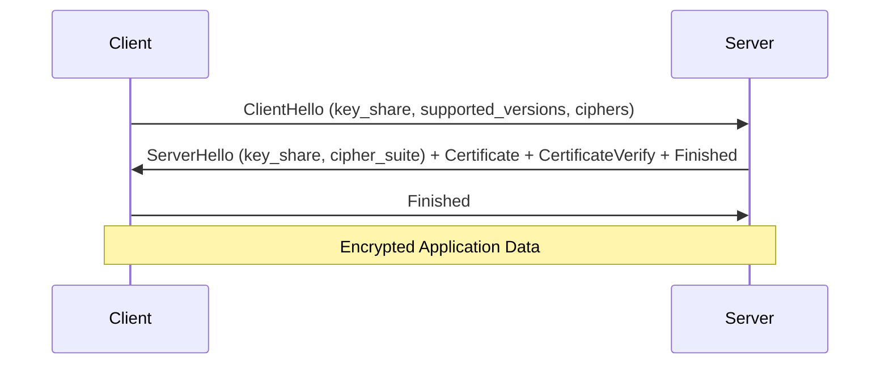

Cryptography is the science of secure communication. It is the foundation of nearly every security control: encrypted data at rest, encrypted traffic in transit, digital signatures, certificate validation, password storage, and blockchain all rely on cryptography.

## Symmetric Encryption

One key for both encryption and decryption. Fast — used for bulk data encryption.

### Algorithms

| Algorithm | Key Size | Security Level | Status |
|-----------|----------|----------------|--------|
| **AES-128** | 128 bits | Sufficient for classified (Secret) | Recommended |
| **AES-256** | 256 bits | Sufficient for Top Secret | Recommended |
| **ChaCha20** | 256 bits | Equivalent to AES-256 | Recommended (mobile/software) |
| **DES** | 56 bits | Can be brute-forced in < 1 day | Deprecated — do NOT use |
| **3DES** | 112 bits | Weak, vulnerable to meet-in-the-middle | Deprecated — do NOT use |
| **RC4** | 40-2048 bits | Multiple critical vulnerabilities | Deprecated — do NOT use |

### AES In Practice

```bash
# Encrypt a file with AES-256-CBC
openssl enc -aes-256-cbc -salt -pbkdf2 -iter 100000 \
  -in secret.docx -out secret.docx.enc

# Decrypt
openssl enc -d -aes-256-cbc -pbkdf2 -iter 100000 \
  -in secret.docx.enc -out secret.docx

# Encrypt with passphrase (interactive)
openssl enc -aes-256-cbc -salt -pbkdf2 -iter 100000 \
  -in secret.txt -out secret.enc

# Generate a random 256-bit key
openssl rand -hex 32
# Output: a1b2c3d4e5f6... (64 hex characters = 256 bits)
```

### Encryption Modes

| Mode | Description | Use Case |
|------|-------------|----------|
| **ECB** | Each block encrypted independently | Do NOT use — patterns visible |
| **CBC** | Each block XORed with previous ciphertext | Standard file encryption |
| **GCM** | Authenticated encryption (encrypt + MAC) | TLS 1.2/1.3, preferred for network |
| **CTR** | Block cipher converted to stream cipher | Disk encryption |

**Why ECB is dangerous:**

```
Original:   [BLOCK1][BLOCK2][BLOCK3][BLOCK4]
ECB:        Encrypt(BLOCK1) | Encrypt(BLOCK2) | ...
            Same plaintext → Same ciphertext → Patterns visible

CBC:        Encrypt(BLOCK1 ⊕ IV) | Encrypt(BLOCK2 ⊕ Enc(BLOCK1)) | ...
            Each block depends on previous → No patterns
```

### The Key Distribution Problem

Symmetric encryption has one fundamental problem: how do you securely share the key?

```
Alice wants to send encrypted message to Bob
  → Alice encrypts with key K
  → Alice must send key K to Bob
  → If an attacker intercepts key K during transmission, encryption is useless
  → Alice and Bob need a secure channel to share the key
  → But if they had a secure channel, they would not need encryption in the first place!
```

This problem is solved by **asymmetric encryption** (also called public-key cryptography).

## Asymmetric Encryption

Uses a key pair: a public key (shared freely) and a private key (kept secret).

### Algorithms

| Algorithm | Key Size | Security Level | Use Case |
|-----------|----------|----------------|----------|
| **RSA-2048** | 2048 bits | Equivalent to 112-bit symmetric | General purpose, key exchange, signatures |
| **RSA-4096** | 4096 bits | Equivalent to 128-bit symmetric | Higher security, slower |
| **ECC P-256** | 256 bits | Equivalent to 3072-bit RSA | Modern, faster, smaller keys |
| **ECC P-384** | 384 bits | Equivalent to 7680-bit RSA | Higher security |
| **Ed25519** | 256 bits | Equivalent to 3072-bit RSA | Fastest, modern, preferred for new systems |
| **DSA** | 2048 bits | Weak, no longer recommended | Deprecated |

### RSA Key Generation and Use

```bash
# Generate 4096-bit RSA key pair
openssl genrsa -out private.pem 4096

# Extract public key
openssl rsa -in private.pem -pubout -out public.pem

# View key details
openssl rsa -in private.pem -text -noout | head -20

# Encrypt a file with public key (small files only — RSA max = key size - overhead)
openssl pkeyutl -encrypt -pubin -inkey public.pem -in secret.txt -out secret.enc

# Decrypt with private key
openssl pkeyutl -decrypt -inkey private.pem -in secret.enc -out secret.txt

# Sign a file with private key
openssl dgst -sha256 -sign private.pem -out file.sig file.txt

# Verify signature with public key
openssl dgst -sha256 -verify public.pem -signature file.sig file.txt
```

### ECC Key Generation

```bash
# Generate ECC key pair using P-256 curve
openssl ecparam -genkey -name prime256v1 -out ecdsa-private.pem

# Extract public key
openssl ec -in ecdsa-private.pem -pubout -out ecdsa-public.pem

# ECC keys are much smaller:
ls -la rsa-private.pem    # 3243 bytes (4096-bit RSA)
ls -la ecdsa-private.pem  # 302 bytes (256-bit ECC — same security level!)
```

### Hybrid Encryption in Practice

In practice, systems use **hybrid encryption** — asymmetric to exchange a symmetric key, then symmetric for the actual data:

```
1. Generate random AES-256 key (session key)
2. Encrypt data with AES-256 (fast, handles large data)
3. Encrypt the AES key with RSA-2048 (solves key distribution)
4. Send: AES-encrypted data + RSA-encrypted AES key
5. Recipient: RSA-decrypts the AES key, then AES-decrypts the data
```

```bash
# Hybrid encryption example using OpenSSL
# Step 1: Generate random 256-bit session key
openssl rand -hex 32 > session.key

# Step 2: Encrypt data with AES-256-CBC using session key
openssl enc -aes-256-cbc -pbkdf2 -pass file:session.key -in large_file.pdf -out large_file.pdf.enc

# Step 3: Encrypt session key with recipient's RSA public key
openssl pkeyutl -encrypt -pubin -inkey recipient-public.pem -in session.key -out session.key.enc

# Send: large_file.pdf.enc + session.key.enc

# Recipient: Decrypt session key with private key
openssl pkeyutl -decrypt -inkey recipient-private.pem -in session.key.enc -out session.key

# Recipient: Decrypt data with session key
openssl enc -d -aes-256-cbc -pbkdf2 -pass file:session.key -in large_file.pdf.enc -out large_file.pdf
```

## Hashing

A hash function produces a fixed-size output from any input. Key properties:

1. **Deterministic**: Same input always produces same output
2. **One-way**: Given a hash, you cannot determine the input (except by brute force)
3. **Collision-resistant**: Two different inputs should never produce the same hash
4. **Avalanche effect**: Changing one bit of input changes ~50% of output bits

### Hash Algorithms

| Algorithm | Output Size | Security | Use Case |
|-----------|-------------|----------|----------|
| **SHA-256** | 256 bits | Strong | General-purpose integrity (file checksums, certificates) |
| **SHA-3** | 256/512 bits | Strong | Newer standard, designed as backup to SHA-2 |
| **MD5** | 128 bits | Broken (collisions demonstrated) | Do NOT use |
| **SHA-1** | 160 bits | Weak (theoretical collisions, practical attack shown) | Do NOT use (except for backward compatibility) |
| **bcrypt** | Variable | Strong | Password hashing (includes salt + work factor) |
| **Argon2** | Variable | Strongest | Password hashing (winner of PHC, resistant to GPU/ASIC) |
| **PBKDF2** | Variable | Moderate | Password hashing (NIST standard, but less memory-hard than Argon2) |

### Hash Usage Examples

```bash
# File integrity verification
sha256sum downloaded-file.iso
# Output: a1b2c3d4...  downloaded-file.iso
# Compare with: expected checksum from vendor website

# Generate and verify file checksums
sha256sum important-file.pdf > checksums.sha256
sha256sum -c checksums.sha256
# Output: important-file.pdf: OK   (or: FAILED)

# HMAC (hash-based message authentication code)
echo -n "message" | openssl dgst -sha256 -hmac "secret-key"
# HMAC-SHA256(message) = output

# Password hashing with openssl
openssl passwd -6 -salt "randomsalt" "mypassword"
# Output: $6$randomsalt$hashvalue...
```

### Password Storage — How NOT to Do It

```python
# BAD: Plaintext storage
users = {"alice": "Password123!"}  # ❌ Never do this

# BAD: Single-round MD5
import hashlib
hashlib.md5(b"password").hexdigest()  # ❌ Broken and fast (easy to brute-force)

# BAD: Unsalted SHA-256
hashlib.sha256(b"password").hexdigest()  # ❌ Same password = same hash (rainbow table attack)

# GOOD: bcrypt with cost factor
import bcrypt
hash = bcrypt.hashpw(b"password", bcrypt.gensalt(rounds=12))
# $2b$12$randomsalt...hash...
bcrypt.checkpw(b"password", hash)  # True
bcrypt.checkpw(b"wrong", hash)     # False

# BEST: Argon2id
from argon2 import PasswordHasher
ph = PasswordHasher(time_cost=3, memory_cost=65536, parallelism=4)
hash = ph.hash("password")
ph.verify(hash, "password")  # True
```

## Public Key Infrastructure (PKI)

PKI is the system of certificates, certificate authorities (CAs), and registration authorities that binds public keys to identities.

### Certificate Chain

```
Root CA (self-signed, in trusted root store)
  └── Intermediate CA (signed by Root CA)
       └── Server Certificate (signed by Intermediate CA)
            ├── Subject: CN=www.example.com
            ├── Public Key: <RSA-2048 public key>
            ├── Issuer: Intermediate CA
            ├── Valid: 2026-01-01 to 2027-01-01
            └── Signature: <signed by Intermediate CA's private key>
```

### Certificate Validation Process

```
Browser connects to https://www.example.com
  → Server sends its certificate
  → Browser checks: is the certificate expired? (validity period)
  → Browser checks: does the certificate match the domain? (CN or SAN)
  → Browser checks: is the certificate signed by a trusted CA?
     → Follows the chain up to a Root CA in the trusted root store
  → Browser checks: is the certificate revoked? (CRL or OCSP)
  → If all pass: 🔒 padlock icon
```

### Certificate Generation

```bash
# Generate a CSR (Certificate Signing Request)
openssl req -new -newkey rsa:2048 -nodes \
  -keyout example.key -out example.csr \
  -subj "/C=US/ST=California/L=San Francisco/O=Example Corp/CN=www.example.com"

# View CSR contents
openssl req -in example.csr -text -noout

# Submit CSR to a CA (Let's Encrypt, DigiCert, etc.) to get a signed certificate

# Self-signed certificate (for testing only)
openssl req -x509 -newkey rsa:4096 -keyout test-key.pem -out test-cert.pem \
  -days 365 -nodes -subj "/CN=test.local"

# View certificate details
openssl x509 -in test-cert.pem -text -noout

# Verify certificate chain
openssl verify -CAfile ca-chain.pem server-cert.pem
```

## TLS 1.3 — The Protocol That Secures the Internet

### TLS 1.3 Handshake (1-RTT)



**Step by step:**

1. **ClientHello**: Client sends its supported TLS version (1.3), cipher suites (e.g., TLS_AES_256_GCM_SHA384), and a public key share (ECDHE key exchange)

2. **ServerHello**: Server selects the cipher suite, sends its public key share. Both sides now have enough information to compute the shared secret (ECDHE key agreement)

3. **Certificate**: Server sends its certificate chain (to prove identity)

4. **CertificateVerify**: Server signs the handshake transcript with its private key (proves it owns the certificate)

5. **Finished**: Both sides send encrypted "Finished" message confirming the handshake is authentic

6. **Application Data**: Encrypted communication begins

TLS 1.3 eliminates insecure options:
- Removes RSA key exchange (only ECDHE — forward secrecy)
- Removes static RSA and DH ciphers
- Removes CBC mode ciphers (only AEAD: GCM, ChaCha20-Poly1305)
- Removes compression (CRIME attack)
- Removes renegotiation

### TLS Inspection

```bash
# Check TLS configuration of a server
openssl s_client -connect example.com:443 -tls1_3

# View certificate chain
openssl s_client -connect example.com:443 -showcerts

# Test supported cipher suites
nmap --script ssl-enum-ciphers -p 443 example.com

# Check for vulnerabilities
nmap --script ssl-cert,ssl-date,ssl-dh-params -p 443 example.com

# Use testssl.sh for comprehensive TLS testing
testssl.sh https://example.com
```

## Real-World Crypto Failures

### Heartbleed (CVE-2014-0160)

A buffer over-read in OpenSSL's TLS heartbeat extension. An attacker could read 64KB of server memory — including the private key — with a single request.

**Impact**: Every HTTPS website using vulnerable OpenSSL (version 1.0.1 through 1.0.1f) had their private keys exposed. The vulnerability existed for 2 years before discovery.

```
Attacker sends heartbeat request: "please echo 'hello' back to me"
  → Normal response: "hello" (4 bytes)
  → Attacker sends: "please echo 'hello' back to me — and I said the response should be 65535 bytes"
  → Vulnerable server: sends back the 4 bytes of "hello" PLUS 65531 bytes of whatever was in server memory
  → Those bytes often include: private keys, passwords, session tokens, PII
```

### Logjam (CVE-2015-4000)

Attackers could downgrade TLS connections to use weak 512-bit Diffie-Hellman parameters, then break them with computation equivalent to that used to break a 512-bit RSA key.

**Impact**: 8.4% of the top 1 million domains were vulnerable. The attack exploited the fact that many servers used the same well-known DH parameters.

### SHA-1 Collision (SHAttered, 2017)

Google demonstrated the first practical SHA-1 collision: two different PDF files with the same SHA-1 hash.

**Impact**: SHA-1 is considered broken for security applications. Certificate authorities stopped issuing SHA-1 certificates in 2016. Git still uses SHA-1 but is migrating to SHA-256.

### What These Failures Teach Us

1. **Algorithm deprecation is not optional** — MD5 → SHA-1 → SHA-256 → (future). Algorithms weaken over time
2. **Implementation matters as much as algorithm** — Heartbleed was not a math flaw, it was a coding bug in OpenSSL
3. **Forward secrecy is essential** — without ECDHE (TLS 1.3 default), an attacker who records encrypted traffic today can decrypt it later if they obtain the private key
4. **Use modern, well-audited libraries** — OpenSSL, libsodium, BoringSSL. Never implement crypto yourself.

## Key Takeaways

- Symmetric encryption (AES) is fast for bulk data but has a key distribution problem — asymmetric encryption (RSA, ECC) solves key distribution but is slow — hybrid encryption combines both
- Hashing is one-way and used for integrity verification and password storage — use SHA-256 for integrity, Argon2id or bcrypt for passwords
- PKI binds public keys to identities through certificate chains signed by trusted Certificate Authorities
- TLS 1.3 provides forward secrecy (ECDHE), removes all weak ciphers, and completes the handshake in one round trip — it is the current standard for secure communication
- Real-world crypto failures (Heartbleed, Logjam, SHAttered) demonstrate that algorithm selection, implementation quality, and timely deprecation are all critical
- Rule of thumb: never implement custom cryptography, never roll your own crypto, use well-audited libraries, and stay current with algorithm deprecation timelines
