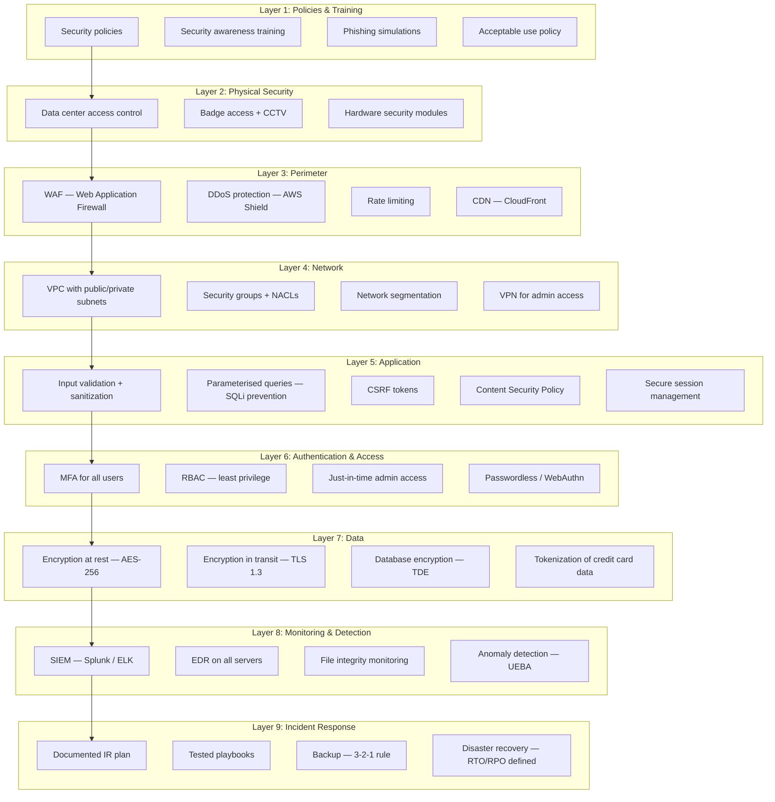

## Lab Overview

| Exercise | Topic | Time | Difficulty |
|----------|-------|------|------------|
| 1 | Asset Inventory & Classification | 30 min | Beginner |
| 2 | Risk Register & FAIR Analysis | 45 min | Intermediate |
| 3 | Password Hashing & Auditing | 30 min | Beginner |
| 4 | TLS Configuration & Verification | 30 min | Intermediate |
| 5 | Defense-in-Depth Architecture Design | 60 min | Advanced |

**Prerequisites**:
- Linux or macOS terminal (WSL on Windows)
- `openssl`, `sha256sum`, `md5sum`, `curl`, `nmap` installed
- Basic command-line familiarity
- A web browser

---

## Exercise 1: Asset Inventory & Classification

### Objective
Create an asset inventory for a fictional company and classify each asset.

### Scenario
You are the security engineer for **TechFlow Inc.**, a SaaS company with:
- 200 employees
- 5 cloud servers (AWS EC2)
- 3 databases (PostgreSQL)
- 1 CRM system (Salesforce)
- 1 code repository (GitHub Enterprise)
- 1 SIEM (Splunk)
- 2 DNS servers
- 1 email system (Microsoft 365)
- Employee laptops (200 MacBooks)
- 2 physical servers in colocation facility

### Step 1: Create a spreadsheet

```bash
cat > asset_inventory.csv << 'EOF'
Asset ID,Name,Type,Owner,Location,Classification,Data Type,Criticality
A001,Web Server 1,Cloud Server,SRE Team,us-east-1 (AWS EC2),Confidential,Customer data,Critical
A002,Web Server 2,Cloud Server,SRE Team,eu-west-2 (AWS EC2),Confidential,Customer data,Critical
A003,Database Primary,Database,DBA Team,us-east-1 (AWS RDS),Restricted,PII,Critical
A004,Database Read Replica,Database,DBA Team,eu-west-2 (AWS RDS),Restricted,PII,Critical
A005,Code Repository,Application,Engineering,github.com,Restricted,Source code,Critical
A006,SIEM Platform,Monitoring,Security Team,us-east-1 (AWS EC2),Internal,Security logs,High
A007,Crm System,SaaS Application,Sales Team,salesforce.com,Confidential,Customer data,High
A008,DNS Primary,Network Service,Infra Team,colocation facility,Internal,DNS records,High
A009,DNS Secondary,Network Service,Infra Team,us-east-1 (AWS EC2),Internal,DNS records,High
A010,Email System,SaaS Application,All Employees,office365.com,Confidential,Emails & attachments,High
A011,Employee Laptops,Endpoint,Individual Employees,various locations,Confidential,Work data,Medium
A012,Physical Server 1,Physical Server,Infra Team,colocation facility,Confidential,Backup data,Medium
A013,Physical Server 2,Physical Server,Infra Team,colocation facility,Confidential,Backup data,Medium
EOF
```

### Step 2: Answer these questions

1. **How many critical assets does TechFlow have?**
2. **Which assets contain PII?**
3. **What is the business impact if the code repository is compromised?**
4. **Which assets are in the cloud vs. on-premises?**
5. **Who is the data owner for each asset?**

### Step 3: Identify gaps

Look at your inventory and identify at least three gaps:

| Gap | Why It Matters |
|-----|----------------|
| Example: No asset owner for employee laptops | Without an owner, no one is accountable for laptop security |
| 1. | |
| 2. | |
| 3. | |

---

## Exercise 2: Risk Register & FAIR Analysis

### Objective
Create a risk register for a fictional scenario using the FAIR model.

### Scenario
TechFlow Inc. is considering a new feature: **customer file upload**. Customers will upload sensitive documents (contracts, financial statements) that are stored in AWS S3 and processed by a Python application.

### Step 1: Identify risks

Using the CIA triad and Parkerian Hexad, identify at least 5 risks:

| Risk ID | Risk Description | Asset Affected | Threat | Vulnerability |
|---------|-----------------|----------------|--------|---------------|
| R-001 | Unauthorised access to uploaded customer files | S3 bucket | External attacker gains access to S3 | Misconfigured S3 bucket permissions |
| R-002 | Malware uploaded via file upload feature | Upload server | Attacker uploads malicious file to compromise server | No file scanning |
| R-003 | Customer data exfiltration by malicious insider | Database | Employee with access steals customer data | No DLP controls |
| R-004 | Denial of service via large file uploads | Upload server | Attacker uploads massive files to crash system | No file size limits |
| R-005 | | | | |

### Step 2: Perform FAIR analysis

For each risk, estimate the annualised loss expectancy (ALE):

```bash
# Example: R-001 (S3 misconfiguration)
cat > fair_analysis_r001.json << 'EOF'
{
  "risk_id": "R-001",
  "risk_name": "Unauthorised access to customer files via S3 misconfiguration",
  
  "threat_event_frequency": {
    "estimated_annual": 2.0,
    "confidence": "Medium",
    "rationale": "S3 misconfigurations are common, automated scanners detect them"
  },
  
  "vulnerability": {
    "probability_of_loss_event": 0.3,
    "confidence": "Low",
    "rationale": "Depends on how quickly misconfiguration is detected"
  },
  
  "loss_event_frequency": {
    "calculated": 0.6,
    "calculation": "TEF × ProbLossEvent = 2.0 × 0.3"
  },
  
  "primary_loss": {
    "magnitude_per_event": {
      "min": 50000,
      "most_likely": 200000,
      "max": 1000000
    },
    "description": "Customer notification, breach response, legal fees"
  },
  
  "secondary_loss": {
    "magnitude_per_event": {
      "min": 100000,
      "most_likely": 500000,
      "max": 2000000
    },
    "description": "Reputation damage, customer churn, regulatory fines"
  },
  
  "annualised_loss_expectancy": {
    "calculation": "LEF × (PrimaryLoss + SecondaryLoss)",
    "most_likely": 0.6 × (200000 + 500000) = 420000
  }
}
EOF
```

Now create similar FAIR analyses for the other risks you identified.

### Step 3: Prioritise risks

| Risk ID | ALE (Most Likely) | Priority | Recommended Control | Cost of Control |
|---------|-------------------|----------|-------------------|-----------------|
| R-001 | $420,000 | Critical | S3 bucket policy with IAM, automated compliance scanning | $5,000/year |
| R-002 | $250,000 | High | File scanning service (ClamAV + commercial AV) | $15,000/year |
| R-003 | $350,000 | Critical | DLP solution, access logging, quarterly access reviews | $30,000/year |
| R-004 | $50,000 | Medium | File size limits, rate limiting, WAF | $2,000/year |
| R-005 | | | | |

**Decision**: Which risks should the company accept, mitigate, transfer, or avoid? Justify.

---

## Exercise 3: Password Hashing & Auditing

### Objective
Understand password storage, hashing algorithms, and audit password policies.

### Step 1: Compare hash algorithms

```bash
# A simple password
echo -n "Password123!" | md5sum
echo -n "Password123!" | sha1sum
echo -n "Password123!" | sha256sum

# Observe the differences in output length
echo -n "Password123!" | md5sum | wc -c
echo -n "Password123!" | sha256sum | wc -c
```

> **Note**: MD5 = 32 hex chars (128 bits), SHA-1 = 40 hex chars (160 bits), SHA-256 = 64 hex chars (256 bits)

### Step 2: Observe hash sensitivity

```bash
# Small change → completely different hash
echo -n "Password123!" | sha256sum
echo -n "Password123?" | sha256sum
echo -n "password123!" | sha256sum

# Are any characters the same? (They should not be — avalanche effect)
```

### Step 3: Generate bcrypt hashes

```bash
# Install bcrypt if needed
# macOS: brew install bcrypt
# Ubuntu/Debian: sudo apt install -y bcrypt

# Generate a bcrypt hash (cost factor 10)
python3 -c "
import bcrypt
password = b'Password123!'
salt = bcrypt.gensalt(rounds=10)
hashed = bcrypt.hashpw(password, salt)
print('Password: Password123!')
print('Hash:', hashed.decode())
print('Salt:', salt.decode())
print('Cost factor: 10')
"

# Try different cost factors
python3 -c "
import bcrypt
import time

for cost in [4, 8, 10, 12, 14]:
    start = time.time()
    salt = bcrypt.gensalt(rounds=cost)
    hashed = bcrypt.hashpw(b'Password123!', salt)
    elapsed = time.time() - start
    print(f'Cost {cost}: {elapsed:.3f}s to compute hash')
"
```

> **What happens as cost factor increases?** Modern systems use cost factor 10-12. At cost 14, each hash takes ~1 second — hard for attackers to brute force, but still acceptable for authentication.

### Step 4: Audit password policy

```bash
# Create a list of common passwords (DO NOT use these)
cat > test_passwords.txt << 'EOF'
password
123456
admin
letmein
Password123!
welcome
P@ssw0rd
sunshine
qwerty123
abc123
EOF

# Test each against a simple policy
python3 << 'PYEOF'
import re

passwords = open('test_passwords.txt').read().strip().split('\n')
policy = {
    'min_length': 12,
    'require_upper': True,
    'require_lower': True,
    'require_digit': True,
    'require_special': True,
    'common_words': ['password', 'admin', 'letmein', 'welcome', 'sunshine']
}

def check_policy(pwd):
    issues = []
    if len(pwd) < policy['min_length']:
        issues.append(f'Too short ({len(pwd)} < {policy["min_length"]})')
    if policy['require_upper'] and not re.search(r'[A-Z]', pwd):
        issues.append('Missing uppercase')
    if policy['require_lower'] and not re.search(r'[a-z]', pwd):
        issues.append('Missing lowercase')
    if policy['require_digit'] and not re.search(r'[0-9]', pwd):
        issues.append('Missing digit')
    if policy['require_special'] and not re.search(r'[^a-zA-Z0-9]', pwd):
        issues.append('Missing special character')
    if any(word in pwd.lower() for word in policy['common_words']):
        issues.append('Contains common word')
    return issues

print(f'{"Password":20s} {"Length":6s} {"Result":30s}')
print('-' * 56)
for pwd in passwords:
    issues = check_policy(pwd)
    result = 'PASS' if not issues else f'FAIL: {", ".join(issues)}'
    print(f'{pwd:20s} {len(pwd):6d} {result:30s}')
PYEOF
```

> **Hardening**: What policy changes would make these passwords stronger? Consider NIST SP 800-63B guidance (focus on length over complexity, check against known breached passwords).

### Step 5: Check if passwords are breached

```bash
# Hash a password and check against Have I Been Pwned API (v3)
# k-anonymity: only send first 5 hex characters of SHA-1 hash

python3 << 'PYEOF'
import hashlib
import requests

def check_breached(password):
    sha1 = hashlib.sha1(password.encode()).hexdigest().upper()
    prefix = sha1[:5]
    suffix = sha1[5:]
    
    resp = requests.get(f'https://api.pwnedpasswords.com/range/{prefix}')
    if resp.status_code == 200:
        for line in resp.text.split('\n'):
            if line.startswith(suffix):
                count = int(line.split(':')[1].strip())
                return count
    return 0

# Test some passwords
test_pwds = ['Password123!', 'correct-horse-battery-staple', 'hunter2']
for pwd in test_pwds:
    count = check_breached(pwd)
    status = '⚠ Breached!' if count > 0 else '✓ Not found'
    print(f'{pwd:35s} → Found in {count:,} breaches' if count > 0 
          else f'{pwd:35s} → Not found in known breaches')
PYEOF
```

---

## Exercise 4: TLS Configuration & Verification

### Objective
Configure and verify TLS connections, understand certificate chains, and audit TLS settings.

### Step 1: Generate a self-signed certificate

```bash
# Generate a private key
openssl genrsa -out server.key 2048
echo "✓ Generated RSA 2048-bit private key"

# Generate a certificate signing request (CSR)
openssl req -new -key server.key -out server.csr -subj "/C=US/ST=California/L=San Francisco/O=TechFlow Inc./CN=techflow.example.com"
echo "✓ Generated CSR"

# Self-sign the certificate (valid for 365 days)
openssl x509 -req -days 365 -in server.csr -signkey server.key -out server.crt
echo "✓ Self-signed certificate created"

# View the certificate
openssl x509 -in server.crt -text -noout | head -20
```

### Step 2: Verify a real TLS connection

```bash
# Connect to a real HTTPS server and examine the certificate chain
echo "=== Google TLS Certificate ==="
openssl s_client -connect google.com:443 -showcerts 2>/dev/null < /dev/null | head -30

echo ""
echo "=== GitHub TLS Certificate ==="
openssl s_client -connect github.com:443 -showcerts 2>/dev/null < /dev/null | head -30

# Check certificate dates
echo "=== Google Certificate Dates ==="
openssl s_client -connect google.com:443 2>/dev/null < /dev/null | openssl x509 -noout -dates

echo ""
echo "=== GitHub Certificate Dates ==="
openssl s_client -connect github.com:443 2>/dev/null < /dev/null | openssl x509 -noout -dates
```

### Step 3: Check TLS version and cipher suite

```bash
# Check supported TLS protocols
echo "=== TLS 1.2 ==="
openssl s_client -connect google.com:443 -tls1_2 2>/dev/null < /dev/null | grep -i "cipher\|handshake failure"

echo ""
echo "=== TLS 1.3 ==="
openssl s_client -connect google.com:443 -tls1_3 2>/dev/null < /dev/null | grep -i "cipher\|handshake failure"

# Check which cipher suite is negotiated
echo ""
echo "=== Current Cipher Suite ==="
openssl s_client -connect google.com:443 2>/dev/null < /dev/null | grep -i "cipher"
```

### Step 4: Audit a server's TLS configuration

```bash
# Check for weak protocols (TLS 1.0, TLS 1.1 — should be disabled)
echo "=== TLS 1.0 (Deprecated — Should Fail) ==="
openssl s_client -connect google.com:443 -tls1 2>/dev/null < /dev/null | grep -i "cipher\|handshake failure"

echo ""
echo "=== TLS 1.1 (Deprecated — Should Fail) ==="
openssl s_client -connect google.com:443 -tls1_1 2>/dev/null < /dev/null | grep -i "cipher\|handshake failure"
```

> **What protocols does Google support?** Most modern sites support TLS 1.2 and 1.3, and have disabled TLS 1.0/1.1. Insecure cipher suites (like RC4, 3DES, CBC-mode ciphers) should also be disabled.

### Step 5: TLS Score

```bash
# Check your own test server's TLS score
# Run a basic TLS check
python3 << 'PYEOF'
sites = ['google.com', 'github.com', 'example.com', 'badssl.com']

for site in sites:
    print(f"\n{'='*50}")
    print(f"Checking: {site}")
    print('='*50)
    
    import subprocess
    import socket
    
    # Check if site supports TLS 1.2
    result = subprocess.run(
        ['openssl', 's_client', '-connect', f'{site}:443', '-tls1_2'],
        input='', capture_output=True, text=True, timeout=10
    )
    supports_tls12 = 'handshake failure' not in result.stderr.lower()
    
    # Check if site supports TLS 1.3
    result = subprocess.run(
        ['openssl', 's_client', '-connect', f'{site}:443', '-tls1_3'],
        input='', capture_output=True, text=True, timeout=10
    )
    supports_tls13 = 'handshake failure' not in result.stderr.lower()
    
    # Get certificate expiry
    result = subprocess.run(
        ['openssl', 's_client', '-connect', f'{site}:443'],
        input='', capture_output=True, text=True, timeout=10
    )
    
    # Extract certificate dates
    date_result = subprocess.run(
        ['openssl', 'x509', '-noout', '-dates'],
        input=result.stdout, capture_output=True, text=True, timeout=5
    )
    
    dates = date_result.stdout.strip().split('\n')
    not_before = dates[0].replace('notBefore=', '') if len(dates) > 0 else 'Unknown'
    not_after = dates[1].replace('notAfter=', '') if len(dates) > 1 else 'Unknown'
    
    print(f"  TLS 1.2: {'✓' if supports_tls12 else '✗'}")
    print(f"  TLS 1.3: {'✓' if supports_tls13 else '✗'}")
    print(f"  Valid from: {not_before}")
    print(f"  Valid until: {not_after}")
PYEOF
```

---

## Exercise 5: Defense-in-Depth Architecture Design

### Objective
Design a defense-in-depth architecture for TechFlow Inc.'s customer portal — a web application that accepts file uploads from customers.

### Scenario

TechFlow Inc.'s customer portal allows registered customers to:

1. Log in with email + password
2. Upload business documents (PDFs, Word files, images)
3. View and download their uploaded documents
4. Share documents with other customers
5. Pay for premium features via credit card

### Step 1: Identify assets, threats, and requirements

```yaml
Assets:
  - Customer PII (name, email, phone, billing address)
  - Uploaded business documents
  - Credit card data (PCI-DSS scope)
  - Authentication database (passwords)
  - Application source code
  - AWS infrastructure credentials

Threats:
  - SQL injection to steal customer data
  - XSS to hijack customer sessions
  - Broken authentication → account takeover
  - Insecure direct object reference → access other customers' docs
  - Malware upload via document upload
  - DDoS to disrupt service
  - Insider threat (employee steals data)
  - Supply chain (compromised dependency)
  - S3 misconfiguration exposing documents

Compliance Requirements:
  - PCI DSS (credit card processing)
  - GDPR (EU customer data)
  - SOC 2 Type II (customer contractual requirement)
```

### Step 2: Design the defense layers

Create a defense-in-depth diagram and fill in controls for each layer:



### Step 3: Select specific controls

For each layer, select at least 3 concrete controls:

```yaml
Layer 3 — Perimeter:
  1. AWS WAF with OWASP Top 10 rule set
     - Blocks SQLi, XSS, RFI, LFI at edge
     - Cost: ~$30/month per web ACL
  2. AWS Shield Advanced
     - DDoS protection up to $3,000/month shield fee
     - 24/7 DDoS response team
  3. CloudFront CDN with geo-restriction
     - Only serve traffic from countries where customers operate
     - Blocks entire regions with no business need

Layer 5 — Application:
  1. All database queries use parameterised statements (no string concatenation)
     ```python
     # BAD — SQL injection vulnerability
     cursor.execute(f"SELECT * FROM users WHERE email = '{email}'")
     
     # GOOD — Parameterised query
     cursor.execute("SELECT * FROM users WHERE email = %s", (email,))
     ```
  2. Content Security Policy (CSP) header
     ```
     Content-Security-Policy: default-src 'self'; 
       script-src 'self' cdn.techflow.com;
       style-src 'self' cdn.techflow.com;
       img-src 'self' data:;
       frame-ancestors 'none';
     ```
  3. File upload validation
     ```python
     ALLOWED_EXTENSIONS = {'pdf', 'docx', 'png', 'jpg'}
     MAX_FILE_SIZE = 10 * 1024 * 1024  # 10MB
     SCAN_COMMAND = 'clamscan --stdout {}'
     
     def process_upload(file):
         # 1. Check extension (whitelist)
         ext = file.filename.rsplit('.', 1)[1].lower()
         if ext not in ALLOWED_EXTENSIONS:
             raise ValueError(f'File type {ext} not allowed')
         
         # 2. Check file size
         if file.content_length > MAX_FILE_SIZE:
             raise ValueError('File too large')
         
         # 3. Scan for malware
         result = subprocess.run(
             SCAN_COMMAND.format(file.temporary_file_path()),
             shell=True, capture_output=True
         )
         if 'FOUND' in result.stdout:
             raise ValueError('Malware detected')
         
         # 4. Store in S3 with random filename
         s3_key = f'uploads/{uuid.uuid4()}.{ext}'
         s3_client.upload_fileobj(file, BUCKET, s3_key)
         return s3_key
     ```

Layer 6 — Authentication:
  1. MFA enforced for all accounts (TOTP or WebAuthn)
  2. Session timeout: 15 minutes idle, 8 hour absolute
  3. Account lockout after 5 failed attempts (30 min lockout)
```

### Step 4: Map controls to frameworks

| Layer | Control | NIST CSF 2.0 | ISO 27001 | CIS Control |
|-------|---------|-------------|-----------|-------------|
| Perimeter | WAF with OWASP Top 10 rules | PR.PS (Platform Security) | A.8.22 (Network security) | 12.3 (Network monitoring) |
| Application | Parameterised queries | PR.PS | A.8.25 (Secure development) | 16.3 (Application security) |
| Data | Encryption at rest (AES-256) | PR.DS (Data Security) | A.8.11 (Cryptographic controls) | 3.10 (Data protection) |
| Detection | SIEM with correlation rules | DE.AE (Adverse Event Analysis) | A.8.15 (Logging and monitoring) | 8.2 (Audit log management) |
| Incident Response | Documented IR plan | RS.MA (Incident Management) | A.8.16 (Incident management) | 17.1 (IR Plan) |

### Step 5: Budget estimate

```yaml
Annual Security Budget for Customer Portal:

Perimeter:
  AWS WAF: $360 ($30/month)
  AWS Shield Advanced: $36,000 ($3,000/month)
  CloudFront: $2,400 (estimated)
  Subtotal: $38,760

Application:
  SAST/DAST tools (Snyk): $15,000
  Dependency scanning: $5,000
  Penetration test (annual): $30,000
  Subtotal: $50,000

Data:
  KMS key management: $600
  Backup storage: $4,800
  DLP solution: $24,000
  Subtotal: $29,400

Detection:
  SIEM (Splunk): $60,000
  EDR (CrowdStrike): $36,000
  File integrity monitoring: $12,000
  Subtotal: $108,000

Authentication:
  MFA solution (Okta/Azure): $24,000
  PAM solution: $18,000
  Subtotal: $42,000

Total Annual: $268,160

ROI Justification:
  Single data breach average cost: $4.5M
  Expected risk reduction: 80% (based on NIST CSF maturity increase)
  Expected annual savings: $3.6M
  Net ROI: $3.6M - $268K = $3.33M/year
```

---

## Lab Deliverables

Submit the following for each exercise:

| Exercise | Deliverable | Format |
|----------|-------------|--------|
| 1 | Completed asset inventory with classification | CSV |
| 2 | Risk register with FAIR analysis for 5 risks | JSON or markdown |
| 3 | Password audit results and policy recommendations | Report |
| 4 | TLS audit report for 3 real websites | Report |
| 5 | Defense-in-depth architecture document | Architecture doc |

### Lab Completion Checklist

- [ ] Exercise 1: Asset inventory completed with classification and gaps identified
- [ ] Exercise 2: Risk register with 5+ risks and FAIR quantitative analysis
- [ ] Exercise 3: Password hashing comparison, bcrypt cost analysis, and breach check
- [ ] Exercise 4: TLS certificate verification for 3 sites, protocol/cipher audit
- [ ] Exercise 5: Defense-in-depth architecture with controls mapped to NIST CSF and ISO 27001
- [ ] Exercise 5: Realistic budget estimate with ROI justification

---

## Additional Resources

- **OpenSSL Cookbook**: `man openssl` | `openssl help`
- **FAIR Model**: [FAIR Institute](https://www.fairinstitute.org/)
- **NIST CSF 2.0**: [NIST CSF Download](https://www.nist.gov/cyberframework)
- **Have I Been Pwned API**: [HIBP API Docs](https://haveibeenpwned.com/API/v3)
- **OWASP Top 10**: [OWASP.org](https://owasp.org/www-project-top-ten/)
- **TLS Best Practices**: [Mozilla TLS Guidelines](https://wiki.mozilla.org/Security/Server_Side_TLS)
