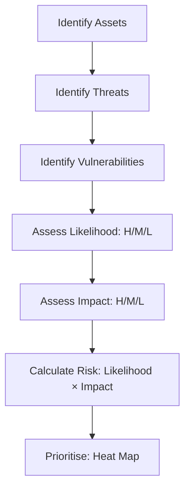

Risk management is the core discipline of cybersecurity. Every decision a security professional makes — what to prioritise, what to accept, what to pay for — is a risk decision. Without risk management, you are guessing. With it, you are making informed trade-offs that the business can understand.

## The Risk Formula

```
Risk = Threat × Vulnerability × Impact
```

All three elements must be present for risk to exist:

| Element | Definition | Example | Without This Element |
|---------|------------|---------|---------------------|
| **Threat** | What could cause harm | A ransomware gang targeting your industry | No risk — no one is trying to attack you |
| **Vulnerability** | A weakness that could be exploited | Unpatched Apache Struts server | No risk — there is no way in |
| **Impact** | The consequence if exploited | $50M in lost revenue from 2-week outage | No risk — even if breached, it does not matter |

**Real-world implication**: If you have a critical vulnerability on an internal server that has no network connectivity and no sensitive data, there is vulnerability but no impact — so the risk is low. Conversely, if you have a well-patched internet-facing server with customer PII, the vulnerability likelihood is low but the impact is high — so the risk is still significant.

## Threat, Vulnerability, Risk — The Relationship

These three terms are often confused. Here is how they relate:

```
THREAT (attacker knocking on doors)
         ↓ finds
VULNERABILITY (an unlocked door)
         ↓ leading to
IMPACT (what is inside gets stolen)
         ↓ = 
RISK (how likely this is × how bad it would be)
```

**Example**: A ransomware gang (threat) scanning the internet for exposed RDP ports finds that your organisation has RDP open to the internet on a domain controller (vulnerability). If they exploit this, they could encrypt your domain and halt operations for weeks (impact). The risk is high because the threat is active, the vulnerability exists, and the impact is severe.

## Risk Assessment Methodologies

### Qualitative Risk Assessment

Qualitative assessment uses descriptive scales (High/Medium/Low) rather than numerical values. It is faster, more accessible, and widely used for initial assessments.



**Risk heat map (5×5 matrix):**

| Likelihood \ Impact | Negligible | Minor | Moderate | Major | Catastrophic |
|---------------------|-----------|-------|----------|-------|-------------|
| **Almost Certain** | Medium | High | High | Critical | Critical |
| **Likely** | Medium | Medium | High | High | Critical |
| **Possible** | Low | Medium | Medium | High | High |
| **Unlikely** | Low | Low | Medium | Medium | High |
| **Rare** | Low | Low | Low | Medium | Medium |

**Example qualitative risk register:**

| Asset | Threat | Vulnerability | Likelihood | Impact | Risk | Treatment |
|-------|--------|---------------|------------|--------|------|-----------|
| Customer database | SQL injection via web app | Web app uses string concatenation for queries | Likely | Catastrophic | Critical | Rewrite with parameterised queries (project) |
| Email system | Spear-phishing attack | No MFA on executive accounts | Almost Certain | Major | Critical | Enforce MFA (1 week) |
| Public website | DDoS attack | No DDoS protection | Possible | Minor | Low | Accept risk |
| Office Wi-Fi | Rogue access point | No 802.1X network access control | Unlikely | Moderate | Medium | Implement NAC (Q3 project) |

### Quantitative Risk Assessment (FAIR Model)

Quantitative assessment uses dollar values and statistical analysis. The Factor Analysis of Information Risk (FAIR) model is the industry standard.

**Key quantitative terms:**

| Term | Definition | Formula |
|------|------------|---------|
| **SLE** (Single Loss Expectancy) | Cost of a single incident | SLE = AV × EF |
| **AV** (Asset Value) | Dollar value of the asset | $ |
| **EF** (Exposure Factor) | Percentage of asset value lost | % |
| **ARO** (Annual Rate of Occurrence) | How many times per year | 0.0 - 365 |
| **ALE** (Annualised Loss Expectancy) | Expected annual cost | ALE = SLE × ARO |

**Example — Ransomware risk calculation:**

```bash
Asset: Financial databases + file servers
Asset Value (AV): $5,000,000 (replacement + data value + downtime cost)
Exposure Factor (EF): 60% (partial data loss + 3-week restoration)
Single Loss Expectancy (SLE) = $5,000,000 × 0.60 = $3,000,000
Annual Rate of Occurrence (ARO): 0.3 (one incident every 3-4 years, based on industry stats)
Annualised Loss Expectancy (ALE) = $3,000,000 × 0.3 = $900,000/year
```

**Now compare control costs:**

```bash
Control option 1: Offline backups + tested DR plan
  Cost: $150,000/year (backup infrastructure + testing)
  New EF: 10% (recover within 48 hours, minimal data loss)
  New SLE: $500,000
  New ALE: $500,000 × 0.3 = $150,000/year
  Annual savings: $900,000 - $150,000 = $750,000
  ROI: $750,000 - $150,000 = $600,000/year net benefit  ✅

Control option 2: Everything-in-the-cloud migration
  Cost: $2,000,000/year (cloud migration + rearchitecture)
  New ARO: 0.1 (cloud provider has better baseline security)
  New ALE: $3,000,000 × 0.1 = $300,000/year
  Annual savings: $900,000 - $300,000 = $600,000
  But $2,000,000 > $600,000 ... negative ROI (unless cloud also provides other benefits)
```

**FAIR analysis output:**

```
Risk: Ransomware on financial systems
  Probable loss frequency: 0.3 events/year
  Probable loss magnitude: $3,000,000 per event
  Annualised loss expectancy: $900,000
  Confidence interval (90%): $450,000 - $1,800,000
  
  Recommended control: Offline immutable backups + DR plan
  Residual ALE with control: $150,000
  Annual benefit of control: $750,000
  Control cost: $150,000/year
  Net benefit: $600,000/year
```

## Risk Treatment Options

Once risk is identified and assessed, you must decide what to do:

| Strategy | Description | When to Use | Example |
|----------|-------------|-------------|---------|
| **Avoid** | Eliminate the activity that creates risk | When risk outweighs benefit | "We will not store credit card numbers — use a tokenisation service" |
| **Transfer** | Shift risk to a third party | When another party can manage it better | "We bought cyber insurance to cover ransomware losses" |
| **Mitigate** | Implement controls to reduce likelihood or impact | When cost of control < expected loss | "We deployed MFA to reduce account takeover risk" |
| **Accept** | Acknowledge the risk and monitor it | When cost of control > expected loss | "We accept the risk of the public wiki being defaced — recovery is trivial" |

**Residual vs inherent risk:**

```
INHERENT RISK: Risk before any controls are applied
    ↓
CONTROLS: What you do to reduce risk
    ↓
RESIDUAL RISK: Risk that remains after controls
    ↓
Do you accept residual risk? If not → add more controls
```

**Example — Inherent vs residual for a public web application:**

| Risk Element | Inherent (no controls) | Control Applied | Residual (after control) |
|-------------|----------------------|-----------------|-------------------------|
| SQL injection | Critical (public app, no input validation) | WAF + parameterised queries | Low |
| DDoS | High (single server, no capacity) | Cloudflare CDN + auto-scaling | Low |
| Credential stuffing | Critical (no rate limiting, no MFA) | Rate limiting + MFA + account lockout | Low |
| XSS | Critical (user-submitted content, no sanitisation) | Content Security Policy + output encoding | Medium |

## Third-Party Risk Management

Most breaches involve a third party. Target was breached through an HVAC vendor. SolarWinds was a supply chain attack. Capital One's cloud provider (AWS) was not breached — but Capital One misconfigured their use of it.

**TPRM process:**

```
1. IDENTIFY: Which vendors have access to our data or network?
   → Vendor registry with data classification and access level

2. ASSESS: What risk does each vendor present?
   → Questionnaires (SIG), SOC 2 reports, penetration test results

3. TIER: Not all vendors are equal
   → Tier 1 (critical): SOC 2 Type II + pen test required
   → Tier 2 (important): SOC 2 Type II or equivalent
   → Tier 3 (low): Self-assessment only

4. TREAT: What do we require from each vendor?
   → Contractual security requirements, right-to-audit clause

5. MONITOR: Continuous oversight
   → Annual reassessment, breach notification agreements
```

**Sample vendor tiering:**

| Tier | Criteria | Requirements | Cadence |
|------|----------|-------------|---------|
| **Tier 1** | Processes PII, or has network access | SOC 2 Type II, pentest, BIA, cyber insurance | Annual assessment |
| **Tier 2** | Connects to non-sensitive systems | SOC 2 Type II or equivalent | Annual assessment |
| **Tier 3** | No access to our environment | Self-assessment questionnaire | Upon onboarding only |

## Case Study: Equifax (Complete)

Equifax is the most important risk management case study in cybersecurity history because it involved failure at every level of the risk management process.

**Timeline:**

| Date | Event |
|------|-------|
| **March 7, 2017** | Apache releases patch for CVE-2017-5638 (Struts RCE) — CVSS 10.0 |
| **March 7 - May 13** | Equifax has the patch available but does not apply it |
| **May 13** | Attackers scan the internet for unpatched Struts servers, find Equifax |
| **May 13 - July 29** | Attackers maintain access, move laterally, locate unencrypted database |
| **July 29** | Equifax security team detects suspicious traffic |
| **September 7** | Equifax publicly discloses the breach |
| **2018-2019** | Congressional hearings, CEO retires, $1.4B in settlements |

**Risk management failures at every level:**

| Failure | What Should Have Happened |
|---------|--------------------------|
| **No asset inventory** — They did not know they had a Struts server | Asset discovery should identify all internet-facing systems |
| **No patch SLA** — CVSS 10.0 vulnerability unpatched for 2+ months | Critical patching SLA of 48 hours or less |
| **No vulnerability scanning** — They had a scanner but it did not cover this system | Authenticated scanning covering all systems |
| **No network segmentation** — Attacker reached the database from the web tier | Database should be in a separate subnet with strict firewall rules |
| **No database encryption** — 147M records stored in plaintext | Encryption at rest (AES-256) would have made stolen data useless |
| **No data exfiltration detection** — 147M records left over months | DLP + anomaly detection would have alerted on the volume |
| **No IR plan** — Took 2 months to discover they were breached | EDR + SIEM with 24/7 monitoring |

**The root cause was not technical — it was risk management.** Equifax had a vulnerability management program on paper. They ran scans. They had a patching process. But the process failed because:
- The scanning did not cover all assets
- The patching SLA was not enforced
- There was no accountability for missed patches
- The risk of not patching was not communicated to leadership
- The board was not informed of cybersecurity risks

**Regulatory outcome:** Equifax settled with the FTC for $575 million (the largest data breach settlement in history at the time), plus $175 million to states, plus $1 billion for consumer remediation. Total: ~$1.4 billion.

**Key regulatory findings from the FTC complaint:**
- Equifax failed to maintain an accurate inventory of their IT systems
- Equifax failed to implement adequate patch management
- Equifax failed to monitor network traffic for anomalous activity
- Equifax failed to segment their network to limit access to sensitive data
- Equifax failed to implement adequate access controls

## Risk Management Maturity Model

| Level | Name | Characteristics |
|-------|------|----------------|
| **1** | Initial | Ad-hoc, reactive, no formal process |
| **2** | Repeatable | Basic risk register, qualitative assessment, some SLAs |
| **3** | Defined | Standardised risk methodology (NIST, FAIR), regular assessments |
| **4** | Managed | Quantitative FAIR analysis, risk appetite defined, metrics-driven |
| **5** | Optimised | Continuous risk monitoring, automated risk scoring, board-level reporting |

## Key Takeaways

- Risk = Threat × Vulnerability × Impact — all three must be present for risk to exist
- Qualitative assessment (H/M/L heat maps) is faster but subjective; Quantitative assessment (FAIR, ALE = SLE × ARO) is more precise but data-intensive — use both
- Four risk treatment options: Avoid (eliminate the activity), Transfer (insurance, contracts), Mitigate (controls), Accept (monitor) — residual risk remains after controls
- Third-party risk management is essential — most breaches involve a vendor or supply chain
- Equifax is the definitive case study: every risk management process failed (asset inventory, scanning, patching, segmentation, encryption, monitoring)
- Risk management maturity progresses from ad-hoc (Level 1) to continuous and board-reported (Level 5) — most enterprises are at Level 2-3
