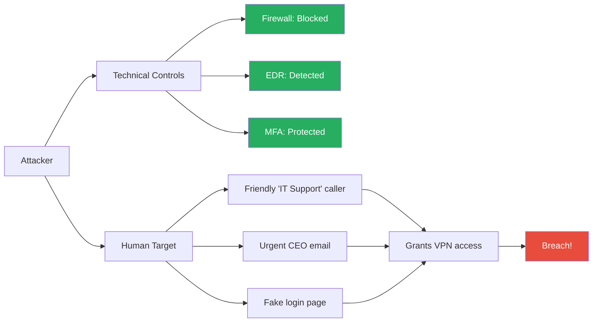

Technology controls fail when people make mistakes. Security awareness transforms employees from your weakest link into your strongest defence layer.

## The Human Risk Problem

### By the Numbers

| Metric | Value | Source |
|--------|-------|--------|
| Percentage of breaches involving human error | 74% | Verizon DBIR 2024 |
| Average click rate on simulated phishing | 15-25% | Industry benchmarks |
| Time for first phishing click after deployment | &lt; 10 minutes | Various |
| Percentage of ransomware via phishing | 65% | Sophos 2024 |
| Average cost per employee of phishing-related breach | $4,000+ | IBM Cost of Data Breach 2024 |
| Organisations with formal security training | 60% | SANS |
| Reduction in phishing click rate with effective training | 70-90% | Proofpoint |

### Why People Are the Target



Attackers know it is easier to trick a person than to break through technical controls.

## The Security Awareness Program Lifecycle

```
   ┌──────────────────────────────────────────────────┐
   │               ANNUAL CYCLE                        │
   │                                                    │
   ├─ Q1: Foundation                                    │
   │   ├─ New hire training (first week)                │
   │   ├─ Annual mandatory training (renewal)           │
   │   ├─ Baseline phishing simulation                  │
   │   └─ Measure baseline click rate                   │
   │                                                    │
   ├─ Q2: Build                                         │
   │   ├─ Targeted training (high-risk roles)           │
   │   ├─ Monthly themed campaigns                      │
   │   │   ├─ Jan: Password security                     │
   │   │   ├─ Feb: Phishing                             │
   │   │   ├─ Mar: Physical security                     │
   │   │   ├─ Apr: Social engineering                    │
   │   │   ├─ May: Remote work security                  │
   │   │   ├─ Jun: Data protection                       │
   │   │   ├─ Jul: Insider threat                        │
   │   │   ├─ Aug: Mobile security                       │
   │   │   ├─ Sep: AI and deepfakes                     │
   │   │   ├─ Oct: Cybersecurity Awareness Month        │
   │   │   ├─ Nov: Supply chain security                 │
   │   │   └─ Dec: Holiday fraud                         │
   │   └─ Remedial training for repeat clickers         │
   │                                                    │
   ├─ Q3: Reinforce                                     │
   │   ├─ Simulated attacks (phishing, vishing)         │
   │   ├─ Tabletop exercises for teams                  │
   │   ├─ Micro-learning modules (5 min/week)           │
   │   └─ Department-specific training (finance, HR)    │
   │                                                    │
   ├─ Q4: Measure & Improve                             │
   │   ├─ Final phishing simulation (compare to Q1)     │
   │   ├─ Program effectiveness report                  │
   │   ├─ Adjust training based on metrics              │
   │   └─ Plan next year's program                      │
   └──────────────────────────────────────────────────┘
```

## Phishing Simulation Program

Phishing simulations must be conducted ethically and effectively.

### Simulation Types

| Type | Description | Difficulty | Example |
|------|-------------|------------|---------|
| **Basic email** | Simple phishing email with obvious red flags | Easy | "Your password is expiring. Click here." |
| **Contextual** | References real tools/systems the organisation uses | Medium | "Your Outlook quota is full. Click to expand." |
| **Spear phishing** | Targeted, personal, uses real information | Hard | "Hi Sarah, I saw your presentation on LinkedIn. Can you review this document?" |
| **Whaling** | Targets executives specifically | Hard | "To: CEO from: Board Chair — Urgent: review this quarterly report" |
| **QR code** | QR code in physical location or email | Medium | QR code in cafeteria: "Scan for free coffee — need to login" |
| **Callback** | Email asks target to call a number | Hard | "Your account was charged $500. Call 1-800-XXX to dispute." |
| **Vishing** | Phone call from "IT support" | Hard | "This is Mike from IT. We're doing a security update. I need your password." |

### Example Phishing Email Breakdown

```
Subject: Urgent: Password Expiration Notice
From: "IT Support" <it-support@acme-corp.com>
To: employee@acme-corp.com

⚠ RED FLAGS:
┌─────────────────────────────────────────┐
│ ❌ FROM: acme-corp.com (not acme.com)   │  ← Wrong domain!
│ ❌ Greeting: "Dear Employee" (generic)  │
│ ❌ Threat: "Your account will be locked" │  ← Urgency tactic
│ ❌ Link: http://bit.ly/xx234 (shortened) │  ← Hides real URL
│ ❌ Grammar: "We have detected that your  │
│    password has expired" (awkward)       │
└─────────────────────────────────────────┘

Dear Employee,

We have detected that your password has expired.
To continue using your email account, please
verify your credentials immediately.

Click here to verify: http://bit.ly/xx234

Failure to do so within 24 hours will result in
account suspension.

Thank you,
IT Support Department
```

### Metrics to Track

```yaml
Phishing Simulation Metrics:

Primary (reporting to leadership):
  Click Rate: % of employees who clicked the link
  Report Rate: % of employees who reported the phish
  Repeat Clicker Rate: % who clicked 2+ campaigns in a row

Secondary (used internally):
  Time to First Click: How fast do people click?
  Time to Report: How fast do people report?
  Department Breakdown: Which departments are most vulnerable?
  Role-Based Breakdown: Executives vs. ICs vs. contractors

Targets:
  Click Rate: Initial ≤ 20% → Goal ≤ 5% after 12 months
  Report Rate: Initial ≥ 10% → Goal ≥ 50% after 12 months
  Repeat Clickers: ≤ 2% of total workforce

Benchmarks (Proofpoint 2024 State of the Phish):
  Average click rate: 15.8% (with training)
  Average click rate: 30%+ (without training)
  Average report rate: 18%
  Finance/Accounts payable: 2x more likely to click
```

## Social Engineering Attack Types

### 1. Phishing (Email)

The most common attack vector. 3.4 billion phishing emails sent daily.

**How it works**: Attacker sends email impersonating a trusted entity, luring the target to click a malicious link, open an attachment, or provide credentials.

**Real Case — Google and Facebook Phishing (2013-2015)**: Evaldas Rimasauskas impersonated a Taiwanese hardware manufacturer. He sent fake invoices for $100M+ to Google and Facebook. Both companies paid before discovering the fraud. Total stolen: $121M.

### 2. Vishing (Voice)

Attackers call pretending to be IT support, your bank, or another trusted entity.

**Real Case — MGM Resorts (2023)**: Attackers called the MGM help desk, impersonated an employee, and tricked the help desk into resetting MFA credentials. This single call led to a ransomware attack costing $100M+ in losses.

### 3. Smishing (SMS)

Text messages with urgent requests or malicious links.

**Real Case — FBI Warning (2024)**: Smishing campaigns impersonated USPS, FedEx, and banks, telling recipients a package delivery failed and they need to click a link and pay a small fee to reschedule. Result: stolen credit card data.

### 4. Pretexting

Creating a fabricated scenario to obtain information.

**Real Case — Uber Breach (2022)**: Attacker sent a WhatsApp message to an Uber contractor saying "I'm from IT support. We need you to accept this MFA prompt to fix your account." The contractor accepted. The attacker accessed Uber's VPN, found credentials in a PowerShell script, and accessed the entire AWS environment.

### 5. Baiting

Leaving infected physical devices (USB drives) where targets will find them.

**Real Case — University of Illinois Test (2016)**: Researchers dropped 297 USB drives across campus. 48% were picked up and plugged in within 6 hours. Some were found within 1 minute of being dropped.

### 6. Quid Pro Quo

Offering a service or benefit in exchange for information.

**Real Case — Coinbase (2022)**: Attackers called employees offering tech support for Coinbase's systems. At least one employee provided credentials, leading to a data breach.

### 7. Tailgating / Piggybacking

Following an authorised person into a restricted area.

**Real Case — Tesla Gigafactory (2019)**: A security researcher (hired by Tesla) dropped a USB drive labelled "Employee Bonuses 2019" in the Gigafactory parking lot. An employee plugged it in. It was harmless, but demonstrated the vulnerability.

## Building a Security Culture

Awareness without culture is a training checkbox — not a defence.

### The Security Culture Maturity Model

| Level | Name | Characteristics | Employee Behaviour |
|-------|------|----------------|-------------------|
| 1 | **Oblivious** | No training, no awareness | Click everything, no reporting, use "password123" |
| 2 | **Compliant** | Annual checkbox training | Know they should report but don't, follow rules begrudgingly |
| 3 | **Aware** | Regular training, phishing sims | Report suspicious emails, use password managers |
| 4 | **Proactive** | Department-specific training, champions | Suggest improvements, identify risks themselves |
| 5 | **Embedded** | Security is part of every decision | Ask "what's the secure way to do this?" before starting work |

### How to Move Up the Maturity Model

| From → To | Strategy | Example |
|-----------|----------|---------|
| Oblivious → Compliant | Mandatory annual training, basic phish sims | "Complete this 30-minute training or lose access" |
| Compliant → Aware | Monthly micro-learning, varied phish sims | "Here's a 2-minute video on QR code phishing" |
| Aware → Proactive | Department-specific training, security champions | "Finance team: here's invoice fraud red flags" |
| Proactive → Embedded | Gamification, recognition, reporting rewards | "Reported 5 phish this month? Here's a $50 gift card" |

### Security Champions Program

Security champions are volunteers in each department who act as the bridge between the security team and their peers.

```yaml
Champion Responsibilities:
  - First point of contact for security questions
  - Distribute awareness materials to their team
  - Participate in phishing simulation reviews
  - Provide feedback on security policies
  - Lead department-specific training

Ideal Profile:
  - Technical enough to understand basic security concepts
  - Respected by their peers
  - Good communicator
  - 5-10% time commitment

Program Structure:
  - Monthly champion meetings (30-45 min)
  - Quarterly deep-dive training
  - Slack/Teams channel for questions
  - Annual champion appreciation event
  - Career development opportunities (security certifications)
```

## Training Content by Role

Not everyone needs the same training. Tailor content based on role and risk:

| Role | Risk Level | Training Focus | Frequency |
|------|-----------|----------------|-----------|
| All employees | Medium | Phishing, password security, data protection, incident reporting | Annual + monthly micro-learning |
| Executives | High | Whaling, social engineering, travel security, crisis communication | Quarterly + targeted simulation |
| IT/Ops | High | Privilege escalation, credential theft, supply chain attacks | Quarterly + hands-on tabletop |
| Finance/AP | Very High | Invoice fraud, CEO fraud, payment diversion | Monthly + quarterly simulations |
| HR | High | Insider threat, data privacy, social engineering | Quarterly + targeted training |
| Engineering | High | Secure coding, secrets management, dependency risks | Quarterly + CI/CD integration |
| Contractors | Medium | Access management, data handling, reporting | Annual + onboarding |
| Customer-facing | High | Social engineering, data protection, pretexting | Quarterly + monthly refreshers |

## Measuring Program Effectiveness

### Leading vs. Lagging Indicators

| Type | Indicator | What It Tells You |
|------|-----------|-------------------|
| Leading | Phishing click rate | How likely people are to fall for real attacks |
| Leading | Report rate | How engaged your workforce is |
| Leading | Training completion rate | Whether people completed required training |
| Leading | Micro-learning quiz scores | Whether knowledge is retained |
| Leading | Champion engagement | Whether your security champions are active |
| Lagging | Actual phishing incidents | How many real attacks succeeded |
| Lagging | Breach cost from human error | Financial impact of human mistakes |
| Lagging | Repeat clicker rate | Whether training is working for the most vulnerable |
| Lagging | Time to report real phish | Speed of human detection |

### Cost-Benefit Analysis

```yaml
Annual Security Awareness Program — Medium Enterprise (1,000 employees)

Costs:
  Training platform license: $20,000/year
  Phishing simulation tool: $15,000/year  
  Content creation: $10,000 (internal)
  Employee time (2 hours/year): $50,000
  Program management (0.5 FTE): $60,000
  Total: $155,000/year

Benefits (Expected Reduction):
  Average phishing breach cost: $4.2M per incident
  Industry frequency: 1 incident per 1,000 employees per year
  70% reduction from effective training
  Expected benefit: $4.2M × 0.70 = $2.94M/year

ROI: ($2,940,000 - $155,000) / $155,000 = 1,797%
```

## Real-World Training Failures

### The "Check-the-Box" Training

Some organisations treat security awareness as a compliance exercise:

```yaml
Failure Mode:
  - 30-minute video, once per year
  - Multiple-choice quiz at end (answers visible)
  - Content never updated
  - No phishing simulations
  - No measurement of effectiveness

Result:
  - Employees click "next" without watching
  - No behaviour change
  - False sense of security
  - Same incidents happen year after year

Better Approach:
  - Micro-learning (2-3 minutes, weekly)
  - Varied content (videos, articles, scenarios)
  - Phishing simulations with immediate feedback
  - Reporting mechanism (phish alert button)
  - Continuous measurement and improvement
```

### The Punishment Trap

Some organisations punish employees who click phishing simulations:

```yaml
Punishment Approach:
  - First click: mandatory remedial training
  - Second click: manager notified
  - Third click: written warning
  - Fourth click: termination

Problem:
  - Employees stop reporting real phish (fear of punishment)
  - Employees don't admit mistakes
  - Culture becomes fear-based, not security-based
  - Security team loses visibility into real risks

Better Approach:
  - No punishment for clicking simulation
  - Immediate positive reinforcement for reporting
  - "Click and report" is a success (caught it eventually)
  - Personalised coaching for repeat clickers
  - Celebrate high-reporters publicly
  - Frame it as: "We're all learning together"
```

## Key Takeaways

- Human error is involved in 74% of breaches — security awareness is not optional, it is a critical control
- A phishing simulation program reduces click rates by 70-90% over 12 months — but must be conducted ethically without punishment
- Social engineering attacks come in many forms: email (phishing), phone (vishing), SMS (smishing), in-person (tailgating), physical devices (baiting), and fabricated scenarios (pretexting)
- Training must be role-specific — executives face whaling, finance faces CEO fraud, engineers face supply chain attacks
- Security culture matures from "oblivious" to "embedded" — this requires years of sustained investment, not a single training session
- Measure both leading (click rate, report rate) and lagging (actual incidents, breach cost) indicators — both tell different parts of the story
- Punishment destroys security culture — celebrate reporting, not perfection
- The ROI of security awareness is compelling — $15 investment per employee yields potential $2.9M annual savings
- Real case studies (Google/Facebook $121M fraud, Uber $100M breach, MGM $100M ransomware) all prove one thing: training would have prevented these attacks
