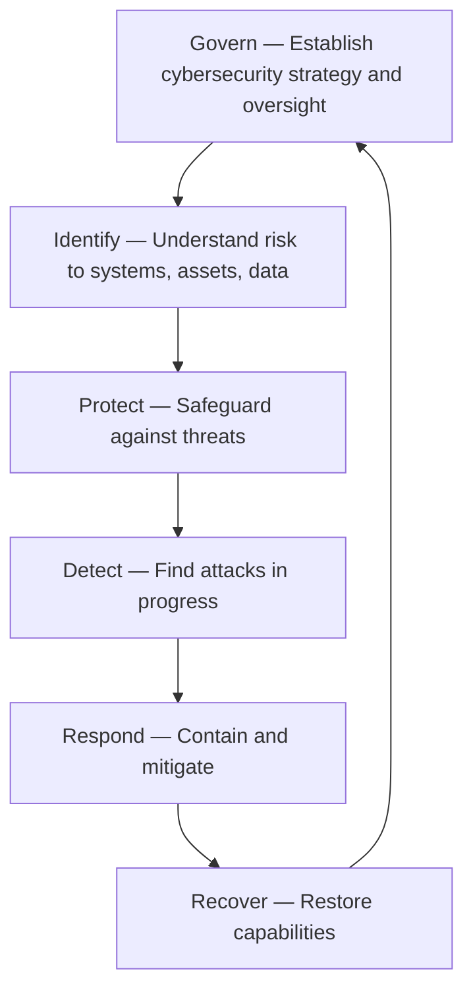

Security frameworks provide structured approaches to managing cybersecurity risk. They are not checklists — they are models that help you identify gaps, prioritise investments, and communicate with stakeholders.

## Why Frameworks Matter

Without a framework, security decisions are reactive: a breach happens, you fix that thing, repeat. With a framework, you have a systematic understanding of your security posture. You know what controls you have, what controls you are missing, and what to prioritise next.

| Without Framework | With Framework |
|------------------|----------------|
| "We need a firewall because everyone says so" | "NIST CSF Protect function — we need network security controls" |
| "We had a breach, let's buy this tool" | "Our gap analysis shows we lack detection capability — let's deploy EDR" |
| "Why are we spending so much on security?" | "Here is our maturity level against ISO 27001 — here are the gaps" |
| "Are we secure?" (unanswerable) | "Our controls map to 85% of the CIS Top 18" (measurable) |

## NIST Cybersecurity Framework (CSF) 2.0

The CSF is the most widely adopted cybersecurity framework globally. Originally released in 2014, updated to v2.0 in February 2024.

### The Six Functions

The 2024 update added a sixth function — **Govern** — recognising that cybersecurity governance must be elevated above technical implementation:



### Detailed Breakdown

#### 1. Govern (GV) — NEW in v2.0
The organisation's cybersecurity strategy, oversight, and governance:

| Category | Example Outcomes |
|----------|-----------------|
| **GV.OC** — Organisational Context | Cybersecurity mission is integrated with enterprise risk |
| **GV.RM** — Risk Management Strategy | Risk appetite is defined and approved by board |
| **GV.RR** — Roles and Responsibilities | CISO reports to board, security roles defined |
| **GV.PO** — Policy and Oversight | Security policies are approved, reviewed annually |
| **GV.OV** — Oversight | Board receives quarterly security updates |
| **GV.SC** — Supply Chain | Vendor security requirements enforced |

#### 2. Identify (ID)
Understand the organisation's current cybersecurity risk:

| Category | Example Outcomes |
|----------|-----------------|
| **ID.AM** — Asset Management | Complete inventory of hardware, software, data |
| **ID.RA** — Risk Assessment | Risk register updated quarterly |
| **ID.IM** — Improvement | Lessons learned from incidents are documented |
| **ID.SC** — Supply Chain Risk | Third-party risk assessed before engagement |

#### 3. Protect (PR)
Safeguards to ensure delivery of critical services:

| Category | Example Outcomes |
|----------|-----------------|
| **PR.AA** — Identity Management and Access Control | MFA enforced, JIT admin access |
| **PR.AT** — Awareness and Training | Annual security training, phishing simulations |
| **PR.DS** — Data Security | Encryption at rest and in transit, DLP |
| **PR.PS** — Platform Security | Patch management, secure configurations |
| **PR.IR** — Technology Infrastructure Resilience | Redundancy, disaster recovery |

#### 4. Detect (DE)
Find cybersecurity attacks in progress:

| Category | Example Outcomes |
|----------|-----------------|
| **DE.AE** — Adverse Event Analysis | SIEM with correlation rules |
| **DE.CM** — Continuous Monitoring | 24/7 security monitoring, EDR on all endpoints |
| **DE.DP** — Detection Processes | Defined alert triage process |

#### 5. Respond (RS)
Take action when an incident is detected:

| Category | Example Outcomes |
|----------|-----------------|
| **RS.MA** — Incident Management | Documented IR plan, tested playbooks |
| **RS.CO** — Communications | Internal and external communication templates |
| **RS.AN** — Analysis | Forensic investigation capability |
| **RS.MI** — Mitigation | Containment strategies defined and tested |
| **RS.IM** — Improvements | Post-incident lessons learned process |

#### 6. Recover (RC)
Restore capabilities after an incident:

| Category | Example Outcomes |
|----------|-----------------|
| **RC.RP** — Recovery Plan Execution | Backups restored within SLA |
| **RC.CO** — Communications | Stakeholder updates during recovery |
| **RC.IM** — Improvements | Recovery procedures updated based on tests |

### Using the CSF

```bash
# Step 1: Determine Current and Target Profiles
# Current Profile: Where are we today?
#   Govern: 2/5 (initial)
#   Identify: 2/5
#   Protect: 3/5
#   Detect: 2/5
#   Respond: 2/5
#   Recover: 2/5

# Target Profile: Where do we need to be?
#   Govern: 3/5
#   Identify: 3/5
#   Protect: 4/5
#   Detect: 3/5
#   Respond: 3/5
#   Recover: 3/5

# Step 2: Conduct GAP Analysis
# Gap: Protect is at 3/5 → target 4/5
#   Missing control: EDR on all endpoints
#   Missing control: Automated patch management
#   Priority: High

# Step 3: Create Action Plan
# 1. Deploy EDR (Q1, $50K)
# 2. Implement patch automation (Q2, $30K)
# 3. Build detection rules for common threats (Q3, 2 months engineering)
```

## ISO 27001

ISO 27001 is the international standard for Information Security Management Systems (ISMS). Unlike the CSF (which is guidance), ISO 27001 is a certifiable standard.

| Aspect | Detail |
|--------|--------|
| **Type** | Management system standard (certifiable) |
| **Latest version** | ISO 27001:2022 |
| **Controls** | 93 controls across 4 domains (updated from 114 in 2013 version) |
| **Domains** | Organisational (37), People (8), Physical (14), Technological (34) |
| **Certification** | Issued by accredited body, valid 3 years, surveillance audits annually |
| **Adoption** | 70,000+ certified organisations globally |

### ISO 27001 Certification Process

```
1. Gap Analysis (2-4 weeks)
   → Compare current state against 93 controls
   → Identify missing policies, procedures, controls

2. ISMS Implementation (3-6 months)
   → Write missing policies
   → Implement missing controls
   → Train staff
   → Conduct internal audit

3. Stage 1 Audit (2-3 days)
   → External auditor reviews documentation
   → Verifies ISMS is designed correctly
   → Identifies major gaps before Stage 2

4. Stage 2 Audit (3-5 days)
   → External auditor tests controls in practice
   → Interviews staff, reviews evidence
   → If no critical findings → certification issued

5. Surveillance Audits (annually)
   → Maintain certification
   → Address changes in environment

6. Recertification (every 3 years)
   → Full reassessment
```

### ISO 27001 Annex A Control Categories (2022)

| Domain | Control Count | Examples |
|--------|---------------|----------|
| **Organisational** (Clause 5-7) | 37 | Information security policy, roles and responsibilities, risk assessment, supplier relationships, incident management |
| **People** (Clause 8) | 8 | Screening, training, disciplinary process, remote working |
| **Physical** (Clause 9) | 14 | Physical entry controls, secure areas, equipment security, clear desk policy |
| **Technological** (Clause 10) | 34 | Access control, cryptography, malware protection, backups, logging, network security |

## CIS Controls

The CIS Critical Security Controls are a prioritised set of actions that form the foundation of an effective security program. They are maintained by the Center for Internet Security.

### CIS Top 18 Controls (v8)

The 18 controls are grouped into three Implementation Groups (IGs):

| IG | Description | Controls | Typical Organisation |
|----|-------------|----------|---------------------|
| **IG1** | Basic cyber hygiene | 1-6 | Small business, limited resources |
| **IG2** | Intermediate | 7-12 | Mid-size organisation |
| **IG3** | Advanced | 13-18 | Large enterprise, high maturity |

### IG1 — Basic Hygiene (Essential for Every Organisation)

| # | Control | Description | Example Implementation |
|---|---------|-------------|----------------------|
| 1 | **Inventory and Control of Enterprise Assets** | Know every device connected to your network | Asset management tool (ServiceNow, Snipe-IT) |
| 2 | **Inventory and Control of Software Assets** | Know every application installed | AppLocker, software inventory |
| 3 | **Data Protection** | Encrypt sensitive data at rest and in transit | BitLocker, TLS, DLP |
| 4 | **Secure Configuration** | Harden all systems to a baseline | CIS Benchmarks, Group Policy |
| 5 | **Account Management** | Unique IDs, MFA, least privilege | Azure AD, Okta, PAM |
| 6 | **Access Control Management** | Grant/revoke access based on role | RBAC, access reviews |

### IG2 — Additional Controls

| # | Control | Description |
|---|---------|-------------|
| 7 | **Continuous Vulnerability Management** | Weekly authenticated scanning, risk-based patching |
| 8 | **Audit Log Management** | Centralised logging (SIEM), 12-month retention |
| 9 | **Email and Web Browser Protections** | DMARC, URL filtering, browser isolation |
| 10 | **Malware Defences** | EDR with behavioural detection |
| 11 | **Data Recovery** | 3-2-1 backup rule, quarterly restoration tests |
| 12 | **Network Infrastructure Management** | Network segmentation, firewall management |

### IG3 — Advanced Controls

| # | Control | Description |
|---|---------|-------------|
| 13 | **Network Monitoring and Defence** | IDS/IPS, network traffic analysis |
| 14 | **Security Awareness and Skills Training** | Role-based training, phishing simulations |
| 15 | **Service Provider Management** | TPRM program, SOC 2 reviews |
| 16 | **Application Security** | SAST, DAST, secure SDLC |
| 17 | **Incident Response Management** | Documented plan, tested playbooks |
| 18 | **Penetration Testing** | Annual external + internal pen test |

## Framework Comparison

| Feature | NIST CSF 2.0 | ISO 27001 | CIS Controls | COBIT |
|---------|-------------|-----------|-------------|-------|
| **Type** | Guidance framework | Certifiable standard | Prioritised controls | Governance framework |
| **Focus** | Risk management | ISMS | Technical controls | IT governance |
| **Certifiable** | No | Yes | No | No |
| **Size** | 6 functions, 106 subcategories | 93 controls | 18 controls | 40 governance objectives |
| **Best for** | Any organisation | Organisations needing certification | Technical teams | IT management, board reporting |
| **Maturity model** | Tiers (1-4) | Not built-in (can be added) | IGs 1-3 | Maturity levels (0-5) |
| **Common use** | Communicate security posture | Prove security program exists | Prioritise improvements | Align IT with business goals |

## Control Mapping Across Frameworks

Frameworks overlap significantly. Most organisations map their controls to multiple frameworks:

```yaml
Control: "Multi-factor authentication on all external-facing applications"
  NIST CSF: PR.AA (Identity Management)
  ISO 27001: A.8.5 (Secure authentication)
  CIS: 5.2 (MFA)
  PCI DSS: 8.3 (MFA for remote access)

Control: "Weekly vulnerability scanning of all internet-facing systems"
  NIST CSF: ID.RA (Risk Assessment)
  ISO 27001: A.8.8 (Technical vulnerability management)
  CIS: 7.1 (Vulnerability scanning)
  PCI DSS: 11.2 (Quarterly external scans, weekly internal scans)
```

## Key Takeaways

- NIST CSF 2.0 adds a sixth function (Govern) and is the most widely adopted framework globally — best for communicating security posture to leadership
- ISO 27001 is the only certifiable standard among the major frameworks — certification demonstrates a formal security management system to customers and partners
- CIS Controls provide a prioritised, actionable list of technical controls — start with IG1 (mandatory for every organisation) and progress to IG3
- Frameworks overlap significantly — map your controls to multiple frameworks to satisfy different requirements (e.g., sell to customers with SOC 2, comply with regulations, guide your own program)
- Choose your framework based on your goal: NIST CSF for strategy, ISO 27001 for certification, CIS for technical implementation, COBIT for IT governance
- No framework is a substitute for risk management — frameworks provide structure, but you must still assess your specific risks and prioritise accordingly
