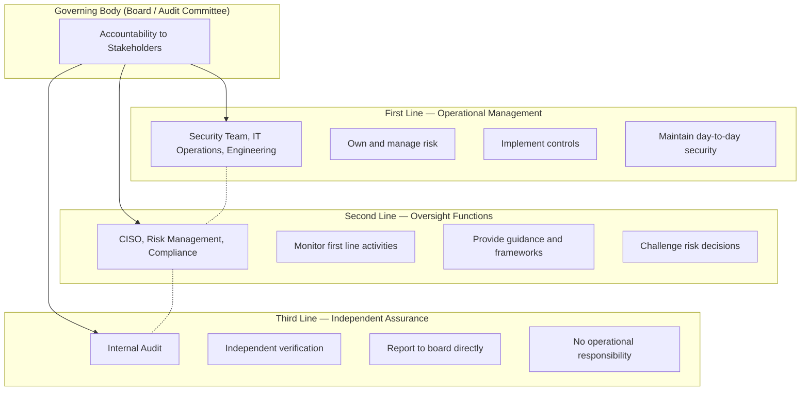

Security governance is the system by which an organisation directs and controls its cybersecurity activities. It answers three fundamental questions:

1. **Who decides** what level of risk is acceptable?
2. **Who is accountable** when things go wrong?
3. **How do we know** our security program is working?

## Governance vs. Management

| Aspect | Governance | Management |
|--------|-----------|------------|
| **Who** | Board of directors, C-suite | CISO, security team |
| **Focus** | Direction, oversight, accountability | Implementation, operations, execution |
| **Questions** | "Are we doing the right things?" | "Are we doing things right?" |
| **Time horizon** | Strategic (1-5 years) | Operational (daily to quarterly) |
| **Key tool** | Policies, risk appetite statements | Procedures, controls, tools |
| **Review cadence** | Quarterly board meetings | Weekly standups, monthly reviews |
| **Example decision** | "Approve $5M security transformation budget" | "Select and deploy CrowdStrike EDR" |

## The Three Lines Model

The Institute of Internal Auditors (IIA) Three Lines Model is the standard for governance structure:



### Real-World Application at a Bank

```
Governance Structure at a Top-10 Global Bank:

Board Level:
  └─ Board Risk Committee (quarterly)
      ├─ Receives CISO report on top 10 risks
      ├─ Approves risk appetite (e.g., "No single breach > $50M")
      └─ Reviews material incidents

C-Suite Level:
  └─ CISO reports to Board Risk Committee
  └─ Management Risk Committee (monthly)
      ├─ Reviews KRIs (Key Risk Indicators)
      ├─ Approves security investment decisions
      └─ Escalates to Board if risk appetite breached

Operational Level:
  └─ First Line: Engineering deploys security controls
  └─ Second Line: Risk team monitors KRIs, flags breaches
  └─ Third Line: Internal audit tests controls annually
```

## Risk Appetite & Risk Tolerance

**Risk appetite** is the amount of risk the organisation is willing to accept in pursuit of its objectives. **Risk tolerance** is the acceptable variation around that appetite.

```yaml
Risk Appetite Statement Examples:

Conservative (Healthcare, Finance):
  "Acme Health will not accept any security risk that could
   result in patient data exposure or regulatory sanction.
   All systems must meet 100% of HIPAA requirements before
   production deployment."

Moderate (Tech SaaS):
  "TechCorp accepts operational security risks where the
   annualised loss expectancy (ALE) is below $250K per
   system, and where compensating controls are documented
   and approved by the CISO."

Aggressive (Startup, Rapid Growth):
  "FastGrowth Inc. accepts that security investment will lag
   behind product velocity in the current growth phase.
   We will not accept risks that affect customer data
   integrity or availability, but accept risks in
   non-critical internal systems."
```

### Risk Appetite Cascade

```
Board Risk Appetite (High-level)
    │
    ▼
CISO Operational Risk Tolerance (Quantified)
    │
    ├─ Data Classification: "PII must always be encrypted"
    ├─ Vulnerability Management: "Critical vulns patched within 7 days"
    ├─ Access Control: "Privileged access requires MFA + approval"
    ├─ Incident Response: "Security incidents reported to CISO within 1 hour"
    └─ Third Party: "All vendors handling PII must have SOC 2 Type II"
    │
    ▼
Technical Controls (Implemented by Engineering)
    ├─ "No database without encryption at rest"
    ├─ "No production access without MFA"
    ├─ "All CI/CD deployments must pass SAST scan"
    └─ "All APIs require authentication + rate limiting"
```

## Security Policy Framework

A well-structured policy framework has four layers:

```mermaid
graph TD
    A[Policy — "What we must do"]
    B[Standard — "How we measure compliance"]
    C[Procedure — "Step-by-step instructions"]
    D[Guideline — "Best practices, optional"]

    A --> B
    B --> C
    B --> D

    style A fill:#e74c3c,color:#fff
    style B fill:#f39c12,color:#fff
    style C fill:#3498db,color:#fff
    style D fill:#95a5a6,color:#fff
```

| Layer | Description | Mandatory? | Example |
|-------|-------------|-----------|---------|
| **Policy** | High-level statement of management intent | Yes, enforceable | "All sensitive data must be encrypted at rest" |
| **Standard** | Specific mandatory requirements | Yes, measurable | "AES-256 with key rotation every 90 days" |
| **Procedure** | Detailed steps to comply | Yes, auditable | "Step 1: Open Azure Key Vault → Step 2: Select key..." |
| **Guideline** | Recommended approach | No | "Consider using AWS KMS for key management" |

### Example: Data Classification Policy

```
Policy: Data Classification Policy
Owner: CISO
Approved: Board of Directors
Last Review: 2026-01-15

1. PURPOSE
   Ensure all data is classified based on sensitivity and handled appropriately.

2. SCOPE
   All data created, processed, or stored by Acme Corp.

3. DATA CLASSIFICATION SCHEME

   Classification | Definition | Examples | Handling Requirements
   ---------------|------------|----------|----------------------
   Public         | No harm if disclosed | Marketing materials, job postings | No special controls
   Internal       | Limited harm | Internal emails, org charts | Access control required
   Confidential   | Moderate harm | Financial data, source code | Encryption, access logging
   Restricted     | Severe harm | PII, PHI, trade secrets | Encryption + DLP + MFA + audit

4. ROLES AND RESPONSIBILITIES
   - Data Owner: Senior manager, classifies data, grants access
   - Data Custodian: IT/Security, implements technical controls
   - Data User: Follows policy, reports incidents

5. ENFORCEMENT
   Violations result in disciplinary action up to termination.
```

## Vendor / Third-Party Risk Management

Third-party breaches are among the most common attack vectors. The SolarWinds, Target, and Okta breaches all originated through vendors.

### TPRM Lifecycle

```
1. Due Diligence (Before Contracting)
   └─ Send security questionnaire
   └─ Review SOC 2 Type II report (if applicable)
   └─ Check breach history, news
   └─ Validate data handling practices

2. Contractual Safeguards
   └─ Include security addendum with:
       ├─ Data protection requirements
       ├─ Breach notification timeline (e.g., 24 hours)
       ├─ Right to audit clause
       ├─ Liability / indemnification
       └─ Termination for cause (security breach)

3. Ongoing Monitoring
   └─ Continuous security rating (SecurityScorecard, BitSight)
   └─ Annual reassessment
   └─ Certifications verification (ISO 27001, SOC 2)
   └─ Sub-processor notification

4. Offboarding
   └─ Data deletion confirmation
   └─ Access revocation
   └─ Certificate of destruction
```

### Vendor Risk Scoring

```yaml
Vendor Risk Score = Impact × Likelihood

Impact (1-5):
  1 = No data shared, low integration
  2 = Internal data, limited integration  
  3 = Confidential data, moderate integration
  4 = PII/PHI, critical integration
  5 = Restricted data, direct network access

Likelihood (1-5):
  1 = SOC 2 Type II, ISO 27001, no breaches
  2 = SOC 2 Type II, limited findings
  3 = No external audit, good questionnaire
  4 = No audit, moderate questionnaire gaps
  5 = Known breaches, poor security posture

Example Vendor Risk Register:

Vendor | Data Access | Impact | Likelihood | Score | Risk Level | Mitigation
-------|------------|--------|------------|-------|------------|-----------
AWS    | IaaS       | 5      | 2          | 10    | Medium     | Shared responsibility model enforced
Okta   | SSO/IdP    | 5      | 2          | 10    | Medium     | MFA + SSO logs monitored
Clever  | PII        | 4      | 4          | 16    | High       | Segment network, additional DLP, quarterly reviews
Mailchimp | Marketing data | 2 | 2          | 4     | Low        | Annual questionnaire
```

## Board-Level Cybersecurity Reporting

Board members are not security experts. Your reports must translate technical risk into business terms.

### Effective Board Dashboard

```yaml
BOARD CYBERSECURITY DASHBOARD — Q1 2026

Governance:
  ✅ Risk appetite statement approved (Feb 2026)
  ✅ Policy review cycle: 12/12 policies current
  ⚠️ Vendor risk: 3 high-risk vendors need mitigation plans

Risk Posture:
  ⬇️ Top 10 risks: 6 trending down, 2 stable, 2 trending up
  ⬆️ New risk: AI-powered phishing targeting executives
  🎯 Risk appetite: All risks within tolerance

Incidents (Q1):
  Phishing attempts blocked: 12,450 (99.97% block rate)
  User-reported phishing: 42 (3 false positives)
  Malware detected (EDR): 87 (all contained)
  Material breaches: 0

Maturity:
  NIST CSF Current: 3.2/5 (up from 2.8/5 last year)
  CIS Controls IG1: 100% complete
  CIS Controls IG2: 75% complete (target: 90% by Q3)

Budget:
  Total spend: $8.2M (2.3% of revenue)
  Spend per employee: $410
  Benchmark: $350-500 (industry average)
```

### Common Board-Level Questions and How to Answer

| Question | Bad Answer | Good Answer |
|----------|-----------|-------------|
| "Are we secure?" | "We have a firewall and antivirus" | "We use NIST CSF to measure maturity. We're at 3.2/5. Our target is 4/5 by Q4 2026." |
| "What keeps you up at night?" | "Ransomware is scary" | "Our top risk is supply chain compromise. The SolarWinds type attack would bypass our perimeter controls. We're implementing zero trust architecture to mitigate this." |
| "Why do we need more money?" | "Because security is important" | "Our current detect capability is at 2.5/5. The Target breach cost $300M+ because they lacked detection. We need $1.2M for a SIEM upgrade to close this gap." |
| "How do we compare to peers?" | "We're doing okay" | "We commissioned a maturity assessment. We're in the 65th percentile for our industry. The top quartile spends 15% more on detection and response specifically." |

## Governance Failure Case Study: Equifax (2017)

The Equifax breach is a textbook governance failure.

### Timeline

```
March 2017:
  └─ Apache Struts CVE-2017-5638 published (critical RCE)
  └─ Equifax scanning team identifies vulnerable systems
  └─ Scanning team sends remediation tickets to operations

March-July 2017:
  └─ Tickets remain open — operations team overloaded
  └─ No escalation process for overdue critical vulnerabilities
  └─ Operations team assumed scanning team would follow up
  └─ Scanning team assumed operations team would patch

May 2017:
  └─ Attackers scan the internet for vulnerable Struts instances
  └─ Find Equifax's vulnerable portal
  └─ Initial access achieved — command execution on the web server

May-July 2017:
  └─ Attackers move laterally for 76 days
  └─ Exfiltrate data over encrypted HTTPS channels
  └─ No detection — encryption hides exfiltration traffic
  └─ Expired TLS certificate on detection tool (missed alerts)

July 29, 2017:
  └─ Equifax discovers the breach
  └─ 143 million customer records stolen (SSN, DOB, addresses)

September 2017:
  └─ Breach disclosed publicly
  └─ Stock drops 35% ($4 billion market cap loss)
  └─ CEO, CSO, CIO all resign
```

### Root Causes (Governance Failures)

| Failure | Detail |
|---------|--------|
| **No clear ownership** | Vulnerability management had no single accountable owner |
| **No escalation** | Critical vulnerabilities >30 days old never escalated to leadership |
| **Siloed teams** | Scanning team and operations team didn't communicate effectively |
| **No detection** | Expired certificate on monitoring tool — no one accountable for maintaining it |
| **Inadequate board oversight** | Board was not informed of cybersecurity risks or gaps |
| **No risk appetite** | No defined threshold for "how long can a critical vulnerability remain unpatched?" |
| **Weak third line** | Internal audit had not tested vulnerability management processes |

### Aftermath

- **Total cost**: $1.4 billion (settlements, legal, remediation)
- **Fines**: $575 million (FTC, CFPB, state AGs)
- **Criminal**: CSO charged with insider trading (sold shares before disclosure)
- **Regulatory**: All 50 US states+DC sued
- **Governance fix**: New board-level cybersecurity committee, quarterly risk reporting, dedicated CISO reporting to board

## Governance Success: JPMorgan Chase

JPMorgan Chase invests $600M+ annually in cybersecurity with 3,000+ security staff. Their governance structure:

```yaml
Governance Structure:
  Board Level:
    - Board Risk Committee (quarterly)
    - Technology Risk Sub-committee (monthly)
  
  Management Level:
    - CISO — reports to Board Risk Committee
    - Operational Risk Committee (weekly)
    - Technology Risk Forum (daily operational risk)
  
  Key Practices:
    - Every critical risk has a named accountable executive
    - Risk appetite is quantified and monitored in real-time
    - Third-party vendors rated monthly (not annually)
    - Board receives a one-page risk summary before each meeting
    - All material risks have remediation plans with deadlines
```

## Governance Metrics (KRIs)

Key Risk Indicators that board and management should monitor:

| KRI | What It Measures | Typical Threshold | Action When Breached |
|-----|-----------------|-------------------|---------------------|
| **Mean Time to Patch Critical** | Average days to patch critical vulns | &lt; 7 days | Escalate to CISO if > 14 days |
| **Phishing Susceptibility Rate** | % of employees who click simulated phish | &lt; 10% | Increase training cadence |
| **Unpatched Critical Vulns** | Count of critical vulns past SLA | 0 | Weekly review with operations |
| **IAM Certification Completeness** | % of access reviews completed | 100% | Escalate to business owners |
| **Third-Party Risk Coverage** | % of vendors assessed | &gt; 90% | CISO review of unassessed vendors |
| **Security Awareness Training** | % completed | 100% | Managers notified of non-completion |
| **Incident Response Time** | Time from detection to containment | &lt; 2 hours | Post-incident review required |
| **Security Budget Variance** | Deviation from approved budget | &lt; 10% | CFO notification |

## Key Takeaways

- Governance answers "who decides?" and "who is accountable?" — it is distinct from management (which answers "who implements?")
- The Three Lines Model separates risk ownership (first line), oversight (second line), and independent assurance (third line)
- Risk appetite statements must be specific and measurable — "we accept low risk" is not a risk appetite
- Policies cascade from high-level intent to detailed procedures — each layer serves a different audience and purpose
- Third-party risk management is a continuous process, not a point-in-time assessment — vendors must be monitored throughout the relationship
- Board reports must translate technical risk into business impact — use dashboards with trends, benchmarks, and clear action items
- The Equifax breach demonstrates what happens when governance fails: no accountability, no escalation, no oversight — leading to $1.4B in losses
- Key Risk Indicators (KRIs) must have defined thresholds and escalation paths — measuring without action is pointless
