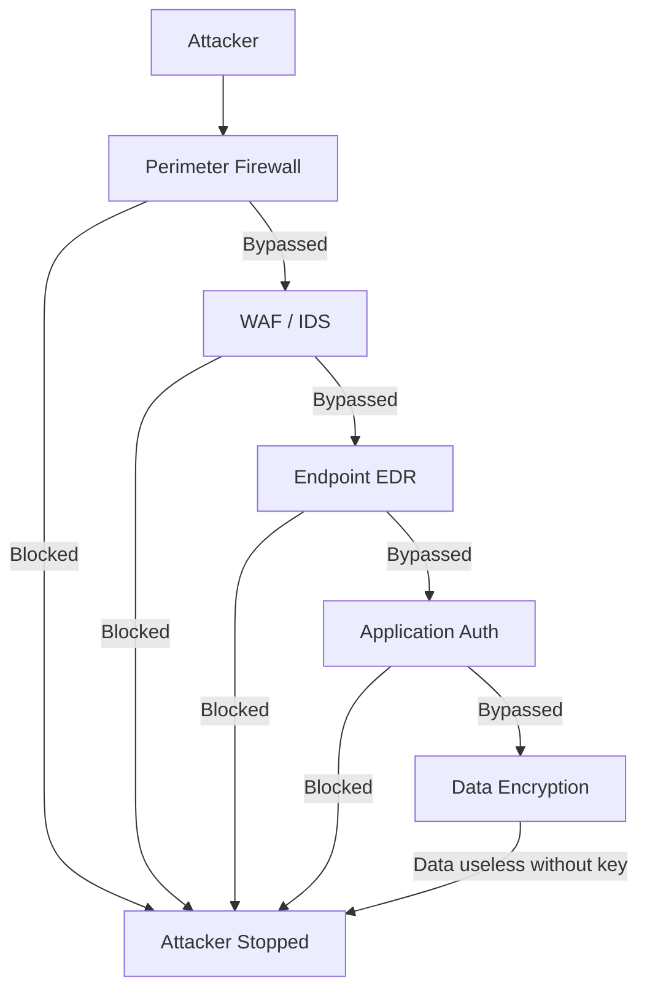

Cybersecurity is the practice of protecting systems, networks, and data from digital attack, damage, or unauthorised access. But that textbook definition misses the point. **Cybersecurity is about managing risk to an acceptable level so the business can operate.** It is not about eliminating all risk — that is impossible. It is about understanding what is at stake, implementing proportionate controls, and accepting residual risk.

## The CIA Triad — Deep Dive

The CIA triad is the foundational model of information security. Every security control you will ever evaluate maps to one or more of these three principles.

### Confidentiality — Keeping Secrets Secret

Confidentiality ensures that data is accessible only to those authorised to view it. When confidentiality fails, data is exposed to unauthorised parties — a data breach.

**How confidentiality is enforced:**

| Control | Example | How It Protects Confidentiality |
|---------|---------|-------------------------------|
| **Encryption at rest** | AES-256 on database volumes | If storage is stolen, data remains unreadable |
| **Encryption in transit** | TLS 1.3 for all network traffic | Data cannot be intercepted during transmission |
| **Access controls** | RBAC, least privilege | Only authorised users can read the data |
| **MFA** | TOTP, hardware key | Even with a stolen password, attacker cannot access |
| **Data classification** | Labels: Public/Internal/Confidential/Restricted | Users are trained to handle data appropriately |

**Case study — Confidental failure: Equifax (2017)**

Equifax stored 147 million customer records — names, SSNs, birth dates, addresses — in a database accessible from a web application running Apache Struts. A vulnerability in Struts (CVE-2017-5638) allowed unauthenticated remote code execution. Attackers exploited it, gained access to the database, and exfiltrated all 147 million records over several months.

The technical vulnerability was a missing patch. But the **confidentiality failure** was that:
1. The database was accessible from the web tier (no network segmentation)
2. The database had no encryption at rest (data was exfiltrated as plain text)
3. No monitoring alerted on the exfiltration of 147 million records (no data loss prevention)
4. Access was not restricted by need-to-know (the web app did not need access to all 147 million records)

**Impact**: $1.4 billion in settlements, CEO resigned, share price dropped 35%.

### Integrity — Trusting Your Data

Integrity ensures that data is accurate and has not been modified by unauthorised parties. When integrity fails, decisions are made based on corrupted data — or malicious code is executed because the source was trusted.

**How integrity is enforced:**

| Control | Example | How It Protects Integrity |
|---------|---------|--------------------------|
| **Hashing** | SHA-256 checksums | Verify files have not been tampered with |
| **Digital signatures** | Code signing certificates | Confirm software came from the claimed publisher |
| **Audit logs** | Immutable log storage | Detect unauthorised modifications after the fact |
| **Change control** | Approved change requests with peer review | Prevent unauthorised modifications |
| **Immutable infrastructure** | Terraform with no in-place edits | Configuration changes are always deployed from scratch |

**Case study — Integrity failure: NotPetya (2017)**

NotPetya was not ransomware — it was a nation-state wiper attack disguised as ransomware. The attackers compromised the update mechanism of M.E.Doc, a Ukrainian accounting software used by 80% of the country's businesses.

The update server pushed a malicious update to every M.E.Doc installation. Because the update was signed with M.E.Doc's code signing certificate, it was trusted by the operating system. The malware spread from Ukraine to companies worldwide: Maersk (shipping), Merck (pharma), FedEx (logistics), Saint-Gobain (construction).

The total damage was estimated at **$10 billion+**. Maersk alone suffered $300 million in losses. The company had to reinstall 4,000 servers and 45,000 PCs. A single domain controller survived because it was protected by a UPS that kept it running when the building was evacuated — and that one DC was used to restore the entire global Active Directory.

**Integrity lessons from NotPetya:**
1. Trust nothing, verify everything — software updates must be verified beyond just "signed by vendor"
2. Immutable backups on offline media — Maersk's backups were also encrypted
3. Supply chain risk is existential — the security of your vendors determines your security
4. Golden images should be available offline — clean OS images not connected to production

### Availability — Keeping the Lights On

Availability ensures that systems and data are accessible when needed. When availability fails, the business cannot operate.

**How availability is enforced:**

| Control | Example | How It Protects Availability |
|---------|---------|-----------------------------|
| **Redundancy** | Active-passive failover | If one server fails, another takes over |
| **DDoS protection** | Cloudflare, AWS Shield | Absorb volumetric attacks |
| **Backups** | 3-2-1 rule with tested restoration | Recover from ransomware or data loss |
| **Disaster recovery** | Cross-region replication | Survive a regional cloud outage |
| **Load balancing** | ELB, HAProxy | Distribute traffic to prevent overload |

**Case study — Availability failure: Dyn DDoS (2016)**

The Dyn DNS DDoS attack used the Mirai botnet — 100,000+ compromised IoT devices (cameras, DVRs, routers) — to flood Dyn's DNS infrastructure with 1.2 Tbps of traffic. Dyn was a major DNS provider for Twitter, Netflix, Spotify, Reddit, Airbnb, and others.

When Dyn went down, these services became unreachable for millions of users — not because their servers were attacked, but because their domain names stopped resolving. Twitter flatlined for hours. Netflix was unreachable across the US East Coast.

**Root cause**: IoT devices shipped with default credentials (admin/admin) that were never changed. The Mirai malware scanned the internet for devices with default credentials, enslaved them into the botnet, and used them for the attack.

**Availability lessons:**
1. DNS is a single point of failure — use multiple DNS providers
2. IoT security is critical — unpatched, default-credential devices are weapons
3. DDoS protection must be in place before the attack, not after
4. Cascading failure is real — DNS failure took down services that were otherwise perfectly healthy

## The Parkerian Hexad

The CIA triad is the minimum. The Parkerian Hexad, proposed by Donn Parker, extends it to six elements:

| Element | Definition | Example Failure |
|---------|------------|-----------------|
| **Confidentiality** | Data is accessible only to authorised parties | Equifax — 147M SSNs exposed |
| **Integrity** | Data is accurate and unmodified | NotPetya — signed malware update |
| **Availability** | Systems accessible when needed | Dyn DDoS — Twitter, Netflix unreachable |
| **Possession/Control** | Data ownership and control | Shadow IT — data stored in unsanctioned SaaS |
| **Authenticity** | Data is genuine and verifiable | Deepfake CEO voice used to authorise $35M transfer |
| **Utility** | Data is useful for its intended purpose | Encrypted data without the decryption key is useless |

## Defense in Depth

No single control is sufficient. Defence in depth layers independent controls so that if one fails, another catches the attacker.



**The "swiss cheese" model of defence**: each control has holes. When you layer controls, the holes are unlikely to align.

| Layer | Control | What It Stops | What It Misses |
|-------|---------|---------------|----------------|
| 1. Perimeter | Firewall | Port scanning, known bad IPs | Application-layer attacks, insider threats |
| 2. Network | IDS/IPS | Known attack signatures | Zero-day exploits |
| 3. Endpoint | EDR/AV | Known malware, malicious behaviour | Fileless attacks, signed malware |
| 4. Application | Input validation, WAF | SQL injection, XSS | Business logic abuse |
| 5. Data | Encryption, access controls | Data theft | Compromised credentials (attacker logs in legitimately) |
| 6. Human | Awareness training | Phishing clicks | Spear-phishing targeting specific individuals |

## Breach Economics

Understanding why cybersecurity matters requires understanding the economics:

| Statistic | Value | Source |
|-----------|-------|--------|
| Average breach cost | $4.88 million | IBM/Ponemon 2024 |
| Average breach lifecycle | 277 days to identify, 62 days to contain | IBM/Ponemon 2024 |
| Ransomware average demand | $1.5 million | Palo Alto Unit 42 |
| Ransomware average recovery cost | $4.5 million | IBM/Ponemon |
| Organisations with MFA that avoided breach | 99.9% reduction in automated attacks | Microsoft |
| Cybersecurity spending as % of IT budget | 10-15% (typical enterprise) | Gartner |
| Global cybercrime cost (projected 2025) | $10.5 trillion | Cybersecurity Ventures |

**The ROI of security**: A simple way to calculate whether a security investment is justified:

```
ALE before control - ALE after control = Annual savings from control

Where ALE (Annualised Loss Expectancy) = SLE × ARO

Example — Implementing MFA for remote access:
  SLE (cost of one account takeover) = $500,000
  ARO before MFA = 2 per year
  ALE before MFA = $1,000,000/year
  
  ARO after MFA = 0.02 per year (99.9% reduction)
  ALE after MFA = $10,000/year
  
  Annual savings = $990,000
  MFA implementation cost = $50,000/year (licensing)
  ROI = $940,000/year net savings
```

## The Business Drivers for Security

Why do organisations invest in cybersecurity?

| Driver | Description | Who Cares |
|--------|-------------|-----------|
| **Risk management** | Prevent financial loss from breaches | Board, CEO, CFO |
| **Compliance** | Meet regulatory requirements (GDPR, HIPAA, PCI) | Legal, Compliance |
| **Reputation** | Protect brand value and customer trust | Marketing, CEO |
| **Operational continuity** | Prevent downtime that stops the business | COO, Operations |
| **Competitive advantage** | Win deals that require security certifications | Sales |
| **Insurance** | Meet cyber insurance requirements | Risk Management, CFO |
| **Customer demand** | Customers require security assessments | Vendor Management |

## The Mindset Shift: Compliance vs Risk

Many organisations approach security as a compliance exercise: "What does the auditor want to see?" This produces checklists that look good on paper but fail in practice.

**Security by compliance:**
- "We have a firewall" — but it's not configured correctly
- "We have MFA" — but it's not enforced on all apps
- "We do access reviews" — but nobody actually reviews, they just click Approve
- "We have an IR plan" — but it hasn't been tested in 3 years

**Security by risk management:**
- "Our highest risk is credential theft — let's prioritise MFA deployment"
- "Our data is most at risk from insider threats — let's implement DLP"
- "Our customers require SOC 2 — let's invest in compliance automation"

The difference: compliance asks "did we do the thing?" while risk management asks "are we actually safer?"

## Key Takeaways

- The CIA triad (Confidentiality, Integrity, Availability) is the foundational model — every control maps to one or more of these principles
- Equifax (confidentiality failure), NotPetya (integrity failure), and Dyn DDoS (availability failure) demonstrate what happens when each principle fails
- Defence in depth layers controls so failure of one is caught by another — the Swiss cheese model shows why layering matters
- Breach economics (ALE = SLE × ARO) provides a quantitative justification for security investments — calculate ROI before buying controls
- The mindset shift from "compliance checkbox" to "risk management" is essential — security is about being safer, not just passing audits
- The Parkerian Hexad extends CIA with Possession, Authenticity, and Utility — a more complete model for modern security analysis
