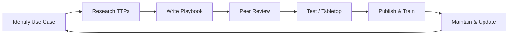

Playbooks and runbooks are the operational backbone of the SOC. They ensure that every analyst — regardless of experience level — follows a consistent, proven process when handling alerts and incidents. A well-written playbook transforms a panicked new analyst into an effective incident responder.

According to the **SANS 2024 SOC Survey**, organisations with documented playbooks achieve **MTTR that is 63% faster** than those without. Yet only **39% of SOCs have playbooks for their top 10 alert types**.

## Playbook vs. Runbook vs. Procedure

| Term | Scope | Audience | Update Frequency | Example |
|------|-------|----------|-----------------|---------|
| **Playbook** | End-to-end incident response process | T1-T2 analysts | Quarterly | "Phishing Response Playbook" |
| **Runbook** | Specific technical steps for a task | T1 analysts (step-by-step) | As tools change | "How to analyze a suspicious URL in URLScan" |
| **Procedure** | Organizational policy and rules | All stakeholders | Annually | "Data Classification Policy" |
| **Standard Operating Procedure (SOP)** | Department-level workflow | SOC team | Semi-annually | "Shift Handover SOP" |

## Playbook Lifecycle



### Phase 1: Identify Use Case

Prioritize playbook development based on:

| Priority | Use Case Type | Examples | Rationale |
|----------|--------------|----------|-----------|
| **P1 — High Frequency** | Top 10 alert types by volume | Phishing, malware, brute force | Highest ROI — most alerts need process |
| **P2 — High Impact** | Low frequency, high damage | Ransomware, data exfiltration, APT | When they happen, process must be flawless |
| **P3 — Compliance** | Regulatory/audit requirements | GDPR breach notification, PCI incident | Legal requirement to have documented process |
| **P4 — Niche** | Rare or environment-specific | SCADA/ICS incident, physical security | As time permits |

### Phase 2: Research TTPs

Before writing, understand what you are detecting:

```yaml
Research Sources:
  └─ MITRE ATT&CK: What techniques does this threat use?
  └─ Threat Intel: Latest TTPs from threat reports
  └─ Past Incidents: Internal lessons learned
  └─ Vendor Guidance: EDR/SIEM vendor recommended response
  └─ Industry Standards: NIST SP 800-61, CISA guidelines
```

### Phase 3: Write Playbook

Use the standard playbook template (see below).

### Phase 4: Peer Review

```yaml
Review Checklist:
  └─ Accuracy: Are the technical steps correct?
  └─ Completeness: Are all decision points covered?
  └─ Clarity: Can a new T1 analyst follow this?
  └─ Safety: Do any steps risk data loss or business disruption?
  └─ Dependencies: Does it reference other playbooks or tools?
```

### Phase 5: Test

```yaml
Testing Methods:
  └─ Tabletop Exercise: Walk through the playbook verbally
  └─ Live Test: Simulate the scenario and follow the playbook
  └─ Purple Team: Red team performs attack, blue team uses playbook
  └─ Post-Incident Review: Does the playbook match what happened?
```

### Phase 6: Maintain

```yaml
Maintenance Schedule:
  └─ Monthly: Quick review — any tool changes? any new TTPs?
  └─ Quarterly: Full review with stakeholder input
  └─ Post-Incident: Update based on lessons learned
  └─ Tool Change: Update immediately when tools/platforms change
```

## Standard Playbook Template

Every playbook should follow this structure:

```
────────────────────────────────────────
PLAYBOOK: [NAME]
Version: 1.0
Last Updated: YYYY-MM-DD
Owner: [Team/Role]
Severity Threshold: P1/P2/P3/P4
MITRE ATT&CK: [Technique IDs]
────────────────────────────────────────

1. OBJECTIVE
   [What this playbook achieves — 1-2 sentences]

2. PREREQUISITES
   [Tools, access, permissions needed before starting]
   □ [Prerequisite 1]
   □ [Prerequisite 2]

3. TRIGGER
   [What causes this playbook to be initiated]
   [Alert name, user report, automated trigger]

4. STEP-BY-STEP PROCEDURE

   4.1 [Phase Name]
       Step 1: [Action] → [Expected Result]
       Step 2: [Action] → [Expected Result]
       Decision: [IF condition → go to X, ELSE go to Y]

   4.2 [Phase Name]
       ...

5. ESCALATION CRITERIA
   Escalate to L2/IR if:
   □ [Criterion 1]
   □ [Criterion 2]

6. SUCCESS CRITERIA
   The playbook is complete when:
   □ [Criterion 1]
   □ [Criterion 2]

7. REFERENCES
   - [NIST standard, vendor KB, internal tool guide]
   - [Related playbooks]
```

## Full Playbook 1: Phishing Response

```
────────────────────────────────────────
PLAYBOOK: Phishing Response
Version: 2.1
Last Updated: 2026-02-15
Owner: SOC Tier 1
Severity Threshold: P2 (escalates to P1 if credential theft)
MITRE ATT&CK: T1566.001, T1566.002
────────────────────────────────────────

1. OBJECTIVE
   Triage and respond to suspected phishing emails — determine if malicious,
   contain the threat, and notify affected users.

2. PREREISITES
   □ Access to email security gateway (Proofpoint/Mimecast/Defender)
   □ Access to URL analysis tools (URLScan, Browserling)
   □ Access to sandbox (ANY.RUN, Joe Sandbox)
   □ SIEM access for log correlation
   □ Mailbox access for email trace/header extraction

3. TRIGGER
   - User reports suspicious email (forward to security@company.com)
   - Email security gateway alerts on malicious/spam email
   - SIEM rule: "Suspicious Email Detected"

4. STEP-BY-STEP PROCEDURE

   4.1 INITIAL RECEIPT (< 5 minutes)
       Step 1: Acknowledge the report/alert in ticketing system
       Step 2: Extract the original email headers:
               Outlook: Open email → File → Properties → Internet headers
               Gmail: Open email → More → Show original
               Forwarded report: User may have forwarded as attachment
       Step 3: Extract key headers:
               - From address (check for display name spoofing)
               - Reply-To address (often different from From)
               - Return-Path (bounce address — tells real sender)
               - Received-SPF (pass/fail)
               - DKIM-Signature (present/absent, pass/fail)
               - Authentication-Results (DMARC pass/fail)
       Step 4: Initial classification:
               IF email auth all pass (SPF, DKIM, DMARC) → Legitimate email
               IF any auth fails → Potentially spoofed → Continue

   4.2 URL & ATTACHMENT ANALYSIS (< 10 minutes)
       Step 5: Extract all URLs from the email and analyze:
               URLScan.io: Submit each URL — check final destination,
                          redirect chain, screenshot
               Check: Domain age (WHOIS — < 30 days = suspicious)
                      Domain reputation (VT Domain, RiskIQ)
                      Page content (does it harvest credentials?)
       Step 6: If attachment present:
               Save attachment to isolated analysis folder
               Check file hash on VirusTotal
               Submit to ANY.RUN sandbox for behavioral analysis
               Check: File type (does extension match content?)
                      Macros? (VBA stomping check)
                      Embedded URLs/objects?

   4.3 CAMPAIGN CHECK (< 5 minutes)
       Step 7: Check if same email sent to other users:
               Email security gateway: Search for similar subject/sender
               SIEM: Search mail flow logs for same URL/attachment hash
               IF 5+ recipients → Broad campaign
               IF single target → Spear-phishing (higher severity)

   4.4 USER INTERACTION CHECK (< 5 minutes)
       Step 8: Check if user clicked/interacted:
               Proxy logs: User accessed the URL?
               Mailbox audit: Any rules created after receiving email?
               Auth logs: Any logins from unusual location after email?
               IF interacted → HIGHER SEVERITY
               IF credentials entered → P1 — force password reset

   4.5 DISPOSITION

       Decision Matrix:
       ┌─────────────┬────────────┬──────────┬──────────┐
       │ Auth Status │ URL/Hash   │ User Act │ Disposition │
       ├─────────────┼────────────┼──────────┼──────────────┤
       │ All Pass    │ Clean      │ None     │ Benign — Close │
       │ Fail        │ Clean      │ None     │ Spam — Block sender │
       │ Fail        │ Malicious  │ None     │ TP — Escalate P2 │
       │ Fail        │ Malicious  │ Clicked  │ TP — Escalate P1 │
       │ Fail        │ Malicious  │ Entered  │ P1 — Immediate IR │
       └─────────────┴────────────┴──────────┴──────────────┘

   4.6 RESPONSE ACTIONS
       IF Malicious + Not Interacted:
         □ Block sender domain in email gateway
         □ Remove email from all recipient mailboxes
         □ Add URL/IP to proxy blocklist
         □ Create ticket for security awareness follow-up
       
       IF Malicious + Clicked (no credential entry):
         □ All above actions
         □ Scan user workstation with EDR for follow-on malware
         □ Reset user's browser session/cookies
         □ Monitor user account for 48 hours
       
       IF Malicious + Credentials Entered (P1):
         □ ALL above actions
         □ IMMEDIATE: Force password reset
         □ IMMEDIATE: Revoke all active sessions/tokens
         □ IMMEDIATE: Check mailbox for rules/forwarding
         □ IMMEDIATE: Check for MFA changes
         □ Escalate to L2/IR for full account compromise investigation

5. ESCALATION CRITERIA
   Escalate to Tier 2 / Incident Response if:
   □ User credentials were entered on phishing page
   □ MFA was approved/passed on attacker session
   □ Multiple high-value users targeted in same campaign
   □ Attacker accessed sensitive data before account was secured
   □ Malware was downloaded/executed from phishing email

6. SUCCESS CRITERIA
   □ Malicious email blocked from all mailboxes
   □ Domain/sender blocked at gateway
   □ All affected users notified
   □ Compromised accounts secured (password reset, sessions revoked)
   □ Ticket documented with IoCs
   □ Tuning feedback submitted (if applicable)
```

## Full Playbook 2: Malware Outbreak

```
────────────────────────────────────────
PLAYBOOK: Malware Outbreak Response
Version: 2.0
Last Updated: 2026-01-20
Owner: SOC Tier 2
Severity Threshold: P1
MITRE ATT&CK: T1204, T1059, T1547, T1486
────────────────────────────────────────

1. OBJECTIVE
   Contain and eradicate malware infection on endpoint systems,
   prevent lateral spread, and preserve forensic evidence.

2. PREREQUISITES
   □ EDR console access with isolate/contain permissions
   □ SIEM access for retrospective analysis
   □ Forensic toolkit (FTK Imager, Volatility, Wireshark)
   □ Evidence storage with chain of custody forms

3. TRIGGER
   - EDR/AV alerts on malware detection
   - User reports unusual system behavior
   - SIEM correlation rule for malware indicators

4. STEP-BY-STEP PROCEDURE

   4.1 IMMEDIATE CONTAINMENT (< 5 minutes)
       Step 1: Acknowledge alert — classify severity
               IF ransomware (mass file encryption) → P1-Critical
               IF Trojan/backdoor → P1-High
               IF PUP/adware → P2-Medium
       
       Step 2: Isolate affected host in EDR:
               CrowdStrike: Host → Actions → Contain
               SentinelOne: Host → Actions → Isolate
               Defender: Device → Actions → Isolate
       Step 3: If multiple hosts, isolate ALL affected hosts
       Step 4: Block observed C2 indicators at firewall/proxy
       Step 5: Disable compromised user accounts (if credential theft suspected)

   4.2 SCOPE ASSESSMENT (< 30 minutes)
       Step 6: Investigate the malware in EDR:
               Process tree: How did it start?
               Network connections: What C2 infrastructure?
               File operations: What was created/modified?
               Registry changes: What persistence was set?
       
       Step 7: SIEM retrospective search (last 14 days):
               Same hash on other hosts?
               Same C2 IP/domain on other hosts?
               Related alerts on the same host?
       
       Step 8: Determine patient zero:
               First system infected
               Email receipt time vs. file creation time
               Drive-by download time from proxy logs

   4.3 EVIDENCE COLLECTION (< 60 minutes)
       Step 9: Collect forensic evidence:
               □ Full disk image (or EDR machine collect)
               □ Memory dump (via EDR or Volatility)
               □ Malware sample (from quarantine or Temp folder)
               □ PCAP (if real-time network capture available)
               □ Chain of custody form for all evidence
       
       Step 10: Malware analysis (basic):
                Hash → VirusTotal → check detections
                Sample → ANY.RUN/Joe Sandbox → behavioral analysis
                Strings → extract IoCs (C2, registry, file paths)

   4.4 ERADICATION
       Step 11: Remove malware:
                EDR: Kill malicious processes
                EDR: Delete malware files
                EDR: Remove persistence mechanisms
                IF cannot guarantee clean → Wipe and reimage system
       
       Step 12: Remove attacker access:
                Reset all credentials used on affected systems
                Revoke session tokens
                Check for backdoor accounts
                Remove unauthorized group memberships

   4.5 RECOVERY
       Step 13: Reimage affected systems (recommended):
                Boot from known-good media
                Apply latest OS patches
                Reinstall applications
                Restore data from clean backup
       
       Step 14: Monitor for re-infection:
                Place reimaged hosts on heightened monitoring for 30 days
                Alert on any re-detection of original IoCs

5. ESCALATION CRITERIA
   Escalate to Incident Response / CISO if:
   □ Ransomware encryption confirmed
   □ Domain controller or critical server infected
   □ Data exfiltration confirmed
   □ Lateral movement to 5+ hosts
   □ Regulatory breach notification required

6. SUCCESS CRITERIA
   □ All affected hosts isolated and cleaned or reimaged
   □ Malware eradicated from environment
   □ Forensic evidence preserved
   □ IoCs documented and shared with threat intel
   □ Detection rules updated based on new IoCs/TTPs
   □ Post-incident review scheduled
```

## Full Playbook 3: Brute Force Attack

```
────────────────────────────────────────
PLAYBOOK: Brute Force Attack Response
Version: 1.2
Last Updated: 2026-03-01
Owner: SOC Tier 1
Severity Threshold: P2 (escalates to P1 if successful)
MITRE ATT&CK: T1110
────────────────────────────────────────

1. OBJECTIVE
   Detect and block brute force authentication attacks against
   any organizational resource (VPN, email, applications, servers).

2. PREREQUISITES
   □ SIEM access for authentication log analysis
   □ Firewall/proxy access for IP blocking
   □ Identity platform access (Azure AD, Okta, AD)

3. TRIGGER
   - SIEM rule: "Multiple Failed Logins" (threshold-based)
   - IDS/IPS alert: "Brute Force Attempt"
   - VPN/firewall alert: Excessive auth failures

4. STEP-BY-STEP PROCEDURE

   4.1 INITIAL TRIAGE
       Step 1: Identify the source IP
       Step 2: Check IP reputation (VT, AbuseIPDB, GreyNoise)
       Step 3: Identify target accounts and resources
       Step 4: Check for any successful logins
               IF successful login found → Escalate P1 immediately

   4.2 ANALYSIS
       Step 5: Determine if attack is still active
               Check: Recent log entries in last 5 minutes
               IF active → Block at firewall immediately
       
       Step 6: Determine attack scope
               Single source IP? Distributed (many IPs)?
               Single target account? Many accounts?
               Single resource? Many resources?

   4.3 RESPONSE
       Step 7: Block attacking IP(s) at firewall:
               Check: Is the IP in any allowlist? (Partner VPN, known service)
               IF not allowlisted → Add to blocklist with 24-hour expiry
       
       Step 8: If distributed attack (many IPs):
               Implement rate limiting at VPN/application level
               Consider CAPTCHA enforcement
               Temporarily disable external access to affected service
       
       Step 9: If account compromised (successful login found):
               □ IMMEDIATE: Force password reset on compromised account
               □ IMMEDIATE: Revoke all active sessions
               □ IMMEDIATE: Check for MFA changes
               □ IMMEDIATE: Check mailbox rules (if email account)
               □ Escalate as P1

5. ESCALATION CRITERIA
   □ Successful authentication from brute force
   □ Compromised account is high-privilege (admin, exec)
   □ Attack targeting multiple high-value accounts
   □ Distributed brute force (botnet-style, many IPs)

6. SUCCESS CRITERIA
   □ Attacking IP(s) blocked at firewall
   □ No successful unauthorized access confirmed
   □ Affected accounts secured (password reset where needed)
   □ Rate limiting implemented (if distributed attack)
   □ Tuning feedback: adjust rule threshold if needed
```

## Full Playbook 4: Ransomware Detection & Response

```
────────────────────────────────────────
PLAYBOOK: Ransomware Detection & Response
Version: 3.0
Last Updated: 2026-02-28
Owner: SOC Tier 2 / Incident Response
Severity Threshold: P1 — Critical
MITRE ATT&CK: T1486
────────────────────────────────────────

1. OBJECTIVE
   Rapidly contain ransomware outbreak, prevent encryption spread,
   preserve evidence, and initiate recovery procedures.

2. PREREQUISITES
   □ EDR admin access (isolate, kill, delete capabilities)
   □ Network team contact (firewall segmentation)
   □ Backup administrator contact (verify clean backups)
   □ CISO/legal notification tree
   □ Offline forensic analysis capability

3. TRIGGER
   - Mass file rename/encryption events in EDR
   - Ransom note text pattern detection
   - User reports files renamed with .encrypted/.locked extension
   - SIEM rule: "Possible Ransomware — High Volume File Operations"

4. STEP-BY-STEP PROCEDURE

   4.1 IMMEDIATE CONTAINMENT (first 5 minutes)
       Step 1: Isolate all hosts with encryption activity
               → EDR: Isolate affected hosts immediately
               → Do NOT wait for full scope determination
       
       Step 2: Block SMB/CIFS outbound at firewall
               → Prevents encryption spreading to file shares
               → Ransomware encrypts mapped drives via SMB
       
       Step 3: Disable Active Directory sync/replication
               → Prevents domain-wide encryption propagation
       
       Step 4: Disable compromised service accounts
               → Ransomware often spreads using cached credentials

   4.2 DETERMINE SCOPE (during containment)
       Step 5: Identify the ransomware strain:
               File extension added (.lockbit, .encrypt, .phoenix)
               Ransom note name (README.txt, HOW_TO_DECRYPT.html)
               Ransom note content (dark web site URL, contact email)
               → Different strains have different characteristics
       
       Step 6: Identify infection vector:
               Phishing email? RDP brute force? Software vulnerability?
               Check email logs, RDP logs, vulnerability scans
       
       Step 7: Determine lateral spread:
               EDR: Check process tree — did it move laterally?
               SIEM: Check authentication logs — unusual RDP/WinRM?
               NetFlow: Check unusual SMB connections between hosts
       
       Step 8: Determine data exfiltration:
               Check: Large outbound data transfers before encryption
               Check: C2 infrastructure connections post-infection
               Check: Web proxy logs for unusual upload activity

   4.3 PRESERVE EVIDENCE
       Step 9: Forensic preservation (BEFORE reimaging):
               □ Memory capture from affected hosts (if EDR didn't capture)
               □ Ransom note file
               □ Encrypted file sample (for decryption research)
               □ Screenshots of ransom demand
       
       Step 10: Chain of custody for all evidence

   4.4 RECOVERY DECISION
       Step 11: Determine recovery path:
               └─ Decryptor available? (some strains have free decryptors)
                  → Check NoMoreRansom.org, ID Ransomware
               └─ Clean backups available?
                  → Test backups before restoring (restore to isolated environment)
               └─ Pay ransom?
                  → NOT recommended — but CISO/legal decision
       
       Step 12: Recovery:
               → Wipe and reimage ALL affected systems
               → Restore data from clean backups (verify no pre-encryption infection)
               → Do NOT restore backups from same period as infection
               → Patch exploited vulnerability before restoring
       
       Step 13: Monitoring:
               → 24-hour enhanced monitoring of restored systems
               → Check for re-infection via same vector
               → Monitor for data exfiltration attempts

   4.5 NOTIFICATION
       Step 14: Internal notifications:
               □ CISO
               □ Legal counsel
               □ PR/Communications team
               □ Affected business unit leaders
       
       Step 15: External notifications (if applicable):
               □ Law enforcement (FBI/CISA — specifically for ransomware)
               □ Regulatory bodies (GDPR, SEC, PCI)
               □ Insurance provider
               □ Affected partners/customers

5. ESCALATION CRITERIA
   Ransomware ALWAYS escalates — this is always P1-Critical:
   □ Active encryption → Immediate CISO notification
   □ Critical systems affected → CIO/CEO notification
   □ Data exfiltration confirmed → Legal/PR notification
   □ Customer data impacted → Regulatory notification

6. SUCCESS CRITERIA
   □ Ransomware contained to initial set of hosts (no further spread)
   □ Business operations restored from clean backups
   □ Forensic evidence preserved for law enforcement
   □ Infection vector identified and patched
   □ Regulatory notifications completed (if required)
   □ Post-incident review conducted within 7 days
   □ Detection rules updated for strain-specific indicators
```

## SOAR Playbook Automation

Converting manual playbooks to automated SOAR workflows:

### Phishing Triage Automation (XSOAR Example)

```yaml
Phishing Auto-Triage Playbook:
  Trigger: User reports email to security@company.com via email integration
  
  Step 1 — Extract:
    └─ Extract all URLs from email body
    └─ Extract all attachments (save to sandbox)
    └─ Extract email headers (From, Reply-To, SPF, DKIM, DMARC)
  
  Step 2 — Enrich:
    └─ Check URLs via URLScan.io → reputation + screenshot
    └─ Check attachment hash via VirusTotal → detection ratio
    └─ Check sender domain via WHOIS → domain age
    └─ Check sender IP via AbuseIPDB → reputation
  
  Step 3 — Classify:
    IF SPF=FAIL AND URL=malicious AND domain_age < 30 days:
      → Classification = "Malicious Phishing" (confidence: 92%)
    ELIF SPF=FAIL AND domain_age < 30 days:
      → Classification = "Suspicious" (confidence: 65%)
    ELSE:
      → Classification = "Benign" (confidence: 78%)
  
  Step 4 — Decide:
    IF confidence > 85% AND classification = "Malicious":
      → AUTO-RESPOND: Remove from all mailboxes, block sender, create P2 ticket
    IF confidence > 50%:
      → CREATE ticket for analyst review with enrichment data
    IF confidence < 50%:
      → Close as Benign with audit trail
  
  Step 5 — Notify:
    IF auto-responded:
      → Post to SOC-Slack channel: "Auto-blocked phishing campaign"
      → Create case in XSOAR with all enrichment data
```

## Playbook Metrics

| Metric | Definition | Target |
|--------|------------|--------|
| **Playbook Coverage** | % of alert types with documented playbook | > 90% |
| **Playbook Adherence** | % of incidents where playbook was followed | > 95% |
| **Playbook Effectiveness** | % of incidents where playbook achieved success criteria | > 90% |
| **Playbook Time-to-Execute** | Average time to complete playbook | < 60 min (P1), < 4 hrs (P2) |
| **Post-Incident Updates** | % of incidents where playbook was updated post-review | > 80% |

## Key Takeaways

- Playbooks and runbooks reduce MTTR by 63% — documented processes prevent panicked, ad-hoc responses
- The playbook lifecycle (Identify → Research → Write → Review → Test → Maintain) ensures continuous improvement
- Every playbook should follow a standard template: Objective, Prerequisites, Trigger, Step-by-Step Procedure, Escalation Criteria, Success Criteria
- The four essential playbooks every SOC needs: Phishing Response, Malware Outbreak, Brute Force Response, and Ransomware Response
- SOAR automation converts manual playbook steps into automated workflows — a well-automated phishing playbook can triage 80% of reports without human intervention
- Playbook maintenance is critical — out-of-date playbooks are worse than no playbooks (they give false confidence)
- Post-incident review should always include playbook update as an action item
- Playbook coverage (what % of alert types have playbooks) is a key SOC maturity metric
- Testing playbooks through tabletop exercises identifies gaps before a real incident
- The best playbooks are living documents — they evolve with the threat landscape, tool changes, and lessons learned
