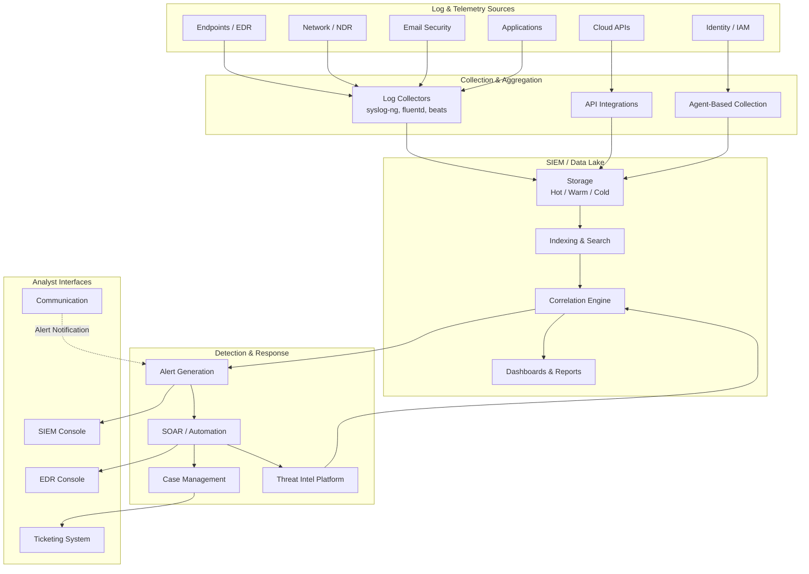

The modern SOC relies on a carefully integrated stack of security tools. Each tool category serves a specific purpose, and the integration between them determines the SOC's overall effectiveness. A well-integrated stack can reduce response times from hours to minutes; a poorly integrated one creates blind spots that attackers exploit.

According to the **2024 SANS SOC Survey**, the average SOC uses **12-15 distinct security tools**, and **45% of SOC time** is spent switching between tools rather than analyzing threats.

## SOC Tool Architecture



## SIEM Platforms

The SIEM is the central nervous system of the SOC. It ingests, normalizes, correlates, and alerts on security events.

### Splunk Enterprise Security

Splunk is the most widely deployed SIEM in large enterprises, known for its powerful search language (SPL) and extensive app ecosystem.

```yaml
Architecture:
  └─ Universal Forwarder (UF): Lightweight agent on log sources
  └─ Heavy Forwarder (HF): Parses/filters logs before indexing
  └─ Indexer: Stores and indexes log data
  └─ Search Head: Query interface, dashboards, correlation
  └─ Deployment Server: Centralized UF configuration management
  └─ License Master: Tracks ingest volume

Key Features:
  └─ Splunk Search Processing Language (SPL): Pipeline-based query language
  └─ Splunk Enterprise Security (ES): Security-specific app with correlation rules
  └─ Risk-Based Alerting (RBA): Risk scoring over raw threshold-based alerts
  └─ Notable Events: Case management within SIEM
  └─ Dashboards: Real-time and historical visualizations

SPL Example — Detect DNS Tunneling:
  index=network sourcetype=dns
  | stats count by query, src_ip
  | eval query_length=len(query)
  | where query_length > 50
  | eval entropy = 
      len(replace(lower(query), "[a-m]", "")) / len(query)
  | where entropy > 0.6
  | sort - entropy
  | table _time, src_ip, query, query_length, entropy

SPL Example — Lateral Movement Detection:
  index=windows EventCode=4624 AccountName!="SYSTEM"
  | search LogonType=3 AccountName=ANONYMOUS_LOGON
  | stats count by AccountName, WorkstationName, IpAddress
  | where count > 5
  | eval severity=if(count>20, "critical", "high")
  | sort - count

Pros:
  └─ Most mature SIEM ecosystem (1000+ apps)
  └─ Best-in-class query language (SPL)
  └─ Massive community and support
  └─ Extensive integration ecosystem

Cons:
  └─ Very expensive ($1.5-2.5/GB/day licensing)
  └─ Complex architecture to maintain
  └─ Requires dedicated Splunk engineers
  └─ Can become slow at high EPS without proper tuning

Pricing: $1,500 - $2,500 per GB/day (ingest-based)
Typical deployment: 50GB - 500GB/day for mid-size enterprise
```

### Microsoft Sentinel

Azure Sentinel is a cloud-native SIEM built on Azure, using Kusto Query Language (KQL).

```yaml
Architecture:
  └─ No infrastructure to manage (SaaS)
  └─ Data connectors for Microsoft and third-party sources
  └─ Log Analytics Workspace as the data store
  └─ KQL-based query engine
  └─ Built-in UEBA and SOAR capabilities

Key Features:
  └─ KQL (Kusto Query Language): Purpose-built for security analytics
  └─ Fusion: ML-based correlation and alert reduction
  └─ UEBA: Machine learning-based behavioral analytics
  └─ Built-in SOAR: Logic Apps-based automation
  └─ Threat Intelligence: Built-in TIP integration (MISP, VirusTotal, etc.)
  └─ Hunting: Jupyter Notebooks integration for advanced analysis

KQL Example — Brute Force Detection:
  // Detect brute force attempts against Azure AD
  SigninLogs
  | where TimeGenerated > ago(1h)
  | where Status.errorCode == 50053  // Account locked
  | summarize Attempts = count(), 
              Users = make_set(UserPrincipalName),
              IPs = make_set(IPAddress)
              by IPAddress
  | where Users > 3
  | project IPAddress, Attempts, Users, IPs
  | order by Attempts desc

KQL Example — Lateral Movement from Workstations:
  // Find remote PowerShell execution from workstations
  DeviceLogonEvents
  | where Timestamp > ago(7d)
  | where LogonType == 3  // Network logon
  | where RemoteIPType == "Private"
  | where InitiatingProcessFileName == "powershell.exe"
  | summarize Logons = count() by 
      DeviceName, AccountName, RemoteIP, InitiatingProcessFileName
  | where Logons > 2
  | order by Logons desc

Pros:
  └─ Pay-as-you-go pricing (no upfront hardware)
  └─ Deep Microsoft 365/Azure integration
  └─ No infrastructure management
  └─ Built-in SOAR without additional licensing
  └─ Strong KQL query language

Cons:
  └─ Azure-only (limited AWS/GCP integration)
  └─ Log Analytics workspace is expensive at scale
  └─ KQL has learning curve from Splunk background
  └─ Alert rule limits (can hit 300-500 rule ceiling)

Pricing: ~$2 - $5/GB/day (including Log Analytics + Sentinel)
Typical deployment: 10GB - 200GB/day
```

### Elastic Security (ELK Stack)

Elastic Security combines the ELK stack (Elasticsearch, Logstash, Kibana) with dedicated security features.

```yaml
Architecture:
  └─ Elasticsearch: Distributed search and analytics engine
  └─ Kibana: Visualization, dashboards, management UI
  └─ Fleet: Agent management (Elastic Agent replaces Beats)
  └─ Detection Rules: Pre-built and custom detection rules

Key Features:
  └─ ESQL: New query language (Elasticsearch QL)
  └─ Detection Rules: 1000+ pre-built rules (MITRE ATT&CK mapped)
  └─ Machine Learning: Built-in anomaly detection
  └─ Cases: Incident management
  └─ Endpoint Security: Included EDR capability
  └─ Cloud Security: K8s, AWS, Azure, GCP integration

ESQL Example — Detect Rare Processes:
  FROM logs-endpoint*
  | WHERE @timestamp > NOW() - 7 DAYS
  | STATS process_count = COUNT(*) BY process.name
  | WHERE process_count < 5
  | SORT process_count ASC
  | LIMIT 50

Detection Rule (Elastic Rule DSL):
  {
    "rule": {
      "name": "Suspicious PowerShell Execution",
      "risk_score": 47,
      "severity": "medium",
      "query": "event.code: \"4104\" AND 
                powershell.command.encoded: *",
      "timeline_template": "powershell-analysis",
      "actions": [
        { "type": "webhook", "frequency": "per_run" }
      ]
    }
  }

Pros:
  └─ Open-source core (free to use)
  └─ Good SIEM + EDR integration
  └─ Scalable architecture
  └─ Strong visualization capabilities
  └─ Active community and rule sharing

Cons:
  └─ Requires significant engineering effort
  └─ ESQL is less mature than SPL or KQL
  └─ Alerting rules need tuning
  └─ Can be complex to scale at enterprise level

Pricing: Free (self-managed) or $0.10/GB/day (Elastic Cloud)
Typical deployment: Very common in MSSP and mid-market
```

### SIEM Comparison

| Criterion | Splunk ES | Microsoft Sentinel | Elastic Security |
|-----------|-----------|-------------------|-----------------|
| **Query Language** | SPL | KQL | ESQL/Query DSL |
| **Deployment Model** | On-prem or Cloud | Cloud-only (Azure) | Self-managed or Cloud |
| **Pricing Model** | Ingest-based ($2-2.5K/GB/yr) | Pay-as-you-go (~$2-5/GB/day) | Free or SaaS ($0.10/GB/day) |
| **EPS Capacity** | Very high (100K+ EPS) | High (scales with Azure) | Very high (100K+ EPS) |
| **SOAR Built-in** | Phantom (extra license) | Yes (Logic Apps) | Limited (Cases only) |
| **UEBA** | Splunk UBA (extra) | Built-in | ML jobs (extra) |
| **Learning Curve** | Medium (SPL) | Medium (KQL) | Medium-High |
| **Best For** | Large enterprise, compliance-focused | Microsoft shops, cloud-native | Cost-conscious, self-managed |
| **Market Share** | ~25% | ~15% | ~20% |

## EDR / XDR Platforms

### CrowdStrike Falcon

The market leader in EDR, CrowdStrike is cloud-native with a single lightweight agent.

```yaml
Architecture:
  └─ Single Agent: One agent for EDR, AV, threat intel, vulnerability management
  └─ Cloud Console: Web-based UI, no on-prem infrastructure
  └─ GraphQL API: Programmatic access to all data
  └─ Real-Time Response (RTR): Remote shell, script execution, file operations

Key Capabilities:
  └─ IOA (Indicators of Attack): Behavioral detection over signatures
  └─ Machine Learning: On-device and cloud ML models
  └─ OverWatch: Managed threat hunting service (24/7 human analysts)
  └─ Falcon Fusion: SOAR-like workflow automation
  └─ Discover: Asset discovery and vulnerability assessment
  └─ Identity Protection: Cloud-delivered identity threat detection

Investigation Workflow:
  # Get process tree for a detection
  falcon guidetection GET /detects/entities/summaries/GET/v1
  
  # Real-Time Response - collect forensic data from endpoint
  falcon rtr-script run -HostId=host123 -ScriptName=forensic_collection.ps1
  
  # Query events via Event Search (KQL-like)
  falcon event-search query="event_simpleName=ProcessRollup2 
    | where TargetProcessName =~ 'powershell.exe' 
    | groupBy ComputerName"

Pros:
  └─ Best-in-class detection (industry-leading IOA)
  └─ Lightweight agent (minimal performance impact)
  └─ Cloud-native (no infrastructure to maintain)
  └─ Strong OverWatch managed hunting
  └─ Extensive API for automation

Cons:
  └─ Expensive ($50-150/endpoint/year)
  └─ Cloud-only (no on-prem option)
  └─ Complex console navigation
  └─ RTR can be latent on larger fleets
```

### SentinelOne

SentinelOne differentiates through autonomous AI-powered response.

```yaml
Key Capabilities:
  └─ Autonomous AI: Detects and responds without human intervention
  └─ Storyline: Automatically groups related events into incident stories
  └─ Purple AI: Natural language query interface for threat hunting
  └─ Ranger: Network discovery and risk assessment
  └─ Singularity XDR: Cross-data-source correlation (endpoint, cloud, identity)

Investigation Workflow:
  # Storyline view automatically shows:
  #   - Initial infection vector
  #   - Process tree with all related activity
  #   - Network connections made
  #   - Files created/modified
  #   - Registry changes
  #   - Persistence mechanisms

Pros:
  └─ Strong autonomous response (reduces manual containment)
  └─ Storyline reduces investigation time significantly
  └─ Purple AI query interface lowers skill barrier
  └─ Good MDR option

Cons:
  └─ Can have false positive issues with aggressive autonomous response
  └─ Console design prioritizes automation over manual investigation
  └─ Less mature than CrowdStrike in enterprise deployments
```

## SOAR Platforms

### Palo Alto XSOAR (Demisto)

XSOAR is the most widely deployed SOAR platform, focused on playbook automation and case management.

```yaml
Key Capabilities:
  └─ Playbook Engine: Visual workflow builder (YAML-based)
  └─ Marketplace: 1000+ pre-built integrations and playbooks
  └─ Case Management: Built-in incident management with SLA tracking
  └─ War Room: Real-time collaboration space for incident response
  └─ Automation: Scheduled, triggered, and manual automations

Example Playbook — Phishing Triage (simplified):
  docker:
    - Phishing_Automation
  tasks:
    Extract Indicators:
      action: ExtractIndicators
      inputs:
        incident_id: ${incident.id}
    
    Check URL Reputation:
      action: urlscan.io
      inputs:
        url: ${extracted.url}
      on_error: Continue
    
    Check Attachment Hash:
      action: VirusTotal
      inputs:
        file_hash: ${extracted.hash}
    
    Determine Severity:
      action: Condition
      inputs:
        conditions:
          - ${vt.detections} > 5: severity = Critical
          - ${urlscan.malicious}: severity = High
          - default: severity = Medium
    
    Auto-Response:
      action: Condition
      inputs:
        conditions:
          - ${severity} = Critical:
              - Block sender at email gateway
              - Quarantine email from all mailboxes
              - Create Teams alert to SOC channel
          - ${severity} = High:
              - Create ServiceNow ticket
              - Escalate to Tier 2
          - default: Create ticket for Tier 1 review

Pros:
  └─ Extensive marketplace (pre-built integrations)
  └─ Strong playbook engine
  └─ Good case management
  └─ Large community

Cons:
  └─ Expensive licensing
  └─ Complex to set up and maintain
  └─ YAML-based playbooks have learning curve
  └─ Can be overkill for smaller SOCs
```

### Splunk SOAR (Phantom)

Splunk SOAR is tightly integrated with Splunk SIEM, focusing on automate-then-investigate workflows.

```yaml
Key Capabilities:
  └─ Playbook Engine: Python-based playbook editor
  └─ Artifact Management: Centralized evidence repository
  └─ Decision Support: Automated enrichment before human review
  └─ Community: Splunk SOAR community playbook library

Example Python Playbook (simplified):
  def on_start(incident):
      # Enrich all IPs in the incident
      for artifact in incident.get_artifacts('IP'):
          virustotal_result = virus_total.lookup(artifact.value)
          artifact.add_note(f"VT: {virustotal_result.detections} detections")
          
          if virustotal_result.detections > 5:
              incident.severity = 'High'
              incident.auto_resolve(actions=['block_firewall'])
```

## Network Detection & Response (NDR)

NDR tools analyze network traffic to detect threats that bypass endpoint controls:

```yaml
Zeek (formerly Bro):
  └─ Type: Network monitoring framework
  └─ Best For: Protocol analysis, traffic baselining, metadata extraction
  └─ Outputs: conn.log (connections), dns.log (DNS queries), http.log (HTTP traffic),
         ssl.log (TLS certificates), files.log (file extraction)
  └─ Query Example — Detect long connections (C2 beaconing):
      cat conn.log | awk '{if($10 > 3600) print}' | sort -k1

Suricata:
  └─ Type: IDS/IPS engine
  └─ Best For: Signature-based network detection
  └─ Rules: Emerging Threats, Proofpoint ET Pro, custom rules
  └─ Example Rule:
      alert http $HOME_NET any -> $EXTERNAL_NET any (
        msg:"ET MALWARE Possible C2 Beacon";
        flow:established,to_server;
        content:"GET"; http_method;
        content:".php"; http_uri;
        threshold:type both, track by_src, count 5, seconds 3600;
        sid:1000001; rev:1;)

Darktrace:
  └─ Type: AI-powered NDR
  └─ Best For: Anomaly detection, unknown threat discovery
  └─ Approach: Unsupervised ML establishes normal behavior and alerts on deviations
  └─ Use Case: Finding insider threats, zero-day malware, subtle beaconing

Open NDR Stack:
  └─ Zeek: Network metadata
  └─ Suricata: IDS signatures
  └─ Stenographer: Full packet capture (retrospective analysis)
  └─ Brim (Zed): PCAP analysis desktop app
  └─ Arkime (Moloch): Full packet capture indexed search
```

## Threat Intelligence Platforms (TIP)

```yaml
MISP (Malware Information Sharing Platform):
  └─ Type: Open-source threat intelligence platform
  └─ Best For: Sharing IoCs with community, managing internal intel
  └─ Key Features:
       - STIX/TAXII protocol support
       - Community sharing groups (Circles)
       - Correlation engine (links related IoCs)
       - Feed generation in multiple formats
  └─ Workflow:
       Receive intel → Validate → Enrich → Publish → Push to SIEM/EDR

Recorded Future:
  └─ Type: Commercial threat intelligence
  └─ Best For: Real-time intel, dark web monitoring, technical threat intel
  └─ Key Features:
       - Integration with major SIEM/SOAR/EDR platforms
       - Indicator scoring and risk assessment
       - Alerting on relevant threats
       - Analyst research reports

VirusTotal:
  └─ Type: File/URL/IoC analysis and reputation
  └─ Best For: Quick enrichment during triage and investigation
  └─ Key Features:
       - Multi-AV scanning (70+ engines)
       - URL analysis
       - Domain/IP reputation
       - Relationship graph
       - Intelligence search
```

## Open Source SOC Stack

A complete SOC can be built entirely with open-source tools:

```yaml
Open Source SOC Stack:
  └─ SIEM: Wazuh (fork of OSSEC) 
       └─ Log collection, analysis, alerting, compliance monitoring
       └─ Agent-based and agentless monitoring
       └─ Built-in regulatory compliance (PCI DSS, HIPAA, GDPR)
  
  └─ SIEM (Alternative): ELK Stack (Elasticsearch, Logstash, Kibana)
       └─ Scalable log management
       └─ + Elastic Security for detection rules
  
  └─ SOAR: Shuffle
       └─ Open-source SOAR with visual playbook builder
       └─ Webhook, API, and scheduled trigger support
       └─ 300+ integrations
  
  └─ Case Management: TheHive
       └─ Incident management with Cortex integration
       └─ Case templating, observables, task tracking
       └─ MISP integration for threat intel
  
  └─ EDR: Wazuh (Endpoint Security) + Velociraptor
       └─ Wazuh: File integrity monitoring, vulnerability detection, log collection
       └─ Velociraptor: Live endpoint hunting, forensic collection, custom queries
  
  └─ NDR: Zeek + Suricata + Stenographer
       └─ Zeek: Network metadata and protocol analysis
       └─ Suricata: IDS/IPS signature detection
       └─ Stenographer: Full packet capture
  
  └─ TIP: MISP
       └─ Threat intelligence sharing platform
       └─ Feed generation for TheHive and Wazuh
  
  └─ Ticketing: OTRS or Zammad
       └─ ITSM with incident management workflows
       └─ Email-to-ticket, SLA tracking, knowledge base

Estimated Cost: $0 in licensing (hardware/staffing costs apply)
Best For: MSSPs, smaller teams, organizations with engineering talent
Limitations: Requires more integration effort, less vendor support
```

## Tool Integration Architecture

The value of SOC tools is realized through their integration:

```yaml
Integration Patterns:
  1. SIEM ↔ EDR:
       └─ EDR sends detections to SIEM for correlation with other data
       └─ SIEM query enriches EDR data with context from other sources
  
  2. SIEM ↔ SOAR:
       └─ SIEM alert triggers SOAR playbook
       └─ SOAR returns enrichment results to SIEM
  
  3. SOAR ↔ EDR:
       └─ SOAR triggers EDR containment actions
       └─ SOAR queries EDR for investigation data
  
  4. SIEM ↔ TIP:
       └─ TIP updates SIEM with new IoCs
       └─ SIEM matches against incoming logs
  
  5. SOAR ↔ Ticketing:
       └─ SOAR creates/updates tickets
       └─ SOAR reads ticket updates for status
  
  6. All ↔ Threat Intel:
       └─ All tools query TIP for IOC enrichment
       └─ TIP pushes updates to SIEM, EDR, firewall
```

## Tool Evaluation Criteria

When evaluating SOC tools, consider:

| Criterion | Weight | What to Evaluate |
|-----------|--------|-----------------|
| **EPS/Capacity** | High | Can it handle peak event load with headroom? |
| **API Availability** | High | Does it have a well-documented API for automation? |
| **Integration Maturity** | High | Pre-built connectors with other tools in your stack? |
| **Staffing Requirements** | High | How many FTEs to maintain? Can generalists manage it? |
| **Time to Value** | Medium | How quickly can you get useful output? |
| **Learning Curve** | Medium | Is training widely available? Strong community? |
| **Vendor Lock-in** | Medium | Can you migrate data out easily? Proprietary formats? |
| **Total Cost of Ownership** | High | Licensing + infrastructure + staffing + training |
| **Scalability** | High | Does it scale linearly with data volume? |

## Key Takeaways

- The SOC tool stack typically includes SIEM, EDR, SOAR, NDR, TIP, and ticketing — integration between them determines effectiveness
- Splunk ES leads in enterprise maturity but is expensive; Microsoft Sentinel excels in Microsoft shops; Elastic Security offers best value
- EDR platforms (CrowdStrike, SentinelOne, Defender) are the most critical detection tool — without EDR, the SOC is blind to endpoint threats
- SOAR automation reduces manual triage: phishing playbooks alone can save 20+ hours per week in a mid-size SOC
- NDR (Zeek, Suricata) provides network-layer visibility that EDR cannot — essential for detecting C2, data exfiltration, and lateral movement
- A fully open-source SOC stack (Wazuh + TheHive + MISP + Shuffle + Zeek) is viable for organizations with engineering talent
- Tool integration is more important than any individual tool — a well-integrated cheap tool beats an isolated expensive one
- Evaluation should consider TCO (licensing + staffing + infrastructure + training), not just up-front licensing costs
- The average SOC wastes 45% of time switching between tools — reducing tool count through platform consolidation improves efficiency
- API-first tools enable automation — every new tool should be evaluated on its API quality, not just its UI
