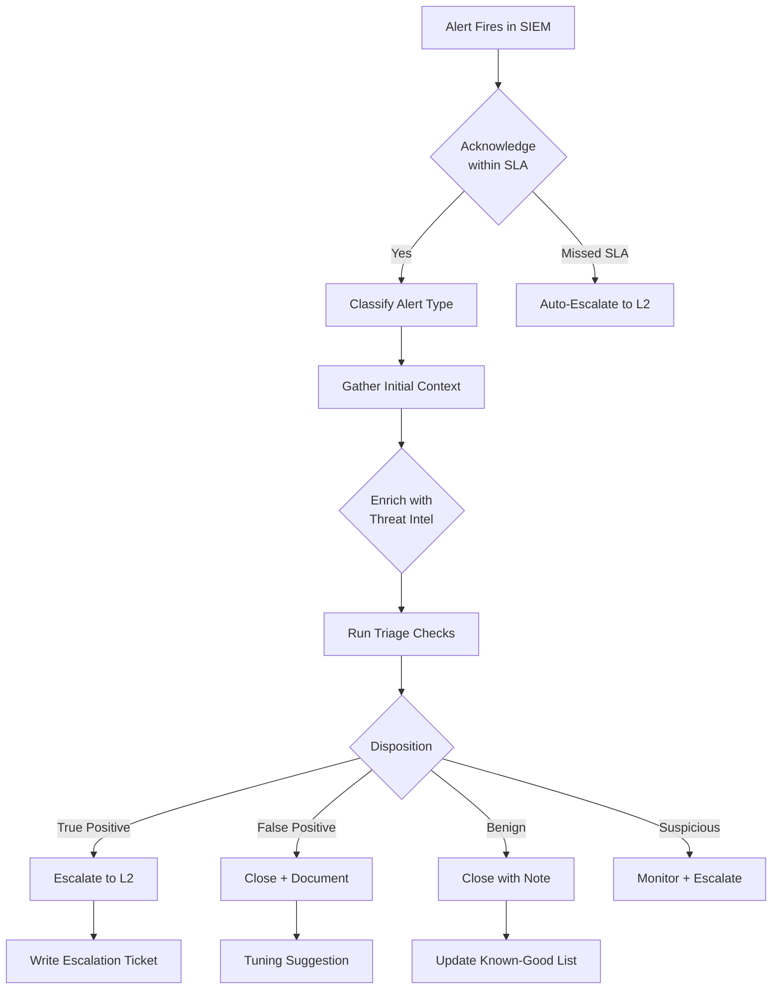

The Tier 1 SOC Analyst is the first line of defense. Every security alert — from a false positive triggered by a backup job to a critical ransomware outbreak — passes through T1 triage before reaching senior analysts. The quality of T1 triage determines the overall effectiveness of the SOC.

According to the **2024 SANS SOC Survey**, Tier 1 analysts handle **60-80% of all incoming alerts**, and well-trained T1 teams resolve **30-40% of alerts at Tier 1 without escalation**. Every alert resolved at T1 saves 30-60 minutes of senior analyst time.

## The T1 Operating Environment

### Shift Structure

Most SOCs operate on one of three shift patterns:

```yaml
Pattern 1 — Panama Schedule (12-hour shifts):
  └─ Week 1: Mon-Tue (days off) → Wed-Thu-Fri-Sat (12hr days)
  └─ Week 2: Sun-Mon-Tue-Wed (12hr nights) → Thu-Fri-Sat (off)
  └─ Week 3: Sun-Mon-Tue (off) → Wed-Thu-Fri-Sat (12hr days)
  └─ Week 4: Sun-Mon-Tue-Wed (12hr nights) → Thu-Fri-Sat (off)
  └─ Cycle repeats every 4 weeks
  └─ Pro: Extended time off (3-4 days/week), consistent schedule
  └─ Con: 12-hour shifts are exhausting, night/weekend rotation

Pattern 2 — 8-hour fixed shifts (3-team coverage):
  └─ Team A (Morning): 6 AM - 2 PM
  └─ Team B (Swing): 2 PM - 10 PM
  └─ Team C (Overnight): 10 PM - 6 AM
  └─ Weekly rotation through teams
  └─ Pro: Predictable hours each week
  └─ Con: Disrupts sleep schedule during rotation, lower pay for night shift

Pattern 3 — Follow-the-Sun (Global SOC):
  └─ Americas: 8 AM - 6 PM local (handover to EMEA at 2 PM ET)
  └─ EMEA: 8 AM - 6 PM local (handover to APAC at 2 PM GMT)
  └─ APAC: 8 AM - 6 PM local (handover to Americas at 2 PM SGT)
  └─ No night shifts — each site works business hours
  └─ Pro: No night shift, natural sleep schedule
  └─ Con: Requires global coordination, limited to large orgs
```

### The T1 Console

The T1 analyst works from a console with multiple screens showing:

```yaml
Screen 1 — SIEM Alert Queue:
  └─ Alert ID, timestamp, severity, rule name, source IP, destination IP, hostname
  └─ Color-coded by severity (Critical=Red, High=Orange, Medium=Yellow, Low=Blue)
  └─ Sortable by time, severity, status
  └─ Count of unacknowledged alerts (target: 0)

Screen 2 — SIEM Dashboard:
  └─ Real-time event throughput (EPS graph)
  └─ Top alert types (pie/bar chart)
  └─ Log source health (green/red indicators)
  └─ Authentication failure heatmap
  └─ Outbound traffic volume spike indicator

Screen 3 — EDR Console:
  └─ Endpoint health status (online/offline/isolated)
  └─ Process tree viewer
  └─ Network connection map
  └─ Detection timeline

Screen 4 — Ticketing System:
  └─ Open tickets assigned to you
  └─ SLA timer (time remaining to acknowledge/investigate)
  └─ Ticket creation form
  └─ Knowledge base / playbook access

Screen 5 — Communication / Monitoring:
  └─ Slack/Teams channels (SOC-alerts, SOC-team, security-announce)
  └─ Email inbox (phishing reports, user-reported incidents)
  └─ Additional monitoring tools (mail security, firewall logs)
```

## Alert Triage Methodology

Triage is not random — it follows a structured process:

### The Triage Flow



### Step 1: Acknowledge

The moment an alert hits the queue, the SLA clock starts ticking:

| Severity | Acknowledge SLA | Triage SLA | Escalation SLA |
|----------|----------------|------------|----------------|
| **P1 — Critical** | < 5 minutes | < 15 minutes | < 30 minutes |
| **P2 — High** | < 15 minutes | < 30 minutes | < 1 hour |
| **P3 — Medium** | < 1 hour | < 4 hours | < 8 hours |
| **P4 — Low** | < 4 hours | < 24 hours | < 48 hours |

**The 5-Minute Rule**: If a P1 alert is not acknowledged within 5 minutes, it auto-escalates to the L2 on-call. If not acknowledged in 15 minutes, it pages the SOC manager. This cascade prevents the Target 2013 scenario where alerts sat unacknowledged indefinitely.

### Step 2: Classify

Determine what type of alert you are dealing with:

| Alert Category | Examples | Typical Severity |
|---------------|----------|-----------------|
| **Malware Detection** | Antivirus/EDR detection, suspicious file, process injection | P1-P2 |
| **Phishing** | Suspicious email, malicious URL, credential harvest attempt | P2-P3 |
| **Authentication Anomaly** | Brute force, impossible travel, unusual login time | P2-P3 |
| **Network Anomaly** | C2 beaconing, data exfiltration, port scan | P1-P3 |
| **Privilege Escalation** | Admin account creation, group modification, privilege abuse | P1-P2 |
| **Policy Violation** | Unauthorized software, data upload to personal cloud | P3-P4 |
| **Compliance** | Unencrypted data, missing patch, configuration drift | P3-P4 |

### Step 3: Gather Context

Before making a disposition, collect this minimum context:

```yaml
For ANY alert, answer these 5 questions:
  1. WHO: What user/account triggered this? (Username, hostname, IP)
  2. WHAT: What rule fired? What was the exact trigger?
  3. WHEN: When did this happen? Is it current or historical?
  4. WHERE: Which system(s) are involved? (Source IP, destination IP, asset criticality)
  5. WHY: Is there context around this event? (User behavior, time of day, location)

Quick enrichment checklist:
  └─ Source IP: Check VirusTotal, AbuseIPDB, GreyNoise
  └─ Destination IP: Check reputation, geolocation, ASN
  └─ File Hash: Check VirusTotal, Hybrid Analysis
  └─ Domain/URL: Check URLScan, WHOIS age, VT
  └─ User Account: Check recent activity, peer comparison
  └─ Host: Check asset criticality, recent alerts on same host
```

### Step 4: Disposition

The most critical decision a T1 analyst makes:

| Disposition | Definition | Action | Escalation? |
|------------|-----------|--------|-------------|
| **True Positive (TP)** | Confirmed malicious activity matching a known threat | Escalate to L2 immediately | Yes — P1/P2 |
| **False Positive (FP)** | Alert triggered but no malicious activity | Close alert, suggest tuning to reduce noise | No — but document tuning |
| **Benign Activity** | Malicious-looking but legitimate (admin scanning own network, security tool traffic) | Close with note, add to known-good list | No — but document exception |
| **Suspicious** | Cannot determine TP/FP with available information | Escalate to L2 with findings and context | Yes — P2/P3 |
| **Confirmed Incident** | Active breach with data loss/system compromise in progress | Isolate affected systems, IMMEDIATE escalation | Yes — P1 emergency |

### The Triage Decision Tree

```
ALERT FIRES
│
├─ Is the source/indicator on any blocklist?
│   ├─ YES → Direction: Likely TP
│   └─ NO → Continue assessment
│
├─ Does the activity match known user behavior?
│   ├─ YES → Direction: Likely benign (unless very unusual)
│   └─ NO → Continue assessment
│
├─ Is the destination known-malicious?
│   ├─ YES → Direction: Likely TP
│   └─ NO → Continue assessment
│
├─ Is there a clear business justification?
│   ├─ YES (scheduled scan, approved tool, admin task) → Benign
│   └─ NO or UNKNOWN → Continue assessment
│
├─ Does this match a known false positive pattern?
│   ├─ YES (known scanner, backup server, monitoring tool) → FP
│   └─ NO → Continue assessment
│
└─ Final disposition based on evidence weight
    ├─ Strong evidence of malice → True Positive → Escalate
    ├─ Weak evidence either way → Suspicious → Escalate with context
    ├─ Strong evidence of benign → Benign → Close with note
    └─ Clear false positive pattern → False Positive → Suggest tuning
```

## Common Alert Types: Analysis Approaches

### Malware Detection Alert

```
ALERT: "Malicious file detected — SALES-05"
Rule: Windows Defender detected Trojan:Win32/Emotet

Triage Checklist:
□ Check file hash on VirusTotal
   → If 5+ detections: Likely TP
   → If 0 detections: Possibly new malware, escalate
□ Check process lineage in EDR
   → Was it launched by email client? (phishing)
   → Was it launched by browser? (drive-by)
   → Was it launched by another process? (lateral movement)
□ Check network connections from host
   → Any C2 connections? (check reputation)
   → Any data staging to unusual locations?
□ Check other hosts for same IOC
   → Is this isolated or widespread?
□ Check file creation/modification time
   → Is this recent or old (dormant malware)?
```

### Brute Force Alert

```
ALERT: "Multiple failed logins — 50 events in 2 minutes"
Rule: Windows Event ID 4625 > 10 in 5 minutes per source IP

Triage Checklist:
□ Check source IP reputation
   → Known VPN/proxy/service IP: Likely benign (password mistype bot)
   → Residential/unknown IP: Likely TP
□ Check target account
   → Generic account (admin, sa, root): Higher suspicion
   → Named user: Check if user was on vacation
□ Check for successful logins AFTER failures
   → Yes: Account likely compromised → Escalate P1-P2
   → No: Attempt failed → Still escalate if high-value account
□ Check across ALL hosts (not just the alerting one)
   → Same IP targeting multiple hosts: Coordinated attack
   → Single host: Possibly mistyped password
□ Check geolocation vs. user location
   → Source IP from different country/region: Higher suspicion
```

### Phishing Alert

```
ALERT: "User reported phishing — suspicious email to CEO"
Source: User forwarded email to security@company.com

Triage Checklist:
□ Check URL in email (if any)
   → Submit to URLScan / browser sandbox
   → Check domain age (WHOIS: < 30 days = high risk)
□ Check email authentication
   → SPF: pass/fail?
   → DKIM: pass/fail?
   → DMARC: pass/fail?
   → Any = fail: Likely spoofed
□ Check sender reputation
   → Known domain: Check if lookalike (rnicrosoft.com vs microsoft.com)
   → Unknown domain: Check VT, domain reputation
□ Check for similar emails
   → Same subject/sender targeting other users?
   → Is this a broad campaign or spear-phishing?
□ Check attachment (if any)
   → Scan hash on VT
   → Submit to sandbox for behavioral analysis
□ Check if user clicked/interacted
   → URL clicked? → Check proxy logs for follow-up
   → Credentials entered? → Force password reset
```

### C2 Beaconing Alert

```
ALERT: "Possible C2 beaconing — host FIN-DB-03"
Rule: Outbound connections to unknown external IP every 60 seconds at exact intervals

Triage Checklist:
□ Check destination IP reputation
   → Known C2/ malware IP: Escalate immediately
   → Unknown: Check geolocation, ASN, WHOIS
□ Check beacon interval and jitter
   → Exact 60-second intervals: Strong C2 indicator
   → Variable intervals (jitter): Could be legitimate API polling
□ Check process making connections
   → Legitimate browser/application? Check if expected
   → Unknown .exe/ DLL? Likely TP
□ Check other hosts for same destination
   → Multiple hosts → Possible botnet → Escalate P1
□ Check data volume per connection
   → Small keep-alive packets: Beaconing
   → Large data transfers: Data exfiltration
□ Check DNS queries for same host
   → Does DNS resolve to this IP? Check recently registered domain
```

## Escalation Procedures

Knowing WHEN to escalate is as important as knowing what to triage:

### When to Escalate Immediately

Any alert meeting these criteria requires immediate escalation to L2:

1. **Active ransomware encryption** — mass file rename detected
2. **Confirmed C2 communication** — host beaconing to known-malicious IP
3. **Admin account compromise** — privileged account showing suspicious activity
4. **Data exfiltration in progress** — large outbound data transfer to unusual destination
5. **Critical system compromise** — domain controller, file server, database, or critical application
6. **Widespread infection** — same IOC detected on 5+ hosts
7. **Active lateral movement** — host-to-host connections from a compromised system
8. **Ransomware demand received** — user contacted by attackers

### Escalation Template

When escalating to L2, provide this minimum context in the ticket:

```
ESCALATION TICKET
─────────────────
Alert ID: INC-2026-0042
Alert Name: [Rule Name]
Severity: [P1/P2]
Source System: [Hostname, IP]
User/Account: [Username]
Timestamp: [First seen - Last seen]

DESCRIPTION:
[1-2 sentences on what the alert detected and why you believe it is a TP]

ENRICHMENT COMPLETED:
□ Source IP checked (VirusTotal/GreyNoise): [result]
□ File hash checked (VT/Hybrid Analysis): [result]
□ Destination IP checked: [result]
□ Asset criticality verified: [criticality]
□ Related alerts checked (same host/IP in last 24h): [yes/no]

TRIAGE NOTES:
[What you found during initial investigation]

ESCALATION REASON:
[Why this needs L2 attention — specific concern]

RECOMMENDED ACTION:
[Suggested containment or investigation step]

ATTACHMENTS:
[Screenshots, log extracts, VT links]
─────────────────
```

## The T1 Tuning Feedback Loop

One of the most valuable contributions T1 makes is identifying false positive patterns:

```yaml
Weekly Tuning Process:
  1. Track false positive rate per rule
  2. Identify top 3 noisiest rules
  3. Document the false positive pattern
  4. Suggest tuning change (threshold, exclusion, whitelist)
  5. Submit to detection engineering for review
  6. Test the tuned rule
  7. Monitor for over-suppression (false negatives)

Example Tuning Suggestion:
  Rule: "Multiple Failed Logins" (50+ events in 5 min)
  False Positive Pattern: Backup service account BACKUP$
           triggers this rule during nightly backup window (2 AM - 4 AM)
  Suggestion: Add BACKUP$ to exclusion list for this rule
           OR create time-based exception (1 AM - 5 AM)
  Risk: Low — backup account has no interactive logon rights
```

## Real Case: Target Breach (T1 Failure)

The **Target data breach (2013)** is the most important case study for T1 triage:

```
Timeline:
  Nov 12, 2013 — Attackers gained access via phishing email to HVAC vendor
  Nov 15-30 — Malware deployed on POS systems (BlackPOS/FireEye detected)
  Nov 27 — FireEye alerts Target's SOC (Bangalore, India): 
           "Backdoor.DarkComet" detected on POS systems
  Nov 27-Dec 12 — FireEye continues alerting — each alert dismissed by T1
  Dec 12 — Secret Service notifies Target of suspicious activity
  Dec 15 — Target confirms breach (40 million credit cards stolen)
  Dec 18 — Public disclosure
  Result: $18.4 million settlement + $202 million breach costs

Why T1 Failed:
  └─ Alert fatigue: FireEye generated too many alerts, many benign
  └─ No escalation trigger: Unacknowledged P1 alerts had no auto-escalation
  └─ No context: T1 lacked understanding of POS malware indicators
  └─ SMTP whitelist: FireEye alerts about data exfiltration were blocked
  └─ No metrics: Time-to-acknowledge was not tracked or enforced
  └─ Undermanning: SOC was understaffed for alert volume

Lessons Learned:
  └─ P1 alerts MUST auto-escalate at 5/15/30 minute intervals
  └─ False positive rate must be tracked per rule, per analyst
  └─ SIEM must correlate across sources (FireEye + EDR + network)
  └─ T1 analysts must understand the business context of what they protect
  └─ Automated containment (IPS, EDR block) as safety net for missed alerts
  └─ Regular cross-training on emerging threats (POS malware in retail)
```

## T1 Metrics and KPIs

| Metric | Definition | Target | Why It Matters |
|--------|------------|--------|---------------|
| **Time to Acknowledge (TTA)** | Time from alert creation to first analyst acknowledgement | < 5 min (P1), < 15 min (P2) | First indicator of SOC responsiveness |
| **Time to Triage (TTT)** | Time from acknowledge to disposition (close/escalate) | < 15 min (P1), < 30 min (P2) | Measures triage efficiency |
| **Escalation Accuracy** | % of escalations confirmed TP by L2 | > 80% | Measures triage quality (too low = misses; too high = alert fatigue for L2) |
| **False Positive Rate** | FP alerts / total alerts handled | < 30% | Measures overall SIEM tuning health and analyst recognition |
| **Alerts Processed per Shift** | Total dispositions per shift | 50-200 | Productivity benchmark (depends on environment) |
| **First Call Resolution** | Alerts resolved at T1 without escalation | > 30% | Measures T1 capability and process effectiveness |
| **Missed Escalations** | Alerts that should have been escalated but were closed | 0 | Critical quality metric — tracked via L2/L3 review |

## Key Takeaways

- T1 triage is the most impactful role in the SOC — 60-80% of alerts pass through T1, and well-trained analysts resolve 30-40% without escalation
- The triage methodology follows a structured flow: Acknowledge → Classify → Enrich → Investigate → Disposition
- The five dispositions (True Positive, False Positive, Benign, Suspicious, Confirmed Incident) each have distinct actions and escalation paths
- Every alert needs enrichment — IoC lookups (VT, AbuseIPDB, GreyNoise) and context gathering (asset criticality, user profile, history)
- Escalation templates ensure L2 receives all context needed to continue investigation without re-doing T1 work
- The Target breach remains the definitive case study on T1 failure — unacknowledged P1 alerts, no auto-escalation, and alert fatigue destroyed the SOC's value
- T1 tuning feedback is critical — analysts who identify and report false positive patterns improve the entire SOC's efficiency
- T1 metrics (TTA, TTT, escalation accuracy, FP rate) measure both individual and SOC effectiveness
- The 5-minute rule for P1 alerts prevents the Target scenario — auto-escalation is a safety net for missed alerts
- T1 is a launchpad, not a destination — the skills built in triage (analysis, documentation, decision-making) transfer directly to L2 and beyond
