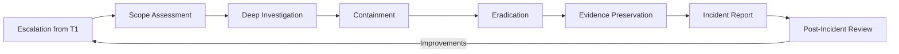

Tier 2 analysts are the investigative core of the SOC. When a T1 analyst escalates an alert, the T2 analyst takes over — determining the full scope of compromise, collecting forensic evidence, containing the threat, and coordinating the response.

According to the **2024 CrowdStrike Global Threat Report**, the average eCrime breakout time is **79 minutes** — meaning from initial compromise, an attacker can begin spreading laterally in just over an hour. T2 analysts operate under intense time pressure: every minute of delay increases the scope of damage.

## The T2 Investigation Lifecycle

The transition from T1 to T2 marks a fundamental shift in mindset: from *triaging individual alerts* to *investigating incidents across multiple data sources*.



### Phase 1: Scope Assessment (First 30 Minutes)

When an escalation arrives from T1, the first priority is understanding the incident scope:

```yaml
Scope Assessment Checklist:
  └─ Patient Zero: Which system/user was initially compromised?
  └─ Method of Entry: How did the attacker get in? (phishing, exploit, credential theft, VPN)
  └─ Dwell Time: How long has the attacker been in the environment?
  └─ Lateral Movement: Which other systems have been accessed?
  └─ Privilege Escalation: Has the attacker gained elevated privileges?
  └─ Data Access: What data/systems has the attacker accessed?
  └─ Exfiltration: Has data been stolen? How much? What type?
  └─ Persistence: What backdoors, accounts, or mechanisms provide ongoing access?
  └─ Infrastructure: What C2 domains/IPs, tools, and malware are involved?
```

**Scope Escalation Matrix:**

| Scope | Definition | Response Level | Stakeholder Notification |
|-------|-----------|---------------|------------------------|
| **Single Host** | One workstation compromised, no lateral movement | Standard T2 investigation | IT manager |
| **Multiple Hosts** | 2-10 systems compromised | T2 lead + T3 consult | Security manager |
| **Domain-Wide** | Domain controller compromised, broad lateral movement | Full IR team activation | CISO, CIO |
| **Enterprise** | Multiple domains, cloud, and on-prem compromise | Crisis management | Board, legal, PR |
| **Supply Chain** | Vendor/customer data involved | Extended crisis | External counsel, regulators |

### Phase 2: Deep Investigation

The investigation phase reconstructs every action the attacker took:

```yaml
Investigation Data Sources:
  └─ Endpoint: EDR telemetry (process creation, network connections, file modifications, registry changes)
  └─ Network: Firewall logs (connections allowed/blocked), proxy logs (URL access), DNS logs (queries)
  └─ Authentication: Windows Event Logs (4624/4625 logons, 4648 explicit credentials), VPN logs, cloud auth logs
  └─ Cloud: CloudTrail (AWS), Activity Log (Azure), Audit Log (GCP), Cloud workload API logs
  └─ Email: Mail flow logs, mailbox audit logs, phishing detection logs
  └─ Application: Web server logs, database audit logs, SaaS app logs
```

**Timeline Reconstruction:**

The most critical T2 skill is building a complete incident timeline:

```
TIMELINE — BEC Investigation (Sample)
─────────────────────────────────────────

2026-03-10 08:23:15 — PHISHING: User jdoe@company.com received email from 
            spoofed@vendor-partner.com with subject "Urgent: Invoice Overdue"
2026-03-10 08:23:18 — URL CLICK: User clicked link in email (hXXps://shorturl[.]xyz/invoice)
2026-03-10 08:23:22 — REDIRECT: Browser redirected through 3 intermediate URLs
2026-03-10 08:23:25 — CREDENTIAL HARVEST: User entered credentials on fake Microsoft 365 login page
2026-03-10 08:23:28 — C2 BEACON: Attacker established session from IP 185.xxx.xxx.xx (residential VPN)
2026-03-10 08:24:00 — ACCESS: Attacker accessed mailbox via IMAP (new device, Russia geolocation)
2026-03-10 08:30-09:15 — RECON: Attacker searched inbox for "invoice", "payment", "wire", "ACH"
2026-03-10 09:30 — RULES: Attacker created mailbox rule forwarding all CFO-emails to deleted@external.com
2026-03-10 11:00 — EXFIL: Attacker downloaded 340MB of email data via Outlook Web Access
2026-03-11 07:45 — T1 ALERT: "Impossible Travel — jdoe login from Russia + US in 15 min"
2026-03-11 08:00 — T1 ESCALATION: Escalated to T2 as suspicious
2026-03-11 08:15 — T2 INVESTIGATION BEGINS: Scope assessment initiated
2026-03-11 08:30 — ACCOUNT DISABLED: User account disabled, sessions terminated
2026-03-11 08:35 — MAILBOX AUDIT: Mailbox access log reviewed, exfiltration confirmed
2026-03-11 08:40 — INCIDENT DECLARED: CISO notified
2026-03-11 09:00 — FORENSIC COLLECTION: Mailbox exported, logs preserved
─────────────────────────────────────────
Dwell time: ~23 hours (detected quickly)
Containment time: 35 minutes from T2 assignment
Data at risk: ~340MB email including financial discussions
```

### Phase 3: Forensic Evidence Collection

T2 analysts must collect evidence in a forensically sound manner:

#### Order of Volatility

Evidence must be collected in order of volatility — collect the most volatile data first:

| Rank | Evidence | Volatility | Collection Tool | Notes |
|------|----------|-----------|----------------|-------|
| 1 | CPU registers, cache | Extremely high | WinDbg, live analysis | Usually impractical in SOC |
| 2 | Running processes | Very high | `tasklist`, `ps -aux`, EDR query | Collect before isolation |
| 3 | Network connections | Very high | `netstat -anob`, `ss -tupan`, EDR | Collect before isolation |
| 4 | Memory (RAM) | High | Magnet RAM Capture, winpmem, `LiME` (Linux) | EDR may already have this |
| 5 | System state | Moderate | Registry, `net` commands, scheduled tasks | Document before changes |
| 6 | Disk (full image) | Low | FTK Imager, `dd`, `guymager` | Take hash first |
| 7 | Logs (remote) | Very low | SIEM query, log server export | Available after containment |
| 8 | Network traffic (pcap) | Low (if captured) | tcpdump, netsh trace, Zeek logs | Retrospective analysis |

#### Chain of Custody

Every piece of evidence must be tracked:

```
CHAIN OF CUSTODY FORM
──────────────────────
Case Number: INC-2026-0042
Investigator: Jane Smith, T2 SOC Analyst
Date/Time Collected: 2026-03-11 09:15

Item #001: Forensic image of SALES-05 system disk (512GB SSD)
Acquisition Method: FTK Imager (bit-for-bit, write-blocker used)
Hash (SHA-256): a1b2c3d4e5f6... (verified at collection)
Hash (SHA-256): a1b2c3d4e5f6... (verified at analysis)
───────────────────────
Chain of Custody:
Collected by: Jane Smith, T2 SOC (09:15, 2026-03-11)
Transferred to: Evidence Locker #3 (09:30, 2026-03-11)
Checked out by: John Doe, DFIR (14:00, 2026-03-11)
Returned to evidence: (date/signature when complete)
───────────────────────
```

#### Endpoint Forensics — Windows Key Artifacts

```yaml
Windows Forensic Artifacts:
  └─ Event Logs: Security.evtx (4624/4625 logons, 4688 process creation, 4732 group membership)
         System.evtx (service installs 7045, driver load)
         PowerShell.evtx (script block logging 4104)
  └─ Prefetch (.pf files): C:\Windows\Prefetch\ — execution history (90-day default)
         Check for unusual executables, renamed binaries
  └─ ShimCache (AppCompatCache): Registry (SYSTEM\CurrentControlSet\Control\Session Manager\AppCompatCache)
         List of executed files with last modified timestamps
  └─ AmCache: C:\Windows\appcompat\Programs\Amcache.hve — execution history with SHA-1 hashes
  └─ USN Journal: $UsnJrnl:$J at C:\$Extend — all file changes with timestamps
  └─ Registry: NTUSER.DAT — user activity (MRU, typed URLs, shell bags)
         SYSTEM — system configuration, mounted devices
         SOFTWARE — installed software, AV state
  └─ SRUM: System Resource Usage Monitor — app execution, network usage per app
  └─ BAM/DAM: Background Activity Moderator — foreground/background app execution
  └─ Jump Lists: C:\Users\[user]\AppData\Roaming\Microsoft\Windows\Recent\ — recently opened files
  └─ Browser History: Chrome/Edge/Firefox — visited URLs, downloads, autofill data
```

#### Network Forensics

```yaml
Network Evidence Analysis:
  └─ PCAP Analysis:
         Command: tshark -r capture.pcap -Y "http.request" -T fields -e http.host -e http.request.uri
         Tool: Wireshark, NetworkMiner, Brim (Zed)
         Key filters: dns.qry.name (DNS queries), http.request.uri (HTTP traffic),
                      tls.handshake.extensions_server_name (SNI — even encrypted traffic)
  └─ NetFlow/IPFIX Analysis:
         Tool: SiLK, nfdump, ElastiFlow
         Key patterns: Long connections to single IP (beaconing), 
                       High-volume connections (exfiltration),
                       Protocol anomalies
  └─ Proxy Log Analysis:
         Check: URLs accessed, User-Agent strings, content-type, upload size
         Red flags: Newly registered domains (VT age check), 
                    encoded URLs, unusual user-agent strings
  └─ DNS Analysis:
         Check: Query volume spikes, NXDOMAIN responses (DGA), 
                unusual TLDs (.xyz, .top, .click), TXT record size
         Tool: DNS log analyzer, Zeek DNS logs
```

### Phase 4: Containment

Containment stops the attacker from causing further damage:

```yaml
Containment Actions (order by speed):
  1. Host isolation: Disable NIC, EDR isolate (seconds)
  2. Account disable: Disable compromised user/service accounts (seconds)
  3. Network block: Block C2 IPs/domains at firewall/proxy (minutes)
  4. Session termination: Kill attacker sessions, revoke tokens (minutes)
  5. Application quarantine: Disable compromised app/SaaS access (minutes)
  6. Network segmentation: Isolate affected VLAN/subnet (hours — needs change mgmt)
```

**Containment Decision Guide:**

| Situation | Recommended Action | Risk of Not Acting |
|-----------|-------------------|-------------------|
| Single host with malware | EDR isolate immediately | Lateral movement to other hosts |
| Compromised user account | Disable account, terminate sessions | Attacker uses mailbox for phishing |
| C2 beacon active | Block C2 IP at firewall + EDR isolate | Data exfiltration, follow-on malware |
| Ransomware detected | Isolate host + disable SMB shares | Encryption spreading to file servers |
| Insider data theft | Preserve evidence before disabling account | Evidence auto-destruction triggers |
| APT/long-term access | Coordinate with T3 — stealth containment | Tip-off causes attacker to destroy evidence |

### Phase 5: Incident Reporting

Every incident requires a written report. The audience varies:

```yaml
Report Audiences:
  └─ Executive Summary (CISO, Board):
         Length: 1 page
         Content: What happened, business impact, what was done, current status
         Format: Bullet points, no technical jargon
         Example: "On March 10, an attacker gained access to a finance user's email 
                  via a targeted phishing campaign. The attacker accessed financial 
                  discussions for approximately 23 hours before being detected. No 
                  wire transfers were initiated. Account has been secured."
  
  └─ Technical Report (IT, Engineering):
         Length: Full report (5-15 pages)
         Content: Complete timeline, IoCs, TTPs, evidence, containment steps
         Format: Structured sections, technical detail
         Includes: Log extracts, screenshots, forensic findings
  
  └─ Legal/Compliance Report:
         Length: As required
         Content: Regulatory relevance (GDPR 72h notification, PCI DSS, HIPAA breach)
         Format: Legal standards, chain of custody, evidence preservation
```

#### Incident Report Template

```
──────────────────────────────────
INCIDENT RESPONSE REPORT
──────────────────────────────────
Incident ID: INC-2026-0042
Classification: BEC — Business Email Compromise
Severity: High (P2)
Date Discovered: 2026-03-11 07:45
Date Closed: 2026-03-12 14:00

1. EXECUTIVE SUMMARY
   [1-2 paragraph summary of the incident, impact, and response]

2. TIMELINE
   [Complete timeline in table format]

3. INITIAL DETECTION
   [How incident was detected, T1 triage notes, escalation trigger]

4. INVESTIGATION FINDINGS
   4.1 Attack Vector
   4.2 Systems Affected
   4.3 Data Accessed/Exfiltrated
   4.4 Attacker Infrastructure
   4.5 MITRE ATT&CK Mapping

5. CONTAINMENT ACTIONS
   [What was done, when, by whom]

6. EVIDENCE COLLECTED
   [List of evidence items with chain of custody]

7. IoCs
   [IPs, domains, hashes, email addresses]

8. ROOT CAUSE ANALYSIS
   [Why the incident was possible]

9. REMEDIATION ACTIONS
   [Completed and pending actions]

10. LESSONS LEARNED
    [What worked, what didn't, improvement items]
──────────────────────────────────
```

### MITRE ATT&CK Mapping

T2 analysts should map attacker actions to the MITRE ATT&CK framework:

```
INCIDENT MITRE ATT&CK MAPPING:
TA0001 — Initial Access
  T1566.001: Spear-phishing Attachment (email with malicious doc)
  
TA0002 — Execution
  T1204.002: User Execution — Malicious File (user opened attachment)
  T1059.001: PowerShell (downloader script)
  
TA0003 — Persistence
  T1547.001: Registry Run Keys / Startup Folder
  
TA0005 — Defense Evasion
  T1055.001: Process Injection
  T1562.001: Disable or Modify Tools (AV disabled)
  
TA0008 — Lateral Movement
  T1021.006: Windows Remote Management (WinRM)
  T1021.001: Remote Desktop Protocol
  
TA0009 — Collection
  T1114.001: Email Collection — Local Email Collection
  
TA0010 — Exfiltration
  T1048.002: Exfiltration Over Alternative Protocol — Asymmetric Encrypted
  
TA0040 — Impact
  T1486: Data Encrypted for Impact (ransomware)
```

## Real Case: Colonial Pipeline — Containment Decisions

The **Colonial Pipeline ransomware attack (May 2021)** is a critical study in T2 containment decisions:

```
Incident: DarkSide ransomware encrypts billing systems
Timeline:
  May 6, 2021 — Attacker gains access via compromised VPN password (no MFA)
  May 6-7 — Attacker exfiltrates 100GB of data over 2 days
  May 7, 04:30 — Ransomware deployed on billing servers
  May 7, 05:00 — SOC detects mass file encryption
  May 7, 05:15 — T2 containment decision: Isolate ALL billing and pipeline ops systems
  May 7, 06:00 — Decision made to SHUT DOWN pipeline (preventative, not required by attack)
  May 7-12 — Pipeline remains offline (6 days)
  May 8 — $4.4M ransom paid (75 Bitcoin)
  May 12 — Pipeline restarted (with manual overrides)
  May 13 — Fuel shortages across US East Coast
  Result: $4.4M ransom + millions in pipeline downtime + national fuel crisis

Key T2 Decisions:
  └─ With containment: Should pipeline SCADA systems be isolated? (Yes — conservative)
  └─ Without containment: Possible explosion/human safety risk from compromised SCADA
  └─ Communication: When to notify TSA/DHS? (Within 12 hours of declaration)
  └─ Ransom decision: Pay or not pay? (Paid — but FBI recommends against it)

Lessons for T2:
  └─ Containment decisions have business impact beyond security
  └─ OT/ICS environments require different containment (cannot just "isolate")
  └─ Ransomware containment must happen BEFORE encryption spreads
  └─ Backup viability testing is critical — Colonial had backups but could not verify them
  └─ Communication with operations teams is essential for safe containment
```

## T2 Metrics

| Metric | Definition | Target |
|--------|------------|--------|
| **Time to Investigate** | Time from T2 assignment to scope determination | < 1 hour (P1), < 4 hours (P2) |
| **Time to Contain** | Time from scope determination to containment | < 30 minutes (P1) |
| **Investigation Accuracy** | Root cause identified correctly | > 95% |
| **Evidence Quality Score** | Peer review of evidence collection/chain of custody | > 90% |
| **Report Timeliness** | Incident report submitted within SLA | < 24 hours (P1), < 72 hours (P2) |
| **False Escalation Rate** | % of T2 investigations determined not to be incidents | < 15% |

## Key Takeaways

- T2 investigation follows a structured lifecycle: Scope → Investigate → Contain → Evidence → Report → Review
- The first 30 minutes determine the quality of the entire response — scope assessment is the most critical phase
- Timeline reconstruction is the core T2 skill — every action the attacker took must be mapped to a timestamp
- Evidence collection follows the Order of Volatility — collect RAM before disk, disk before remote logs
- Chain of custody documentation is essential for legal/admissibility purposes — it must track every evidence item from collection through analysis
- Containment decisions balance speed vs. reversibility — when in doubt, contain first and ask questions later
- Incident reports serve multiple audiences (executive, technical, legal) — each needs a different level of detail
- MITRE ATT&CK mapping connects observed TTPs to the broader threat landscape and informs detection improvements
- The Colonial Pipeline case demonstrates that T2 containment decisions can have national-level consequences
- T2 is a development role — investigation skills built here transfer to DFIR consulting, detection engineering, and security architecture
