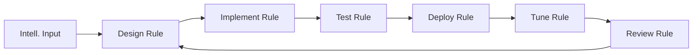

Detection engineering is the practice of designing, implementing, and maintaining detection rules. It bridges the gap between threat intelligence (what to look for) and SOC operations (responding to alerts).

## The Detection Lifecycle



### Phase 1: Intelligence Input

Detection rules come from:
```yaml
  └─ Threat intelligence (new APT group, new malware)
  └─ Incident findings (post-mortem lessons)
  └─ Vulnerability disclosures (CVE-specific detection)
  └─ MITRE ATT&CK techniques
  └─ Industry sharing (ISACs, threat intel sharing groups)
  └─ Hunting results (operationalised hunts)
  └─ Regulatory requirements (PCI, HIPAA specific detections)
```

### Phase 2: Design the Rule

```yaml
Good Detection Rule Requirements:
  
  Atomic — Detects ONE behaviour:
    ✅ "Detect PowerShell with encoded commands"
    ❌ "Detect all malicious activity on Windows"
  
  Specific — Low false positive potential:
    ✅ "Detect schtasks.exe creating a task starting from AppData"
    ❌ "Detect all scheduled task creation"
  
  Contextual — Includes filtering for known-good:
    ✅ "Flag if not from admin workstation AND not during maintenance window"
    ❌ No whitelist/exclusions
  
  Testable — Can be validated:
    ✅ Can generate test event to confirm detection
    ❌ "We'll know it works when we see it"
```

### Phase 3: Implement

Sigma is an open-source, generic signature format for log events. Write once, convert to any SIEM.

**Sigma rule example**:
```yaml
title: Suspicious PowerShell with EncodedCommand
id: 6d9e3c2e-8b4a-4a7c-9f1c-2b3c4d5e6f7a
status: experimental
description: Detects PowerShell execution with the EncodedCommand parameter
references:
    - https://attack.mitre.org/techniques/T1059/001/
author: Detection Engineering Team
date: 2024/01/15
tags:
    - attack.execution
    - attack.t1059.001
logsource:
    category: process_creation
    product: windows
detection:
    selection:
        Image|endswith:
            - '\powershell.exe'
            - '\pwsh.exe'
        CommandLine|contains: '-EncodedCommand'
    filter:
        - CommandLine|contains: 'MicrosoftDNS'
        - CommandLine|contains: 'Update-Help'
    condition: selection and not filter
falsepositives:
    - Legitimate administrative scripts using encoded commands
    - System management tools
level: medium
```

**Convert Sigma to Splunk**:
```bash
# Using sigma-cli
sigma convert -t splunk -p sysmon sigma_rules/powershell_encoded.yml

# Output:
# index=windows source="WinEventLog:Microsoft-Windows-Sysmon/Operational"
# EventID=1
# (Image=*\\powershell.exe OR Image=*\\pwsh.exe)
# CommandLine=*-EncodedCommand*
# NOT (CommandLine=*MicrosoftDNS* OR CommandLine=*Update-Help*)
# | eval severity="medium"
```

**Convert Sigma to Elastic**:
```bash
sigma convert -t elastalert -p sysmon sigma_rules/powershell_encoded.yml

# Output:
# query: (event.code:"1" AND process.name:("powershell.exe" OR "pwsh.exe") 
#         AND winlog.event_data.CommandLine:*-EncodedCommand*)
# filter: (NOT winlog.event_data.CommandLine:*MicrosoftDNS*)
#         AND (NOT winlog.event_data.CommandLine:*Update-Help*)
```

### Phase 4: Test the Rule

```yaml
Testing Stages:

Unit Test:
  └─ Generate a positive match event (confirm alert triggers)
  └─ Generate a negative match event (confirm no false positive)
  └─ Test exclusion filter (confirm known-good is excluded)

Integration Test:
  └─ Deploy in test SIEM environment
  └─ Confirm alert appears in SOC dashboard
  └─ Confirm enrichment works (threat intel lookup)

Staging Test:
  └─ Deploy in staging/production monitoring (IDS mode)
  └─ Run for 7-14 days
  └─ Measure false positive rate
  └─ Tune exclusions

Production:
  └─ Enable alerting with low severity initially
  └─ Ramp up severity after tuning
  └─ Document rule in detection knowledge base
```

### Phase 5: Tune

```yaml
Tuning Metrics:
  └─ Total alerts generated per day
  └─ True positive rate (true positives / total alerts)
  └─ False positive rate (false positives / total alerts)
  └─ Time spent per alert (triage burden)

Tuning Actions:
  └─ Add exclusion filter for known good activity
  └─ Increase threshold (10 events in 5 min → 20 in 10 min)
  └─ Narrow scope (all processes → specific parent process)
  └─ Target specific software versions known to be vulnerable
```

### Phase 6: Review & Retire

```yaml
Monthly:
  └─ Review alert volume for each rule
  └─ Remove rules with zero true positives in 90 days
  └─ Check for new false positive patterns

Quarterly:
  └─ Review against new threat intelligence
  └─ Update references to latest MITRE ATT&CK version
  └─ Verify rules still work (log source changes?)

Annually:
  └─ Full rulebase audit
  └─ Remove rules for no-longer-used systems
  └─ Retire rules for deprecated techniques
```

## Detection-as-Code

Treat detection rules like application code:

```yaml
Detection-as-Code Principles:

  1. Version Control (Git):
     └─ All rules in Git repository
     └─ Branch-based development
     └─ Pull requests with peer review
  
  2. CI/CD Pipeline:
     └─ Lint rules on commit (validate Sigma syntax)
     └─ Automated testing (generate test events)
     └─ Deploy to staging → test → deploy to production
  
  3. Peer Review:
     └─ Every rule reviewed by at least one other engineer
     └─ Review checklist: accuracy, false positive potential, performance
  
  4. Documentation:
     └─ Rule rationale (why this detection exists)
     └─ Known false positives
     └─ References (CVE, ATT&CK, threat report)
     └─ Testing evidence
  
  5. Automated Deployment:
     └─ CI/CD pipeline pushes rules to SIEM
     └─ Version tracking (which rules are deployed where)
     └─ Rollback capability
```

## Alert Fatigue Prevention

```yaml
The Economics of Alert Fatigue:

  1 analyst can handle: ~100 alerts per day (quality triage)
  1 analyst can handle: ~200 alerts per day (superficial triage)
  1 analyst can handle: ~500+ alerts per day (alert ignored)

  If you generate 5,000 alerts per day and have 5 analysts:
    └─ Each analyst handles 1,000 alerts/day
    └─ Most alerts get a 2-second glance
    └─ Critical alerts are missed
    └─ True positive rate drops below 1%

  Solution: Ruthless tuning.
    └─ Target: < 500 alerts per day total (for 5 analysts)
    └─ Target true positive rate: > 10%
    └─ Automate response for well-understood alerts
    └─ Escalate only what requires human judgment
```

## Key Takeaways

- Detection engineering is a distinct discipline that bridges threat intelligence and SOC operations — it requires both security knowledge and data analysis skills
- The detection lifecycle is: intelligence → design → implement → test → deploy → tune → review (and repeat)
- Sigma is the industry standard for writing SIEM-agnostic detection rules — write once, deploy to Splunk, ELK, Azure Sentinel, QRadar, etc.
- Every rule must be tested for both true positives (it fires when it should) and false positives (it doesn't fire when it shouldn't)
- Alert fatigue is the #1 operational problem — if your SOC generates 5,000 alerts/day with 5 analysts, critical alerts will be missed
- Detection-as-Code applies software engineering practices (Git, CI/CD, peer review) to detection rule management
- Rules must be retired when they no longer serve a purpose — a rule with zero true positives in 90 days should be reviewed for removal
- Tuning is never finished — new applications, new behaviours, and new attacks require continuous adjustment
- Every detection rule should map to a MITRE ATT&CK technique — this provides context and identifies coverage gaps
- Testing must include negative tests (confirming known-good activity is NOT flagged) — these are as important as positive tests
