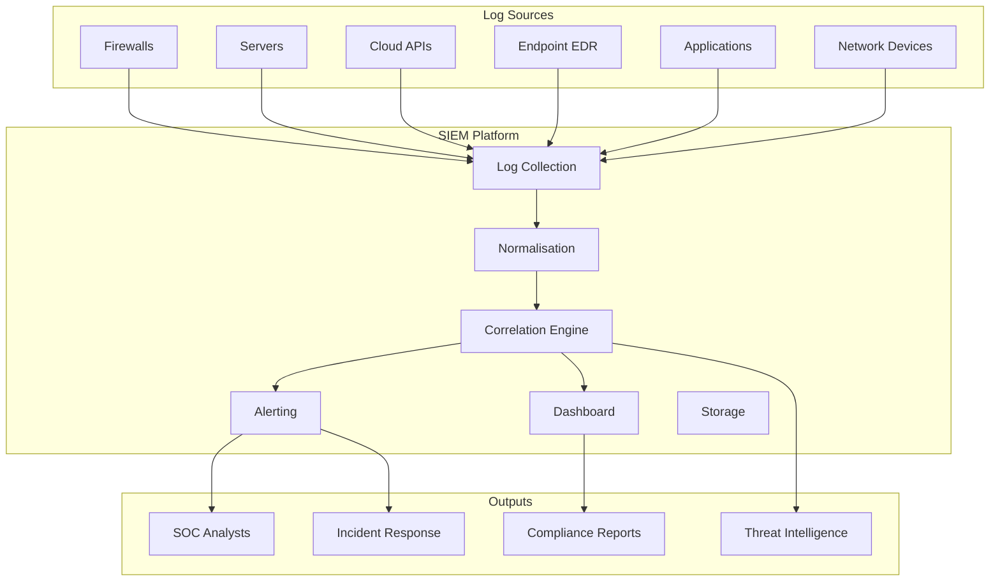

A Security Information and Event Management (SIEM) system aggregates logs from across the organisation, normalises them, and applies correlation rules to detect security incidents.

## What a SIEM Does



## Core SIEM Capabilities

| Capability | Description | Why It Matters |
|-----------|-------------|----------------|
| **Log Collection** | Receive logs from any source (syslog, API, agent) | Without collection, there is no data |
| **Normalisation** | Parse different log formats into a common schema | Enables cross-source correlation |
| **Correlation** | Match events across sources against rules | Detects multi-step attacks |
| **Alerting** | Notify analysts when correlation triggers | Timely response to incidents |
| **Dashboards** | Visualise security posture and trends | Communicates status to management |
| **Reporting** | Generate compliance reports (PCI, HIPAA, SOC 2) | Evidence for auditors |
| **Retention** | Store logs for regulatory periods (1-7 years) | Required for compliance, forensics |
| **Threat Intel** | Enrich logs with known-bad IOC feeds | Block known malicious IPs automatically |

## SIEM Architecture

### Log Sources & Ingestion

```yaml
Critical Log Sources (mandatory for any SIEM):
  └─ Authentication: Windows Event ID 4624/4625, SSH auth.log, VPN logs
  └─ Network: Firewall denies, NetFlow, DNS queries, proxy logs
  └─ Endpoint: EDR alerts, process creation (4688), PowerShell (4104)
  └─ Cloud: AWS CloudTrail, Azure Activity Log, GCP Audit Log
  └─ Application: Web server access logs, API gateway logs
  └─ Database: Audit logs, failed login attempts
  └─ Email: DMARC reports, spam filter logs, mailbox audit
```

```bash
# Example: Forward syslog from Linux to SIEM (rsyslog)
cat > /etc/rsyslog.d/60-siem.conf << 'EOF'
# Send auth logs to SIEM
auth.*;authpriv.*    @siem.company.com:514
# Send all security-relevant logs
*.emerg              @siem.company.com:514

# Send via TCP for reliable delivery
$ActionSendStreamDriver gtls
$ActionSendStreamDriverMode 1
$ActionSendStreamDriverAuthMode x509/name
*.* @@siem.company.com:6514
EOF

systemctl restart rsyslog
```

### Correlation Rules

Correlation rules define what constitutes an incident.

```yaml
Example Correlation Rules:

Single Event (simple match):
  Rule: "Windows Event ID 4625 (failed login) > 10 in 5 minutes"
  Action: Alert SOC analyst
  Tuning: Exclude service accounts, known admin jump boxes

Multi-Event (sequence across sources):
  Rule: "Firewall deny for outbound port 445" followed by
        "Windows Event 4688 (process creation) for cmd.exe" on same host
  Action: Escalate to Tier 2 — possible lateral movement

Threat Intel Match:
  Rule: "DNS query to known C2 domain from internal IP"
  Action: Block IP at firewall, alert SOC
  Source: MISP/CrowdStrike threat intel feed

Statistical Baseline:
  Rule: "Outbound traffic volume > 5x baseline for 5 minutes"
  Action: Alert — possible data exfiltration
  Consideration: Exclude backup windows
```

### Splunk Correlation Example

```
# Splunk SPL (Search Processing Language)

# Detect brute force: 10+ failed logins per source IP in 5 minutes
index=windows EventCode=4625
| stats count by Source_Network_Address
| where count > 10
| join type=inner Source_Network_Address
  [ search index=windows EventCode=4624
  | stats values(User_Name) as SuccessUsers by Source_Network_Address ]
| table Source_Network_Address, count, SuccessUsers

# Detect anomalous outbound traffic by host
index=netflow bytes_out > 1000000
| stats sum(bytes_out) as TotalBytes by src_ip, dest_ip
| eventstats avg(TotalBytes) as AvgBytes, stdev(TotalBytes) as StdDev by src_ip
| where TotalBytes > (AvgBytes + 3*StdDev)
| sort - TotalBytes
| table src_ip, dest_ip, TotalBytes
```

### ELK Stack Correlation (Elastic Security)

```yaml
# Elastic Security detection rule
rule:
  name: "Suspicious PowerShell Execution"
  description: "Detects PowerShell launched with hidden window or encoded commands"
  risk_score: 47
  severity: medium
  
  query: |
    event.code: 4104 AND
    powershell.command.encoded: * AND
    NOT powershell.command: *-WindowStyle Hidden
  
  timeline_template: "powershell-analysis"
  
  actions:
    - type: "webhook"
      frequency: "per_run"
      body: "Alert: Suspicious PowerShell on {{host.name}}"
```

## SIEM Tuning

### Reducing False Positives

| Source | Common False Positive | Tuning Action |
|--------|----------------------|---------------|
| Vulnerability scanner | Scanners trigger failed auth rules | Whitelist scanner IPs |
| Admin activity | Legitimate admin logins at odd hours | Create admin baseline, alert on deviation |
| Backup software | Service accounts creating processes | Exclude known service accounts |
| Monitoring tools | Nagios/Zabbix pings trigger IDS | Whitelist monitoring servers |
| Pen test team | Pen test triggers all rules | Create maintenance window for tests |

### Alert Triage Process

```
RAW EVENT (SIEM alert fires)
    │
    ▼
TRIAGE (Tier 1 Analyst, < 15 minutes)
    ├─ Is this a known false positive? → Close + update tuning
    ├─ Is this a known benign activity? → Close + add to whitelist
    └─ Is this potentially malicious? → Escalate to Tier 2
    │
    ▼
INVESTIGATION (Tier 2 Analyst)
    ├─ Check related events (login, process, network)
    ├─ Query threat intelligence feeds
    ├─ Check host for IOCs
    └─ Determine if this is a true positive
    │
    ▼
RESPONSE (Tier 3 / Incident Response)
    ├─ True positive → Open incident, initiate IR playbook
    └─ False positive → Document and return to tuning
```

## SIEP: Correlation vs. UEBA

| Aspect | Rule-Based Correlation | UEBA (User/Entity Behavior Analytics) |
|--------|----------------------|--------------------------------------|
| **Approach** | Static rules ("if X then Y") | ML/statistical baselines |
| **Detection** | Known attacks | Unknown attacks, insider threats |
| **False positives** | Low (when well-tuned) | High (requires tuning) |
| **Setup time** | Fast (rules are immediate) | Weeks to establish baselines |
| **Example** | "10 failed logins in 5 min" | "User logged in from unusual country" |
| **Best for** | Known TTPs, compliance | Anomaly detection, zero-days |

**Best practice**: Use both. Correlation rules catch known patterns; UEBA catches the unknowns.

## Real Case: SIEM Failure at Target (2013)

The Target breach is the most famous SIEM failure case:

```
What Happened:
  └─ Target had deployed FireEye (now Trellix) for malware detection
  └─ FireEye detected the POS malware in September 2013 (weeks before breach disclosure)
  └─ FireEye alerted Target's SOC in Bangalore, India
  └─ SOC analyst reviewed the alert and determined it was NOT a threat
  └─ No escalation was triggered
  └─ FireEye continued alerting for weeks — each alert dismissed
  └─ SMTP allowlist allowed the data exfiltration to go through
  └─ Breach discovered only after US Department of Justice alerted Target

Why SIEM Failed:
  └─ No escalation path for unacknowledged alerts
  └─ No SIEM correlation between FireEye alerts and other events
  └─ Alert fatigue — too many alerts, too few analysts
  └─ No automated blocking (IPS/EDR) as backup
  └─ No metrics tracked on time-to-acknowledge or alert disposition

Lessons Learned:
  └─ Every alert must have an escalation path
  └─ If not acknowledged in 15 minutes → escalate to senior analyst
  └─ If still not acknowledged in 30 minutes → page CISO
  └─ Automated responses: block, quarantine, contain
  └─ SIEM correlation: link related alerts for context
  └─ Track metrics: time to detect, time to respond, alert volume trends
```

## SIEM Deployment Checklist

```yaml
Planning Phase:
  └─ Define use cases (what attacks to detect?)
  └─ Map compliance requirements (PCI, HIPAA, SOC 2)
  └─ Estimate daily log volume (EPS — events per second)
  └─ Determine retention requirements
  └─ Budget for licensing, hardware, staffing

Build Phase:
  └─ Deploy log collectors (syslog-ng, fluentd, beats)
  └─ Configure log sources for security-relevant events
  └─ Test log ingestion (verify all sources sending)
  └─ Install base correlation rules
  └─ Create dashboards for SOC operations

Operate Phase:
  └─ Tune rules weekly (reduce false positives)
  └─ Review missed detection opportunities
  └─ Update threat intelligence feeds
  └─ Test alert-to-incident workflow
  └─ Track and report SIEM metrics

Mature Phase:
  └─ Implement UEBA for anomaly detection
  └─ Automate response playbooks (SOAR integration)
  └─ Threat hunting based on SIEM data
  └─ Predictive analytics
```

## Key Takeaways

- SIEM aggregates, normalises, and correlates logs from across the organisation — without a SIEM, you cannot detect multi-step attacks that span multiple systems
- Correlation rules must be tuned continuously — initial deployment will generate excessive false positives
- Every alert needs an escalation path — the Target breach demonstrated that unacknowledged alerts in a SIEM are as good as no alerts at all
- SIEM + UEBA provides complementary detection: rules catch known patterns, baselines catch anomalies
- Splunk, ELK, and Azure Sentinel are the dominant SIEM platforms — each has different strengths for different environments
- Alert fatigue is the #1 SIEM problem — reduce false positives by whitelisting known-good activities and tuning thresholds
- SIEM is only as good as its data — if critical sources (firewalls, EDR, cloud APIs) are not sending logs, the SIEM is blind
- Metrics matter: track time-to-detect, time-to-respond, false positive rate, and alert volume over time
- Automated response (block IP, quarantine host) reduces response time from hours to seconds
- SIEM requires dedicated staffing: 1 analyst per 1,000 EPS is a rough staffing guideline
