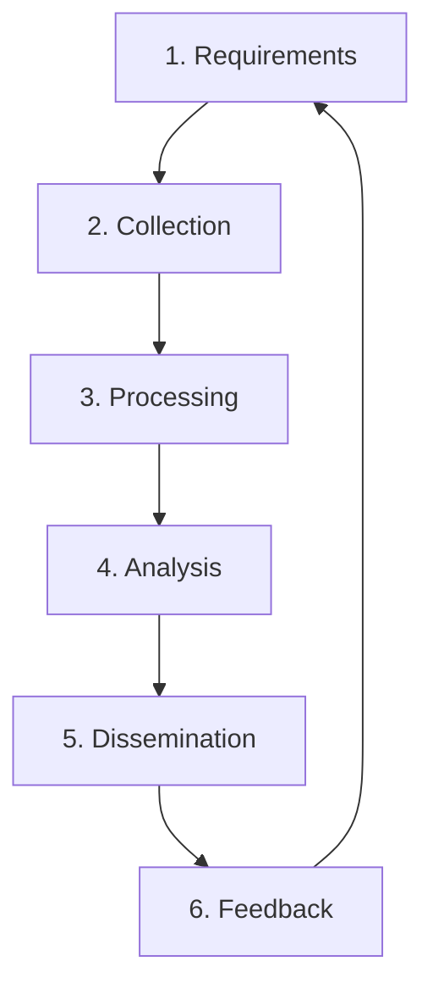

Threat intelligence is evidence-based knowledge about existing or emerging threats. It answers: who is attacking, what are they using, which systems are vulnerable, and how should we defend.

## The Intelligence Lifecycle



### Phase 1: Requirements

```
  What decisions will this intelligence inform?
  
  Strategic (Board/CISO):
    └─ "What are the top 3 threat actors targeting our industry?"
    └─ "How does our threat landscape compare to peers?"
    └─ "Should we invest in X security control?"

  Operational (SOC):
    └─ "What IOCs should we block on our firewalls today?"
    └─ "What new attack techniques should we hunt for?"
    └─ "Is there active targeting of our organisation?"

  Tactical (Analysts):
    └─ "What C2 infrastructure is this APT group using?"
    └─ "What is the hash of the latest ransomware variant?"
    └─ "What TTPs are associated with this campaign?"
```

### Phase 2: Collection

```yaml
OSINT Sources:
  └─ Threat feeds: AlienVault OTX, MISP, VirusTotal, AbuseIPDB
  └─ Dark web monitoring: Telegram, Discord, forums (via paid services)
  └─ Social media: Twitter/X security researchers, LinkedIn
  └─ Government: CISA, NCSC, MITRE ATT&CK
  └─ Industry: ISACs (FS-ISAC, R-ISAC, H-ISAC)
  └─ Technical: DNS, WHOIS, certificate transparency logs, Shodan

Commercial Sources:
  └─ Recorded Future, Mandiant, CrowdStrike, Palo Alto Unit 42
  └─ Intel 471, Flashpoint, Anomali
  └─ Cost: $10K-$500K+/year depending on scope

Internal Sources:
  └─ SIEM alerts and investigations
  └─ EDR telemetry
  └─ Honeypots
  └─ Incident response findings
```

### Phase 3: Processing

Raw data must be normalised and enriched:

```yaml
Processing Steps:
  └─ Normalise format (JSON, STIX, TAXII)
  └─ De-duplicate across sources
  └─ Enrich with context (geolocation, ASN, domain age)
  └─ Score/prioritise IOC confidence
  └─ Verify reliability (was this IOC corroborated?)
```

### Phase 4: Analysis

```yaml
Analysis Types:
  └─ TTP Analysis: What techniques does the actor use?
  └─ Infrastructure Analysis: What IPs, domains, certificates?
  └─ Targeting Analysis: Who is being targeted?
  └─ Campaign Analysis: How does this relate to other attacks?
  └─ Attribution Analysis: Who is behind this? (most difficult)
```

### Phase 5: Dissemination

```yaml
Intel Products by Audience:

Board/CISO (Strategic — monthly):
  └─ Threat landscape overview
  └─ Industry-specific risks
  └─ Recommended strategic investments

SOC Manager/Security Team (Operational — weekly):
  └─ New IOCs to block
  └─ New detection rules to deploy
  └─ Active campaigns targeting our industry

Analysts/Engineers (Tactical — daily):
  └─ Alert enrichment with context
  └─ IP/domain reputation scores
  └─ Automated threat intel lookups in SIEM
```

### Phase 6: Feedback

```yaml
Questions to answer:
  └─ Did this intelligence lead to detection?
  └─ Was the intelligence accurate? (false positives)
  └─ Was it timely? (did we get it before the attack?)
  └─ Was it actionable? (could we do something with it?)
  └─ What intelligence would have helped that we didn't have?
```

## MITRE ATT&CK Framework

The MITRE ATT&CK framework is the industry standard for categorising adversary TTPs.

```yaml
ATT&CK Matrix Structure:

Tactics (columns — "Why"):
  └─ Initial Access, Execution, Persistence, Privilege Escalation
  └─ Defense Evasion, Credential Access, Discovery, Lateral Movement
  └─ Collection, Command and Control, Exfiltration, Impact

Techniques (rows — "What"):
  └─ T1059: Command and Scripting Interpreter
  └─ T1003: OS Credential Dumping
  └─ T1078: Valid Accounts
  └─ T1485: Data Destruction

Procedures (specific implementations — "How"):
  └─ T1059.001: PowerShell
  └─ T1003.001: LSASS Memory
  └─ T1003.002: Security Account Manager
```

## The Cyber Kill Chain

Developed by Lockheed Martin, the kill chain describes the stages of a cyber attack.

```
1. Reconnaissance     — Research target (LinkedIn, Shodan, job postings)
2. Weaponisation      — Create exploit (malware, phishing email)
3. Delivery           — Send exploit (email, USB, drive-by download)
4. Exploitation       — Execute exploit (user clicks, vulnerability triggered)
5. Installation       — Install backdoor/persistence
6. Command & Control  — Establish C2 channel
7. Actions on Object  — Achieve objective (exfiltrate, encrypt, destroy)

How to Break the Chain:
  └─ Recon: OSINT monitoring, reduce public footprint
  └─ Weaponisation: Endpoint protection, app whitelisting
  └─ Delivery: Email filtering, DMARC, AV scanning
  └─ Exploitation: Patch management, application hardening
  └─ Installation: EDR, file integrity monitoring, app control
  └─ C2: Network segmentation, egress filtering, DNS monitoring
  └─ Actions: Backups, DLP, incident response
```

## IOC vs. TTP Detection

```yaml
Indicator of Compromise (IOC) Detection:
  └─ Based on: Hashes, IPs, domains, file names
  └─ Easily changed by attacker (recompile changes hash)
  └─ Pyramid of Pain: Low
  └─ Example: "Block MD5 hash 3a4b5c..."

Indicator of Behaviour (IOB) / TTP Detection:
  └─ Based on: Patterns, behaviours, techniques
  └─ Hard for attacker to change (fundamental to their operation)
  └─ Pyramid of Pain: High
  └─ Example: "Detect LSASS access via process dump" (T1003.001)

Best Practice:
  80% of detection should be TTP-based (behaviours)
  20% can be IOC-based (known-bad hashes, domains)
```

## Open Source Threat Intelligence Tools

| Tool | Purpose | Description |
|------|---------|-------------|
| **MISP** | Threat intel platform | Share, store, correlate IOCs |
| **MITRE ATT&CK** | TTP framework | Categorise adversary behaviours |
| **VirusTotal** | File/IP/URL analysis | Multi-AV scanner, community intel |
| **Shodan** | Device discovery | Find exposed services, IoT devices |
| **Censys** | Internet scanning | Discover exposed assets |
| **URLhaus** | Malicious URLs | Database of malware distribution URLs |
| **AbuseIPDB** | IP reputation | Report and check abusive IPs |
| **PhishTank** | Phishing URLs | Community-driven phishing database |
| **OTX (AlienVault)** | Open Threat Exchange | Shared threat intelligence community |

## Key Takeaways

- Threat intelligence follows a lifecycle: requirements → collection → processing → analysis → dissemination → feedback — never start with collection (know what you need first)
- Intelligence is produced at three levels: strategic (board/CISO — monthly), operational (SOC — weekly), tactical (analysts — daily) — each audience needs different content and cadence
- The Cyber Kill Chain (Lockheed Martin) describes 7 stages of attack — defending at any stage breaks the chain, but earlier stages (recon, delivery) are easier to defend
- MITRE ATT&CK is the industry standard for categorising TTPs — map your detections to ATT&CK techniques to identify coverage gaps
- IOCs (hashes, IPs) are easily changed by attackers — focus detection on TTPs (behaviours) which are harder to change
- Pyramid of Pain: hash detection causes least pain to attackers, TTP detection causes most pain — hunt at the top of the pyramid
- MISP is the leading open-source threat intel platform — integrate with your SIEM for automated IOC ingestion
- Threat intelligence without action is noise — every intel product must answer "what should we DO differently?"
- OSINT provides broad coverage but requires processing and de-duplication — commercial intel provides curated, higher-confidence IOCs
- CTI (Cyber Threat Intelligence) is a specialised role requiring analysis skills, not just data collection
