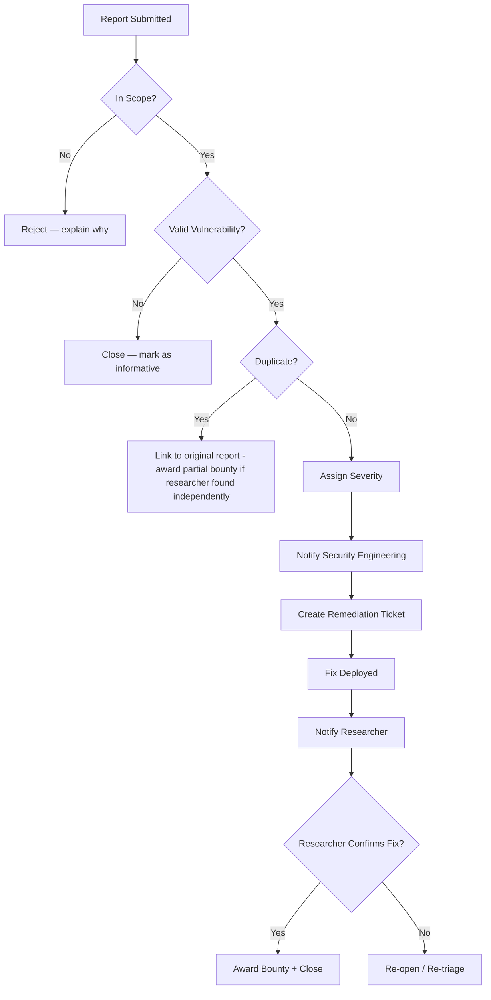

Bug bounty programs invite external security researchers to find and report vulnerabilities in exchange for monetary rewards. When designed well, bug bounties give organisations access to thousands of skilled researchers who find vulnerabilities their internal teams miss.

## Why Bug Bounties?

| Reason | Detail |
|--------|--------|
| **Scale** | Thousands of researchers vs. a few internal testers — far more coverage |
| **Cost-effective** | Pay only for valid findings (vs. a fixed-cost pen test contract) |
| **Continuous testing** | Researchers test whenever they want, not in a fixed window |
| **Diverse perspectives** | Different researchers have different specialities and approaches |
| **Real-world motivation** | Financial incentives drive thorough testing |
| **Talent recruitment** | Top researchers may become future employees |

## Program Models

| Model | Description | Reward Range | Best For |
|-------|-------------|--------------|----------|
| **Private program** | Invitation-only researchers | Standard ($500-$10k) | Organisations building capability, sensitive attack surface |
| **Public program** | Open to all researchers | Standard ($500-$10k) | Mature security programs, large attack surface |
| **VDP (no rewards)** | Policy-only, no monetary rewards | $0 | Starting out, low-budget organisations |
| **Hybrid** | Private for critical systems, public for rest | Variable | Large organisations with diverse attack surfaces |

## Platform Comparison

| Feature | HackerOne | Bugcrowd | Intigriti |
|---------|-----------|----------|-----------|
| **Researcher base** | 600,000+ | 450,000+ | 50,000+ |
| **Focus** | Enterprise | Enterprise | European market |
| **Pricing** | Subscription + 20% reward fee | Subscription + 20% reward fee | 15% reward fee |
| **Managed option** | HackerOne Response (full service) | Bugcrowd Managed Bug Bounty | Intigriti Premium |
| **Notable clients** | Microsoft, Twitter, GitHub | Tesla, Atlassian, Dropbox | KPMG, Deloitte, ABN AMRO |

## Program Design

### Scope Definition

Clearly define what researchers can test:

```
IN SCOPE:
- *.example.com (excluding staging.example.com)
- API endpoints: api.example.com, api-v2.example.com
- Mobile apps: ExampleApp (Android), ExampleApp (iOS)
- Source code: github.com/example/public-repo

OUT OF SCOPE:
- Staging and development environments
- Third-party services (AWS, Stripe, SendGrid)
- Physical security, social engineering
- Denial of service attacks
- Rate-limit testing exceeding 100 requests/second

TESTING RULES:
- Only use accounts created for testing (no compromised accounts)
- Maximum 5GB of stored test data
- Delete all test data after testing
- Do not modify or delete production data
- Report via platform only (no direct email/twitter DMs)
```

### Reward Structure

| Severity | Typical Bounty Range | Example Vulnerabilities |
|----------|---------------------|------------------------|
| **Critical** | $5,000 - $100,000+ | RCE, SQL injection with data exfiltration, authentication bypass |
| **High** | $2,000 - $20,000 | XSS with impact, privilege escalation, IDOR with sensitive data |
| **Medium** | $500 - $5,000 | CSRF on sensitive actions, limited XSS, information disclosure |
| **Low** | $100 - $1,000 | Open redirect, minor info disclosure, missing security headers |
| **Informative** | $0 - $100 | Best practice violations, config recommendations |

### Response SLAs

| Phase | Target | Description |
|-------|--------|-------------|
| **Acknowledgement** | < 24 hours (critical), < 72 hours (other) | Researcher knows the report was received |
| **Triage** | < 48 hours | Initial assessment: valid, duplicate, out-of-scope |
| **Validation** | < 1 week | Confirm the vulnerability and determine severity |
| **Bounty award** | Within 2 weeks of validation | Payment processed |
| **Remediation** | Per severity: Critical (7 days), High (30 days), Medium (90 days) | Fix deployed |
| **Public disclosure** | After remediation is verified | Coordinate with researcher on disclosure timeline |

## Triage Process



### Duplicate Handling

A common challenge: multiple researchers finding the same vulnerability. Standard approaches:

| Model | Payment | When |
|-------|---------|------|
| **First reporter paid** | Full bounty to first | Only the first valid reporter receives the bounty |
| **Partial duplicates** | Reduced bounty (e.g., 25%) | Researchers who found the same bug independently within a short window |
| **Boundary testing** | Discretionary bonus | Researcher who found the bug in a different boundary (e.g., subdomain) |
| **Near misses** | Informative + swag | Close but not quite exploitable — reward the effort |

## Case Study: Microsoft Bug Bounty Program

Microsoft runs one of the largest and longest-running bug bounty programs:

| Metric | Value |
|--------|-------|
| **Program launched** | 2013 (Internet Explorer) |
| **Researchers paid** | 1,500+ |
| **Total paid** | $100M+ |
| **Max bounty** | $250,000 (Hyper-V RCE) |
| **Average response time** | < 24 hours |
| **Average payout time** | 7-10 business days |

**Key success factors:**
- Clear scope with detailed technical descriptions of in-scope attack surfaces
- Fast triage (most reports triaged within 24 hours)
- No negotiation on bounties (set clear rates upfront)
- Public recognition (hall of fame, researcher case studies)

## Running a Successful Program

### Researcher Communication

```yaml
Researcher Communication Best Practices:
  └─ Acknowledge reports quickly: Even an auto-response within minutes is better than silence for 24 hours
  └─ Be transparent about timeline: "We received your report and will triage within 48 hours"
  └─ Explain rejections: If a report is out of scope or not valid, explain WHY — not just "closed"
  └─ Give credit: Public Hall of Fame, Twitter shoutouts, conference invitations
  └─ Be respectful: Researchers are volunteers giving you free security testing
  └─ Communicate fixes: Let the researcher know when a fix is deployed and ask them to verify

Communication Anti-Patterns:
  └─ Ignoring reports: No response for weeks kills researcher trust
  └─ Arguing severity: If you disagree with severity, explain your reasoning respectfully
  └─ Lowballing bounties: Offering $50 for a critical RCE is insulting
  └─ Threatening legal action: Never threaten researchers who follow the rules of engagement
  └─ Delaying payment: Pay within 2 weeks of validation — researchers have bills too
```

### Legal Safe Harbor

For any bug bounty program, a clear safe harbor policy is essential:

```
SAFE HARBOR PROVISIONS:
We will not pursue legal action against researchers who:

1. Follow the scope defined in this program
2. Report vulnerabilities immediately through the designated platform
3. Do not access or modify production data beyond what is necessary for proof of concept
4. Do not exfiltrate, share, or publicize data accessed during testing
5. Do not perform denial of service attacks, physical attacks, or social engineering
6. Delete all test data after the vulnerability is confirmed and reported

If a researcher accidentally violates scope while in good faith attempting to find vulnerabilities,
we will work with them to resolve the situation before taking any legal action.
```

### Common Program Pitfalls

| Pitfall | Symptom | Solution |
|---------|---------|----------|
| **Scope too broad** | Hundreds of low-quality reports (rate limiting, missing security headers) | Be specific about what you want tested; exclude out-of-scope assets explicitly |
| **Slow triage** | Researchers stop submitting after waiting 2+ weeks for a response | Dedicate triage resources; set SLA and stick to it |
| **Inconsistent bounty amounts** | Researchers complain publicly about low bounties | Publish clear bounty ranges; pay competitive rates for your industry |
| **No disclosure policy** | Researchers go public before you fix | Define disclosure terms in program policy (e.g., 90 days after fix) |
| **Ignoring duplicates** | Multiple researchers find same bug, only first gets credit | Clear duplicate policy: first reporter gets full bounty, partial for near-simultaneous |
| **Scope changes without notice** | Researchers wasting time on newly out-of-scope assets | Announce scope changes with 30-day transition period |

## Metrics to Track

| Metric | Target | Why |
|--------|--------|-----|
| **Reports per month** | 20-200 (program dependent) | Indicates researcher engagement |
| **Valid report rate** | > 30% | Quality of researcher reports; too low = scope too broad |
| **Mean time to triage** | < 24 hours (critical), < 72 hours (other) | Researcher satisfaction |
| **Mean time to bounty** | < 2 weeks | Researcher satisfaction and retention |
| **% of critical/high fixed in SLA** | > 90% | Security team effectiveness |
| **Researcher satisfaction score** | > 4.0/5.0 | Program health |
| **Cost per valid finding** | < $2,000 (good), < $1,000 (excellent) | Cost efficiency |

<Aside variant="tip">
The most common mistake in bug bounty programs is having a scope that is too broad. A vague scope results in low-quality reports (rate limits, missing security headers, self-XSS). Be specific about what you want tested and what you don't. Quality over quantity.
</Aside>

## Key Takeaways

- Bug bounties scale security testing by leveraging thousands of external researchers who are paid only for valid findings
- Program design is critical: clear scope, defined reward structure, and transparent triage process determine program success
- Response SLAs (acknowledgement, triage, bounty, remediation) directly impact researcher satisfaction and retention
- Duplicate handling must be fair and transparent — the first reporter is typically paid, with partial rewards for independent near-simultaneous findings
- Microsoft's program demonstrates that fast triage, clear scope, and fair rewards build a sustainable bug bounty ecosystem
- Track program metrics (report volume, valid rate, triage time, researcher satisfaction) to measure and improve program health
