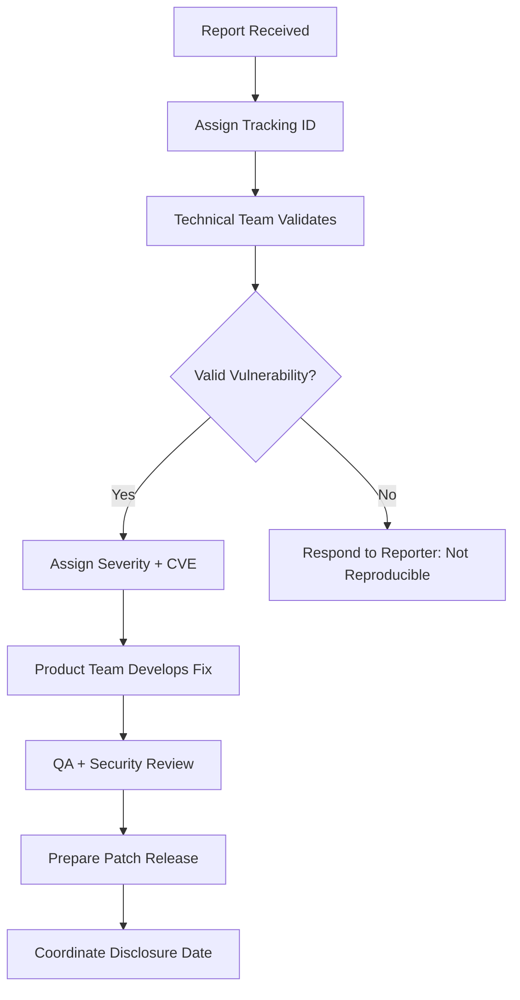

Vulnerability disclosure is the process by which security vulnerabilities are reported to affected vendors and disclosed to the public. A well-managed disclosure process protects users while giving vendors time to develop and deploy patches.

## Disclosure Models

| Model | Description | Pros | Cons |
|-------|-------------|------|------|
| **Responsible (Coordinated) Disclosure** | Reporter privately notifies vendor, vendor develops patch, both coordinate public disclosure | Users are protected; vendor has time to fix | Vendor may delay or ignore |
| **Full Disclosure** | Reporter publicly discloses vulnerability immediately (or with minimal notice) | Forces vendor action; users know the risk | Users are exposed before patch exists |
| **Private Disclosure** | Reporter informs vendor only; no public disclosure | No attacker information | Other vendors/users unaware of risk |
| **No Disclosure** | Reporter keeps vulnerability secret (sells to government, broker, or exploit market) | Financial gain for reporter | No user protection — vulnerability is weaponised |

## Coordinated Disclosure Process

The ISO 29147 standard defines the coordinated vulnerability disclosure process:

### Step 1: Discovery

A researcher (or vendor's internal team) discovers a vulnerability.

### Step 2: Report

Researcher reports the vulnerability to the vendor:

```
TO: security@example.com
SUBJECT: Vulnerability Report — RCE in ExampleApp v2.3

I have identified a critical security vulnerability in ExampleApp 
version 2.3 and earlier.

Vulnerability: Remote Code Execution
CVE: (pending)
Severity: Critical (CVSS 10.0)

Description:
The /admin/import endpoint does not validate file types before 
processing. An authenticated attacker can upload a PHP webshell 
and execute arbitrary commands on the server.

Reproduction:
[Detailed steps with PoC code]

Impact:
Full remote code execution as www-data user.

Disclosure Policy:
I follow responsible disclosure. I will disclose publicly 90 days 
from this report, or earlier if a patch is released.

Contact:
Researcher Name
researcher@email.com
Signal: +1-555-0123
```

### Step 3: Acknowledgment

Vendor acknowledges receipt within a defined timeframe (typically 24-72 hours).

### Step 4: Validation

Vendor validates the vulnerability, determines scope, and assigns severity. During this phase:



### Step 5: Remediation

Vendor develops, tests, and deploys the fix. Target timelines:

| Severity | Target Fix Time | Typical TAT |
|----------|-----------------|-------------|
| Critical | 7-14 days | 14-30 days |
| High | 30-45 days | 30-60 days |
| Medium | 60-90 days | 60-120 days |
| Low | 90-180 days | May never be fixed |

### Step 6: Disclosure

Coordinated public disclosure on an agreed date:

```
Public Disclosure Date: 2026-02-01

VENDOR STATEMENT:
ExampleApp version 2.4 patches a critical remote code execution 
vulnerability (CVE-2026-1234) in the /admin/import endpoint. 
We thank [Researcher Name] for the responsible disclosure.

RESEARCHER STATEMENT:
CVE-2026-1234 is a critical RCE in ExampleApp affecting versions 
2.3 and earlier. The vulnerability was fixed in version 2.4. 
Proof of concept has not been released to allow users time to patch.
```

### Step 7: Post-Disclosure

- Monitor for exploit attempts
- Notify users who haven't patched
- Update security advisories
- Conduct post-mortem on the finding

## CVE Assignment

CVE (Common Vulnerabilities and Exposures) is the standard identifier for publicly known vulnerabilities:

```bash
# Request a CVE from MITRE (if you are a researcher/CNE)
# Go to: https://cveform.mitre.org/
# Or use your CNA's request process

# CVE ID format:
# CVE-2026-1234  (published 2026, ID 1234)

# Check CVE details
curl -s "https://cve.circl.lu/cve/CVE-2026-1234" | jq '.'
```

### CVE Data Structure

```json
{
  "id": "CVE-2026-1234",
  "published": "2026-02-01T15:00:00Z",
  "lastModified": "2026-02-02T10:00:00Z",
  "vulnStatus": "Analyzed",
  "descriptions": [
    {
      "lang": "en",
      "value": "Remote Code Execution in ExampleApp v2.3 and earlier...",
      "type": "description"
    }
  ],
  "metrics": {
    "cvssMetricV31": [
      {
        "cvssData": {
          "version": "3.1",
          "vectorString": "CVSS:3.1/AV:N/AC:L/PR:N/UI:N/S:U/C:H/I:H/A:H",
          "attackVector": "NETWORK",
          "attackComplexity": "LOW",
          "privilegesRequired": "NONE",
          "userInteraction": "NONE",
          "scope": "UNCHANGED",
          "confidentialityImpact": "HIGH",
          "integrityImpact": "HIGH",
          "availabilityImpact": "HIGH",
          "baseScore": 9.8
        }
      }
    ]
  },
  "weaknesses": [
    {
      "source": "nvd@nist.gov",
      "type": "Primary",
      "description": [{"value": "CWE-434: Unrestricted Upload of File with Dangerous Type"}]
    }
  ],
  "references": [
    {"url": "https://example.com/security/advisory/CVE-2026-1234", "source": "vendor"},
    {"url": "https://github.com/example/exampleapp/releases/v2.4", "source": "vendor"}
  ]
}
```

## Disclosure Timeline Examples

### Good Timeline (Google Project Zero)

```
2026-01-16: Researcher reports vulnerability to vendor
2026-01-17: Vendor acknowledges and confirms
2026-01-25: Vendor assigns CVE, begins development of patch
2026-02-01: Vendor releases patch
2026-02-01: Coordinated public disclosure
→ Total: 16 days, users protected, vendor responsive
```

### Bad Timeline (Stalled Disclosure)

```
2026-01-16: Researcher reports vulnerability
2026-02-01: (16 days no response) Researcher follows up
2026-02-15: (30 days) Vendor acknowledges — "investigating"
2026-03-15: (60 days) Vendor: "still working on it, no ETA"
2026-04-15: (90 days) Researcher discloses publicly per policy
2026-04-16: Vendor releases emergency patch under pressure
→ Total: 90 days, users exposed for 3 months, patch was rushed
```

### Google Project Zero's 90-Day Policy

Google's Project Zero (the industry's most influential vulnerability research team) follows a strict 90-day disclosure deadline:

```
Day 0: Report to vendor
Day 90: Public disclosure (regardless of patch status)
Day 90+7: If patch still not available, exploit details may be released
```

This policy creates pressure on vendors to fix vulnerabilities within a reasonable timeframe while giving them a meaningful window to develop patches.

## Disclosure Policy Template

Organisations should publish a clear vulnerability disclosure policy:

```
SECURITY.VULNERABILITY DISCLOSURE POLICY

Last Updated: 2026-01-16

We welcome and encourage security researchers to report vulnerabilities 
discovered in our products and infrastructure. We follow coordinated 
disclosure to protect our users while ensuring vulnerabilities are 
addressed.

REPORTING:
- Email: security@example.com (PGP key available at example.com/pgp)
- Preferred: HackerOne (hackerone.com/example)

WHAT WE EXPECT FROM RESEARCHERS:
1. Report vulnerabilities privately — do not disclose publicly
2. Provide sufficient detail to reproduce the vulnerability
3. Make a good faith effort to avoid privacy violations and service disruption
4. Do not modify or delete production data
5. Allow us reasonable time to respond and fix (90 days recommended)

WHAT WE COMMIT TO:
1. Acknowledge receipt within 48 hours
2. Provide regular status updates (every 2 weeks minimum)
3. Assign a CVE for each confirmed vulnerability
4. Fix vulnerabilities within a timeframe appropriate to severity
5. Credit researchers in our security advisories (if desired)
6. Never pursue legal action against good-faith researchers
```

## Legal Protections for Researchers

Many countries have laws protecting good-faith security research:

| Country/Region | Law | Protection |
|----------------|-----|------------|
| **United States** | CFAA (Department of Justice policy 2022) | Good-faith security research is not a CFAA violation |
| **EU** | Directive 2013/40/EU | Security research without malicious intent is not a criminal offence |
| **UK** | Computer Misuse Act (CMA reform proposals) | Clarification of defences for security research |
| **Germany** | §202c StGB (with legal interpretation) | Research with responsible disclosure is not punishable |
| **Singapore** | Computer Misuse Act (Amendment 2017) | Authorised testing and research exemption |

<Aside variant="caution">
Even with legal protections, researchers can face legal risk. Always work within a published VDP/bug bounty program, use a dedicated testing account, and never test outside the defined scope. When in doubt, get written authorisation before testing.
</Aside>

## Key Takeaways

- Coordinated (responsible) disclosure is the industry standard: private report → vendor remediation → coordinated public disclosure
- The disclosure process follows seven steps: Discovery → Report → Acknowledgment → Validation → Remediation → Disclosure → Post-Disclosure
- CVE assignment provides a standardised identifier for each vulnerability — request through a CNA or MITRE directly
- Disclosure timelines balance user protection with vendor remediation time — 90 days is the industry standard
- Google Project Zero's 90-day policy creates accountability while giving vendors a reasonable window
- Organisations should publish a clear disclosure policy that protects good-faith researchers and defines the process
