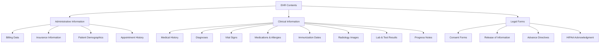

An electronic health record contains a wealth of information that spans the entire patient care journey. Understanding the contents of an EHR — what data belongs where, who enters it, and who owns it — is fundamental to working effectively with these systems.

## Classification of EHR Contents

The contents of an electronic health record may be classified into three main categories:



### 1. Administrative Information

This category includes data related to billing, operations, and patient identification:

```yaml
Patient Demographics:
  └─ Full name, date of birth, gender
  └─ Address, phone number, email
  └─ Social Security Number (if applicable)
  └─ Race, ethnicity, language preference
  └─ Marital status, occupation, education

Insurance & Billing:
  └─ Primary and secondary insurance carriers
  └─ Policy and group numbers
  └─ Claims submission address
  └─ Copayment and deductible information
  └─ Guarantor information
  └─ Billing codes (CPT, ICD-10, HCPCS)
  └─ Payment history and account balance

Appointment Management:
  └─ Scheduled appointments
  └─ Appointment history
  └─ No-show and cancellation records
  └─ Referral tracking
```

### 2. Clinical Information

The clinical section forms the core of the patient record:

| Clinical Element | Description | Clinical Significance |
|-----------------|-------------|---------------------|
| **Medical History** | Past and present medical conditions, surgeries, hospitalizations | Foundation for all clinical decision-making |
| **Family History** | Health conditions of immediate family members | Identifies genetic risk factors |
| **Social History** | Smoking, alcohol, occupation, lifestyle factors | Context for preventive care and risk assessment |
| **Diagnoses** | Active and resolved diagnoses with dates | Tracks patient health status over time |
| **Vital Signs** | Blood pressure, heart rate, temperature, respiratory rate, oxygen saturation | Baseline and trend monitoring |
| **Medications** | Current and past prescriptions, dosage, frequency | Medication reconciliation, interaction checking |
| **Allergies** | Drug, food, and environmental allergies with reaction type | Prevents adverse events |
| **Immunizations** | Vaccination dates and types | Preventive care tracking |
| **Laboratory Results** | Blood tests, urinalysis, microbiology, pathology | Diagnostic confirmation and monitoring |
| **Radiology/Imaging** | X-rays, MRIs, CT scans, ultrasounds with reports | Diagnostic imaging |
| **Progress Notes** | SOAP notes, consultation notes, discharge summaries | Ongoing clinical documentation |

### 3. Legal Forms

Legal documentation protects both the patient and the healthcare provider:

- **Consent for Treatment** — Authorizes the provider to deliver care
- **HIPAA Privacy Notice Acknowledgement** — Documents patient receipt of privacy practices
- **Release of Information (ROI)** — Authorization to disclose health information
- **Advance Directives** — Living will, healthcare power of attorney
- **Do Not Resuscitate (DNR)** Orders
- **Informed Consent** for procedures and surgeries
- **Assignment of Benefits** — Authorizes insurance payments to the provider

## Who Documents in the EHR?

Healthcare workers across multiple roles contribute data to the patient's health record. Each provider contributes data in different ways based on their role and responsibilities:

| Role | Documentation Responsibilities |
|------|------------------------------|
| **Physician / Provider** | Diagnoses, treatment plans, prescription orders, progress notes, consultation reports |
| **Nurse** | Vital signs, nursing assessments, medication administration, patient education |
| **Medical Assistant (Clinical)** | Patient history, chief complaint, vitals, preparation for examination |
| **Medical Assistant (Administrative)** | Patient demographics, appointment scheduling, insurance verification, billing codes |
| **Specialist** | Specialty-specific assessments, procedure notes, treatment recommendations |
| **Surgeon** | Pre-operative assessments, operative reports, post-operative orders |
| **Radiologist** | Imaging reports, interpretations, recommendations |
| **Laboratory Technician** | Lab results, quality control data |
| **Pharmacist** | Medication reconciliation, drug interaction reviews |
| **Social Worker / Case Manager** | Psychosocial assessments, care coordination notes, discharge planning |
| **Medical Biller / Coder** | CPT/ICD-10 coding, claim submission, payment posting |

<Aside variant="tip" title="Comprehensive Documentation">
  All aspects of a patient encounter must be recorded in the EHR including patient health history, observations, treatment plans, and other administrative and legal data. If it was not documented, it was not done.
</Aside>

## EHR Ownership and Patient Rights

Medical records are owned by the facility or individuals who created them. However, patients have significant legal rights regarding their health information:

### Ownership Principles

```yaml
Who Owns the Record:
  └─ The healthcare facility or institution that created the record
  └─ Example: Data created in a hospital belongs to that hospital
  └─ Private practice records belong to the practice/provider
  └─ The original physical or electronic record remains with the creator

Who Has Rights to the Information:
  └─ Patients have the legal right to access their medical information
  └─ This access is granted through a medical release form
  └─ Patients can request copies of their records
  └─ The facility keeps the original; patients receive copies
```

### Patient Rights Under HIPAA

The **Health Insurance Portability and Accountability Act (HIPAA)** grants patients specific rights regarding their health information:

| Patient Right | Description |
|--------------|-------------|
| **Right to Access** | Obtain a copy of their health records within 30 days of request |
| **Right to Amend** | Request corrections to inaccurate or incomplete information |
| **Right to Request Restrictions** | Limit how their information is used or disclosed |
| **Right to Accounting of Disclosures** | Know who has requested or received their health information |
| **Right to Request Confidential Communications** | Receive communications through alternative means |
| **Right to File a Complaint** | File a complaint with the provider or HHS if rights are violated |

### Doctrine of Professional Discretion

The **doctrine of professional discretion** allows the provider to use their best judgment in sharing developmental notes or clinical observations with patients who have unstable conditions — such as those being treated for mental or emotional disturbances. This doctrine is meant to protect patients from harm when health information is shared.

**Example**: A provider may choose not to share a detailed psychological evaluation directly with a suicidal patient who may become upset upon learning their condition. Instead, the provider may share the information with a family member or guardian who can support the patient.

## Key Takeaways

- EHR contents are classified into three categories: Administrative (billing, demographics), Clinical (medical history, diagnoses, test results), and Legal (consent forms, HIPAA documents)
- Multiple healthcare professionals contribute to the EHR — each role documents different aspects of the patient encounter
- Medical records are owned by the facility that created them, but patients have extensive legal rights to access and control their health information
- HIPAA guarantees patients the right to access, amend, and request restrictions on their health information
- The doctrine of professional discretion protects patients from potential harm when sensitive information is shared
- All aspects of a patient encounter must be documented — incomplete documentation can lead to legal liability and compromised care
