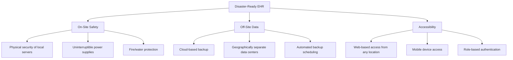

One of the most powerful advantages of electronic health records is their resilience in the face of disasters. While paper records can be destroyed by fire, flood, or other catastrophes, EHRs are designed with redundancy and accessibility that make them far more durable and useful during emergencies.

## EHR Resilience in Disasters

Electronic Health Records are set up by a secure web-based system that can be retrieved even when computers are destroyed by disasters such as flood or fire. EHRs are more durable than paper records because they provide data available on the internet.

### Three Essential Health IT Features for Disasters

For EHRs to effectively support disaster response, they must have these three health IT features:



### 1. On-Site Safety

Local systems must be protected against physical threats:

```yaml
On-Site Protection Measures:
  └─ Physical Security:
       Locked server rooms with access control
       Security cameras and monitoring
       Biometric or keycard access
  └− Environmental Controls:
       Temperature and humidity monitoring
       Fire suppression systems (clean agent, not water)
       Water leak detection
  └− Power Protection:
       Uninterruptible Power Supply (UPS) for graceful shutdown
       Backup generators for extended outages
       Surge protection for all equipment
  └− Hardware Redundancy:
       RAID storage for disk failure protection
       Redundant power supplies
       Hot-swappable components
```

### 2. Off-Site Data

Data must be backed up in a geographically separate location:

| Backup Type | Description | Recovery Time | Best For |
|-------------|-------------|---------------|----------|
| **Cloud Backup** | Automated replication to cloud data center | Hours | Most practices |
| **Off-Site Tape** | Physical media stored at separate location | Days | Large health systems |
| **Real-Time Replication** | Synchronous data mirroring to second site | Minutes | Hospitals, critical care |
| **Hybrid Approach** | Local backup + cloud replication | Variable | Enterprise health systems |

```yaml
Backup Best Practices:
  └─ Automated daily backups (at minimum)
  └− Weekly full backup + daily incremental
  └− Encrypted backup data (in transit and at rest)
  └─ Regular backup testing and restoration verification
  └− Backup retention: minimum 30 days (longer for legal requirements)
  └─ Geographically diverse backup locations (100+ miles apart)
  └− Documented disaster recovery plan with annual testing
```

### 3. Accessibility

During emergencies, authorized users must be able to access health information from any location:

```yaml
Emergency Access Features:
  └─ Web-Based Access:
       Accessible from any internet-connected device
       No special software required (browser-based)
       Mobile-optimized interfaces
  
  └− Authentication in Disasters:
       Role-based access control (RBAC)
       Emergency access protocols (break-glass accounts)
       Multi-factor authentication (with backup methods)
       Automatic audit logging of emergency access
  
  └─ Field Triage Support:
       Immediate access to victim's health record
       Critical information (allergies, medications, conditions)
       Emergency contact information
       Advance directives and DNR orders
  
  └− Communication Integration:
       Health Information Exchange (HIE) connectivity
       Interoperability with emergency response systems
       Public health reporting integration
```

## EHR in Emergency Response Scenarios

### Natural Disasters

During natural disasters, EHRs enable healthcare continuity:

```yaml
Hurricane/Flood Scenario:
  └─ Physical facility may be inaccessible or destroyed
  └─ Cloud-based EHR accessible from evacuation site
  └─ Patient records available at field hospitals
  └− Prescription history available for refill authorizations
  └− Chronic condition information available for disaster shelters

Earthquake Scenario:
  └─ Local infrastructure may be damaged
  └─ Mobile health units with tablet access to records
  └− Patient identification via demographic data (even without ID)
  └− Medication and allergy information critical for treatment
  
Wildfire Scenario:
  └− Rapid evacuation may leave paper records behind
  └─ Cloud-based EHR not affected by physical destruction
  └− Pharmacy access to e-prescriptions for displaced patients
  └− Continuity of care at alternate facilities
```

### Public Health Emergencies

During pandemics and disease outbreaks, EHRs play a critical role:

| Function | How EHR Supports Response | Example |
|----------|-------------------------|---------|
| **Surveillance** | Real-time reporting of symptoms and diagnoses | COVID-19 case tracking |
| **Reporting** | Automated submission to public health agencies | Immunization registry updates |
| **Population Identification** | Query-based identification of at-risk patients | Identify patients eligible for vaccination |
| **Communication** | Mass notification through patient portals | Vaccine availability announcements |
| **Telehealth** | Integrated virtual care capabilities | Remote COVID-19 consultations |

## Improved Documentation Quality

Beyond disaster response, electronic documentation provides significant improvements over paper-based systems:

### Elimination of Illegible Handwriting

One of the most basic but impactful improvements:

```yaml
Problems with Handwritten Notes:
  └─ 30-50% of handwritten notes contain illegible sections
  └─ 10-15% of medication errors involve look-alike/sound-alike drugs
  └− Misread abbreviations cause thousands of adverse events annually
  └− Illegible orders must be clarified — delaying care

EHR Solutions:
  └─ Typed or structured entry — always legible
  └− Drop-down selections eliminate guesswork
  └─ Alert systems catch potential errors before they reach patients
  └− Standardized terminology reduces ambiguity
```

### Structured Data and Searchability

The structured data in EHRs promotes quick search through various categories of patient health information:

| Paper Documentation | Electronic Documentation |
|---------------------|------------------------|
| Records stored in chronological order only | Searchable by any data field |
| Finding specific information requires flipping through pages | Instant search by diagnosis, medication, lab result |
| Manual chart pulls for research/reporting | Automated queries for population health |
| Data extraction requires manual abstraction | Structured data export for analytics |
| One user at a time can access a paper chart | Multiple simultaneous users |

### Electronic Linkage of Records

The EHR tool can link records electronically which readily allows providers to compare graphs or test results:

```yaml
Electronic Linkage Benefits:
  └─ Graph vital signs over time: Visual trend identification
  └− Compare lab results: Side-by-side historical comparison
  └− Link medications to diagnoses: Context for prescribing decisions
  └− Connect imaging to reports: View images and interpretations together
  └− Track immunizations: Complete history across multiple providers
  └− Integrated problem list: Active and resolved conditions at a glance
```

### Automated Coding Capabilities

When medical documentation is automated, coding capabilities for insurance claims are readily available:

| Coding Benefit | Description | Impact |
|---------------|-------------|--------|
| **Code Suggestions** | EHR suggests codes based on documentation | Reduces coding errors |
| **Medical Necessity Checking** | Ensures codes match documented services | Reduces claim denials |
| **Real-Time Edits** | Alerts for code conflicts or missing information | Cleaner claims |
| **Specificity Prompts** | Guides toward appropriate ICD-10 specificity | Proper reimbursement |
| **Modifier Alerts** | Suggests modifiers for special circumstances | Accurate billing |

### Ensuring a Complete Patient Record

Electronic documentation helps ensure a complete patient record as long as data entry is complete, clear, and accurate:

```yaml
Completeness Features:
  └─ Required Fields: Enforce documentation of essential information
  └− Missing Data Alerts: Prompt users to complete critical sections
  └− Structured Templates: Guide complete data collection
  └− Monitored Quality: Regular audits of documentation completeness
  └− Automated Data Population: Pull demographics, medications, problem lists

Data Entry Best Practices:
  └─ Enter data in real-time during the patient encounter
  └− Use structured templates rather than free text
  └− Verify information with the patient
  └− Correct errors through proper amendment procedures
  └− Avoid copy/paste of outdated information
  └− Complete all required fields before signing
```

## Documentation Standards for Quality

| Standard | Requirement | Purpose |
|----------|-------------|---------|
| **Timeliness** | Documentation completed within 24-48 hours | Ensures accuracy of recall |
| **Legibility** | Clear, readable text (typed is preferred) | Prevents miscommunication |
| **Authenticity** | Signed and dated by the author | Establishes accountability |
| **Accuracy** | Correct patient, correct information | Patient safety |
| **Completeness** | All relevant information documented | Legal and clinical requirements |
| **Confidentiality** | Protected from unauthorized access | Patient privacy |
| **Integrity** | Cannot be altered without audit trail | Legal admissibility |

## Key Takeaways

- EHRs are more durable than paper records in disasters — data is stored securely off-site and accessible via the internet when local systems are destroyed
- Three essential health IT features for disaster response: on-site safety (physical protection), off-site data (geographic redundancy), and accessibility (anywhere access with emergency protocols)
- During natural disasters, cloud-based EHRs enable continuity of care at evacuation sites, field hospitals, and mobile health units
- During public health emergencies, EHRs support disease surveillance, automated reporting, population identification, and mass communication
- Electronic documentation eliminates illegible handwriting — a root cause of medication errors (30-50% of handwritten notes have illegible sections)
- Structured data enables instant search, trend analysis, graph comparisons, and automated queries that are impossible with paper records
- Automated coding capabilities improve billing accuracy and completeness at the point of care
- Electronic documentation ensures a complete patient record through required fields, missing data alerts, and structured templates
- Documentation quality is governed by standards: timeliness, legibility, authenticity, accuracy, completeness, confidentiality, and integrity
- The principle remains: "If it was not documented, it never happened" — but with EHRs, documenting thoroughly is easier and more reliable than ever before
