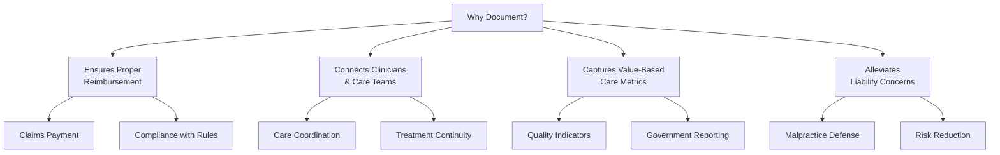

In healthcare, a fundamental principle guides all documentation: **"If it was not documented, then it never happened."** This principle has legal, financial, and clinical implications that make proper documentation one of the most critical responsibilities in healthcare.

## Why Documentation Matters

Proper documentation of medical records is vital for four primary reasons:



### 1. Ensuring Proper Reimbursement

A well-documented medical record is essential for the financial health of any practice:

| Documentation Need | Impact on Reimbursement |
|-------------------|------------------------|
| **Accurate CPT Coding** | Determines the level of service billed — under-documentation leads to lost revenue |
| **Medical Necessity** | Services must be justified by documented clinical findings |
| **ICD-10 Specificity** | Diagnosis codes must match the level of detail in documentation |
| **Modifier Justification** | Special circumstances require documented rationale |
| **CMS Guidelines** | Medicare and Medicaid have specific documentation requirements |
| **Audit Readiness** | Payers can request records to validate claims — incomplete records result in recoupment |

```yaml
Financial Impact of Poor Documentation:
  └─ Denied claims: 15-30% of claims may be denied for documentation issues
  └─ Downcoding: Payers may reduce reimbursement level if documentation doesn't support the code billed
  └─ Audit penalties: Up to $10,000 per false claim under the False Claims Act
  └─ Revenue cycle delays: Average 30-45 day delay per documentation-related denial
  └─ Compliance costs: Staff time spent correcting documentation errors
```

<Aside variant="tip" title="Documentation and Reimbursement">
  The level of Evaluation and Management (E/M) service billed must be supported by the documentation in the medical record. Medical necessity, determined by the patient's presenting problem and the provider's medical decision-making, must be clearly documented. Following proper documentation rules imposed by the federal government and other organizations ensures smooth claims payment processing.
</Aside>

### 2. Connecting Clinicians and Care Teams

Proper documentation serves as the primary communication tool across the healthcare team:

**Continuity of Care** — When a patient sees multiple providers, the medical record tells the complete story:

- A primary care physician documents a referral to a specialist
- The specialist reviews the history, performs an evaluation, and documents findings
- The specialist sends the consultation note back to the PCP
- All providers have a complete picture of the patient's care

**Care Coordination Benefits:**

| Stakeholder | How Documentation Enables Better Care |
|-------------|---------------------------------------|
| **Primary Care Provider** | Tracks referrals, lab results, and specialist recommendations |
| **Specialist** | Understands the full clinical context before seeing the patient |
| **Emergency Department** | Accesses critical history (allergies, medications, chronic conditions) |
| **Hospital** | Receives complete patient history on admission |
| **Pharmacist** | Reviews medication list for interactions and duplications |
| **Home Health** | Continues care plan after discharge |

```yaml
Real-World Impact:
  └─ 80% of serious medical errors involve miscommunication during care transitions
  └─ Complete documentation reduces hospital readmission rates by 15-25%
  └─ EHR-based care coordination saves an estimated 12 minutes per patient encounter
  └─ Improved documentation reduces duplicate testing by 20-30%
```

### 3. Capturing Value-Based Care Metrics

Healthcare has shifted from **volume-based** (how many patients were seen) to **value-based** (how well patients were cared for) reimbursement. Documentation directly impacts these quality measures:

| Quality Measure Category | Examples | Documentation Required |
|-------------------------|----------|----------------------|
| **Preventive Care** | Cancer screenings, immunizations, well-child visits | Screening date, result, patient education |
| **Chronic Disease Management** | Diabetes HbA1c control, blood pressure management | Test results, medication adjustments, follow-up plan |
| **Patient Safety** | Medication reconciliation, fall risk assessment | Completed assessments, interventions |
| **Care Coordination** | Transition of care, referral follow-up | Discharge summary, follow-up appointment |
| **Population Health** | Flu vaccination rates, childhood immunization schedules | Immunization records, patient declinations |

<Aside variant="info" title="Value-Based Care">
  When data is properly documented, it captures Hospital Quality Indicators and measures that the government requires from hospitals and healthcare providers. These metrics directly affect reimbursement through programs like the Hospital Value-Based Purchasing (VBP) Program and Merit-Based Incentive Payment System (MIPS).
</Aside>

### 4. Alleviating Liability Concerns

Accurate documentation is one of the best defenses against malpractice claims:

| Liability Risk | How Documentation Protects |
|---------------|---------------------------|
| **Malpractice Claims** | Serves as proof of treatment and care provided |
| **Standard of Care** | Documents that care met accepted medical standards |
| **Informed Consent** | Records what risks and alternatives were discussed |
| **Patient Non-Compliance** | Documents when patients refused recommended treatment |
| **Missed Diagnosis** | Shows what assessments were performed and findings |
| **Prescription Errors** | Verifies what was ordered and when |
| **Communication Failures** | Documents handoffs and care coordination |

```yaml
Documentation as Legal Defense:
  └─ A well-documented record is the provider's best witness
  └─ Contemporaneous notes (written at the time of care) carry more weight
  └─ Corrections must be made as addendums — never alter original entries
  └─ Electronic audit trails provide additional evidence of care delivery
  └─ Incomplete documentation is a plaintiff attorney's best tool
```

**The Risk of Incomplete Documentation:**

Delayed or missed diagnosis claims — the most common malpractice allegation — often hinge on what was or was not documented. If a patient reports a symptom and it is not documented, the assumption is that it was not asked about or not addressed. If a follow-up is recommended but not documented, it is assumed the recommendation was never made.

## Documentation Standards and Requirements

### Legal Status of Medical Records

Medical records are **legal documents** subject to specific standards:

```yaml
Legal Requirements:
  └─ Must be accurate, complete, and timely
  └─ Must be legible (or typed/electronic)
  └─ Must be dated and authenticated (signed) by the author
  └─ Must not be altered — corrections are made via addendum
  └─ Must be retained for legally mandated periods
  └─ Must be kept confidential and secure
  └─ Must be available to the patient upon request

Record Retention Requirements:
  └─ Adult patients: 7-10 years after last encounter (varies by state)
  └─ Minors: Age of majority + statute of limitations (often 21-25 years)
  └─ Medicare providers: 5 years (10 years for some programs)
  └─ Immunization records: Indefinitely
  └─ Always check state-specific requirements
```

### Common Documentation Errors

| Error | Example | Consequence |
|-------|---------|-------------|
| **Incomplete Information** | Missing chief complaint or history | Reimbursement denial, liability gap |
| **Late Entries** | Charting hours/days after encounter | Reduced credibility, audit flags |
| **Over-Documentation** | "Charting by exception" taken too far | Wasted time, potential fraud concerns |
| **Copy/Paste (Cloning)** | Identical notes for different visits | Fraud allegations, audit risk |
| **Using Abbreviations** | Non-standard or prohibited abbreviations | Miscommunication, errors |
| **Missing Signatures** | Notes not authenticated | Incomplete record, legal risk |
| **Subjective Opinions** | "Difficult patient," "non-compliant" | Potential bias, legal exposure |

## Documentation Best Practices

```yaml
Do's of Medical Documentation:
  └─ Document immediately or as soon as possible after the encounter
  └─ Be objective and factual — describe what you observe
  └─ Include the patient's own words (in quotes) for subjective complaints
  └─ Document all informed consent discussions
  └─ Record patient instructions and education provided
  └─ Document phone calls and electronic communications
  └─ Include follow-up plans and referrals
  └─ If it was done, document it. If not, don't.

Don'ts of Medical Documentation:
  └─ Never alter or backdate entries
  └─ Never use correction fluid or delete electronic entries
  └─ Never document for someone else (use your own credentials)
  └─ Never include discriminatory or derogatory comments
  └─ Never assume something will be remembered — write it down
  └─ Never document before the service is provided (pre-dating)
```

## Key Takeaways

- The principle "if it was not documented, it was not done" drives all healthcare documentation — it is a legal and clinical mandate
- Proper documentation ensures timely reimbursement — incomplete records lead to denied claims, downcoding, and audit penalties
- Documentation connects the entire care team — 80% of serious medical errors involve miscommunication during care transitions
- Value-based care metrics depend on accurate documentation to capture quality measures that determine reimbursement
- Complete documentation is the best defense against malpractice claims — it serves as objective proof of care delivery
- Medical records are legal documents with specific requirements for accuracy, timeliness, authentication, and retention
- Common documentation errors (copy/paste, late entries, incomplete information) carry significant financial and legal risk
- Following documentation best practices protects the provider, the patient, and the healthcare organization
