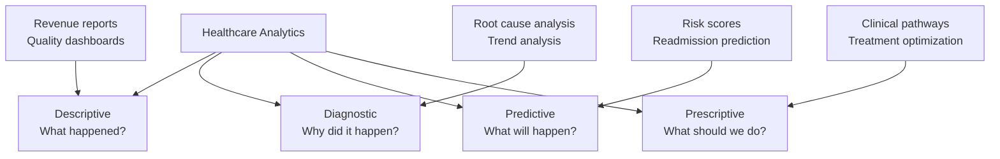

EHR systems generate enormous amounts of data. The ability to analyze this data — turning raw information into actionable insights — separates organizations that merely use an EHR from those that leverage it for strategic advantage.

## Types of Healthcare Analytics



### Descriptive Analytics (Most Common)

```yaml
What happened?
  └− Operational Reports:
       Patient volume by provider, day, time
       Appointment no-show rates
       Cycle times (check-in to check-out)
       Provider productivity (RVUs, encounters)
  
  └− Financial Reports:
       Revenue by provider, payer, service
       Accounts receivable aging
       Denial rates by payer
       Charge lag analysis
  
  └− Clinical Reports:
       Quality measure performance
       Chronic disease control rates
       Preventive screening rates
       Medication adherence
```

### Diagnostic Analytics

```yaml
Why did it happen?
  └− Root Cause Analysis:
       Why did denial rate increase? (specific payer, code, provider?)
       Why are no-show rates higher on Mondays?
       Why is HbA1c control declining in the 18-30 age group?
  
  └− Trend Analysis:
       Monthly quality measure trends
       Seasonal variation in visit types
       Provider-level performance variation
       Patient population changes

  └− Comparative Analysis:
       Provider-to-provider comparison
       Practice-to-benchmark comparison
       Pre/post intervention analysis
```

### Predictive Analytics

```yaml
What will happen?
  └− Risk Prediction Models:
       Hospital readmission risk (30-day)
       Emergency department utilization risk
       Deterioration risk for chronic conditions
       Sepsis early warning scores
  
  └− Operational Predictions:
       Visit volume forecasting (staffing)
       Supply and inventory needs
       Appointment demand by season
       Revenue projections
  
  └− Population Predictions:
       Patients at risk for developing diabetes
       Patients at risk for medication non-adherence
       Patients likely to miss appointments
  
  └− Example — Readmission Risk Score:
       Factors: Age, comorbidities, prior admissions, medications, SDOH
       Score: 0-100
       > 70: High risk → Care coordinator assigned
       40-70: Moderate risk → Follow-up call scheduled
       < 40: Low risk → Standard discharge instructions
```

### Prescriptive Analytics

```yaml
What should we do?
  └− Clinical Decision Support (advanced):
       Recommended treatment pathway based on patient profile
       Optimal medication selection based on efficacy, cost, adherence
       Best next action for care gap closure
  
  └− Operational Optimization:
       Optimal staffing levels based on predicted volume
       Best appointment scheduling pattern to minimize wait times
       Most effective patient outreach channel (portal, phone, text, mail)
  
  └− Example — Diabetes Treatment Prescription:
       Patient: 62-year-old, HbA1c 8.5%, BMI 32, moderate adherence
       EHR analysis: Metformin + SGLT2 inhibitor recommended
       Rationale: HbA1c reduction of 1.5-2.0%, weight loss, cardiovascular benefit
       Alternative: GLP-1 receptor agonist if injection acceptable
       Adherence strategy: Once-daily dosing, mail-order pharmacy
```

## EHR Reporting Tools

### Operational Dashboards

Real-time views of practice operations:

| Dashboard | Metrics | Audience | Refresh |
|-----------|---------|----------|---------|
| **Patient Flow** | Check-ins, wait times, room status, cycle times | Practice manager | Real-time |
| **Provider Productivity** | Encounters, RVUs, charges, wRVUs per hour | Provider, leadership | Daily |
| **Appointment Management** | Fill rate, no-shows, cancellations, wait list | Scheduling team | Real-time |
| **Revenue Dashboard** | Daily charges, payments, A/R, denial rate | Billing manager | Daily |
| **Clinical Quality** | Quality measure performance, care gaps | Quality director | Weekly |

### Built-In vs. External Analytics

| Aspect | Built-In EHR Reports | External BI Tools |
|--------|---------------------|-------------------|
| **Data Source** | Single EHR only | Multi-source (EHR, claims, billing) |
| **Report Types** | Standard operational/clinical reports | Custom, complex analytics |
| **Timeliness** | Real-time (within EHR) | Near-real-time (ETL pipeline) |
| **User Skill** | No technical skill needed | Requires data analyst |
| **Cost** | Included in EHR license | Additional software + staff cost |
| **Examples** | Crystal Reports, SSRS | Tableau, Power BI, Qlik |
| **Best For** | Daily operations, standard reports | Strategic analytics, predictive models |

### Building Effective Reports

```yaml
Report Design Principles:
  1. Know your audience:
     └− Provider: Patient panel gaps, quality scores (at a glance)
     └− Practice Manager: Operational efficiency, staff productivity
     └− CFO: Revenue, A/R, cost metrics
     └− Quality Director: Measure performance, benchmark comparisons
  
  2. Choose the right format:
     └− Dashboard: At-a-glance KPIs with trend lines
     └− Detail report: Row-level data for investigation
     └− Summary report: Aggregated metrics for management
     └− Exception report: Only what needs attention
  
  3. Follow data visualization best practices:
     └− Most important metric in top-left
     └− Color coding: Green (good), Yellow (warning), Red (attention)
     └− Trend arrows: Up/down indicators for direction
     └− Limit to 5-7 KPIs per dashboard
     └− Provide drill-down capability
```

## Key Analytics Use Cases

### 1. Provider Performance Analytics

```yaml
Provider Scorecard:
  Productivity:
    └− Encounters per day: 18 (target: 20-25) ✗
    └− wRVUs per encounter: 2.1 (target: > 1.8) ✓
    └− Hours per day: 9.5 (target: 8-9) ✗ — spending too much time
  
  Quality:
    └− Diabetes HbA1c control: 72% (target: > 70%) ✓
    └− Mammography screening: 65% (target: > 75%) ✗
    └− Hypertension control: 78% (target: > 75%) ✓
  
  Patient Satisfaction:
    └− Overall CG-CAHPS: 4.2/5 (target: > 4.0) ✓
    └− Provider communication: 4.5/5 (target: > 4.3) ✓
    └− Access to care: 3.8/5 (target: > 4.0) ✗
  
  Financial:
    └− Charges per encounter: $185 (target: $175-$200) ✓
    └− Denial rate: 4.5% (target: < 5%) ✓
    └− Patient collection rate: 75% (target: > 80%) ✗
```

### 2. Clinical Program Analytics

```yaml
Diabetes Management Program Analysis:
  └− Program Overview:
       Patients enrolled: 1,245
       Average HbA1c: 7.8% (baseline: 8.5% at enrollment)
       HbA1c < 7%: 35% of patients
       HbA1c > 9%: 18% of patients (needs attention)
  
  └− Intervention Effectiveness:
       Patients with nutrition counseling: Avg HbA1c reduction 1.2%
       Patients on CGM: Avg HbA1c reduction 0.8%
       Patients with care coordinator: Lower readmission rate by 40%
  
  └− Cost Impact:
       Program cost per patient: $1,200/year
       Reduced ED visits: 0.8/patient/year → 0.3/patient/year
       Reduced admissions: 0.3/patient/year → 0.1/patient/year
       Net savings: $1,800/patient/year
```

### 3. Population Health Analytics

Refer to the Population Health Tools page for detailed population health analytics information.

## Report Governance

```yaml
Data Quality Standards:
  └− Accuracy: Data entered correctly at source
  └− Completeness: All required fields populated
  └− Consistency: Same data definition across reports
  └− Timeliness: Data available when needed
  └− Validity: Data within expected ranges

Report Management:
  └− Report catalog: Central inventory of all reports
  └− Report owner: Identified owner for each report
  └− Version control: Track changes to report definitions
  └− Distribution schedule: When reports are run and sent
  └− Access control: Who can see which reports (data sensitivity)
  └− Retention policy: How long report history is kept
```

## Key Takeaways

- Healthcare analytics spans four levels: Descriptive (what happened), Diagnostic (why), Predictive (what will happen), and Prescriptive (what to do)
- Descriptive analytics are the most common — operational reports (patient volume, productivity), financial reports (revenue, A/R), and clinical reports (quality measures, chronic disease control)
- Predictive analytics use EHR data to forecast outcomes like readmission risk, deterioration risk, and patient no-shows — enabling proactive intervention
- Prescriptive analytics recommend optimal actions based on patient data — treatment pathways, medication selection, and adherence strategies
- EHR reporting tools range from built-in operational dashboards (real-time, easy to use) to external BI tools (custom, complex, requiring analyst support)
- Report design principles: know your audience, choose the right format, use visualization best practices, focus on actionable metrics
- Provider performance analytics combine productivity, quality, satisfaction, and financial metrics into a comprehensive scorecard
- Clinical program analytics measure intervention effectiveness, cost impact, and outcomes — essential for value-based care
- Data quality (accuracy, completeness, consistency, timeliness) is the foundation of meaningful analytics
- Report governance ensures reports are accurate, maintained, controlled, and accessible to the right people
- The most sophisticated analytics is worthless without action — insights must be connected to workflows and decision-making processes
