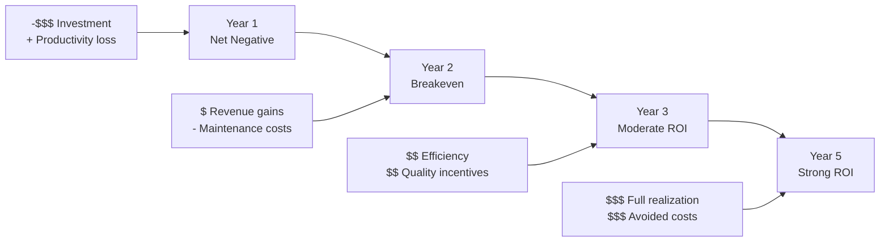

Implementing an EHR system requires significant financial investment. Understanding the full costs, potential benefits, and realistic timeline for return on investment is essential for making informed decisions and building a business case.

## The Cost-Benefit Equation

```yaml
EHR Financial Equation:
  Net Value = (Quantified Benefits + Intangible Benefits) - (Direct Costs + Indirect Costs)

  └− When Benefits > Costs: Positive ROI — EHR is a sound investment
  └− When Costs > Benefits: Negative ROI — revisit implementation strategy
  └− Timeline: Most organizations achieve positive ROI within 3-5 years
```

## Cost Categories

### Direct Costs

| Cost Category | Typical Range | Description |
|---------------|---------------|-------------|
| **Software Licensing** | $5,000-$30,000/provider/year | Subscription or licensing fees |
| **Implementation Services** | $10,000-$40,000/provider | Installation, configuration, project management |
| **Hardware** | $3,000-$10,000/provider | Workstations, tablets, printers, servers (on-premise) |
| **Network Infrastructure** | $5,000-$50,000 (total) | Bandwidth upgrades, wireless infrastructure |
| **Data Migration** | $2,000-$10,000 (total) | Data conversion, cleansing, validation |
| **Training** | $2,000-$5,000/provider | Initial training, super-user program |
| **Interface Development** | $2,000-$10,000 per interface | Lab, radiology, pharmacy, billing connections |
| **Ongoing Maintenance** | 15-20% of initial cost/year | Support, updates, hosting (on-premise) |
| **Total First Year** | **$20,000-$70,000/provider** | Including all direct costs |

<Aside variant="info" title="Cloud-Based EHR Cost Advantage">
  Cloud-based (SaaS) EHRs typically have lower upfront costs but similar long-term costs:
  - Lower initial investment: $5,000-$15,000/provider upfront (vs. $20,000-$70,000)
  - Higher ongoing costs: 15-25% of annual revenue (vs. 10-15% for owned systems)
  - Total cost over 5 years is often comparable
  - Key difference: Cash flow — cloud spreads cost over time
</Aside>

### Indirect Costs

```yaml
Productivity Loss During Transition (3-6 months):
  └− Reduced patient volume: 20-40% decrease during first 1-3 months
  └− Extended visit times: 1-2 minutes longer per visit
  └− After-hours documentation: 1-2 hours/night additional
  └− Estimated cost: $10,000-$50,000 per provider

Opportunity Costs:
  └− Staff time diverted to training: 40-80 hours per person
  └− IT staff time diverted from other projects
  └− Leadership focus on implementation vs. strategic initiatives
  └− Delayed revenue from new services (due to implementation focus)

Risk Costs:
  └− Implementation failure risk (5-10% of implementations fail)
  └− Vendor lock-in risk (difficult/expensive to switch)
  └− Obsolescence risk (technology may become outdated)
  └− Security breach risk (EHRs are targets for cyberattacks)
```

## Quantifiable Benefits

### Revenue Enhancement

| Benefit Source | Typical Impact | Annual Value per Provider |
|----------------|---------------|--------------------------|
| **Improved Coding Accuracy** | 2-5% increase in E/M code levels | $3,000-$10,000 |
| **Reduced Denials** | Denial rate from 8% to 4% | $2,000-$5,000 |
| **Faster Claims Submission** | Charge lag from 5 days to 1 day | $1,000-$3,000 |
| **Reduced Write-Offs** | Improved documentation supports billed services | $2,000-$5,000 |
| **Increased Patient Volume** | Efficiency gains → 1-2 more patients/day | $20,000-$50,000 |
| **Revenue Cycle Improvement** | Days in A/R from 45 to 30 | $1,000-$2,000 |
| **Total Revenue Benefit** | | **$29,000-$75,000/provider/year** |

### Cost Savings

```yaml
Direct Cost Reductions:
  └− Transcription Costs:
       Before: $5,000-$15,000/provider/year
       After: $0-2,000 (voice recognition)
       Savings: $3,000-$15,000/provider/year
  
  └− Medical Records Storage:
       Before: $2,000-$5,000/month (chart storage)
       After: $200-$500/month (digital storage)
       Savings: $18,000-$54,000/year (practice-level)
  
  └− Paper and Supply Costs:
       Before: $3-$5 per encounter
       After: $0.50-$1 per encounter
       Savings: $10,000-$30,000/provider/year
  
  └− Chart Pulling and Filing:
       Before: 1-2 FTE for records management
       After: 0.25-0.5 FTE
       Savings: $20,000-$40,000/year (practice-level)
```

### Quality-Based Benefits

```yaml
Avoided Cost Savings (Difficult to Quantify but Real):
  └− Medication Error Reduction:
       Each preventable adverse drug event costs: $5,000-$10,000
       EHR prevents: 5-10 ADEs per 100,000 encounters
       Savings: $250-$1,000 per 100,000 encounters
  
  └− Reduced Malpractice Claims:
       EHR reduces malpractice risk through complete documentation
       Average malpractice claim: $300,000
       Risk reduction: 10-20% lower claim probability
  
  └− Quality Incentive Payments:
       MIPS bonus for exceptional performance: up to +9%
       Value-based care shared savings: varies
       Average quality incentive: $5,000-$15,000/provider/year
```

## ROI Timeline



### Phase 1: Investment (Year 1)

```yaml
Financial Position: Net Negative
  └− Costs: $50,000-$100,000+ total practice investment
  └− Productivity loss: 20-40% reduction in visits
  └− Benefits: Minimal (system just going live)
  └− Expected: Negative $50,000-$100,000 per provider
  
  Non-Financial Milestones:
    └− Go-live completed
    └− Staff trained and operational
    └− Interfaces operational
    └− Initial workflows stabilized
```

### Phase 2: Recovery (Year 2)

```yaml
Financial Position: Approaching Breakeven
  └− Costs: Annual maintenance ($8,000-$15,000/provider)
  └− Benefits: Revenue cycle improvements, efficiency gains
  └− Expected: Near breakeven to slightly positive
  
  Milestones:
    └− Productivity returns to pre-EHR levels
    └− Billing improvements realized (denials down, coding up)
    └− Basic quality reporting operational
    └− Staff proficient in workflows
```

### Phase 3: Realization (Year 3-5)

```yaml
Financial Position: Positive ROI
  └− Costs: Maintenance only (15-20% of initial/year)
  └− Benefits: Full efficiency gains, quality incentives, reduced errors
  └− Expected ROI: 15-30% annual return
  
  Milestones:
    └− Advanced features in use (CDS, population health)
    └− Quality incentive payments received
    └− Patient portal achieving engagement targets
    └− Interoperability connections active
```

### Phase 4: Optimization (Year 5+)

```yaml
Financial Position: Strong Positive ROI
  └− Costs: Declining as percentage of revenue
  └− Benefits: Comprehensive (efficiency, quality, revenue, safety)
  └− Expected ROI: 30-50%+ annual return
  
  Milestones:
    └− Predictive analytics in use
    └− Population health driving improved outcomes
    └− Telehealth generating new revenue
    └− Full interoperability with HIE
```

## Sample ROI Calculation

| Year | Costs | Benefits | Net | Cumulative |
|------|-------|----------|-----|------------|
| **Year 1** | ($120,000) | $20,000 | ($100,000) | ($100,000) |
| **Year 2** | ($25,000) | $55,000 | $30,000 | ($70,000) |
| **Year 3** | ($25,000) | $85,000 | $60,000 | ($10,000) |
| **Year 4** | ($28,000) | $100,000 | $72,000 | $62,000 |
| **Year 5** | ($30,000) | $115,000 | $85,000 | $147,000 |
| **Total** | ($228,000) | $375,000 | **$147,000** | **ROI: 64%** |

*Assumes 5-provider practice. Costs and benefits will vary significantly by practice size, specialty, and implementation quality.*

## Factors Affecting ROI

| Factor | Positive Impact | Negative Impact |
|--------|----------------|-----------------|
| **Practice Size** | Larger practices spread fixed costs over more providers | Small practices bear same fixed costs |
| **Implementation Quality** | Well-planned, well-executed | Rushed, poorly managed |
| **Vendor Selection** | Good fit for specialty, good support | Poor fit, limited support |
| **Provider Adoption** | High adoption, efficient use | Low adoption, inefficient workflows |
| **Revenue Cycle** | Improved coding, fewer denials | No billing improvement |
| **Quality Incentives** | Eligible for MIPS bonus | Not eligible or poor performance |
| **Interoperability** | Active HIE participation, reduced duplicate testing | Limited data sharing |

## Key Takeaways

- EHR implementation costs $20,000-$70,000 per provider in the first year with $50,000-$100,000 net negative in Year 1
- Total cost of ownership includes direct costs (software, hardware, implementation, training) and indirect costs (productivity loss, opportunity costs, risk costs)
- Quantifiable benefits come from revenue enhancement (improved coding, reduced denials, increased volume) and cost savings (transcription, storage, paper, staffing)
- ROI follows a 4-phase timeline: Investment (Year 1, negative), Recovery (Year 2, breakeven), Realization (Years 3-5, positive 15-30%), Optimization (Year 5+, strong 30-50%)
- The sample calculation for a 5-provider practice shows $147,000 net benefit over 5 years (64% ROI)
- Cloud-based EHRs reduce upfront costs but have similar TCO over 5 years — the key difference is cash flow timing
- Quality-based benefits (reduced errors, malpractice risk reduction, MIPS bonuses) are real but harder to quantify
- Factors affecting ROI: practice size, implementation quality, vendor selection, provider adoption, revenue cycle impact, and interoperability
- The highest ROI comes from revenue cycle improvements (increased volume, better coding) and operational efficiency (reduced transcription, storage, and staffing)
- ROI should not be the only consideration — patient safety, care quality, and provider satisfaction improvements are equally important but harder to monetize
- Organizations should plan for a 3-5 year timeline to positive ROI and ensure adequate financial reserves for the initial investment phase
