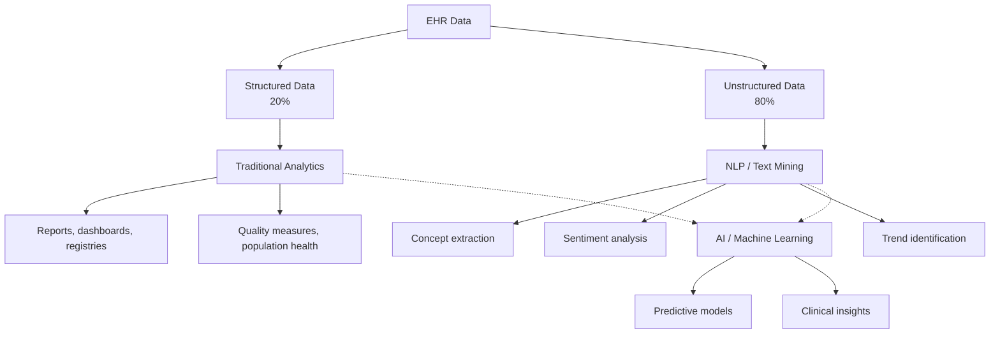

Clinical data analytics transforms the raw data captured in EHRs into actionable insights. With the massive volume of data generated by EHR systems daily, analytics has become essential for improving patient outcomes, optimizing operations, and advancing medical knowledge.

## The Data Opportunity

```yaml
EHR Data Volume:
  └− A typical hospital generates 50+ petabytes of data annually
  └− A single patient encounter generates 100-1,000+ data points
  └− Unstructured data (notes, reports): 80% of health data
  └− Structured data (lab results, vitals, codes): 20%

Data Types in EHR:
  └− Structured Data:
       Diagnoses (ICD-10), Procedures (CPT), Medications (RxNorm)
       Lab results (LOINC), Vital signs
       Demographics, Immunizations, Allergies
  └− Unstructured Data:
       Clinical notes (progress notes, consults, discharge summaries)
       Radiology reports, Pathology reports
       Imaging data (DICOM)
       Patient communications (portal messages, phone notes)
```

## Structured vs. Unstructured Data Analytics



### Structured Data Analytics

```yaml
What It Is:
  └− Analysis of coded, numeric, and categorical data
  └− Fields with defined values (diagnosis codes, lab values, vitals)
  └− Clean, organized, queryable

What It Can Do:
  └− Quality measure calculation (HbA1c control, screening rates)
  └− Population health analytics (registries, risk stratification)
  └− Operational analytics (volume, cycle times, productivity)
  └− Financial analytics (revenue, A/R, denial patterns)
  └− Research queries (patient cohorts for clinical trials)

Limitations:
  └− Only 20% of health data is structured
  └− Coding may not capture clinical nuance
  └− Missing data affects accuracy
  └− Coding inconsistencies across providers
```

### Unstructured Data Analytics (NLP)

Natural Language Processing (NLP) extracts meaning from clinical notes:

```yaml
NLP Applications in Healthcare:
  └− Concept Extraction:
       Identify: diagnoses, symptoms, medications from free text
       Extract: disease severity, temporal relationships, negation
       Example: "Patient denies chest pain" → chest pain = absent
  
  └− Cohort Identification:
       Find patients matching specific clinical criteria
       Example: "Patients with refractory hypertension despite 3 medications"
       NLP + structured data for comprehensive identification
  
  └− Clinical Research:
       Extract research data from notes without manual chart review
       Identify adverse events from clinical narratives
       Assess treatment effectiveness from real-world data
  
  └− Quality Improvement:
       Identify undocumented conditions
       Detect missed care opportunities
       Monitor adherence to clinical guidelines

NLP Example — Extracting Smoking Status:
  Text: "Patient is a 45-year-old male with 30 pack-year smoking history.
         Quit 2 years ago."
  
  NLP Extraction:
    └− Smoking status: Former smoker
    └− Pack years: 30
    └− Quit date: ~2 years ago
    └− Current status: Non-smoker
    └− Structured code: Z87.891 (history of tobacco dependence)
```

## Clinical Data Mining

Data mining discovers patterns and relationships in clinical data:

| Technique | Application in Healthcare | Example |
|-----------|--------------------------|---------|
| **Association Rules** | Identify co-occurring conditions | "Patients with diabetes and hypertension are 3x more likely to develop CKD" |
| **Clustering** | Group similar patients | Identify previously unknown patient subgroups with similar outcomes |
| **Classification** | Predict categories | Classify ER visits as high-utilizer vs. appropriate-use |
| **Regression** | Predict continuous values | Predict length of stay based on admission characteristics |
| **Sequential Patterns** | Identify care pathways | Most common treatment sequence for newly diagnosed diabetes |
| **Anomaly Detection** | Identify outliers | Detect unusual prescribing patterns (potential diversion) |

## Clinical Research Using EHR Data

EHR data is increasingly used for clinical research:

```yaml
Research Applications:
  └− Retrospective Studies:
       Large-scale analysis of treatment outcomes
       Real-world effectiveness vs. clinical trial efficacy
       Safety signal detection (adverse event monitoring)
  
  └− Patient Recruitment:
       Identify eligible patients for clinical trials
       Pre-screening from EHR data reduces recruitment cost
       Real-time identification of eligible patients
  
  └− Pragmatic Clinical Trials:
       Trials embedded in clinical workflow
       EHR used for data collection and follow-up
       Lower cost than traditional RCTs

Challenges of EHR-Based Research:
  └− Data quality: Missing data, coding errors, documentation variations
  └− Selection bias: EHR data reflects who seeks care, not general population
  └− Confounding: Treatment decisions influenced by unmeasured factors
  └− Standardization: Different EHRs, different data formats
  └− Privacy: Research use requires additional patient consent
  └− Data extraction: Complex queries needed across multiple data sources
```

## Data Quality Management

Analytics is only as good as the underlying data:

```yaml
Data Quality Dimensions:
  └− Completeness: Are required fields populated?
       Missing data leads to inaccurate analytics
       Target: > 95% completeness for critical fields
  
  └− Accuracy: Does data reflect reality?
       Coding errors, wrong patient, wrong value
       Target: > 99% accuracy
  
  └− Consistency: Same format across sources?
       Date formats, units of measure, code sets
       Target: Standardized across all data sources
  
  └− Timeliness: Is data available when needed?
       Real-time for clinical decision support
       Daily for operational reporting
       Target: As required by use case

Data Quality Improvement:
  └− Front-end validation: Required fields, range checks at data entry
  └− Automated data quality reports: Identify gaps and errors
  └− Regular data quality audits: Random sample validation
  └− Provider feedback: Reports on documentation completeness
  └− Structured templates: Guide complete data capture
```

## Analytics Tools and Platforms

```yaml
EHR-Embedded Analytics:
  └− Built-in reporting tools (vendor-specific)
  └− Dashboard capabilities
  └− Quality measure calculators
  └− Ad-hoc query tools
  └− Limited to data within the EHR
  └− User-friendly but less flexible

Enterprise Data Warehouse (EDW):
  └− Data from EHR + billing + claims + other sources
  └− Standardized data model (often OMOP or i2b2)
  └− Supports complex queries across multiple sources
  └− Requires IT support for development
  └− Powerful but requires significant investment

Specialized Analytics Platforms:
  └− Population health platforms (HealtheIntent, Cerner Healthe)
  └− Clinical analytics (Tableau, Power BI)
  └− Predictive analytics (Jvion, KenSci)
  └− NLP platforms (CogStack, cTAKES)
  └− Research platforms (i2b2, OMOP, TriNetX)
```

## Key Takeaways

- EHRs generate massive volumes of data — a single hospital generates 50+ petabytes annually, but 80% is unstructured (clinical notes)
- Structured data analytics (diagnosis codes, lab values, vitals) powers traditional reporting, quality measurement, and population health
- Unstructured data analytics uses NLP to extract meaning from clinical notes — capturing the 80% of health data that structured fields miss
- NLP applications include concept extraction, cohort identification, clinical research, and quality improvement — turning narrative text into actionable data
- Data mining techniques (clustering, classification, association rules) discover patterns and relationships that are not obvious from single data points
- EHR data is increasingly used for clinical research — retrospective studies, patient recruitment, and pragmatic clinical trials
- Data quality is the foundation of analytics — completeness, accuracy, consistency, and timeliness must be actively managed
- Analytics platforms range from EHR-embedded (limited but accessible) to enterprise data warehouses (powerful but complex) to specialized tools (population health, NLP, predictive analytics)
- The value of analytics depends on action — insights must be connected to clinical workflows and decision-making
- The future of clinical analytics is real-time, predictive, and personalized — moving from "what happened" to "what will happen" to "what should we do"
