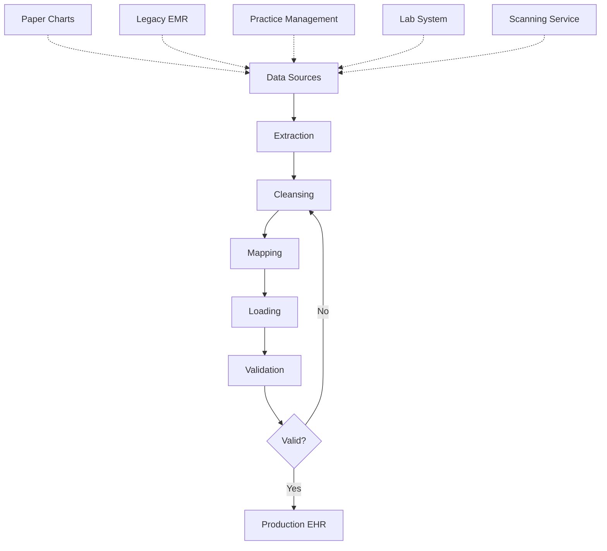

Data migration — the process of moving patient health information from paper records and legacy systems into a new EHR — is one of the most challenging aspects of implementation. Poor data migration can result in lost information, incorrect data, and compromised patient safety.

## Data Migration Overview



## Types of Data to Migrate

| Data Category | Source | Migration Approach | Complexity |
|---------------|--------|-------------------|------------|
| **Patient Demographics** | Current PMS/billing system | Electronic import from legacy system | Low |
| **Insurance Information** | Current PMS | Electronic import | Low |
| **Appointment History** | Current PMS | Electronic import | Low |
| **Problem List** | Paper chart or legacy EMR | Electronic or manual entry | Medium |
| **Medication List** | Paper chart or legacy EMR | Electronic or manual entry | Medium |
| **Allergy List** | Paper chart or legacy EMR | Electronic or manual entry | Medium |
| **Lab Results** | Lab system or paper | Electronic interface (ideal) or scanned | Medium-High |
| **Immunization History** | State registry or paper | Registry query or manual entry | Medium |
| **Progress Notes** | Paper chart | Scan or summarize (not full entry) | High |
| **Radiology Reports** | PACS or paper | Electronic interface or scanned | Medium-High |
| **Hospital Records** | Various | Scan or summary only | High |
| **Advanced Directives** | Paper | Scan (legal document) | Low |

## Migration Strategies

### Strategy 1: Selective Migration (Recommended)

Not all data from paper records needs to be entered into the new EHR:

```yaml
What to Migrate (High Value):
  └− Demographics and insurance (always)
  └− Active problem list
  └− Current medication list
  └− Known allergies
  └− Recent lab results (last 2 years recommended)
  └− Immunization history
  └− Recent procedure history
  └− Advance directives
  
What to Summarize (Not Full Entry):
  └− Past medical history → brief summary note
  └− Surgical history → brief summary note
  └− Family history → brief summary note
  └− Social history → brief summary note
  
What to Scan (Available but not Data-Entered):
  └− Old progress notes (scanned PDF)
  └− Historical lab reports (scanned)
  └− Consultation letters (scanned)
  └− Hospital discharge summaries (scanned)
  
What to Leave in Paper Archive (Accessible on Request):
  └− Records older than 7 years
  └− Records from closed/retired providers
  └− X-ray films (if not digitized)
```

### Strategy 2: Phased Migration

Migrate data in stages to manage risk:

| Phase | Data | Timeline | Validation |
|-------|------|----------|------------|
| **1. Reference Data** | Demographics, insurance, providers, locations | 2-3 months before go-live | Full validation |
| **2. Clinical Summary** | Problem list, medications, allergies, immunizations | 1-2 months before go-live | Spot-check validation |
| **3. Historical Data** | Lab results, procedure history, recent notes | 2-4 weeks before go-live | Sample validation |
| **4. Scanned Documents** | Old records, consent forms, advance directives | Ongoing after go-live | Random audit |
| **5. Continuous Migration** | New data from legacy system during transition | Throughout parallel period | Daily verification |

### Strategy 3: Hybrid Approach

Combine electronic migration with manual data entry:

```yaml
Electronic Migration (Automated):
  └− Demographics and insurance from PMS
  └− Lab results from lab system
  └− Immunizations from state registry
  └− Medications from e-prescribing system

Manual Data Entry (Staff-Assisted):
  └− Problem list from paper chart (MA enters during first visit)
  └− Medication reconciliation (provider reviews during first visit)
  └− Allergy verification (MA confirms with patient during first visit)
  └− History summary (patient completes via portal before first visit)

Scanned Documents:
  └− Old records scanned as PDF and linked to patient chart
  └− Accessible in EHR but not part of structured data
  └− OCR (optical character recognition) for searchability
```

## Data Migration Best Practices

### Data Cleansing

Before migrating, clean your existing data:

```yaml
Common Data Quality Issues:
  └− Duplicate patient records (5-15% of databases)
  └− Missing or incomplete data
  └− Inconsistent formatting (e.g., phone numbers, SSNs)
  └− Outdated information (wrong insurance, old addresses)
  └− Incorrect coding (wrong diagnosis codes)
  └− Orphan records (patients with no visits in 10+ years)
  └− Test patients mixed with real patients

Cleansing Activities:
  └− Duplicate merge: Identify and merge duplicate patient records
  └− Data standardization: Consistent date, phone, address formats
  └− Completeness check: Identify and fill critical gaps
  └− Inactivation: Mark deceased patients, inactive patients
  └− Error correction: Fix known data errors before migration
  └− Purge test data: Remove test patients from production data
```

### Data Mapping

Every data field in the old system must map to a field in the new EHR:

```
Old System Field → New EHR Field → Transformation Rule
──────────────────────────────────────────────────────
Patient.LastName       Patient.LastName       None (direct)
Patient.FirstName      Patient.FirstName       None (direct)
Patient.DOB            Patient.BirthDate       Format: M/D/YYYY → YYYY-MM-DD
Patient.Sex            Patient.Gender          M→Male, F→Female
Patient.ZIP            Patient.PostalCode      Format: 12345 → 12345-6789
Insurance.PolicyID     Coverage.MemberID       Strip hyphens
Diagnosis.ICD9         Diagnosis.ICD10         ICD-9→ICD-10 mapping
Medication.RxNorm      Medication.RxCUI        Lookup RxNorm code
```

### Data Validation

After migration, validate the data:

```yaml
Validation Checks:
  Count Validation:
    └− Patient count in old system vs. new system
    └− Encounter count match (if migrating encounters)
    └− Medication list completeness
    └− Problem list completeness

  Spot-Check Validation:
    └− Random sample of 5% of records
    └− Verify: Demographics, medications, allergies
    └− Compare: Source document vs. migrated data
    └− Acceptable error rate: < 1%

  Functional Validation:
    └− Can provider find patient records?
    └− Are medications searchable and orderable?
    └− Do problems display correctly?
    └− Are scanned documents accessible?

  User Validation:
    └− Providers review their patient panels
    └− Clinical staff verify their patient records
    └− Billing staff verify insurance information
```

## Common Data Migration Pitfalls

| Pitfall | Consequence | Prevention |
|---------|-------------|------------|
| **Migrating Everything** | Cluttered EHR with unusable data | Selective migration strategy |
| **No Data Cleansing** | Duplicates, errors propagated | Clean data before migration |
| **Insufficient Testing** | Data errors discovered after go-live | Comprehensive validation plan |
| **Poor Mapping** | Data in wrong fields or lost | Thorough mapping with testing |
| **Ignoring Unstructured Data** | Loss of clinical context | Scan important unstructured data |
| **No Rollback Plan** | Trapped in failed migration | Maintain legacy system access |
| **Underestimating Time** | Rushed migration, errors | Allocate adequate time (3-6 months) |

## Key Takeaways

- Data migration is one of the most challenging aspects of EHR implementation — poor migration leads to lost data and patient safety risks
- Selective migration recommends migrating high-value data (demographics, problems, meds, allergies) while summarizing or scanning historical notes
- Phased migration with multiple validation stages manages risk — start with reference data and progress through clinical summaries, historical data, and scanned documents
- Data cleansing is essential before migration — address duplicates, missing data, inconsistencies, and errors in the legacy system
- Data mapping requires careful documentation of each field's transformation from old to new system
- Validation includes count checks, spot-checks (5% sample, < 1% error rate), functional validation, and user validation
- Common pitfalls: migrating everything, no cleansing, insufficient testing, and underestimating the time required
- A hybrid approach combining electronic migration with manual staff entry during the first visit and scanned documents for historical data offers the best balance of completeness and efficiency
- Always maintain access to legacy systems after go-live until data migration is fully validated
- Never delete paper records until the EHR has been live for at least 3-6 months and all data has been validated
