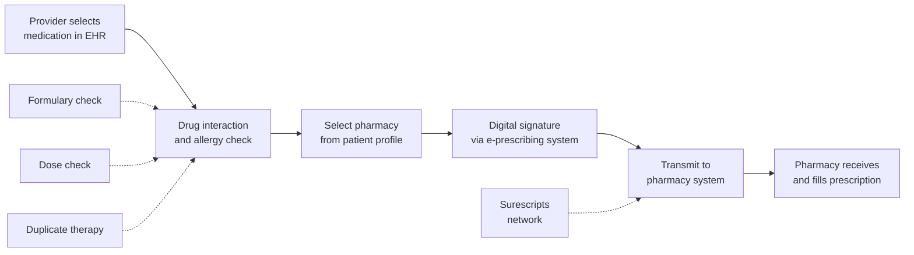

Electronic prescribing (e-prescribing) is one of the most impactful capabilities of EHR systems. By replacing handwritten prescriptions with electronic transmission, e-prescribing has dramatically reduced medication errors, improved patient safety, and streamlined the prescribing workflow.

## How E-Prescribing Works



## Benefits of E-Prescribing

```yaml
Patient Safety Improvements:
  └− Eliminates illegible handwriting errors (15% of handwritten scripts have errors)
  └− Drug interaction checking at the time of prescribing
  └− Allergy alerts prevent adverse reactions
  └− Dose range checking for appropriate dosing
  └− Duplicate therapy checks prevent redundant medications
  └− Contraindication alerts based on patient conditions

Efficiency Improvements:
  └− Prescription transmitted in seconds vs. printing/signing/handing to patient
  └− No callbacks from pharmacists for clarification (reduced by 70%)
  └− Refill requests processed electronically
  └− Renewal authorization requests from pharmacies
  └− Medication history available from pharmacy benefit managers

Cost Savings:
  └− Formulary checking at the point of prescribing ensures preferred medications
  └− Generic substitution information displayed
  └− Reduces brand-name prescribing where generics are available
  └− Lowers overall pharmacy spend for patients and health plans

Regulatory Compliance:
  └− Required for Meaningful Use / Promoting Interoperability
  └− Electronic transmission reduces controlled substance diversion risk
  └− Complete audit trail for all prescriptions
  └− Meets e-prescribing requirements for Medicare Part D
```

## E-Prescribing Workflow

### Standard Prescription

```yaml
Step 1: Medication Selection
  └− Provider searches for medication by name (brand or generic)
  └− System displays: strength, form, dose, route
  └− Dosage suggestions based on diagnosis and patient factors
  └− Formulary tier information displayed

Step 2: Safety Checks
  └− Drug-allergy check: Does patient have allergy to this medication?
  └− Drug-drug interaction: Does this interact with current medications?
  └− Dose range check: Is the dose appropriate for age, weight, renal function?
  └− Duplicate therapy: Is patient already on a similar medication?
  └− Contraindication: Is there a diagnosis that contraindicates this drug?

Step 3: Pharmacy Selection
  └− Patient's preferred pharmacy displayed (from demographics)
  └− Search for pharmacy by name, location
  └− Include pharmacy address and contact information

Step 4: Prescription Details
  └− Sig: Instructions for use (structured or free-text)
  └− Quantity: Number of tablets, capsules, or days supply
  └− Refills: Number of authorized refills
  └− DAW (Dispense As Written): Brand vs. generic substitution

Step 5: Submission
  └− Provider signs electronically
  └− Prescription transmitted via Surescripts network
  └− Pharmacy receives within seconds
  └− Status tracked in EHR
```

### Controlled Substance Prescribing (EPCS)

Electronic prescribing of controlled substances (EPCS) requires additional security:

```yaml
EPCS Requirements:
  └− Two-factor authentication for provider:
       └− Something you know (password)
       └− Something you have (hardware token, biometric)
  └− Identity proofing: Provider must be credentialed
  └− DEA registration verified
  └− Prescription cannot be altered after signing
  └− Complete audit trail maintained

Controlled Substance Schedule:
  Schedule II:
    └− Examples: Oxycodone, Adderall, Ritalin, Fentanyl
    └− No refills — new prescription required each time
    └− Limited to 30-day supply (state-dependent)
  
  Schedule III:
    └− Examples: Tylenol with Codeine, Testosterone
    └− Up to 5 refills in 6 months
  
  Schedule IV:
    └− Examples: Xanax, Valium, Ambien, Ativan
    └− Up to 5 refills in 6 months
  
  Schedule V:
    └− Examples: Cough preparations with codeine
    └− Varies by state

EPCS Adoption:
  └− All 50 states allow EPCS (as of 2024)
  └− 70%+ of controlled substance prescriptions transmitted electronically
  └− Federal requirement for Medicare Part D EPCS by 2025
  └− Reduces prescription forgery and diversion
```

## Medication Reconciliation

Medication reconciliation is the process of comparing a patient's medication orders to all of the medications the patient is actually taking:

```yaml
The "5 Moments" of Medication Reconciliation:
  1. At admission: What was the patient taking before?
  2. At transfer: Are medications correct during transition?
  3. At discharge: What should the patient continue at home?
  4. Post-discharge follow-up: Are medications working?
  5. Annual medication review: Is the medication list current?

EHR-Enabled Med Rec Process:
  └− Patient's current medication list displayed
  └− RxNorm-coded for accurate identification
  └− External sources checked (PBM claims, pharmacy fill data)
  └− Provider reconciles: Continue, Modify, Discontinue, or Add
  └− Discrepancies flagged for resolution
  └− Patient education materials printed at discharge

Common Discrepancies Detected by EHR:
  └− Omission: Patient taking medication not in chart
  └− Commission: Chart lists medication patient is not taking
  └− Duplication: Multiple medications in same class
  └− Dose discrepancy: Different dose than what patient takes
  └− Frequency discrepancy: Wrong dosing schedule
  └− Interaction: New medication interacts with existing regimen
```

## Pharmacy Integration

```yaml
Pharmacy Communication via EHR:
  └− New prescription → sent to pharmacy
  └− Refill request ← pharmacy initiates
  └− Renewal request ← pharmacy initiates (for expired prescriptions)
  └− Change request ← pharmacy (formulary change, therapeutic substitution)
  └− Clarification request ← pharmacy (dose, directions, quantity)
  └− Fill status → notification when prescription is ready
  └− Adherence data → fill history and gaps in therapy

Integration Standards:
  └− Surescripts: Largest e-prescribing network in the US
       Connects 95%+ of pharmacies
       Handles 2+ billion transactions annually
       Includes: prescribing, formulary, medication history, benefit eligibility
  └− NCPDP SCRIPT: Standard for e-prescribing transactions (v10.6, v2017071, v2023011)
  └− FHIR: Emerging standard for medication management APIs
```

## E-Prescribing Metrics

| Metric | Target | Impact |
|--------|--------|--------|
| **E-Prescribing Rate** | > 90% of prescriptions | CMS MIPS measure |
| **EPCS Rate** | > 70% of controlled substances | Patient safety |
| **Formulary Check Usage** | > 80% of prescriptions | Cost savings |
| **Medication Reconciliation at Admission** | 100% | Patient safety |
| **Medication Reconciliation at Discharge** | 100% | Reduced readmissions |
| **Prescription Error Rate** | < 1% | Quality measure |
| **Pharmacy Callback Rate** | < 5% | Efficiency measure |

## Key Takeaways

- E-prescribing replaces handwritten prescriptions with electronic transmission, eliminating errors from illegible handwriting (affecting 15% of paper scripts)
- Safety checks occur at the time of prescribing: drug-allergy, drug-drug interaction, dose range, duplicate therapy, and formulary checks
- The e-prescribing workflow: medication selection → safety checks → pharmacy selection → prescription details → electronic submission via Surescripts
- EPCS (Electronic Prescribing of Controlled Substances) requires two-factor authentication and is now legal in all 50 states
- Medication reconciliation at admission, transfer, discharge, follow-up, and annually is critical for patient safety — EHRs enable structured med rec with discrepancy detection
- Pharmacy integration through Surescripts handles 2+ billion transactions annually, connecting 95%+ of US pharmacies
- E-prescribing is required for Meaningful Use/Promoting Interoperability and Medicare Part D
- E-prescribing reduces pharmacy callbacks by 70%, reduces medication errors by 48-81%, and ensures formulary compliance
- Medication reconciliation discrepancies (omission, commission, duplication, dose errors) are automatically flagged by the EHR
- The goal of e-prescribing is the right medication, for the right patient, at the right dose, at the right time, via the right route — every time
