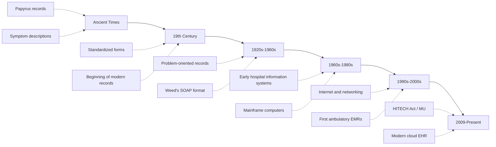

The journey of health records spans centuries — from handwritten notes on papyrus to cloud-based electronic systems that connect providers across the globe. Understanding this evolution provides critical context for the current state of EHR technology.

## Timeline of Health Records



### Ancient Times — 19th Century: The Beginning

| Era | Record Keeping Method | Key Characteristics |
|-----|---------------------|-------------------|
| **Ancient Egypt** | Papyrus scrolls | Descriptions of symptoms, treatments, and outcomes |
| **Hippocratic Era** | Written case histories | Systematic observation and documentation |
| **Middle Ages** | Monastery records | Limited to religious institutions |
| **Renaissance** | Individual physician notes | First standardized anatomical descriptions |
| **1800s** | Hospital ledgers | Admission/discharge records, basic clinical notes |

### 1920s-1960s: The Modern Medical Record

The early 20th century saw the formalization of the medical record as we know it:

```yaml
Key Developments:
  1918 — American College of Surgeons (ACS) establishes medical record standards
  └─ First minimum standards for hospital records
  └─ Required: history, physical exam, diagnosis, treatment, and outcome
  
  1930s — Problem-oriented medical record concept emerges
  └─ Dr. Lawrence Weed develops the problem-oriented medical record (POMR)
  └─ Introduction of the SOAP format (Subjective, Objective, Assessment, Plan)
  └─ Becomes the gold standard for clinical documentation
  
  1960s — First hospital information systems (HIS)
  └─ Lockheed-Martin develops first electronic medical record system
  └─ Mayo Clinic and other large institutions develop custom systems
  └─ Mainframe-based, limited to large hospitals
```

### 1970s-1980s: Early Computerization

| Year | Milestone | Significance |
|------|-----------|-------------|
| **1972** | PROMIS (Problem-Oriented Medical Information System) at University of Vermont | First comprehensive EMR system |
| **1970s** | COSTAR (Computer-Stored Ambulatory Record) at Harvard | One of the first ambulatory EMRs |
| **1980s** | VA develops Veterans Health Information Systems and Technology Architecture (VistA) | One of the largest early EHR deployments |
| **1985** | First commercial ambulatory EMR systems appear | Early products from Medical Manager, NextGen |
| **1988** | HL7 version 2 standard released | First major healthcare data exchange standard |

**VistA — A Landmark Achievement:**

The VA's VistA system (originally Decentralized Hospital Computer Program) was one of the most significant early EHR implementations:

```yaml
VistA Impact:
  └─ Implemented across 1,200+ VA facilities
  └─ Served 9+ million veterans
  └─ Included CPOE, pharmacy, lab, radiology modules
  └─ Open-source architecture (public domain)
  └─ Significantly improved quality of care for veterans
  └─ Cost $4.5 billion over 15 years vs. $15+ billion for commercial alternatives
  └─ Demonstrated that large-scale EHR implementation was feasible
```

### 1990s-2000s: Internet Era and Early Adoption

The internet revolutionized health IT capabilities:

```yaml
1990s:
  └─ Internet enables new data sharing possibilities
  └─ Web-based EMRs begin to emerge
  └─ Group Health Cooperative implements first patient portal (1999)
  └─ Institute of Medicine (IOM) publishes "To Err Is Human" (1999)
  └─ Report finds 44,000-98,000 Americans die annually from medical errors
  └─ Calls for computerized systems to reduce errors

Early 2000s:
  └─ IOM publishes "Crossing the Quality Chasm" (2001)
  └─ Recommends EHR as essential tool for quality improvement
  └─ President Bush calls for universal EHR by 2014 (2004 State of the Union)
  └─ Office of the National Coordinator for Health IT (ONC) established (2004)
  └─ Early adopters begin EHR implementation
  └─ Adoption rate in 2007: only 17% of practices
```

**Institute of Medicine Reports — Catalysts for Change:**

Two IOM reports were instrumental in driving EHR adoption:

| Report | Year | Key Findings | Impact on Health IT |
|--------|------|-------------|-------------------|
| **To Err Is Human** | 1999 | 44,000-98,000 deaths/year from medical errors | Made the case for CPOE and CDS to prevent errors |
| **Crossing the Quality Chasm** | 2001 | US healthcare system is fragmented, unsafe, and inefficient | Recommended EHRs as essential infrastructure for quality improvement |

### 2009-2015: The HITECH Revolution

The **Health Information Technology for Economic and Clinical Health (HITECH) Act**, part of the 2009 American Recovery and Reinvestment Act, was the single biggest catalyst for EHR adoption:

```yaml
HITECH Act Key Provisions:
  └─ $27 billion in incentive payments for EHR adoption
  └─ Medicare: Up to $44,000 per eligible provider over 5 years
  └─ Medicaid: Up to $63,750 per eligible provider
  └─ Meaningful Use program with 3 stages
  └─ EHR certification criteria established
  └─ Regional Extension Centers for technical assistance
  └─ Health Information Exchange (HIE) grants
  └─ Workforce development programs

Adoption Impact:
  └─ 2008: 17% of physicians used any EHR
  └─ 2011: 34% (MU Stage 1 begins)
  └─ 2013: 48% (MU Stage 1 meaningful use criteria)
  └─ 2015: 78% (MU Stage 2; penalties begin for non-adopters)
  └─ 2017: 86% of physicians using certified EHR
```

### 2015-Present: Modern EHR Era

Current state and ongoing developments:

| Year | Milestone | Significance |
|------|-----------|-------------|
| **2015** | MU Stage 3 final rules published | Focus on improved outcomes and population health |
| **2016** | 21st Century Cures Act passed | Mandates interoperability and prevents information blocking |
| **2018** | MU renamed to "Promoting Interoperability" | Shift in focus from adoption to meaningful data exchange |
| **2020** | COVID-19 pandemic accelerates telehealth | EHRs integrate video visits, remote monitoring |
| **2021** | CMS Interoperability and Patient Access Rule | Patients can access records via smartphone apps (FHIR APIs) |
| **2023** | TEFCA (Trusted Exchange Framework) implementation | Nationwide health information exchange framework |
| **2024** | AI integration in EHR workflows | Ambient listening, predictive analytics, clinical NLP |

## Adoption Trends

```yaml
Current EHR Adoption (2024):
  └─ Office-based physicians: 89% use any EHR system
  └─ Non-federal acute care hospitals: 96% certified EHR
  └─ Critical Access Hospitals: 97% EHR adoption
  └─ Rural health clinics: 82% EHR adoption
  └─ Long-term care: 65% (growing)

Remaining Adoption Barriers:
  └─ Implementation cost: $15,000-$70,000 per provider
  └─ Ongoing maintenance: 3-5% of practice revenue
  └─ Training burden: 40-80 hours per staff member
  └─ Disruption to workflow during transition
  └─ Lack of interoperability between systems
```

## Key Takeaways

- Health records have evolved from ancient papyrus scrolls to digital, interconnected systems spanning the entire care continuum
- The problem-oriented medical record (POMR) and SOAP format, developed in the 1960s-70s, remain the foundation of clinical documentation
- Early EMR systems (VistA, COSTAR, PROMIS) demonstrated the feasibility of electronic records in the 1970s-80s
- The 1999 IOM report "To Err Is Human" made a powerful case for health IT to reduce medical errors
- The HITECH Act of 2009 was the watershed moment — $27 billion in incentives drove adoption from 17% to 86%+
- The Meaningful Use program evolved into Promoting Interoperability, reflecting a shift from adoption to effective data exchange
- Modern EHR adoption exceeds 89% in physician offices and 96% in hospitals
- Ongoing challenges include interoperability, usability, and the transition to value-based care
- The 21st Century Cures Act and TEFCA are driving the next wave of interoperability and patient data access
