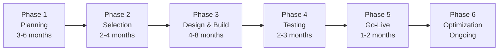

EHR implementation is one of the most complex projects a healthcare organization can undertake. A successful implementation requires careful planning, significant resources, and a structured approach. This page covers the full implementation lifecycle.

## Implementation Timeline



## Phase 1: Planning (3-6 Months)

The planning phase establishes the foundation for the entire project:

```yaml
Key Planning Activities:
  └− Needs Assessment:
       Evaluate current state — what works, what needs improvement
       Identify pain points in current workflows
       Define goals and objectives for EHR implementation
       Assess organizational readiness for change
  
  └− Budget Development:
       Implementation cost: $15,000-$70,000 per provider
       Annual maintenance: 15-20% of implementation cost
       Infrastructure: Servers, workstations, network upgrades
       Training: 40-80 hours per staff member
       Productivity loss: 3-6 months of reduced volume
       Contingency: 15-20% of total budget
  
  └− Team Formation:
       Executive sponsor (C-level)
       Project manager (full-time, experienced)
       Clinical champion(s) — respected physicians
       IT lead and technical team
       Super-users from each department
       Vendor relationship manager
  
  └− Timeline Development:
       Realistic milestones and deadlines
       Dependency mapping
       Go-live date selection (avoid holidays, flu season)
       Phased rollout plan (if applicable)
```

### Planning Checklist

```
□ Needs assessment completed
□ Goals and objectives documented
□ Budget approved (including contingency)
□ Project team identified and assigned
□ Executive sponsor committed
□ Clinical champions recruited
□ High-level timeline established
□ Risk assessment completed
□ Communication plan created
```

## Phase 2: Vendor Selection (2-4 Months)

```yaml
Selection Process:
  1. Requirements Definition (4-6 weeks):
     └− Functional requirements: What must the EHR do?
     └− Technical requirements: Infrastructure, integration, security
     └− Regulatory requirements: Meaningful Use, HIPAA, certification
     └− Departmental requirements: Specific needs per specialty
     └− Create Request for Proposal (RFP)
  
  2. Market Research (2-4 weeks):
     └− Identify vendors meeting requirements
     └− Check KLAS ratings and industry reports
     └− Request references from similar organizations
     └− Attend vendor demonstrations
     └− Check financial stability of vendors
  
  3. Vendor Evaluation (4-6 weeks):
     └− Score based on weighted criteria:
          Functionality: 25%
          Usability: 20%
          Interoperability: 15%
          Cost: 15%
          Support and training: 10%
          Vendor stability: 10%
          Scalability: 5%
     └− Site visits to current customers
     └− Technical proof of concept
  
  4. Contract Negotiation (4-6 weeks):
     └− Software licensing and subscription fees
     └− Implementation services costs
     └− Ongoing support and maintenance
     └− Training costs
     └− Data migration and conversion
     └− Service level agreements (SLAs)
     └− Exit clause and data portability
```

### Vendor Evaluation Scorecard

| Criterion | Weight | Vendor A | Vendor B | Vendor C |
|-----------|--------|----------|----------|----------|
| **Functionality** | 25% | 8/10 | 7/10 | 9/10 |
| **Usability** | 20% | 7/10 | 9/10 | 6/10 |
| **Interoperability** | 15% | 8/10 | 6/10 | 9/10 |
| **Cost** | 15% | 7/10 | 8/10 | 5/10 |
| **Support/Training** | 10% | 8/10 | 7/10 | 8/10 |
| **Vendor Stability** | 10% | 9/10 | 8/10 | 7/10 |
| **Scalability** | 5% | 8/10 | 8/10 | 8/10 |
| **Weighted Total** | **100%** | **7.75** | **7.55** | **7.60** |

## Phase 3: Design and Build (4-8 Months)

This is where the EHR system is configured for the organization:

```yaml
Design Activities:
  └− Workflow Design (parallel to build):
       Document current state workflows (As-Is)
       Design future state workflows (To-Be)
       Map workflows to EHR capabilities
       Identify template and order set needs
  
  └− System Configuration:
       User roles and security settings
       Template creation (progress notes, history forms)
       Order set development (condition-specific order groups)
       Rule configuration (CDS alerts, reminders)
       Interface development (lab, radiology, pharmacy, billing)
       Report and dashboard creation
  
  └− Data Preparation:
       Data mapping (paper fields to EHR fields)
       Data cleansing (fix errors in existing data)
       Data conversion timeline
       Conversion testing plan
  
  └− Infrastructure Build:
       Server installation (on-premise) or cloud setup
       Network upgrades for increased bandwidth
       Workstation deployment with appropriate hardware
       Printer/scanner configuration
       Backup and disaster recovery setup
```

## Phase 4: Testing (2-3 Months)

```yaml
Testing Levels:
  Level 1 — Unit Testing:
     └− Each component tested individually
     └− Templates, order sets, rules, interfaces
     └− Conducted by IT team
  
  Level 2 — System Testing:
     └− Integrated workflows tested end-to-end
     └− All interfaces connected and verified
     └− Conducted by IT + super-users
  
  Level 3 — User Acceptance Testing (UAT):
     └− Real-world scenarios tested by end-users
     └− Each role tests their workflows
     └− Issues logged and resolved
     └− Conducted by super-users and representative staff
  
  Level 4 — Performance Testing:
     └− System response times under load
     └− Concurrent user testing
     └− Failover and disaster recovery testing

Testing Documentation:
  └− Test scripts for each workflow
  └− Expected results vs. actual results
  └− Issue tracking and resolution log
  └− Go/no-go criteria and sign-off
```

## Phase 5: Go-Live (1-2 Months)

### Go-Live Strategies

| Strategy | Description | Pros | Cons |
|----------|-------------|------|------|
| **Big Bang** | All users go live simultaneously | Fastest transition, single training period | Highest risk, productivity impact concentrated |
| **Phased by Department** | One department at a time goes live | Lower risk, lessons learned applied to next phase | Longer total transition, dual systems |
| **Phased by Location** | One clinic/hospital at a time | Controlled rollout, geographic focus | Duplicate processes during transition |
| **Parallel** | Paper and EHR run simultaneously | Safety net — fall back to paper if issues | Double documentation, highest staff burden |

### Go-Live Support

```yaml
Go-Live Support Structure:
  └− Command Center:
       Central location for issue tracking
       IT and vendor support staff present
       Escalation procedures defined
       Daily standing meetings (start and end of day)
  
  └− At-the-Elbow Support:
       Super-users and vendor staff on each clinical floor
       Immediate assistance for users
       Workflow guidance
       Issue triage and escalation
  
  └− Technical Support:
       Help desk with dedicated EHR support line
       System monitoring for performance issues
       Interface monitoring for data flow
       After-hours support for overnight shifts
  
  └− Go-Live Metrics:
       Number of support tickets (by category, severity)
       System response times
       Patient volume vs. baseline
       Provider documentation completion rate
       Order entry accuracy
```

## Phase 6: Post-Implementation Optimization (Ongoing)

Implementation is not the end — optimization is a continuous process:

```yaml
Immediate Post-Go-Live (Weeks 1-4):
  └− Daily team huddles to address issues
  └− Adjust workflows based on real-world feedback
  └− Address critical performance issues
  └− Monitor: Response times, patient volume, staff satisfaction
  └− Celebrate wins and recognize staff efforts

Short-Term Optimization (Months 1-6):
  └− Tune CDS alerts (reduce alert fatigue)
  └− Refine templates based on provider feedback
  └− Optimize order sets with utilization data
  └− Expand patient portal features
  └− Begin quality measure reporting from EHR
  └− Monthly optimization committee meetings

Long-Term Optimization (Months 6-24):
  └− Advanced feature adoption (closed-loop medication administration)
  └− Population health management implementation
  └− Analytics and reporting maturity
  └− Interoperability expansion (additional HIE connections)
  └− Telehealth and remote monitoring integration
  └− Annual workflow review and refresh
```

## Implementation Cost Breakdown

| Cost Category | Typical Range | % of Total |
|---------------|---------------|------------|
| Software licensing/subscription | $5,000-$30,000/provider/year | 20-30% |
| Implementation services | $10,000-$40,000/provider (one-time) | 25-35% |
| Hardware and infrastructure | $3,000-$10,000/provider | 10-15% |
| Training | $2,000-$5,000/provider + staff | 10-15% |
| Data migration and conversion | $2,000-$10,000 | 5-10% |
| Productivity loss (3-6 months) | $10,000-$50,000/provider | 15-25% |
| Ongoing maintenance (annual) | 15-20% of initial cost/year | — |

## Key Success Factors

| Factor | Impact | Implementation Strategy |
|--------|--------|------------------------|
| **Executive Sponsorship** | Critical — without it, projects fail | C-level champion with regular engagement |
| **Clinical Leadership** | Drives adoption and workflow design | Physician and nurse champions with dedicated time |
| **Project Management** | Keeps timeline and budget on track | Experienced PM with healthcare IT background |
| **User Involvement** | Ensures system meets real needs | Super-users involved from planning through go-live |
| **Training Quality** | Determines user competence and confidence | Role-based training, hands-on practice, at-the-elbow support |
| **Workflow Redesign** | Prevents automating bad processes | Invest time in redesign BEFORE build |
| **Go-Live Support** | Manages risk during transition | Adequate at-the-elbow support, command center |
| **Post-Go-Live Optimization** | Realizes full value of investment | Dedicated optimization resources and budget |

## Key Takeaways

- EHR implementation follows a six-phase lifecycle: Planning, Selection, Design/Build, Testing, Go-Live, and Optimization
- Planning (3-6 months) establishes the foundation — needs assessment, budget, team formation, and timeline are critical
- Vendor selection uses a structured evaluation process with weighted criteria — functionality, usability, cost, and vendor stability
- Design and build (4-8 months) is the longest phase — workflow design, system configuration, template creation, and infrastructure build happen here
- Testing covers four levels: unit, system, user acceptance, and performance — each level requires sign-off before proceeding
- Go-Live strategies range from big bang (fastest but riskiest) to phased by department (lower risk but longer)
- Go-live support structure should include a command center, at-the-elbow support, and dedicated technical support
- Post-implementation optimization is where the real value is realized — tuning alerts, refining templates, and expanding feature adoption
- Implementation costs range from $15,000-$70,000 per provider with ongoing annual maintenance of 15-20%
- Key success factors: executive sponsorship, clinical leadership, expert project management, user involvement, and quality training
