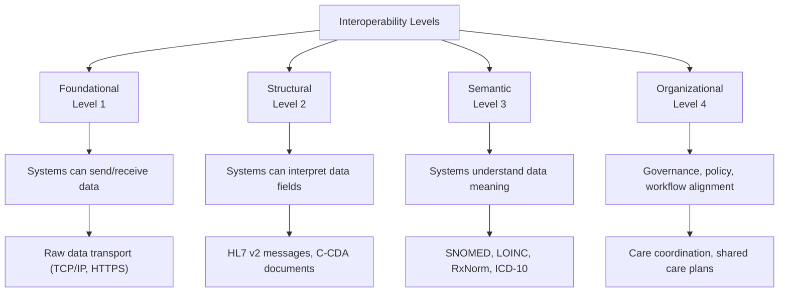

Interoperability — the ability of different health IT systems to exchange and use health information — is the ultimate promise of EHR technology. A truly interoperable healthcare system means that a patient's complete health information follows them wherever they receive care, regardless of which EHR system their providers use.

## The Interoperability Challenge

```yaml
The Current Reality:
  └− A patient sees 3-5 different providers across different organizations
  └− Each provider may use a different EHR system
  └− Data often cannot flow between these systems
  └− Providers rely on fax, phone, and mail to share information
  └− Critical information is delayed or lost in transition

The Impact:
  └− Duplicate testing: 15-30% of tests are repeated due to inaccessible results
  └− Medication errors: 20% of adverse drug events involve poor care coordination
  └− Delayed diagnoses: Critical information unavailable when needed
  └− Patient burden: Patients must repeat their history at every encounter
  └− Increased costs: Estimated $30+ billion annually in wasted spending
```

## Levels of Interoperability



### Level 1: Foundational Interoperability

```yaml
Description: Systems can securely send and receive data
Standards: HTTPS, TCP/IP, SFTP
Example: Secure email with encrypted attachment of patient summary
Limitations: Receiving system must manually process the data
Adoption: Universal (all systems support network communication)
```

### Level 2: Structural Interoperability

```yaml
Description: Data fields are structured and interpretable
Standards: HL7 v2, C-CDA, CCD
Example: Hospital discharges patient with C-CDA summary
  └− Receiving system can parse: allergies, medications, problems
  └− Data goes into correct fields automatically
Adoption: Widely implemented in hospitals and EHRs (85%+)
Limitations: Templates vary, data may not map perfectly
```

### Level 3: Semantic Interoperability

```yaml
Description: Systems understand the meaning of data
Standards: SNOMED CT, LOINC, RxNorm, ICD-10
Example: Two systems exchange "Myocardial Infarction"
  └− Both recognize SNOMED 22298006 → same clinical concept
  └− No ambiguity about what type of heart attack or severity
Adoption: Growing, required for certification
Limitations: Requires consistent use of terminology standards
```

### Level 4: Organizational Interoperability

```yaml
Description: Governance, policy, and workflow alignment across organizations
Standards: DTA (Data Use and Reciprocal Support Agreement), HIPAA, TEFCA
Example: Regional Health Information Exchange (HIE)
  └− All hospitals in the region share patient data
  └− Common consent management and privacy framework
  └− Coordinated care plans across organizations
Adoption: Limited to mature HIEs and integrated delivery networks
```

## Health Information Exchange (HIE) Models

| Model | Description | Example | Best For |
|-------|-------------|---------|----------|
| **Centralized** | Single database shared by all participants | Community HIE | Regional data sharing |
| **Federated/Decentralized** | Data stays in each system; query-retrieve model | eHealth Exchange | Organizations retaining data control |
| **Hybrid** | Combined approach — some data centralized, some queried | CommonWell Health Alliance | Flexible architecture |
| **Point-to-Point** | Direct data exchange between two organizations | Direct Standard | Simple, direct sharing |
| **API-Based** | Real-time data access via FHIR APIs | Apple Health Records, Epic MyChart | Patient and app access |

### Major HIE Networks

| HIE Network | Model | Participants | Coverage |
|-------------|-------|-------------|----------|
| **eHealth Exchange** | Federated | 75% of US hospitals | National |
| **CommonWell Health Alliance** | Hybrid | 25,000+ provider sites | National |
| **Carequality** | Interoperability framework | 90%+ of US providers | National |
| **Sequoia Project** | Governance/TEFCA QHIN | Multiple networks | National |
| **State HIEs** | Varies (centralized/federated) | Per state | State/regional |

## FHIR: The Future of Interoperability

**Fast Healthcare Interoperability Resources (FHIR)** is the modern standard for healthcare data exchange:

```yaml
FHIR Key Concepts:
  └− Resources: Modular data components
       Patient, Observation, Medication, Condition, Procedure, etc.
       ~150 defined resource types
  └− RESTful API: Standard web API approach
       GET, POST, PUT, DELETE operations
       Uses JSON or XML
  └− SMART on FHIR: App launch framework
       Allows third-party apps to integrate with EHR
       Patient-facing and provider-facing apps
  └− Required by 21st Century Cures Act (2016)
       All certified EHRs must support FHIR APIs
       No blocking or interfering with data access

FHIR API Example — Get Patient Data:
  GET https://ehr.example.com/fhir/Patient/12345
  Response:
  {
    "resourceType": "Patient",
    "id": "12345",
    "name": [{"family": "Doe", "given": ["John"]}],
    "gender": "male",
    "birthDate": "1955-01-15"
  }

FHIR API Example — Get Lab Results:
  GET https://ehr.example.com/fhir/Observation?patient=12345&code=4548-4
  Response:
  {
    "resourceType": "Bundle",
    "entry": [
      {
        "resource": {
          "resourceType": "Observation",
          "code": {"coding": [{"system": "http://loinc.org", "code": "4548-4"}]},
          "valueQuantity": {"value": 7.2, "unit": "%"},
          "effectiveDateTime": "2026-03-15"
        }
      }
    ]
  }
```

## Information Blocking

The **21st Century Cures Act** prohibits information blocking — practices that interfere with access, exchange, or use of electronic health information:

```yaml
Information Blocking Definition:
  └− Practice likely to interfere with access, exchange, or use of EHI
  └− Knows (or should know) the practice is unreasonable
  └− Applies to: Health IT developers, HIEs, providers

Examples of Information Blocking:
  └− Charging excessive fees for data exchange
  └− Implementing health IT in ways that limit interoperability
  └− Delaying response to data exchange requests
  └− Restricting patient access to their own data
  └− Refusing to connect to other systems
  └− Using contractual terms that restrict data sharing

Exceptions (Practice is NOT blocking if it meets exception criteria):
  └− Preventing harm exception (safety)
  └− Privacy exception (patient consent)
  └− Security exception (reasonable security measures)
  └− Infeasibility exception (technically not possible)
  └− Licensing exception (IP rights)
  └− Fees exception (reasonable fees for specific services)

Penalties:
  └− Health IT developers: Up to $1,000,000 per violation (HHS/OIG enforcement)
  └− Providers: Meaningful Use adjustment (lower MIPS score)
  └− Enforcement began: September 2023 (electronic health information definition effective)
```

## TEFCA (Trusted Exchange Framework and Common Agreement)

TEFCA establishes a nationwide framework for health information exchange:

```yaml
TEFCA Components:
  └− QHIN (Qualified Health Information Network):
       Organizations that connect HIEs and health IT systems
       Serve as "backbone" of nationwide exchange
       Must meet rigorous technical and governance requirements
       Initial QHINs: eHealth Exchange, CommonWell, Kno2, Health Gorilla
  
  └− Common Agreement (DTA):
       Terms for participation in nationwide exchange
       Data Use and Reciprocal Support Agreement
       Standardizes: privacy, security, data sharing obligations
  
  └− Exchange Purposes:
       Treatment
       Payment
       Healthcare Operations
       Public Health
       Individual Access (patient access to data)
       Benefits Determination

TEFCA Impact:
  └− Connects previously isolated HIEs
  └− Reduces need for point-to-point connections
  └− Establishes consistent governance nationwide
  └− Enables patient data access across all participating networks
  └− Expected to significantly improve interoperability by 2026-2027
```

## Interoperability Maturity Model

| Level | Name | Characteristics | Organizational Examples |
|-------|------|----------------|-------------------------|
| **0** | Siloed | No external data exchange; fax/phone only | Solo practices, non-participating providers |
| **1** | Basic | E-prescribing, basic lab interfaces | Most practices using EHR |
| **2** | Intermediate | HIE participation, CCD exchange, portal | Health systems with HIE connection |
| **3** | Advanced | FHIR APIs, patient app ecosystem, TEFCA | Large health systems, integrated networks |
| **4** | Comprehensive | Nationwide interoperability, real-time data, AI-enabled | Future state — emerging |

## Key Takeaways

- Interoperability is the ability of different health IT systems to exchange and use health information — it is essential for coordinated care but remains incomplete
- Four levels of interoperability: Foundational (transport), Structural (fields), Semantic (meaning), Organizational (governance)
- Health Information Exchanges (HIEs) come in centralized, federated, hybrid, and point-to-point models — each with different tradeoffs
- FHIR (Fast Healthcare Interoperability Resources) is the modern standard for healthcare data exchange using RESTful APIs — required by the 21st Century Cures Act
- Information blocking — practices that interfere with data access or exchange — is prohibited under the Cures Act, with penalties up to $1M per violation
- TEFCA establishes a nationwide framework for health information exchange through Qualified Health Information Networks (QHINs)
- Poor interoperability costs the US healthcare system $30+ billion annually in wasted spending from duplicate testing, medication errors, and delayed care
- The 21st Century Cures Act mandates that patients can access their electronic health information via smartphone apps using FHIR APIs without special effort
- Interoperability maturity ranges from Level 0 (siloed, fax-only) to Level 4 (comprehensive nationwide exchange)
- The goal of nationwide interoperability is that a patient's complete health information follows them wherever they receive care, regardless of EHR vendor
