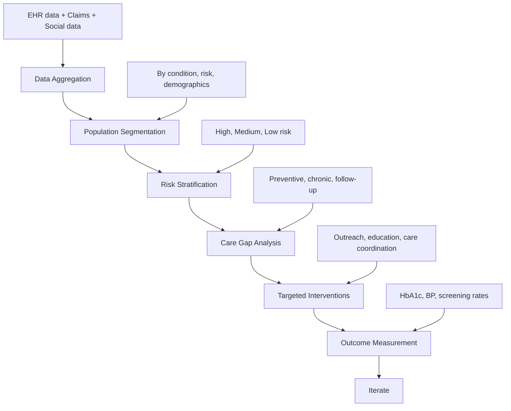

Population health management uses EHR data to improve the health outcomes of entire patient populations — not just individual patients seen in the office. By aggregating and analyzing data across all patients, providers can identify at-risk populations, close care gaps, and proactively manage chronic conditions.

## What Is Population Health?

```yaml
Population Health Definition:
  └− The health outcomes of a group of individuals, including the distribution of outcomes within the group
  └− Focuses on: Managing the health of defined populations
  └− Differs from individual care: Systematic, proactive, data-driven

Key Population Health Questions:
  └− Which patients have diabetes and have not had an HbA1c test in the last 12 months?
  └− Which patients over 50 are overdue for colorectal cancer screening?
  └− Which patients with hypertension have poorly controlled blood pressure?
  └− Which patients are at high risk for hospital readmission?
  └− Which patients have gaps in preventive care?
```

## Population Health Management Framework



## Key Population Health Tools in EHR

### Patient Registries

Registries are lists of patients with specific conditions or characteristics:

| Registry Type | Example | Use |
|---------------|---------|-----|
| **Disease Registry** | Diabetes registry | Track HbA1c, eye exams, foot exams |
| **Preventive Care Registry** | Cancer screening registry | Identify patients due for screening |
| **High-Risk Registry** | Readmission risk registry | Care coordination for at-risk patients |
| **Medication Registry** | Anticoagulation registry | Monitor INR, adjust warfarin dosing |
| **Immunization Registry** | Childhood immunization registry | Track vaccination schedules |
| **Social Risk Registry** | Food insecurity, housing instability registry | Connect with community resources |

### Registry Workflow

```yaml
Building a Diabetes Registry:
  Step 1 — Define Criteria:
    └− Patients 18-75 years
    └− Diagnosis of diabetes (ICD-10: E10-E14)
    └− Seen in last 12 months
  
  Step 2 — Extract Data from EHR:
    └− Diagnosis codes from problem list
    └− HbA1c results (LOINC 4548-4)
    └− Eye exam dates (CPT codes)
    └− Blood pressure values
    └− Medication lists
  
  Step 3 — Analyze Gaps:
    └− 187 patients with diabetes
    └− HbA1c > 9%: 34 patients (18%)
    └− No eye exam in 12 months: 52 patients (28%)
    └− BP > 140/90: 41 patients (22%)
  
  Step 4 — Take Action:
    └− Automated outreach to patients due for eye exam
    └− Provider dashboard showing patients with HbA1c > 9%
    └− Care coordinator calls patients with multiple gaps
    └− CDS alert at next visit: "Patient due for diabetic eye exam"
```

### Risk Stratification

Risk stratification assigns patients to risk levels based on predicted outcomes:

```yaml
Risk Stratification Model:
  └− Factors Considered:
       Age and comorbidities
       Previous hospitalizations and ED visits
       Medication adherence
       Social determinants of health
       Chronic condition count
       Lab values (HbA1c, BP, cholesterol)
       Mental health conditions
  
  └− Risk Levels:
       Level 1 — Healthy: Low risk, preventive care focus
       Level 2 — Stable Chronic: Well-controlled chronic conditions
       Level 3 — Complex Chronic: Multiple or poorly controlled conditions
       Level 4 — High Risk: Frequent hospitalizations, multiple specialists
       Level 5 — Palliative: End-of-life care needs

  └− Resource Allocation:
       Level 1-2: Automated outreach, portal reminders
       Level 3: Care coordinator assigned, regular provider follow-up
       Level 4-5: Intensive care management, home visits, multidisciplinary team
```

### Care Gap Analysis

Care gaps are evidence-based services that patients need but have not received:

| Gap Category | Example | Data Source | EHR Action |
|-------------|---------|-------------|------------|
| **Preventive Screening** | Mammogram due | CPT codes in claims/EHR | Portal reminder, in-visit alert |
| **Chronic Disease Monitoring** | HbA1c overdue | Lab LOINC codes | Care coordinator outreach |
| **Medication Management** | Statin not prescribed for diabetes | Medication list | CDS alert at next visit |
| **Immunization** | Flu vaccine due | Immunization record | Portal reminder, nurse visit |
| **Follow-Up Visit** | No follow-up after hospital discharge | Encounter history | Social worker outreach |

### Population Health Dashboard

A dashboard provides real-time visibility into population health metrics:

```yaml
Hypertension Population Dashboard:
  └− Population Overview:
       Total patients with hypertension: 3,245
       Controlled (BP < 140/90): 2,434 (75%) ✓
       Uncontrolled (BP ≥ 140/90): 811 (25%) ✗
  
  └− Detailed Metrics:
       Patients with BP measured in last 12 months: 2,918 (89.9%)
       Patients on any antihypertensive: 2,724 (84%)
       Patients on > 2 antihypertensives: 978 (30%)
       Patients with medication adherence documentation: 2,433 (75%)
  
  └− Trend (Last 12 Months):
       Q1: 72% controlled
       Q2: 73% controlled
       Q3: 74% controlled
       Q4: 75% controlled ✓ (improving)

  └− Actionable Patients:
       Patients with no BP in 12 months: 327 → Send recall letter
       Patients with BP ≥ 160/100: 142 → Contact for medication adjustment
       Patients with new hypertension diagnosis: 65 → Confirm treatment started
```

## Social Determinants of Health (SDOH)

EHRs increasingly capture and act on social determinants:

| SDOH Domain | Examples | EHR Integration |
|-------------|----------|-----------------|
| **Economic Stability** | Employment, income, food security | Z codes (Z55-Z65), screening questionnaires |
| **Education** | Health literacy, education level | Patient education tailored to literacy level |
| **Healthcare Access** | Insurance, transportation, proximity to care | Referral tracking, telehealth options |
| **Neighborhood** | Housing, safety, environment | Geocoding, community resource referrals |
| **Social Context** | Social support, isolation, discrimination | Psychosocial assessment, support group referrals |

## Value-Based Care and Population Health

Value-based care models that depend on population health management:

| Model | Description | How EHR Supports |
|-------|-------------|-----------------|
| **Accountable Care Organization (ACO)** | Provider group responsible for cost and quality of defined population | Registries, quality reporting, cost tracking |
| **Patient-Centered Medical Home (PCMH)** | Primary care model emphasizing coordination and access | Care management, patient portal, referrals |
| **Medicare Shared Savings Program** | ACO model with upside/downside financial risk | Attribution, quality measurement, utilization analytics |
| **Medicaid Managed Care** | State-contracted managed care organizations | SDOH screening, care coordination |
| **Commercial Value-Based Contracts** | Employer/payer contracts with quality incentives | Performance dashboards, gap closure tools |

## Key Takeaways

- Population health management uses EHR data to improve health outcomes for entire patient populations through systematic, proactive, data-driven approaches
- Patient registries (disease, preventive, high-risk) identify patients sharing specific conditions or characteristics for targeted management
- Risk stratification assigns patients to risk levels (1-5) based on predicted outcomes, enabling appropriate resource allocation
- Care gap analysis identifies patients overdue for evidence-based services — EHRs automate gap detection and trigger outreach
- Population health dashboards provide real-time visibility into metrics like hypertension control, diabetes management, and screening rates
- SDOH (Social Determinants of Health) are increasingly captured in EHRs through Z codes and screening questionnaires
- Value-based care models (ACOs, PCMHs, MSSP) depend on population health capabilities in EHRs
- Population health requires data from multiple sources: EHR (clinical), claims (utilization), pharmacy (medication fills), and social data (SDOH)
- The return on population health investment comes from reduced hospitalizations, better chronic disease control, and improved preventive care rates
- Effective population health management requires dedicated staff (care coordinators, population health analysts) — it is not a purely technological solution
