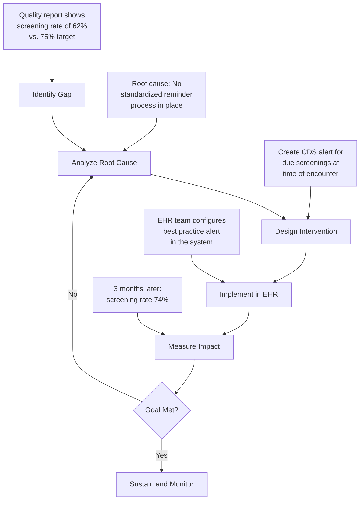

Quality measurement and reporting have become central to healthcare reimbursement. EHRs play a critical role in capturing, calculating, and reporting quality measures that determine provider payment, public reporting, and health system performance.

## What Are Quality Measures?

Quality measures are tools that help measure healthcare processes, outcomes, patient perceptions, and organizational structure:

```yaml
Measure Domains:
  └− Clinical Quality: How well clinical care meets evidence-based standards
  └− Patient Safety: Prevention of harm during care delivery
  └− Patient Experience: Patient satisfaction and engagement
  └− Population Health: Health outcomes for patient populations
  └− Care Coordination: Effectiveness of care transitions and teamwork
  └− Efficiency: Cost of care relative to outcomes
  └− Equity: Disparities in care across populations
```

### Measure Types

| Measure Type | Description | Example |
|--------------|-------------|---------|
| **Process** | Did providers do what they should? | Percentage of diabetic patients with annual HbA1c test |
| **Outcome** | What happened to the patient? | Rate of hospital readmissions within 30 days |
| **Patient Experience** | How did the patient perceive care? | CAHPS survey scores |
| **Structure** | Does the system have the right resources? | EHR adoption and use |
| **Composite** | Combined score across multiple measures | Overall hospital quality star rating |
| **Patient-Reported** | Patient-reported outcomes (PROs) | Depression screening scores |

## How EHRs Support Quality Measurement

```yaml
EHR Capabilities for Quality:
  └− Structured Data Capture:
       Standardized templates capture structured data
       Drop-downs, checklists, and coded fields
       Enables automated quality measure calculation
  
  └− Clinical Decision Support:
       Automated reminders for preventive care
       Alerts for care gaps at the point of care
       Prompts for evidence-based treatment
  
  └− Registry Functionality:
       Identify patients with specific conditions
       Track care delivery against guidelines
       Generate gap reports for outreach
  
  └− Reporting:
       Automated quality measure calculation
       Regulatory submission (MIPS, PQRS)
       Custom dashboard for internal tracking
```

## Major Quality Programs

### MIPS (Merit-Based Incentive Payment System)

MIPS is the primary quality program for Medicare providers, replacing PQRS, the Value-Based Payment Modifier, and the Medicare EHR Incentive Program.

```yaml
MIPS Performance Categories (2024):
  1. Quality: 30%
     └− Report 6 clinical quality measures (at least 1 outcome measure)
     └− Measures selected from ∼200+ MIPS quality measures
     └− Based on administrative claims data or EHR-reported data
  
  2. Promoting Interoperability: 25%
     └− EHR meaningful use criteria
     └− Measures: e-prescribing, health information exchange, patient portal
     └− Requires 2015 Edition CEHRT
  
  3. Improvement Activities: 15%
     └− Activities that improve care processes
     └− Examples: Care coordination, patient engagement, expanded access
     └− Must attest to 40 points (for high-weight activities)
  
  4. Cost: 30%
     └− Medicare spending per beneficiary
     └− Total per capita cost
     └− Episode-based measures (increasing over time)

Performance Threshold:
  └− 2024: 75 points to avoid negative adjustment
  └− Exceptional performance: 100+ points for bonus payment
  └− Maximum adjustment: ±9% of Medicare Part B payments
```

### Clinical Quality Measures (CQMs)

EHRs must support reporting of clinical quality measures:

| Measure ID | Description | Measure Steward |
|------------|-------------|----------------|
| CMS2v12 | Preventive Care and Screening: Screening for Depression | CMS |
| CMS69v11 | Preventive Care and Screening: BMI Screening | CMS |
| CMS122v11 | Diabetes: HbA1c Poor Control (>9%) | NCQA |
| CMS125v11 | Breast Cancer Screening | NCQA |
| CMS130v11 | Colorectal Cancer Screening | NCQA |
| CMS139v11 | Falls: Screening for Future Fall Risk | CMS |
| CMS155v11 | Weight Assessment and Counseling for Children | CMS |
| CMS165v11 | Controlling High Blood Pressure | NCQA |

### Examples of How EHR Captures Quality Data

```yaml
Measure: Diabetes HbA1c Poor Control (CMS122)
  └− Denominator: Patients 18-75 with diabetes
       EHR data: Problem list with diabetes diagnosis (ICD-10: E10-E14)
  └− Numerator: Patients with HbA1c > 9%
       EHR data: Lab results with LOINC code 4548-4 (HbA1c)
  └− Exclusions: Patients with hospice care, ESRD, gestational diabetes
       EHR data: Problem list, encounter diagnoses
  └− EHR Workflow:
       Provider documents diabetes diagnosis → patient enters denominator
       Lab result posts electronically → HbA1c value captured
       If > 9% → numerator met (or not)
       EHR tracks performance and generates report

Measure: Breast Cancer Screening (CMS125)
  └− Denominator: Women 50-74
       EHR data: Demographics (gender, age)
  └− Numerator: Mammogram within 27 months
       EHR data: Procedure codes for mammogram, or imaging results
  └− EHR Workflow:
       Automated reminder: "Patient due for mammogram — order?"
       Provider orders mammogram → tracked in EHR
       Result received → entered in EHR
       EHR reports screening rate: 65% → target > 70%
```

## HEDIS Measures

The **Healthcare Effectiveness Data and Information Set (HEDIS)** is used by most health plans to measure quality:

```yaml
HEDIS Measure Domains:
  └− Effectiveness of Care:
       Controlling high blood pressure
       Comprehensive diabetes care
       Asthma medication ratio
       Antidepressant medication management
  
  └− Access/Availability of Care:
       Adults' access to preventive care
       Children's access to primary care
  
  └− Experience of Care:
       CAHPS survey scores
       Consumer experience with health plans
  
  └− Utilization and Risk-Adjusted Utilization:
       Inpatient utilization
       Emergency department utilization
  
  └− Measures Collected Using Electronic Clinical Data Systems (ECDS):
       EHR data for HEDIS reporting (growing area)
       Reduces administrative burden of chart review
```

## Building a Quality Dashboard

EHRs can create real-time quality dashboards for providers and practices:

```yaml
Provider Dashboard Example:
  └− Patient Panel Overview:
       Total patients: 1,245
       Patients with diabetes: 187 (15%)
       Patients with hypertension: 312 (25%)
  
  └− Quality Measures (Current Month):
       Diabetes HbA1c control: 72% (target > 70%) ✓
       Diabetes eye exam: 58% (target > 60%) ✗ — needs improvement
       Breast cancer screening: 68% (target > 75%) ✗
       Colorectal cancer screening: 62% (target > 70%) ✗
       Blood pressure control: 78% (target > 75%) ✓
  
  └− Gap Report (Actionable Patients):
       Patients due for mammogram: 23
       Patients with HbA1c > 9%: 14
       Patients overdue for colonoscopy: 31
  
  └− Trending (12 Months):
       Diabetes control: 68% → 70% → 69% → 72% (improving ✓)
       Mammogram screening: 65% → 63% → 66% → 68% (improving ✓)
       BP control: 76% → 77% → 75% → 78% (stable ✓)
```

## Quality Improvement Cycle with EHR



## Key Takeaways

- Quality measures assess healthcare processes, outcomes, patient experience, and system performance — they are increasingly tied to reimbursement
- EHRs support quality measurement through structured data capture, CDS alerts, registry functionality, and automated reporting
- MIPS (Merit-Based Incentive Payment System) is the primary quality program for Medicare, with four performance categories: Quality (30%), Promoting Interoperability (25%), Improvement Activities (15%), and Cost (30%)
- Clinical Quality Measures (CQMs) are standardized measures that EHRs must support — covering diabetes control, cancer screening, hypertension management, and preventive care
- HEDIS measures are used by health plans and increasingly leverage EHR data through the ECDS (Electronic Clinical Data Systems) reporting method
- Quality dashboards provide real-time visibility into performance for individual providers and practices, enabling targeted improvement
- The quality improvement cycle with EHR: Identify gap → Analyze root cause → Design intervention → Implement in EHR → Measure impact → Iterate
- MIPS performance determines payment adjustments — up to ±9% of Medicare Part B payments, making quality reporting a financial imperative
- Automated data capture through EHR eliminates the need for manual chart abstraction, reducing reporting burden and improving accuracy
- Quality reporting is shifting from claims-based to EHR-based data, enabling more timely and granular quality measurement
