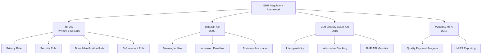

EHR systems operate within a complex regulatory framework designed to protect patient privacy, ensure data security, promote interoperability, and prevent misuse of health information. Understanding these regulations is essential for anyone working with EHR systems.

## Major Healthcare Regulations



## HIPAA Privacy Rule (2003)

The **HIPAA Privacy Rule** establishes national standards for protecting individuals' medical records and other personal health information:

```yaml
Protected Health Information (PHI):
  └─ Any individually identifiable health information
  └─ Includes: Name, address, dates (birth, treatment, death), phone numbers,
      FAX numbers, email, SSN, medical record numbers, health plan numbers,
      account numbers, biometric identifiers, photos, IP addresses

Key Provisions:
  └─ Limits use and disclosure of PHI without patient authorization
  └─ Establishes patient rights to access their health information
  └─ Requires notice of privacy practices (NPP)
  └─ Requires minimum necessary standard — use only what is needed
  └─ Permitted disclosures without authorization:
       └─ Treatment: Sharing information for patient care
       └─ Payment: Billing and claims processing
       └─ Healthcare Operations: Quality improvement, training
       └─ Public Health: Disease reporting, vital statistics
       └─ Law Enforcement: As required by law

Patient Rights Under Privacy Rule:
  └─ Right to access, inspect, and obtain copies of records
  └─ Right to request amendment of incorrect information
  └─ Right to request restrictions on use/disclosure
  └─ Right to accounting of disclosures
  └− Right to request confidential communications
  └− Right to file complaints
```

## HIPAA Security Rule (2005)

The **Security Rule** specifically addresses electronic PHI (ePHI) and requires three types of safeguards:

| Safeguard Category | Examples | EHR-Specific Requirements |
|-------------------|----------|--------------------------|
| **Administrative** | Risk analysis, training, contingency planning, assignments of responsibility | Security officer designation, workforce training, incident response procedures |
| **Physical** | Facility access controls, workstation security, device and media controls | Server room security, laptop encryption, device disposal procedures |
| **Technical** | Access controls, audit controls, integrity controls, transmission security | Unique user IDs, automatic logoff, encryption, audit logs, integrity controls |

### Security Rule Implementation Specifications

```yaml
Administrative Safeguards (Required):
  └─ Risk Analysis: §164.308(a)(1)(ii)(A) — Must conduct accurate and thorough assessment
  └─ Risk Management: §164.308(a)(1)(ii)(B) — Must implement security measures
  └− Sanction Policy: §164.308(a)(1)(ii)(C) — Must take action against violators
  └− Information System Activity Review: §164.308(a)(1)(ii)(D) — Must review records
  └− Security Awareness Training: §164.308(a)(5) — Must train all workforce members

Technical Safeguards (Required):
  └− Unique User Identification: §164.312(a)(2)(i) — Each user must have unique ID
  └− Emergency Access Procedure: §164.312(a)(2)(ii) — Must have break-glass procedure
  └− Automatic Logoff: §164.312(a)(2)(iii) — Must terminate inactive sessions
  └− Encryption and Decryption: §164.312(a)(2)(iv) — Addressable, but strongly recommended
  └− Audit Controls: §164.312(b) — Must record and examine system activity
  └− Integrity Controls: §164.312(c)(1) — Must protect ePHI from improper alteration
  └− Person or Entity Authentication: §164.312(d) — Must verify identity
  └− Transmission Security: §164.312(e)(1) — Must protect ePHI during transmission
```

## HIPAA Breach Notification Rule (2009)

Requires notification when unsecured PHI is breached:

```yaml
Breach Definition:
  └─ Acquisition, access, use, or disclosure of PHI
  └− Not permitted by Privacy Rule
  └− Compromises security or privacy of PHI
  
Notification Requirements:
  └─ 500+ individuals affected:
       └─ Notify affected individuals without unreasonable delay (max 60 days)
       └− Notify HHS Secretary immediately
       └− Notify major media in state/jurisdiction
  └─ Less than 500 individuals:
       └─ Notify affected individuals
       └− Log breach and report to HHS annually

Penalties for Violations:
  └− Tier 1 (Did not know): $100-$50,000 per violation
  └− Tier 2 (Reasonable cause): $1,000-$50,000 per violation
  └− Tier 3 (Willful neglect, corrected): $10,000-$50,000 per violation
  └− Tier 4 (Willful neglect, not corrected): $50,000-$1,500,000 per violation
  └− Annual maximum: $1,500,000 for identical provisions
```

## HITECH Act (2009)

The HITECH Act significantly expanded HIPAA and incentivized EHR adoption:

```yaml
HITECH Key Provisions:
  └− Business Associate Liability:
       Before HITECH: Business associates had no direct HIPAA liability
       After HITECH: Business associates directly liable for HIPAA violations
       Includes: EHR vendors, cloud providers, billing companies, attorneys
  
  └− Increased Penalties:
       Before HITECH: Maximum penalty $25,000 per year
       After HITECH: Maximum $1,500,000 per year
       Four-tier penalty structure established
  
  └− Breach Notification:
       Created HIPAA Breach Notification Rule
       Required notification to individuals, HHS, and media
  
  └− Meaningful Use:
       $27 billion incentive program for EHR adoption
       Three stages of increasingly complex EHR use requirements
       Later renamed Promoting Interoperability Program
  
  └− Enforcement:
       Increased audits and enforcement actions
       State Attorneys General can bring civil actions
       HHS Office for Civil Rights (OCR) primary enforcer
```

## 21st Century Cures Act (2016)

The most significant recent health IT legislation:

```yaml
Key Provisions:
  └− Interoperability Mandate:
       Requires EHR systems to support interoperable data exchange
       Must use published APIs (FHIR) without special effort
  
  └− Information Blocking Prohibition:
       Defines information blocking as a practice that:
         └─ Prevents or materially discourages access to, exchange of, or use of EHI
       Exceptions: Privacy, security, infeasibility, harm
       Penalties: Up to $1,000,000 per violation for health IT developers
       OIG enforcement began September 2023
  
  └− Patient Access to Data:
       Patients have the right to access their EHI (Electronic Health Information)
       Data must be available via APIs without special effort
       No fees for patient access via API

  └− EHR Certification Requirements:
       Must support FHIR API (HL7 FHIR Release 2 or higher)
       Must support standardized data categories
       Must not block data exchange

EHI Definition:
  └− All ePHI in the designated record set
  └− Includes: Clinical notes, lab results, medications, allergies, immunizations,
      problem lists, procedures, imaging data, and more
  └− Expanded beyond treatment, payment, and operations data
```

## MACRA and MIPS (2015)

The **Medicare Access and CHIP Reauthorization Act (MACRA)** established the **Quality Payment Program (QPP)**:

```yaml
MIPS (Merit-Based Incentive Payment System):
  └− Four Performance Categories:
       1. Quality: 30% — Clinical quality measures reported via EHR
       2. Promoting Interoperability: 25% — EHR meaningful use criteria
       3. Improvement Activities: 15% — Care coordination, patient engagement
       4. Cost: 30% — Medicare cost measures (increasing weight)
  
  └− Impact on Payment:
       Positive adjustment: Up to +9% for exceptional performance
       Negative adjustment: Up to -9% for non-participation or low scores
       Performance threshold determines bonus/penalty
  
  └− EHR Connection:
       Promoting Interoperability category directly tied to EHR use
       Must use 2015 Edition certified EHR technology
       Measures: e-prescribing, health information exchange, patient portal
```

## Regulatory Compliance Checklist for EHR

| Requirement | Regulation | Implementation |
|-------------|------------|----------------|
| Risk Analysis | HIPAA Security Rule §164.308(a)(1)(ii)(A) | Annual security risk assessment |
| Unique User IDs | HIPAA Security Rule §164.312(a)(2)(i) | Each user has unique login credentials |
| Automatic Logoff | HIPAA Security Rule §164.312(a)(2)(iii) | Inactive session timeout (15 min recommended) |
| Audit Logs | HIPAA Security Rule §164.312(b) | Track all access, modifications, deletions |
| Encryption | HIPAA Security Rule §164.312(a)(2)(iv) | Encrypt ePHI at rest and in transit |
| Breach Notification | HIPAA Breach Notification Rule | Incident response plan with notification procedures |
| Patient Portal Access | 21st Century Cures Act | Provide online access to EHI via API |
| Information Blocking | 21st Century Cures Act | Do not prevent data exchange with other systems |
| MIPS Reporting | MACRA | Submit quality measures and PI data |
| Business Associate Agreements | HIPAA + HITECH | Contracts with all vendors handling ePHI |
| Emergency Access | HIPAA Security Rule §164.312(a)(2)(ii) | Break-glass procedure for emergency access |

## Common Compliance Violations in EHR

| Violation | Frequency | Typical Penalty | Prevention |
|-----------|-----------|----------------|------------|
| Unauthorized access (employee snooping) | Most common | $10,000-$50,000 | Audit logs, access controls, training |
| Missing risk analysis | Very common | $50,000-$250,000 | Annual comprehensive risk assessment |
| Business associate agreements missing | Common | $10,000-$50,000 | Vendor management program |
| Delayed breach notification | Common | $5,000-$50,000 | Incident response plan |
| Information blocking | Emerging | Up to $1,000,000 | FHIR API implementation |
| Device theft (unencrypted) | Occurs | $25,000-$100,000 | Full disk encryption, device management |

## Key Takeaways

- HIPAA's Privacy Rule establishes patient rights over their health information and limits use/disclosure of PHI without authorization
- HIPAA's Security Rule requires three categories of safeguards: Administrative (policies, training), Physical (facility, devices), and Technical (access controls, audit logs, encryption)
- The HITECH Act extended HIPAA liability to business associates, increased penalties (up to $1.5M), and created the Meaningful Use incentive program
- The 21st Century Cares Act mandates interoperability and prohibits information blocking — patients must have access to their EHI via FHIR APIs
- MACRA/MIPS ties Medicare payment to EHR use through the Promoting Interoperability performance category
- EHR compliance requires specific safeguards: unique user IDs, automatic logoff, audit logs, encryption, breach notification procedures, and business associate agreements
- Unauthorized access (employee snooping) is the most common HIPAA violation in EHR systems
- Information blocking prohibitions under the Cures Act represent a major shift — preventing data exchange now carries penalties up to $1M per violation
