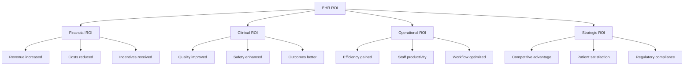

Return on Investment (ROI) for EHR systems extends far beyond simple financial returns. A comprehensive ROI framework must account for financial, clinical, operational, and strategic benefits — some easily quantifiable, others intangible but equally important.

## The Four Dimensions of EHR ROI



## Financial ROI

### Revenue Enhancement

| Revenue Driver | Mechanism | Quantifiable Impact |
|----------------|-----------|-------------------|
| **Coding Accuracy** | Computer-assisted coding improves E/M levels | +2-5% per encounter |
| **Denial Reduction** | Clean claims, fewer rejections | Denial rate: 8% → 4% |
| **Charge Capture** | Automated capture reduces leakage | Revenue leakage: 3% → < 1% |
| **Visit Volume** | Efficiency gains enable more visits | +1-2 patients/provider/day |
| **Quality Incentives** | MIPS bonuses, value-based shared savings | +5-9% Medicare revenue |
| **Telehealth Revenue** | New service line | Varies by specialty |

```yaml
Sample Revenue Calculation (Single Provider):
  Current annual revenue: $500,000
  Coding improvement (+3%): $15,000
  Denial reduction (+2%): $10,000
  Volume increase (1 patient/day × $150 × 200 days): $30,000
  MIPS bonus (+5%): $25,000
  Total annual revenue benefit: $80,000 (16% increase)
```

### Cost Reduction

```yaml
Direct Cost Savings (Annual):
  └− Transcription eliminated: $8,000-15,000
  └− Chart storage reduced: $5,000-10,000
  └− Paper/supplies reduced: $10,000-20,000
  └− Medical records staffing reduced: $15,000-30,000
  └− Total direct savings: $38,000-75,000

Indirect Cost Avoidance (Annual):
  └− Malpractice premium reduction: 5-15%
  └− Avoided adverse drug events: $5,000-10,000 per event
  └− Reduced duplicate testing: 15-30% reduction
  └− Lower readmission penalties: Varies by hospital
  └− Staff turnover reduction: Lower burnout
```

## Clinical ROI

Clinical ROI measures improvements in patient outcomes and care quality:

| Clinical Metric | Baseline (Paper) | With EHR | Improvement |
|----------------|-----------------|----------|-------------|
| **Medication Error Rate** | 5-10% of orders | 1-3% of orders | 48-81% reduction |
| **Preventive Screening Rates** | 50-60% | 70-80% | 15-25% improvement |
| **Chronic Disease Control** | 50-60% | 65-75% | 15-30% improvement |
| **Hospital Readmission Rate** | 15-20% | 12-16% | 15-25% reduction |
| **Time to Critical Result Notification** | 2-12 hours | < 1 hour | 80-90% faster |
| **Guideline Adherence** | 55-65% | 75-85% | 20-30% improvement |

```yaml
Valuing Clinical ROI:
  └− Each prevented adverse drug event: $5,000-$10,000 avoided cost
  └− Each avoided hospital readmission: $5,000-$15,000 avoided cost
  └− Each life saved through improved safety: Priceless but real
  └− Quality-adjusted life years (QALYs): $50,000-$100,000 per QALY (standard threshold)
  └− Clinical ROI is harder to monetize but often exceeds financial ROI in value
```

## Operational ROI

| Operational Metric | Before EHR | After EHR | Impact |
|--------------------|------------|-----------|--------|
| **Chart Pull Time** | 5-15 minutes | 0 seconds | Eliminated |
| **Visit Cycle Time** | 45-60 minutes | 30-45 minutes | 25% reduction |
| **Transcription Turnaround** | 24-72 hours | Real-time | Eliminated |
| **Claims Submission Time** | 5-7 days | 1-2 days | 70% faster |
| **Referral Completion** | 60-70% tracked | 90%+ closed-loop | 20-30% improvement |
| **Staff Overtime** | 5-10 hours/week | 2-5 hours/week | 40-50% reduction |

```yaml
Operational Efficiency Value:
  └− Time saved per provider: 30-60 minutes/day
  └− Value of saved time: $100-200/hour provider time
  └− Annual value per provider: $12,000-60,000
  └− Staff time saved: 1-2 hours/day per clinical staff member
  └− Value of staff time saved: $20-40/hour
```

## Strategic ROI

Strategic ROI encompasses benefits that are difficult to quantify but critical for long-term success:

| Strategic Benefit | Description | Value to Organization |
|------------------|-------------|---------------------|
| **Competitive Position** | Patients expect digital access | Market differentiation |
| **Regulatory Compliance** | Meeting HIPAA, MACRA, Promoting Interoperability requirements | Avoid penalties ($100K-$1M+) |
| **Data-Driven Decision Making** | Analytics capabilities enable strategic planning | Improved business strategy |
| **Population Health Readiness** | Infrastructure for value-based care | Future revenue protection |
| **Innovation Platform** | Foundation for telehealth, AI, precision medicine | Future-proofing |
| **Patient Experience** | Portal, telemedicine, online scheduling | HCAHPS scores, loyalty |
| **Provider Recruitment** | Modern digital workplace attracts talent | Staffing competitive advantage |

## Building the EHR Business Case

### Executive Summary Template

```
BUSINESS CASE: EHR IMPLEMENTATION
──────────────────────────────────
Organization: [Practice/Clinic Name]
Number of Providers: [N]
Specialty: [Primary specialty]

EXECUTIVE SUMMARY:
We recommend implementing [EHR Vendor] at a total cost of $[amount]
over 3 years. The investment will generate a projected ROI of [X]% by
Year 4 through revenue enhancement, cost reduction, and quality incentives.

INVESTMENT SUMMARY:
  Year 1 Investment: $[amount] per provider
  Year 1 Net Loss: $[amount] per provider
  Breakeven: Year [2/3]
  5-Year ROI: [X]%

KEY BENEFITS:
  1. Revenue increase: $[amount]/provider/year (coding, volume, denials)
  2. Cost savings: $[amount]/provider/year (transcription, storage, paper)
  3. Quality incentives: $[amount]/provider/year (MIPS, value-based)
  4. Patient safety: [X]% reduction in medication errors
  5. Patient satisfaction: Portal access, telehealth

STRATEGIC RATIONALE:
  Without EHR implementation, the practice faces:
  - Declining reimbursement (penalties for non-compliant providers)
  - Inability to participate in value-based care contracts
  - Growing patient expectations for digital access
  - Increasing administrative burden without technology support

RECOMMENDATION: Proceed with implementation starting [Quarter/Year]
──────────────────────────────────
```

### ROI Calculation Worksheet

```yaml
Practice Information:
  └− Number of providers: ___
  └− Annual revenue per provider: $___
  └− Current denial rate: ___%
  └− Current charge lag: ___ days

Cost Estimates:
  └− Software (annual): $___ × ___ providers
  └− Implementation (one-time): $___
  └− Hardware (one-time): $___
  └− Training (one-time): $___
  └− Annual maintenance: $___
  └− Productivity loss (Year 1): $___
  └─ Total Year 1 cost: $___

Benefit Estimates:
  └− Revenue cycle improvement: $___ (3-10% of revenue)
  └− Cost savings: $___ (transcription, storage, paper)
  └− Volume increase: $___ (1-2 more patients/day × days × revenue)
  └− Quality incentives: $___ (MIPS, value-based bonuses)
  └− Total annual benefit (steady state): $___

ROI Calculation:
  └− Year 1: Costs (___) - Benefits (___) = Net (___)
  └− Year 2: Costs (___) - Benefits (___) = Net (___)
  └− Year 3: Costs (___) - Benefits (___) = Net (___)
  └− Year 4: Costs (___) - Benefits (___) = Net (___)
  └− Year 5: Costs (___) - Benefits (___) = Net (___)
  └─5-Year Net: $___
  └─5-Year ROI: ___%
```

## ROI by Practice Size

| Practice Size | Typical Year 1 Investment | Breakeven | 5-Year ROI |
|---------------|--------------------------|-----------|------------|
| **Solo Practice** | $20,000-$40,000 | Year 3-4 | 20-40% |
| **Small (2-5 providers)** | $60,000-$200,000 | Year 3 | 40-60% |
| **Medium (6-20 providers)** | $200,000-$1M | Year 2-3 | 50-80% |
| **Large (21+ providers)** | $1M-$5M+ | Year 2 | 60-100%+ |
| **Hospital / Health System** | $10M-$100M+ | Year 2-4 | Varies by scope |

<Aside variant="tip" title="Scale Advantage">
  Larger practices achieve faster breakeven and higher ROI because they can spread fixed costs (implementation, hardware, training) over more providers and capture economies of scale in revenue cycle management.
</Aside>

## Non-Financial ROI: The Intangibles

```yaml
Benefits That Resist Quantification:
  └− Patient Safety Improvements:
       Each prevented medication error is a potential life saved
       Each avoided adverse drug event prevents suffering
       These are the most important benefits, but hardest to monetize
  
  └− Provider Satisfaction:
       Reduced frustration with paper processes
       Access to information at the point of care
       More time for patient care (once optimized)
  
  └− Organizational Learning:
       Data enables continuous quality improvement
       Analytics supports evidence-based decisions
       Foundation for a learning healthcare organization
  
  └− Community Benefit:
       Improved population health
       Public health reporting and surveillance
       Research contributions from aggregated data
```

## Measuring and Tracking ROI

```yaml
Pre-Implementation Baseline:
  └− Establish metrics before go-live
  └− Measure: revenue, costs, quality, patient volume, provider time
  └− Document baseline for future comparison

Ongoing Measurement:
  └− Monthly: Revenue cycle metrics, productivity
  └− Quarterly: Quality measures, patient satisfaction
  └− Annually: Comprehensive ROI calculation
  └− Track both financial and non-financial metrics

ROI Reporting:
  └− Board-level: Strategic ROI summary (annual)
  └− Management: Financial ROI dashboard (quarterly)
  └− Department: Operational ROI metrics (monthly)
  └− Provider: Individual performance reports (monthly)
```

## Key Takeaways

- EHR ROI has four dimensions: Financial (revenue, costs), Clinical (quality, safety), Operational (efficiency, productivity), and Strategic (competitive advantage, future readiness)
- Financial ROI comes from revenue enhancement (improved coding +3-5%, denial reduction, increased volume) and cost reduction (transcription, storage, paper savings of $38K-$75K/provider/year)
- Clinical ROI includes 48-81% reduction in medication errors, 15-25% improvement in preventive screening rates, and improved chronic disease control
- Operational ROI eliminates chart pulling (5-15 minutes per chart), reduces visit cycle time by 25%, and accelerates claims submission by 70%
- Strategic ROI encompasses competitive positioning, regulatory compliance (avoiding penalties), data-driven decision-making, and population health readiness
- A sample 5-provider practice achieves $147,000 net benefit over 5 years (64% ROI)
- Breakeven typically occurs in Year 3 for most practices (smaller practices longer, larger practices faster)
- Larger practices achieve higher ROI through economies of scale — spreading fixed costs over more providers
- Non-financial ROI (patient safety, provider satisfaction, community benefit) may be more valuable than financial ROI in the long run
- Measuring ROI requires establishing pre-implementation baselines and tracking financial, clinical, operational, and strategic metrics continuously
- The business case for EHR should include financial projections, strategic rationale, risk assessment, and a clear implementation roadmap
- An EHR is not just an expense — it is an investment in the future of the practice, patient safety, and competitive viability in an increasingly digital healthcare environment
