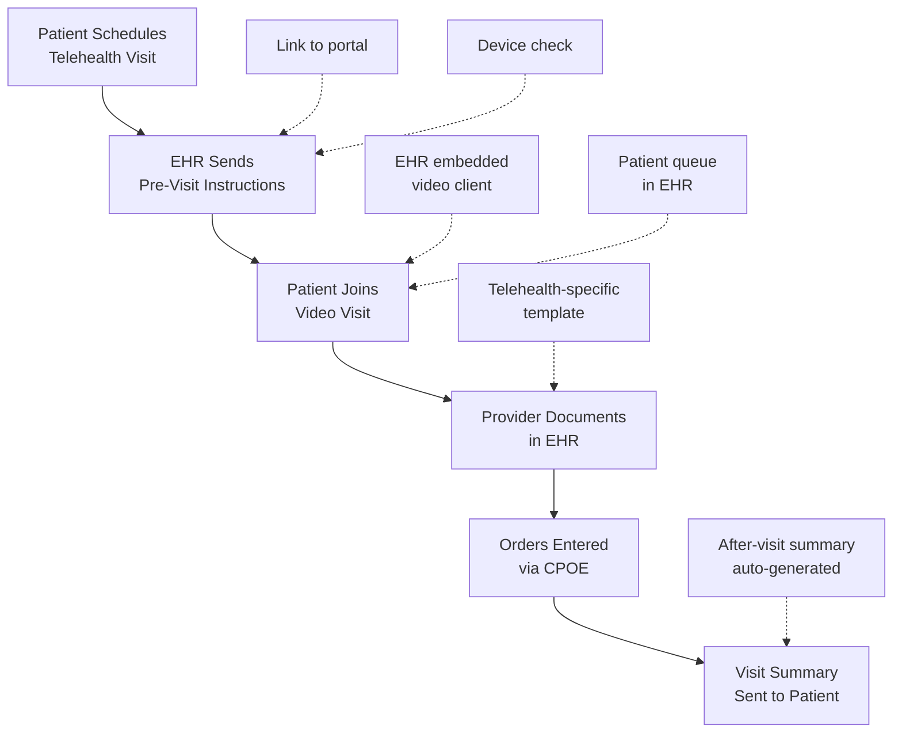

Telehealth has transformed from a niche service to a mainstream care delivery modality — accelerated dramatically by the COVID-19 pandemic. EHR integration is essential for making telehealth seamless, efficient, and clinically effective.

## Telehealth Modalities

| Modality | Description | Synchronous? | Typical Use |
|----------|-------------|--------------|-------------|
| **Live Video (Synchronous)** | Real-time video consultation | Yes | Office visit replacement |
| **Store-and-Forward (Asynchronous)** | Recorded video/images reviewed later | No | Dermatology, radiology |
| **Remote Patient Monitoring (RPM)** | Home device data transmitted to provider | No | Chronic disease management |
| **E-Visit (Patient Portal)** | Structured questionnaire via portal | No | Simple acute concerns |
| **Telephone Visit** | Audio-only consultation | Yes | When video unavailable |
| **Chat-Based Care** | Secure text conversation | Usually async | Triage, simple questions |

## EHR Integration for Telehealth



### Pre-Visit Workflow

```yaml
Scheduling:
  └− Appointment type: "Telehealth Visit" (not in-person)
  └− Patient instructions auto-sent (link, device requirements, prep)
  └− Consent for telehealth collected via portal
  └− Pre-visit questionnaires sent through portal
  └− Insurance eligibility verified (telehealth coverage confirmed)

Patient Preparation:
  └− Device requirements: camera, microphone, internet connection
  └− Environment: private, well-lit, quiet space
  └− Have medications available for review
  └− Prepare questions for provider
  └− Complete eCheck-in via portal (update demographics, pharmacy)
```

### During the Visit

```yaml
Provider Workflow:
  └− Launch video visit directly from EHR scheduler
  └− Video client embedded in EHR (no separate login)
  └− Patient joins from portal or mobile app
  └− Provider documents in standard or telehealth-specific template
  └− Physical exam adapted for telehealth:
       └− Patient-reported vitals (home BP cuff, scale)
       └− Visual observation (skin, gait, swelling)
       └− Verbal assessments (pain level, symptom review)
  └− Orders placed via CPOE (e-prescribing, lab, imaging, referral)
  └− Patient education materials sent to portal
```

### Post-Visit Workflow

```yaml
Visit Completion:
  └− After-visit summary auto-generated from note
  └− Summary includes: diagnoses, medications, follow-up plan
  └− Summary sent to patient via portal
  └− Follow-up scheduled (telehealth or in-person)
  └− Billing: Appropriate telehealth codes used (modifier 95, GT, GQ)

Telehealth Billing Codes:
  └− 99201-99215: Office/outpatient visit (with modifier 95 or GT)
  └− G0425-G0427: Telehealth consultation, emergency department
  └− G0459: Telehealth physiological monitoring
  └− 99421-99423: Online digital evaluation and management (e-visit)
  └− 99453-99458: Remote patient monitoring (RPM) codes
```

## Remote Patient Monitoring (RPM)

RPM involves collecting health data from patients outside of clinical settings:

```yaml
Common RPM Use Cases:
  └− Hypertension: Home blood pressure monitoring
  └− Diabetes: Continuous glucose monitoring (CGM)
  └− Heart Failure: Daily weight monitoring
  └− COPD: Spirometry, oxygen saturation
  └− Sleep Apnea: CPAP compliance data
  └− Anticoagulation: Home INR monitoring
  └− Pregnancy: Fetal heart rate, contraction monitoring
  └− Post-Surgical: Wound healing, vital signs

RPM Workflow:
  1. Device Provisioning:
     └− Patient receives Bluetooth-enabled device
     └− Device paired with patient's smartphone or tablet
     └− App connects to device and transmits to EHR
  
  2. Data Collection:
     └− Automatic transmission at scheduled intervals
     └− Patient can also manually enter data
     └− Alerts for out-of-range values
  
  3. Clinical Review:
     └− Provider reviews data in EHR dashboard
     └− Trend lines show changes over time
     └− Alerts flagged for immediate attention
  
  4. Intervention:
     └− Medication adjustment based on data
     └− Patient contacted via phone or video
     └− In-person visit scheduled if needed
```

## Regulatory and Reimbursement Landscape

```yaml
Medicare Telehealth Coverage:
  └− Pre-COVID: Limited to rural areas, specific facilities
  └− COVID (2020): Expanded broadly — any location, any modality
  └− Current (2024): Many flexibilities extended through 2025
       └─ Audio-only: Still covered (critical for audio-only patients)
       └─ Any location: Home, work, school
       └− No geographic restrictions
       └− Federally Qualified Health Centers (FQHCs) and Rural Health Clinics (RHCs)
  
  └− Services Covered:
       Evaluation and management visits
       Mental health counseling
       Preventive health counseling
       Remote patient monitoring
       Virtual check-ins

State Telehealth Regulations (Vary):
  └− Licensure: Provider must be licensed in patient's state
  └− Consent: Written or verbal consent required
  └− Prescribing: In-person exam typically required for controlled substances
  └− Standard of care: Same as in-person for telehealth
  └− Privacy: HIPAA-compliant platform required
  └− Audio-only: Permitted in most states (with limitations)
```

## Telehealth Integration Challenges

| Challenge | Impact | Solution |
|-----------|--------|----------|
| **Technology Access** | Digital divide limits telehealth for vulnerable populations | Audio-only option, community broadband, kiosk-based telehealth |
| **Reimbursement Uncertainty** | Policy changes create financial risk | Diversify telehealth offerings, monitor legislation |
| **State Licensure** | Providers must be licensed in patient's state | Interstate compact (IMLCC), federal licensure proposals |
| **Clinical Limitations** | Cannot perform physical exam remotely | Video-guided patient exam, home diagnostic devices |
| **Workflow Integration** | Separate telehealth platforms create inefficiency | Integrated EHR-telehealth platform |
| **Patient Preference** | Some patients prefer in-person care | Hybrid model — offer both options |
| **Quality of Care** | Concerns about diagnostic accuracy | Telehealth-appropriate visit triage |

## Telehealth Metrics

| Metric | Target | Measurement |
|--------|--------|------------|
| **Telehealth Visit Volume** | % of total visits | EHR visit type tracking |
| **Telehealth No-Show Rate** | < 10% (vs. 15% in-person) | Schedule analysis |
| **Patient Satisfaction** | > 4/5 | Post-visit survey |
| **Provider Satisfaction** | > 3.5/5 | Provider survey |
| **Telehealth-Related Technical Issues** | < 5% of visits | Support ticket analysis |
| **RPM Patient Onboarding Rate** | > 60% of eligible patients | RPM enrollment tracking |
| **RPM Data Transmission Rate** | > 80% of expected readings | Device data analytics |

## Key Takeaways

- Telehealth encompasses live video, store-and-forward, remote patient monitoring, e-visits, telephone, and chat-based care — each with different clinical applications
- EHR integration is essential for seamless telehealth: scheduling, pre-visit instructions, embedded video, documentation templates, CPOE, and after-visit summaries
- RPM collects home health data (BP, glucose, weight, etc.) and transmits it to the EHR for provider review with trend analysis and alerting
- Medicare telehealth coverage expanded dramatically during COVID-19, with many flexibilities extended through 2025
- State regulations vary for licensure, consent, prescribing, and audio-only requirements — providers must know the rules in each state where patients are located
- Key challenges: technology access (digital divide), reimbursement uncertainty, state licensure barriers, workflow integration, and clinical limitations
- A hybrid care model offering both telehealth and in-person options is emerging as the preferred approach
- Telehealth is not a replacement for in-person care — it is a complementary modality that expands access, convenience, and continuity of care
- The integration of EHR and telehealth is becoming a requirement, not a nice-to-have — separate platforms create inefficiency and data fragmentation
- Future trends include AI-assisted virtual care, home-based hospital care, and continuous remote monitoring as standard of care for chronic conditions
