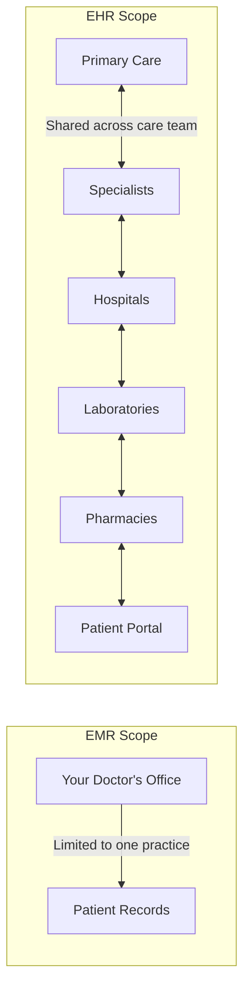

The terms **Electronic Health Record (EHR)** and **Electronic Medical Record (EMR)** are often used interchangeably, but they represent distinctly different concepts with different capabilities, scope, and impact on patient care.

## Definitions

### Electronic Medical Record (EMR)

An EMR is a digital version of a patient's medical chart from a **single practice or organization**. It contains the medical and treatment history of patients within that practice.

### Electronic Health Record (EHR)

An EHR is a comprehensive digital record that includes **health information from multiple providers and settings**, designed to be shared across the entire care continuum.



## Comparison Table

| Dimension | EMR | EHR |
|-----------|-----|-----|
| **Scope** | Single practice or organization | Multiple organizations and settings |
| **Interoperability** | Limited — internal use only | Full — designed for data exchange |
| **Data Sharing** | Requires manual transfer (print/fax) | Electronic sharing via HIE and APIs |
| **Patient Access** | Typically not available to patients | Patient portal for online access |
| **Population Health** | Cannot aggregate across populations | Supports population health analytics |
| **Care Coordination** | Limited to within the practice | Enables multi-provider coordination |
| **Longitudinal View** | Episodic — care within one practice | Comprehensive — across the patient's lifetime |
| **Example** | A cardiologist's internal system | A regional health information exchange |

## Key Differences in Practice

### Perspective 1: Data Flow

```yaml
EMR Data Flow:
  └─ Patient visits Dr. Smith (PCP)
  └─ EMR records: vitals, diagnosis, prescription
  └─ Patient visits Dr. Jones (Cardiologist)
  └─ Dr. Jones has NO access to Dr. Smith's EMR
  └─ Dr. Jones must request records via fax or mail
  └─ Risk: Duplicate tests, medication errors, incomplete history

EHR Data Flow:
  └─ Patient visits Dr. Smith (PCP)
  └─ EHR records: vitals, diagnosis, prescription
  └─ Patient visits Dr. Jones (Cardiologist)
  └─ Dr. Jones accesses the SAME EHR system or connected HIE
  └─ Dr. Jones sees: Dr. Smith's notes, lab results, medication list
  └─ Benefit: Complete picture, coordinated care, fewer duplicates
```

### Perspective 2: Information Silos vs. Connected Care

| Scenario | With EMR | With EHR |
|----------|----------|----------|
| **Emergency Visit** | No access to patient history | Immediate access to allergies, medications, chronic conditions |
| **Specialist Referral** | Paper referral, records mailed | Electronic referral with complete history attached |
| **Medication Reconciliation** | Patient must list all medications | EHR shows all prescriptions from all providers |
| **Lab Results** | Results returned to ordering provider only | Results available to all authorized providers |
| **Hospital Discharge** | Discharge summary faxed to PCP | Discharge summary available in EHR immediately |

### Perspective 3: Practice Impact

```yaml
For the Provider:
  EMR:
    └─ Better than paper within the practice
    └─ Tracks immunizations and preventive care for YOUR patients
    └─ Cannot see what specialists have prescribed
    └─ Must manually import external records
  EHR:
    └─ Complete view of patient's health journey
    └─ Sees all medications, allergies, and test results
    └─ Coordinates care across the care team
    └─ Enables population health management

For the Patient:
  EMR:
    └─ May not have direct access to records
    └─ Must repeat history to each provider
    └─ Tests may be duplicated unnecessarily
  EHR:
    └─ Patient portal for 24/7 record access
    └─ Providers already know your history
    └─ Coordinated care, fewer duplicate tests
```

## Why the Confusion Exists

The terms are often confused because:

1. **Historical usage**: EMR was the original term; EHR emerged as the technology matured
2. **Marketing**: Some vendors label their products as "EHR" even when they are functionally closer to EMR
3. **Gradient**: There is a spectrum of interoperability — some EMRs have limited sharing capabilities
4. **Transition**: Many practices are in the process of moving from EMR to true EHR capabilities

## Regulatory Definitions

The **Office of the National Coordinator for Health IT (ONC)** makes a clear distinction:

| Aspect | EMR | EHR |
|--------|-----|-----|
| **ONC Definition** | "An electronic record of health-related information on an individual that can be created, gathered, managed, and consulted by authorized clinicians and staff within one healthcare organization." | "An electronic record of health-related information on an individual that conforms to nationally recognized interoperability standards and that can be created, managed, and consulted by authorized clinicians and staff across more than one healthcare organization." |
| **Certification** | Older certification programs | Modern 2015 Edition and ONC Certification |
| **Meaningful Use** | Stage 1 focused on EMR capabilities | Stages 2-3 and Promoting Interoperability require EHR capabilities |
| **Incentive Programs** | Early incentive payments | Current payment programs |

## When to Use Each Term

```yaml
Use "EMR" when:
  └─ Referring to a single-practice system
  └─ Discussing historical medical records systems
  └─ The system does not share data with other organizations
  └─ Focus is on replacing paper charts within one practice

Use "EHR" when:
  └─ Discussing comprehensive health information
  └─ Interoperability and data sharing are key features
  └─ Multiple providers access the same patient information
  └─ Patient portal and engagement are included
  └─ Discussing population health or care coordination
```

## The Evolution Path

Most healthcare organizations are on a journey from EMR to EHR:

```yaml
Stage 1 — Basic EMR:
  └─ Digital charting within one practice
  └─ Basic e-prescribing
  └─ No data sharing

Stage 2 — Advanced EMR:
  └─ CPOE and CDS capabilities
  └─ Patient portal (limited)
  └─ Some lab interfaces

Stage 3 — Interoperable EHR:
  └─ Health Information Exchange (HIE) connectivity
  └─ Comprehensive patient portal
  └─ Data sharing with hospitals and specialists

Stage 4 — Comprehensive EHR:
  └─ Full interoperability (FHIR APIs)
  └─ Population health management
  └─ Advanced analytics and reporting
  └─ Patient-generated health data integration
```

## Key Takeaways

- EMRs are digital charts within a single practice; EHRs are comprehensive records designed for sharing across the entire healthcare ecosystem
- The fundamental difference is **interoperability** — EHRs are built to share data; EMRs are not
- In practice, EMRs create information silos while EHRs enable coordinated, connected care
- The confusion between terms stems from historical usage and vendor marketing
- ONC defines EMR as single-organization and EHR as cross-organization with interoperability standards
- The evolution from EMR → EHR is a journey through stages of increasing interoperability and capability
- For patients, the difference is tangible: fragmented care with EMRs vs. coordinated, complete care with EHRs
- For providers, EHRs reduce duplicate testing, prevent medication errors, and provide a complete patient picture
